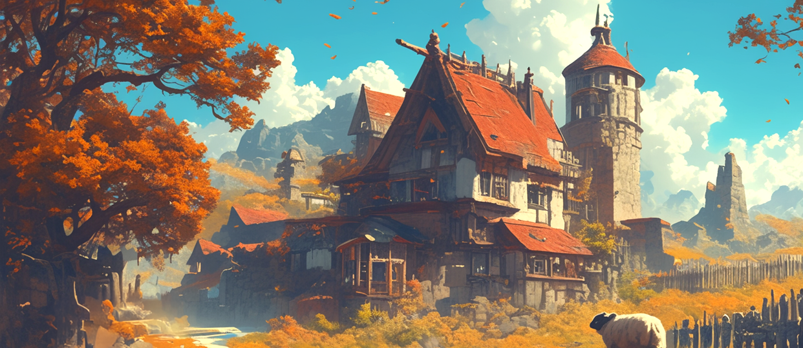
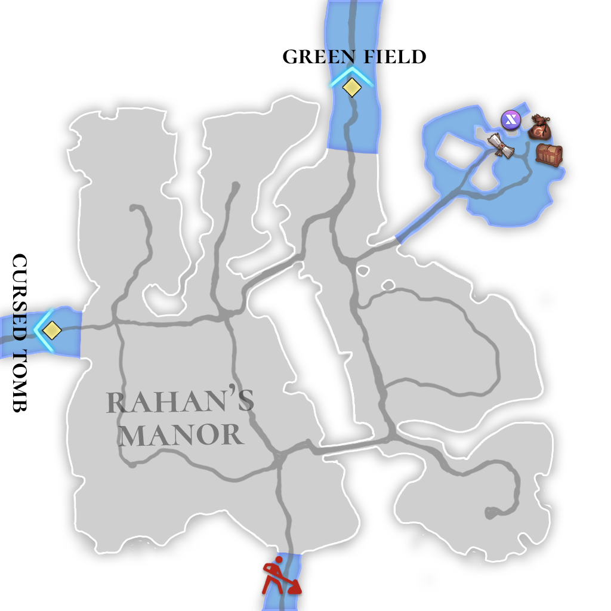

# 🏔️ \~Lv.20 Rahan's Manor

<figure><figcaption></figcaption></figure>

<figure><figcaption></figcaption></figure>



📒This is the production site of the highest quality wheat that is supplied to every part of the Asterica continent. It is also the largest granary region with an environment that allows for two harvests per year, serving as the food storage for the entire continent. For this reason, the Lord of Rahan is secretly referred to as the "Emperor of Autumn" among the residents. Even the royals of Asterica are said to bow their heads in the Rahan territory. The Rahan tribe settled in this area, which was once barren land covered in volcanic ash from long ago, and cultivated the land. Since the secret to the fertilizer that enriches the soil is passed down only within the Rahan family, no one on the continent dares to covet this land.

<table><thead><tr><th width="77">Lv.</th><th>Monster</th><th>Drop1</th><th>Drop2</th><th>Drop3</th><th>Drop4</th></tr></thead><tbody><tr><td>11</td><td>Shy pig (LEAF)</td><td>Pork belly</td><td>Bark</td><td>Scrap metal</td><td>-</td></tr><tr><td>13</td><td>Runaway pig (FIRE)</td><td>Bark</td><td>Flint</td><td>Fur ball</td><td>-</td></tr><tr><td>15</td><td>Bison (FORCE)</td><td>Milk</td><td>Leather</td><td>Hard bone</td><td>-</td></tr><tr><td>16</td><td>Iguana (WATER)</td><td>Lizard’s tail</td><td>-</td><td>Piece of copper</td><td>-</td></tr><tr><td>18</td><td>Shy boar (LEAF)</td><td>Pork belly</td><td>Bark</td><td>Scrap metal</td><td>Piece of copper</td></tr><tr><td>20</td><td>Slime (WATER)</td><td>-</td><td>Jelly</td><td>Powder of blessing</td><td>Piece of jewelry</td></tr></tbody></table>

🍀**Gathered items :** Oranges, Wheat, Eggs, Herbs, Vegetables

> 😈**Field Raid :** Lv.23 Lizard Man
>
> 🕓**Spawn Time (UTC)** : 16:10 / 21:30 / 02:50 / 08:10 / 13:40
>
> 📦**Drop Item :** Core of protection, Lucky Core, Evil crystal, Crystal of wrath, Freshly caught octopus, Extocium Fragment etc…

🍀**Recipe  Drop Information:**

<table><thead><tr><th width="141">Monster</th><th width="143">Drop1</th><th width="162">Drop2</th><th>Drop3</th></tr></thead><tbody><tr><td>Shy pig</td><td>Cheese Recipe</td><td>Salad Recipe</td><td>Glue Recipe</td></tr><tr><td>Runaway pig</td><td>Cheese Recipe</td><td>Orange juice Recipe</td><td>Glue Recipe</td></tr><tr><td>Bison</td><td>Butter Recipe</td><td>Nut Yogurt Recipe</td><td>Glue Recipe</td></tr><tr><td>Iguana</td><td>Butter Recipe</td><td>Pancake Recipe</td><td>-</td></tr><tr><td>Shy boar</td><td>Pancake Recipe</td><td>Apple steak Recipe</td><td>Iron Ring Recipe</td></tr><tr><td>Slime</td><td>Assorted skewers recipe</td><td>Magic jelly Recipe</td><td>Spirit's Necklace Recipe</td></tr><tr><td>Rampaging Giant Pig</td><td>Cheese Recipe</td><td>Orange juice Recipe</td><td>-</td></tr><tr><td>Giant Slime</td><td>Assorted skewers recipe</td><td>Magic jelly Recipe</td><td>-</td></tr></tbody></table>



📒아스테리카 대륙 모든 곳에 납품 되는 최상급 밀의 생산지다. 또한 일 년에 두 번에 이르는 수확 환경을 갖춘 최대의 곡창 지대로, 대륙의 식량 창고 역할을 하고 있다. 이 때문에, 라한 영주는 주민들 사이에서 암암리에 가을의 황제라 불리운다. 아스테리카의 왕족들 조차 라한 영지에서는 목을 굽힌다 한다. 라한 부족은 오래 전 화산재로 뒤덮여 불모지였던 이곳에 정착하여 땅을 일구고 다듬어냈다. 토질을 좋게 하는 비료의 비법은 라한 가문 내에서만 전승되기 때문에, 대륙의 누구도 이 땅을 함부로 탐내지 않는다.

<table><thead><tr><th width="77">레벨</th><th>몬스터</th><th>드랍1</th><th>드랍2</th><th>드랍3</th><th>드랍4</th></tr></thead><tbody><tr><td>11</td><td>수줍은 돼지 (LEAF)</td><td>삼겹살</td><td>나무껍질</td><td>고철조각</td><td>-</td></tr><tr><td>13</td><td>폭주 돼지 (FIRE)</td><td>나무껍질</td><td>부싯돌</td><td>털뭉치</td><td>-</td></tr><tr><td>15</td><td>바이슨 (FORCE)</td><td>우유</td><td>가죽</td><td>단단한 뼈</td><td>-</td></tr><tr><td>16</td><td>이구아나 (WATER)</td><td>도마뱀 꼬리</td><td>-</td><td>구리조각</td><td>-</td></tr><tr><td>18</td><td>수줍은 멧돼지 (LEAF)</td><td>삼겹살</td><td>나무껍질</td><td>고철조각</td><td>구리조각</td></tr><tr><td>20</td><td>슬라임 (WATER)</td><td>-</td><td>젤리</td><td>축복의 가루</td><td>보석조각</td></tr></tbody></table>

🍀**채집 품목 :** 오렌지, 밀, 달걀, 허브, 야채

> 😈**필드 레이드 :** Lv.23 리자드맨
>
> 🕓**출현시간 (KST)** : 01:10 / 06:30 / 11:50 / 17:10 / 22:40&#x20;
>
> 📦**드랍 아이템 :** 보호의 핵, 행운의 핵, 악의 결정, 분노의 결정, 갓 잡은 문어, 엑스토시움 조각 etc…

**🍀레시피 드랍 정보 :**

<table><thead><tr><th width="153">Monster</th><th width="136">Drop1</th><th width="170">Drop2</th><th>Drop3</th></tr></thead><tbody><tr><td>수줍은 돼지</td><td>치즈 레시피</td><td>샐러드 레시피</td><td>접착제 레시피</td></tr><tr><td>폭주 돼지</td><td>치즈 레시피</td><td>오렌지 주스 레시피</td><td>접착제 레시피</td></tr><tr><td>바이슨</td><td>버터 레시피</td><td>견과류 요거트 레시피</td><td>접착제 레시피</td></tr><tr><td>이구아나</td><td>버터 레시피</td><td>팬케이크 레시피</td><td>-</td></tr><tr><td>수줍은 멧돼지</td><td>팬케이크 레시피</td><td>사과 스테이크 레시피</td><td>철 고리 레시피</td></tr><tr><td>슬라임</td><td>모듬꼬치 레시피</td><td>매직 젤리 레시피</td><td>정령의 목걸이 제작서</td></tr><tr><td>거대 폭주 돼지</td><td>치즈 레시피</td><td>오렌지 주스 레시피</td><td>-</td></tr><tr><td>거대 슬라임</td><td>모듬꼬치 레시피</td><td>매직 젤리 레시피</td><td>-</td></tr></tbody></table>



📒これはアステリカ大陸全土に供給される最高級の小麦の生産地である。また、年に2回の収穫環境を備えた最大の穀倉地帯でもあり、大陸の食料庫の役割を果たしている。このため、ラハン領主は住民の間で「秋の皇帝」と呼ばれている。アステリカの王族ですらラハン領地では頭を垂れるという。ラハン族は昔、火山灰に覆われた不毛の地にここに定住し、土地を耕し整えた。土壌を良くする肥料の秘訣はラハン家の中でのみ代々伝えられているため、大陸のだれもこの土地を無闇に欲しがらない。

<table><thead><tr><th width="91">レベル</th><th>モンスター</th><th>ドロップ1</th><th>ドロップ2</th><th>ドロップ3</th><th>ドロップ4</th></tr></thead><tbody><tr><td>11</td><td>はにかむ豚 (LEAF)</td><td>サムギョプサル</td><td>樹皮</td><td>古鉄のかけら</td><td>-</td></tr><tr><td>13</td><td>暴走豚 (FIRE)</td><td>樹皮</td><td>フリント</td><td>毛玉</td><td>-</td></tr><tr><td>15</td><td>バイソン (FORCE)</td><td>ミルク</td><td>かわ</td><td>固い骨</td><td>-</td></tr><tr><td>16</td><td>イグアナ (WATER)</td><td>トカゲのしっぽ</td><td>-</td><td>銅片</td><td>-</td></tr><tr><td>18</td><td>はにかむイノシシ (LEAF)</td><td>サムギョプサル</td><td>樹皮</td><td>古鉄のかけら</td><td>銅片</td></tr><tr><td>20</td><td>スライム (WATER)</td><td>-</td><td>ゼリー</td><td>祝福の粉</td><td>宝石のかけら</td></tr></tbody></table>

🍀**採集品目 :** オレンジ、小麦、卵、ハーブ、野菜

> 😈**フィールドレイド :** Lv.23 リザードマン
>
> 🕓**出現時間 (KST)** : 01:10 / 06:30 / 11:50 / 17:10 / 22:40
>
> 📦**ドロップアイテム:** 保護の核、幸運の核、悪の結晶、怒りの結晶、獲れたてのタコ、エクストシウム彫刻 ect···

🍀**レシピドロップ情報:**

<table><thead><tr><th width="150">Monster</th><th width="154">Drop1</th><th width="145">Drop2</th><th>Drop3</th></tr></thead><tbody><tr><td>はにかむ豚</td><td>チーズレシピ</td><td>サラダレシピ</td><td>接着剤レシピ</td></tr><tr><td>暴走豚</td><td>チーズレシピ</td><td>オレンジジュースレシピ</td><td>接着剤レシピ</td></tr><tr><td>バイソン</td><td>バターレシピ</td><td>ナッツヨーグルトレシピ</td><td>接着剤レシピ</td></tr><tr><td>イグアナ</td><td>バターレシピ</td><td>パンケーキレシピ</td><td>-</td></tr><tr><td>はにかむイノシシ</td><td>パンケーキレシピ</td><td>リンゴステーキレシピ</td><td>鉄のリングレシピ</td></tr><tr><td>スライム</td><td>串盛り合わせレシピ</td><td>マジックゼリーレシピ</td><td>精霊のネックレスレシピ</td></tr><tr><td>暴走巨大豚</td><td>チーズレシピ</td><td>オレンジジュースレシピ</td><td>-</td></tr><tr><td>巨大スライム</td><td>串盛り合わせレシピ</td><td>マジックゼリーレシピ</td><td>-</td></tr></tbody></table>


