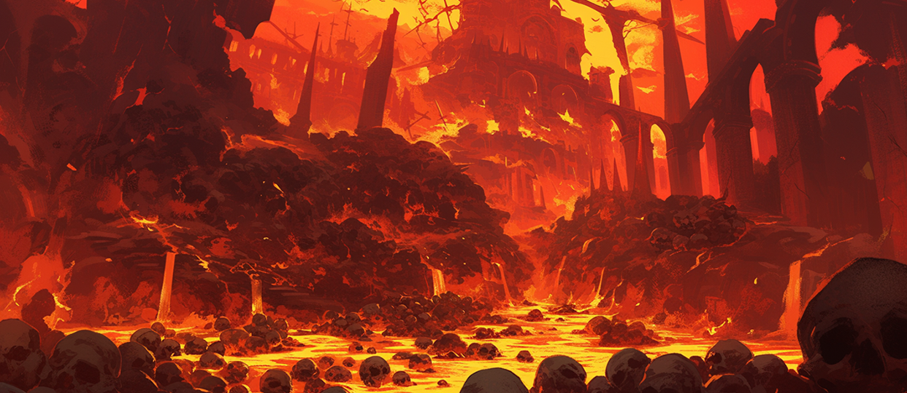

# 🗿 Naraka - Dungeon

<figure><figcaption></figcaption></figure>



Nestled deep within the fertile reaches of Rahan's Manor, the Naraka Dungeon is an ancient relic shrouded in shadow and mystery. Once a sacred yet brutal chamber of punishment wielded by the gods, it served as a place where sinners faced divine retribution amid roaring flames and anguished cries. But when the gods vanished from this world, the fires of Naraka guttered out, leaving the dungeon abandoned for countless ages. For centuries, it lay dormant—a silent ruin swallowed by dust and stillness, as if time itself had turned its back on the place.

Recently, however, whispers have begun to ripple across the Asterica continent. Word has spread of a glowing orb unearthed in the dungeon’s subterranean depths—an artifact said to hold a power capable of ensnaring souls and twisting minds. This rumor has set the hearts of adventurers ablaze, drawing the bold and the greedy alike to Rahan's Manor in search of this enigmatic treasure. The dungeon’s entrance lies hidden beneath jagged volcanic rock, where a chilling breeze seeps through the cracks, carrying echoes of its punitive past. Venture deeper, and the walls come alive with faintly glowing runes etched in the tongue of the gods, radiating an aura of dread and grandeur long forgotten.

Some say it’s no coincidence that the lord of Rahan built a manor nearby. Local tongues wag that his intentions go beyond tending to the golden wheat fields—that he’s secretly probing the depths of Naraka to uncover its buried secrets. Those brave enough to descend into the dungeon often find more than they bargained for: instead of the orb, they encounter low, guttural moans reverberating through the dark and shadowy figures that flicker just out of sight. Naraka feels alive, testing intruders with the lingering wrath of its divine creators. It’s a place that promises riches but guards them with peril and enigma—a forbidden domain where the past refuses to rest.



나라카 던전은 라한 영지의 깊은 품속, 어둠이 짙게 깔린 지하에 자리 잡고 있는 고대의 유산이다. 이곳은 한때 신들이 죄인을 벌하고 혼을 심판하던 형벌장으로, 불타는 지옥의 화염과 비명 소리가 끊이지 않던 신성하면서도 잔혹한 공간이었다. 그러나 신들이 이 땅에서 자취를 감춘 뒤, 나라카는 지옥의 불길이 스러진 채로 긴 세월 동안 잊혀진 폐허로 남아 있었다. 먼지와 침묵만이 쌓인 이곳은 마치 시간이 멈춘 듯한 고요 속에서 잠들어 있었다.

그런데 최근, 아스테리카 대륙에 한 이야기가 퍼지기 시작했다. 나라카의 지하 감옥 깊은 곳에서 빛나는 구슬이 발견되었다는 소문이었다. 그 구슬은 단순한 보석이 아니라, 인간의 혼을 농락하고 마음을 뒤흔드는 신비로운 힘을 품고 있다고 전해진다. 이 소문은 모험가들의 가슴에 불을 지폈고, 용기와 탐욕을 품은 이들이 라한 영지로 몰려들었다. 나라카 던전의 입구는 오래된 화산석으로 뒤덮여 있고, 그 틈새로 새어나오는 차가운 바람은 형벌장의 잔재를 속삭이는 듯하다. 안으로 들어갈수록 벽면에는 신들의 언어로 새겨진 불길한 문양들이 희미하게 빛나며, 과거의 공포와 위엄을 되살린다.

라한 영주가 이곳 근처에 별장을 지은 것도 우연이 아니라는 이야기가 떠돈다. 사람들은 그가 단순히 풍요로운 밀밭을 관리하기 위해서가 아니라, 나라카의 지하 감옥에 숨겨진 비밀을 캐내려는 속셈을 품고 있다고 수군거린다. 던전 깊숙이 들어간 모험가들은 구슬을 찾는 대신, 어둠 속에서 울려 퍼지는 낮은 신음 소리와 형체 없는 그림자들에 맞닥뜨리곤 한다. 나라카는 여전히 살아 있는 듯, 침입자들을 시험하며 신들의 잊힌 분노를 간직하고 있다. 이곳은 보물을 약속하지만, 그만큼 위험과 미스터리로 가득한 금단의 영역이다.



ナラカのダンジョンは、ラハン領の豊かな土地の奥深く、闇に包まれた地下にひっそりと佇む古代の遺跡です。かつては神々が罪人を裁き、魂を罰する場所として使われ、地獄の炎が燃え盛る中、叫び声が響き渡る神聖かつ残酷な空間でした。でも、神々がこの世界から姿を消した後、ナラカの炎は消え、何世紀もの間、放置されたまま忘れ去られていました。埃と静寂だけが積もり、まるで時間が止まってしまったかのような寂しさに包まれていたんです。

ところが最近、アステリカ大陸に一つの噂が広まり始めました。ナラカの地下牢の奥底で、光り輝く珠が見つかったというのです。その珠はただの宝石じゃなく、人間の魂を惑わし、心をかき乱す不思議な力を宿していると囁かれています。この話に心を奪われた冒険者たちは、勇気と欲望を胸にラハン領へと集まってきました。ダンジョンの入り口は古い火山岩に覆われていて、そこから吹き出す冷たい風は、過去の刑場を思わせる何かを運んでくるようです。奥へ進むほど、壁には神々の言葉で刻まれた不気味な文様がほのかに光り、遠い昔の恐怖と威厳を呼び起こします。

ラハン領主が近くに別荘を建てたのも偶然じゃないって噂が流れています。豊かな小麦畑を管理するだけじゃなく、ナラカの地下牢に隠された秘密を探ろうとしているんじゃないかって、みんながひそひそ話してるんです。ダンジョンの奥深くに足を踏み入れた冒険者たちは、珠を見つけるどころか、闇の中から響く低い唸り声や、形のない影たちと対峙することに。ナラカは今も生きているみたいに、侵入者を試し、神々の忘れられた怒りを抱き続けています。宝を約束する一方で、危険と謎に満ちた禁断の領域なんです。


