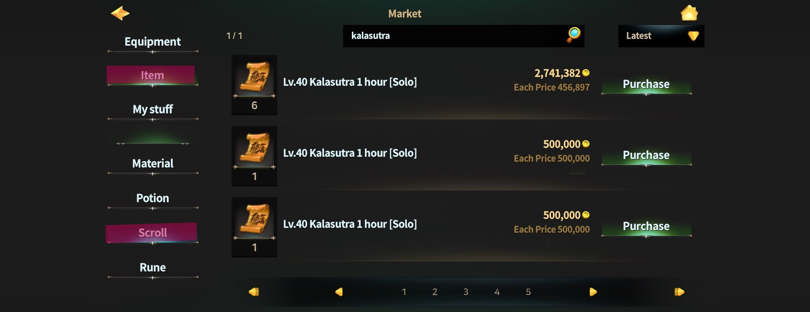
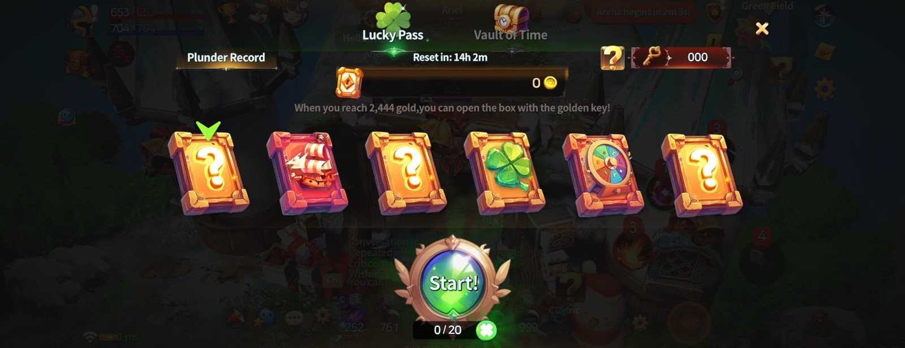
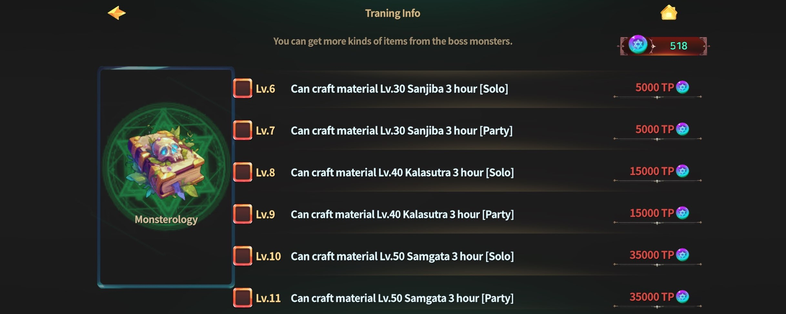
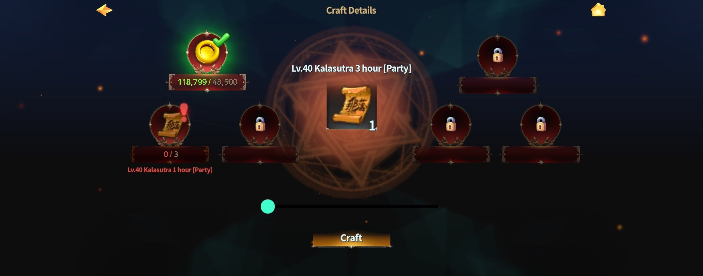

# 🎟️ Dungeon Entry Guide



### 🎟️ Dungeon Entry Pass Guide

To enter **Naraka-type dungeons**, you’ll need the **correct dungeon entry pass** for each one.\
No pass, no entry - rules are rules 😉

***

#### 🗺️ Target Dungeons

The Naraka dungeon lineup includes **three dungeons**, \
and **all of them require an entry pass** to enter:

* [**Sanjiva**](lv.30-sanjiva.md)
* [**Kalasūtra**](lv.40-kalasutra.md)
* [**Saṃghāta**](lv.50-samgata.md)


#### Without a valid entry pass, you won’t be able to step inside.


***

#### ⏱️ Types of Entry Passes

Dungeon entry passes are categorized by **entry mode** and **usage duration**.

**▶ Entry Mode**

* **Party Pass** – Entry only possible while in a party
* **Solo Pass** – Enter alone, no party required

**▶ Usage Duration**

* **1-Hour Pass**
* **3-Hour Pass**

_Entry passes are **time-based items**._ \
_Once activated, you can use the dungeon freely for the selected duration._

***

#### 📦 How to Obtain Entry Passes

You can get dungeon entry passes through several methods:

* **Market Purchase**\
  Dashboard → Marketplace → Items → Scroll\
  Buy entry passes listed by other players.

<figure><figcaption></figcaption></figure>

* **Lucky Pass Rewards**\
  Obtainable as rewards from the Lucky Pass mini-game content.

<figure><figcaption></figcaption></figure>

* **Monster Drops**\
  Very low chance to drop from dungeon or field monsters.

* **X-Point Shop**\
  Shop → Item Shop\
  Purchase using X-Points.

<figure><figcaption></figcaption></figure>

* **Crafting**

***

#### 🛠️ Entry Pass Crafting Guide

To craft dungeon entry passes, you must meet the following requirement:

* **Training → Monsterology unlocked**

<figure><figcaption></figcaption></figure>

*   Once dungeon entry pass crafting is unlocked in Monsterology:

    Go to **Crafting → Items → Scroll** to start crafting.

<figure><figcaption></figcaption></figure>

**📜 Crafting Rules**

* 3× Solo Pass (1 Hour) → 1× Solo Pass (3 Hours)
* 3× Party Pass (1 Hour) → 1× Party Pass (3 Hours)

<figure><figcaption></figcaption></figure>

Crafting helps you manage your entry passes **more efficiently** and saves resources in the long run.

✨ Smart prep leads to smoother dungeon runs. You’ve got this, Wizard!



### 🎟️ 던전 입장권 획득 안내

나라카 계열 던전에 입장하기 위해서는\
각 던전에 대응하는 **던전 입장권**이 필요합니다.

***

#### 🗺️ 대상 던전

나라카 던전은 아래 3개의 던전으로 구성되어 있으며,\
모든 던전은 입장 시 입장권이 필요합니다.

* [**산지바**](lv.30-sanjiva.md)
* [**칼라수트라**](lv.40-kalasutra.md)
* [**삼가타**](lv.50-samgata.md)


#### 각 던전은 입장권이 없을 경우 진입할 수 없습니다.


***

#### ⏱️ 입장권 종류

던전 입장권은 **입장 방식**과 **사용 시간**에 따라 구분됩니다.

**▶ 입장 방식**

* **파티 입장권** _(파티 상태에서만 입장 가능)_
* **솔로 입장권** _(파티 없이 혼자 입장)_

**▶ 사용 시간**

* **1시간 입장권**
* **3시간 입장권**

_입장권은 **시간제 아이템**으로, 사용 시 해당 시간 동안 던전 이용이 가능합니다._

***

#### 📦 입장권 획득 방법

던전 입장권은 다음과 같은 방법으로 획득할 수 있습니다.

* **거래소 구매**\
  대시보드>거래소>아이템>스크롤 로 진입하며 다른 유저가 판매한 입장권을 구매할 수 있습니다.

<figure><figcaption></figcaption></figure>

* **럭키패스 보상**\
  미니게임 콘텐츠인 럭키패스 보상으로 획득할 수 있습니다.

<figure><figcaption></figcaption></figure>

* **몬스터 드랍**\
  던전 및 필드 몬스터 사냥 시 매우 낮은 확률로 드랍됩니다.

* **X포인트 샵 구매**\
  샵 > 아이템샵 에서 X포인트를 사용하여 구매할 수 있습니다.

<figure><figcaption></figcaption></figure>

* **직접 제작**

***

#### 🛠️ 입장권 제작 안내

입장권 제작은\
다음 조건을 충족해야 가능합니다.

* **기술연마 > 마물학 해금 필요**

<figure><figcaption></figcaption></figure>

* **마물학**에서 던전 입장권 해금 완료 시,\
  **제작 > 아이템 > 스크롤** 메뉴에서 입장권 제작 가능

<figure><figcaption></figcaption></figure>

제작 관련 규칙은 다음과 같습니다.

* 솔로 입장권 (1시간) 3개 → 솔로 입장권 (3시간) 1개 제작 가능
* 파티 입장권 (1시간) 3개 → 파티 입장권 (3시간) 1개 제작 가능

<figure><figcaption></figcaption></figure>

_제작을 통해 보다 효율적으로 입장권을 운용할 수 있습니다._



### 🎟️ ダンジョン入場券のご案内

**ナラカ系ダンジョン**に挑戦するには、\
各ダンジョンに対応した**ダンジョン入場券**が必要となります。\
入場券がない場合、ダンジョンへ入ることはできませんのでご注意ください。

***

#### 🗺️ 対象ダンジョン

ナラカダンジョンは、以下の**3つのダンジョン**で構成されています。\
すべてのダンジョンで、入場時に入場券が必要です。

* [**サンジヴァ**](lv.30-sanjiva.md)
* [**カラスートラ**](lv.40-kalasutra.md)
* [**サンガータ**](lv.50-samgata.md)


#### 入場券を所持していない場合、ダンジョンには入場できません。


***

#### ⏱️ 入場券の種類

ダンジョン入場券は、**入場方式**と**使用時間**によって分類されます。

**▶ 入場方式**

* **パーティ入場券**（パーティ状態でのみ入場可能）
* **ソロ入場券**（パーティなしで単独入場）

**▶ 使用時間**

* **1時間入場券**
* **3時間入場券**

_入場券は**時間制アイテム**です。_\
_使用すると、指定された時間内でダンジョンを利用できます。_

***

#### 📦 入場券の入手方法

ダンジョン入場券は、以下の方法で入手可能です。

* **取引所で購入**\
  ダッシュボード → 取引所 → アイテム → スクロール\
  他のプレイヤーが出品した入場券を購入できます。

<figure><figcaption></figcaption></figure>

* **ラッキーパス報酬**\
  ミニゲームコンテンツ「ラッキーパス」の報酬として獲得可能です。

<figure><figcaption></figcaption></figure>

* **モンスタードロップ**\
  ダンジョンおよびフィールドモンスター討伐時、\
  **非常に低い確率**でドロップします。

* **Xポイントショップ**\
  ショップ → アイテムショップ にて\
  Xポイントを使用して購入できます。

<figure><figcaption></figcaption></figure>

* **制作（クラフト）**

***

#### 🛠️ 入場券制作のご案内

* 入場券を制作するには、以下の条件を満たす必要があります。\
  **技術研磨 → 魔物学を解放すると、ダンジョン入場券を制作できるようになります。**

<figure><figcaption></figcaption></figure>

* 魔物学でダンジョン入場券の解放が完了すると、\
  **制作 → アイテム → スクロール** メニューから制作が可能になります。

<figure><figcaption></figcaption></figure>

**📜 制作ルール**

* ソロ入場券（1時間）×3 → ソロ入場券（3時間）×1
* パーティ入場券（1時間）×3 → パーティ入場券（3時間）×1

<figure><figcaption></figcaption></figure>

制作を活用することで、\
入場券をより**効率的に運用**することができます。


