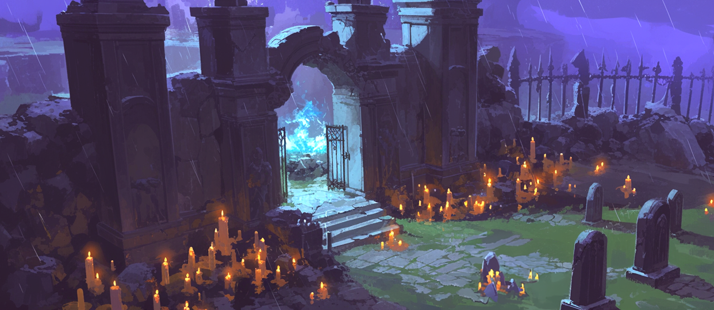
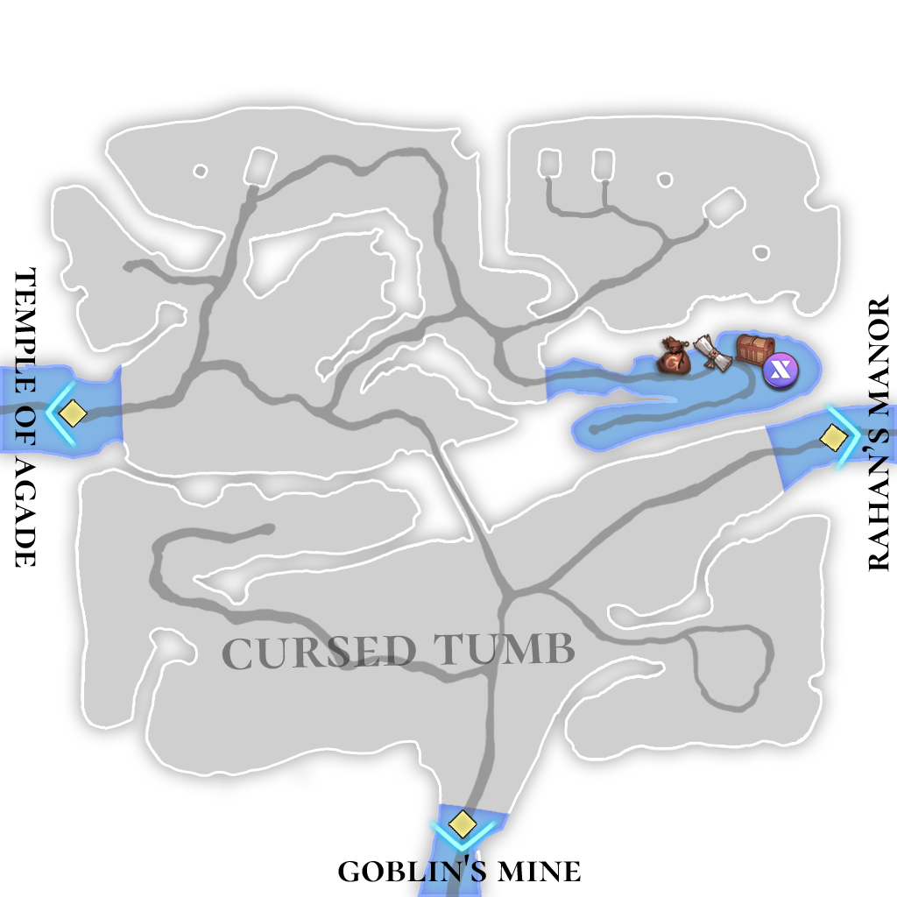

# 🏔️ \~Lv.30 Cursed Tomb

<figure><figcaption></figcaption></figure>

<figure><figcaption></figcaption></figure>



📒The Cursed Tomb is a tragic remnant deeply embedded in the dark history of the Asterica Kingdom. Long ago, when Sargon mercilessly destroyed the Umma Kingdom and built the Asterica Kingdom upon its ashes, this place became the site where the defeated King Lugal of Umma was beheaded and executed. Lugal's death was not the end. His tomb became a mass grave, where his family, loyal retainers, and even servants were buried alive with him. The screams and wails of hundreds soaked the land, sowing the seeds of a terrible curse. The power of this curse is said to be so strong that the spirits are unable to pass on, trapped here, tormenting the living.

Legend whispers that Lugal lingers here, bound by the unbearable betrayal of Sargon, his once-trusted vassal. His unresolved grudge seeps into the cold winds that sweep the tomb, carrying faint sobs that chill the blood of those who hear them in the night. The area is alive with eerie inhabitants: foxes let out sharp, warning cries; wolves growl from the shadows, their eyes glinting with menace; crows perch on gnarled branches, cawing ominous tales of the departed. Mutated elk, warped by the curse, roam with twisted antlers and blood-red eyes, casting hulking silhouettes. Scavengers skulk through the ruins, picking at the remnants of death.

Once a thriving source of amethyst, this land’s beauty has been tainted since the execution. The gems mined here now shimmer with a cursed energy, their radiant purple hues hiding a malevolent power that drives those who hold them to misfortune and madness. Adventurers drawn by tales of treasure venture into the Cursed Tomb, only to face the wrath of Lugal’s vengeful spirit and the restless ghosts of his entourage. This is a place where tragedy and resentment intertwine, a forbidden ground that breathes with the weight of its sorrowful past.

<table><thead><tr><th width="76">Lv.</th><th>Monster</th><th>Drop1</th><th>Drop2</th><th>Drop3</th><th>Drop4</th></tr></thead><tbody><tr><td>21</td><td>Fox (FIRE)</td><td>Fur ball</td><td>–</td><td>Leather</td><td>-</td></tr><tr><td>24</td><td>Wolf (FORCE)</td><td>Magic bead</td><td>Leather</td><td>-</td><td>Piece of jewelry</td></tr><tr><td>26</td><td>Crow (DARK)</td><td>Powder of blessing</td><td>Rubber</td><td>Jelly</td><td>Hard bone</td></tr><tr><td>28</td><td>Mutated elk (DARK)</td><td>-</td><td>Bark</td><td>Scrap metal</td><td>Magic bead</td></tr><tr><td>30</td><td>Scavenger (STONE)</td><td>Scrap metal</td><td>Flint</td><td>Rubber</td><td>Lizard’s tail</td></tr></tbody></table>

🍀**Gathered items :** Amethyst, copper, mushroom, cinnabar

> 😈**Field Raid :** Lv.32 Cursed Wizard (Dark)
>
> 🕓**Spawn Time (UTC)** : 16:20 / 18:30 / 21:40 / 03:00 / 08:20 / 10:10 / 11:10
>
> **🕓Spawn Time (PHT) :** 00:20 / 02:30 / 05:40 / 11:00 / 16:20 / 18:10 / 19:10
>
> 📦**Drop Item :** Core of protection, Lucky Core, Evil crystal, Curse crystal, Cursed medicine, Extocium etc…
>
> <a href="https://extocium.com/cursedwizard/" class="button primary" data-icon="pen-circle">Drop Table Detail...</a>

🍀**Recipe  Drop Information:**

<table><thead><tr><th width="140">Monster</th><th width="153">Drop1</th><th width="142">Drop2</th><th>Drop3</th></tr></thead><tbody><tr><td>Fox</td><td>Red dye Recipe</td><td>Orb of Clarity Recipe</td><td>Spirit's Necklace Recipe</td></tr><tr><td>Wolf</td><td>Orb of Clarity Recipe</td><td>Tough leather Recipe</td><td>Spirit's Bracelet Recipe</td></tr><tr><td>Crow</td><td>Pancake Recipe</td><td>Orc Eye Recipe</td><td>Spirit's Earrings Recipe</td></tr><tr><td>Mutated elk</td><td>Tough leather Recipe</td><td>Wind of Fire Recipe</td><td>Spirit's Earrings Recipe</td></tr><tr><td>Scavenger</td><td>Magic jelly Recipe</td><td>Wind of Fire Recipe</td><td>Inferno's Necklace Recipe</td></tr><tr><td>Mutated Magic Elk</td><td>Tough leather Recipe</td><td>Wind of Fire Recipe</td><td>-</td></tr><tr><td>Burning Crow</td><td>Pancake Recipe</td><td>Orc Eye Recipe</td><td>-</td></tr></tbody></table>

🍀 **Weapon Drop Notice (Paid Energy)**

When using Paid Energy, rewards are drawn from the Paid Energy–exclusive reward pool.\
At an extremely low probability, the following weapon items may be dropped.

> **Wooden Sword, Steel Sword, Flamberg, Paladin's Sword, Orc eye**



📒저주받은 무덤은 아스테리카 왕국의 어두운 역사 속에 깊이 박힌 비극의 흔적이다. 오래전, 사르곤이 움마 왕국을 무참히 멸망시키고 그 잿더미 위에 아스테리카 왕국을 세울 때, 이곳은 패배한 움마의 왕 루갈의 목을 베어 처형한 장소였다. 루갈의 죽음은 끝이 아니었다. 그의 무덤에는 왕의 가족, 충직한 신하들, 그리고 하인들까지 모두 산 채로 순장되어 함께 묻혔다. 수백 명의 비명과 울부짖음이 대지를 적시며 끔찍한 저주의 씨앗이 뿌려졌다. 그 저주의 힘은 너무 강렬해서, 망령들이 저승으로 떠나지 못하고 이곳에 갇혀 떠돌며 살아 있는 자들을 괴롭힌다고 전해진다.

소문에 따르면, 루갈은 가장 아꼈던 신하 사르곤에게 배신당한 억울함을 풀지 못해 이승을 떠나지 못하고 있다. 그의 원한은 무덤 주변을 떠도는 차가운 바람 속에 스며들어, 밤이면 들려오는 흐느낌과 같은 소리로 사람들의 간담을 서늘하게 한다. 이곳에는 여우가 날카로운 울음소리로 경고를 보내고, 늑대가 어둠 속에서 으르렁거리며 침입자를 노려본다. 까마귀는 나뭇가지 위에서 불길한 소리를 내며 망자의 이야기를 속삭이고, 변이된 엘크는 저주의 힘에 뒤틀린 거대한 뿔과 붉은 눈으로 위협적인 그림자를 드리운다. 스캐빈저는 폐허 사이를 기어다니며 죽음의 잔재를 뒤지곤 한다.

원래 이 지역은 자수정 광석이 풍부한 보물 창고로 유명했으나, 처형 사건 이후 모든 것이 변했다. 저주받은 무덤에서 채굴된 자수정은 아름다운 보랏빛 속에 강력한 저주의 기운을 품고 있어, 이를 손에 쥔 자는 불행과 광기에 시달린다고 한다. 모험가들은 보물을 노리고 이곳을 찾지만, 루갈의 망령과 그를 따르는 원혼들의 분노를 마주하며 공포 속에 발걸음을 돌리곤 한다. 저주 받은 무덤은 과거의 비극과 억울함이 얽힌 채, 여전히 살아 숨 쉬는 듯한 금단의 땅이다.

<table><thead><tr><th width="87">레벨</th><th>몬스터</th><th>드랍1</th><th>드랍2</th><th>드랍3</th><th>드랍4</th></tr></thead><tbody><tr><td>21</td><td>여우 (FIRE)</td><td>털뭉치</td><td>–</td><td>가죽</td><td>-</td></tr><tr><td>24</td><td>늑대 (FORCE)</td><td>마력구슬</td><td>가죽</td><td>-</td><td>보석조각</td></tr><tr><td>26</td><td>까마귀 (DARK)</td><td>축복의 가루</td><td>고무</td><td>젤리</td><td>단단한 뼈</td></tr><tr><td>28</td><td>변이된 엘크 (DARK)</td><td>-</td><td>나무껍질</td><td>고철조각</td><td>마력구슬</td></tr><tr><td>30</td><td>스캐빈저 (STONE)</td><td>고철조각</td><td>부싯돌</td><td>고무</td><td>도마뱀 꼬리</td></tr></tbody></table>

🍀**채집 품목 :** 자수정, 구리, 버섯, 진사

> 😈**필드 레이드 :** Lv.32 저주 받은 위자드
>
> 🕓**출현시간 (KST)** : 01:20 / 03:30 / 06:40 / 12:00 / 17:20 / 19:10 / 20:10
>
> 📦**드랍 아이템 :** 보호의 핵, 행운의 핵, 악의 결정, 저주의 결정, 저주받은 약재, 엑스토시움 etc…
>
> <a href="https://extocium.com/cursedwizard/" class="button primary" data-icon="pen-circle">Drop Table Detail...</a>

**🍀레시피 드랍 정보 :**

<table><thead><tr><th width="147">Monster</th><th width="133">Drop1</th><th width="135">Drop2</th><th>Drop3</th></tr></thead><tbody><tr><td>여우</td><td>붉은 염료  레시피</td><td>청명의 오브  제작서</td><td>정령의 목걸이 제작서</td></tr><tr><td>늑대</td><td>청명의 오브 제작서</td><td>질긴 가죽  레시피</td><td>정령의 팔찌 제작서</td></tr><tr><td>까마귀</td><td>팬케이크  레시피</td><td>오크의 눈  제작서</td><td>정령의 귀걸이 제작서</td></tr><tr><td>변이된 엘크</td><td>질긴 가죽  레시피</td><td>화염의 바람  제작서</td><td>정령의 귀걸이 제작서</td></tr><tr><td>스캐빈저</td><td>매직 젤리  레시피</td><td>화염의 바람  제작서</td><td>업화의 목걸이 제작서</td></tr><tr><td>변이된 매직 엘크</td><td>질긴 가죽  레시피</td><td>화염의 바람  제작서</td><td>-</td></tr><tr><td>불타는 까마귀</td><td>팬케이크  레시피</td><td>오크의 눈  제작서</td><td>-</td></tr></tbody></table>

🍀 **유료 에너지 사용 시 무기 드랍 안내**

유료 에너지를 사용하면 유료 에너지 풀 전용 보상이 적용됩니다.
\
이때, 매우 희박한 확률로 아래의 무기 아이템이 드랍될 수 있습니다.

> **목검, 강철검, 플람베르그, 팔라딘의 검, 오크의 눈**



📒呪われた墓は、アステリカ王国の暗い歴史に深く刻まれた悲劇の痕跡である. 遠い昔、サルゴンがウンマ王国を容赦なく滅ぼし、その廃墟の上にアステリカ王国を築いたとき、この場所は敗北したウンマ王のルガルが首を刎ねられ処刑された場所であった. ルガルの死は終わりではなかった. 彼の墓には、王の家族、忠実な家臣、そして使用人たちまでもが生きたまま殉葬され、一緒に埋葬された. 数百人の悲鳴と泣き声が大地を濡らし、恐ろしい呪いの種がまかれた. その呪いの力はあまりにも強く、亡霊たちはあの世へ旅立つことができず、この地に囚われ、生者を苦しめていると伝えられている.

噂では、ルガルが最も信頼していた家臣サルゴンに裏切られた悔しさから、この世を去れずにいるのだとか。彼の恨みは墓の周りを吹く冷たい風に溶け込み、夜になると聞こえるすすり泣きのような音で訪れる者を震え上がらせます。この場所には不気味な住人たちがいます。キツネは鋭い声で警告を発し、オオカミは闇の中から唸り声を上げて侵入者を睨みます。カラスは枯れ枝の上で不吉な鳴き声を響かせ、亡者の物語をつぶやいているよう。呪いで変形したエルクは歪んだ角と赤い目を持ち、巨大な影を投げかけてきます。スカベンジャーは廃墟の間を這い回り、死の残骸をついばんでいます。

昔はアメジストの産地として名を馳せたこの地域。でも、処刑事件以来、すべてが変わってしまいました。呪われた墓から採れるアメジストは美しい紫色の中に強力な呪いの気を宿し、手にした者を不幸や狂気に追い込むと言われています。宝を求めてやって来た冒険者たちは、ルガルの亡霊や彼に従う亡魂たちの怒りに直面し、恐怖に駆られて逃げ出すことも。この呪われた墓は、過去の悲劇と無念が絡み合い、今なお生きているような禁断の地なんです。

<table><thead><tr><th width="87">レベル</th><th>モンスター</th><th>ドロップ1</th><th>ドロップ2</th><th>ドロップ3</th><th>ドロップ4</th></tr></thead><tbody><tr><td>21</td><td>キツネ (FIRE)</td><td>毛玉</td><td>–</td><td>かわ</td><td>-</td></tr><tr><td>24</td><td>オオカミ (FORCE)</td><td>魔力玉</td><td>かわ</td><td>-</td><td>宝石のかけら</td></tr><tr><td>26</td><td>カラス (DARK)</td><td>祝福の粉</td><td>ゴム</td><td>ゼリー</td><td>固い骨</td></tr><tr><td>28</td><td>変異したエルク (DARK)</td><td>-</td><td>樹皮</td><td>古鉄のかけら</td><td>魔力玉</td></tr><tr><td>30</td><td>スカベンジャー (STONE)</td><td>古鉄のかけら</td><td>リント</td><td>ゴム</td><td>トカゲのしっぽ</td></tr></tbody></table>

🍀**採集品目 :** 紫水晶、銅、きのこ、ジンサ

> 😈**フィールドレイド :** Lv.32 呪われたウィザード
>
> 🕓**出現時間 (KST)** : 01:20 / 03:30 / 06:40 / 12:00 / 17:20 / 19:10 / 20:10
>
> 📦**ドロップアイテム:** 保護の核、幸運の核、悪の結晶、呪いの結晶、呪われた薬材、エクストシウムetc···
>
> <a href="https://extocium.com/cursedwizard/" class="button primary" data-icon="pen-circle">Drop Table Detail...</a>

🍀**レシピドロップ情報:**

<table><thead><tr><th width="135">Monster</th><th width="134">Drop1</th><th width="158">Drop2</th><th>Drop3</th></tr></thead><tbody><tr><td>キツネ</td><td>赤染料レシピ</td><td>清明のオブ製作書</td><td>精霊のネックレスレシピ</td></tr><tr><td>オオカミ</td><td>清明のオブ製作書</td><td>丈夫な革レシピ</td><td>精霊のブレスレットレシピ</td></tr><tr><td>カラス</td><td>パンケーキレシピ</td><td>オークの雪の製作書</td><td>精霊のイヤリングレシピ</td></tr><tr><td>変異したエルク</td><td>丈夫な革レシピ</td><td>火炎の風の製作書</td><td>精霊のイヤリングレシピ</td></tr><tr><td>スカベンジャー</td><td>マジックゼリーレシピ</td><td>火炎の風の製作書</td><td>インフェルノのネックレスレシピ</td></tr><tr><td>変異マジックエルク</td><td>丈夫な革レシピ</td><td>火炎の風の製作書</td><td>-</td></tr><tr><td>燃えるカラス</td><td>パンケーキレシピ</td><td>オークの雪の製作書</td><td>-</td></tr></tbody></table>

🍀 **有料エナジー使用時の武器ドロップ案内**

有料エナジーを使用すると、有料エナジー専用報酬プールが適用されます。
\
この際、非常に低い確率で、以下の武器アイテムがドロップする場合があります。

> **木剣, 鋼鉄の剣, フランベルグ, パラディンの剣, オークの目**



<em>※ This guide was written based on the game status as of January 7, 2026,</em>  <em>and its contents may change with future updates.</em>

