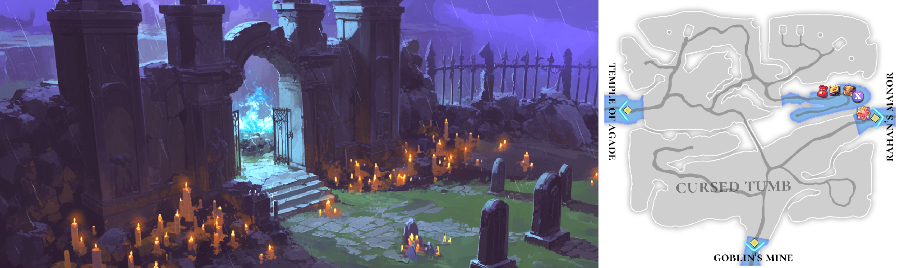

# 🏔️ \~Lv.30 Cursed Tomb

<figure><figcaption></figcaption></figure>



### ⚰️ Cursed Tomb

Deep within the darkness of the Asterica Kingdom\
lies a place marked by an ancient tragedy, known as the **Cursed Tomb**.

This site is said to be where **Lugal**,\
the king of the **Umma Kingdom**, was executed during the rise of **Sargon**,\
as he destroyed Umma and founded the Asterica Kingdom.\
From that day on, an unshakable shadow of curse fell upon this land.

***

Lugal’s death was not the end.

It is said that his family, loyal retainers, and even servants were buried alongside him,\
and the resentment of countless souls soaked deep into the ground.

The curse was so powerful that the spirits could not pass on to the afterlife\
and are believed to still linger here.\
At night, rumors tell of sob-like sounds carried on the cold wind.

***

The Cursed Tomb is a land\
where tragedy and unresolved hatred remain entwined.

Once known for its rich deposits of amethyst, the region changed after the calamity.\
Amethyst mined from this place is said\
to carry traces of the curse within its beautiful violet glow.

***

Many adventurers still seek treasure here, yet often turn back\
when faced with the weight of the curse  that clings to the land itself.

The Cursed Tomb is a forbidden place where past tragedy has never truly ended,\
a land that feels as though it still breathes with lingering sorrow.

***

🍀 **Item Drop Information :**

<table><thead><tr><th width="76">Lv.</th><th>Monster</th><th>Drop1</th><th>Drop2</th><th>Drop3</th><th>Drop4</th></tr></thead><tbody><tr><td>21</td><td>Fox (FIRE)</td><td>Fur ball</td><td>–</td><td>Leather</td><td>-</td></tr><tr><td>24</td><td>Wolf (FORCE)</td><td>Magic bead</td><td>Leather</td><td>-</td><td>Piece of jewelry</td></tr><tr><td>26</td><td>Crow (DARK)</td><td>Powder of blessing</td><td>Rubber</td><td>Jelly</td><td>Hard bone</td></tr><tr><td>28</td><td>Mutated elk (DARK)</td><td>-</td><td>Bark</td><td>Scrap metal</td><td>Magic bead</td></tr><tr><td>30</td><td>Scavenger (STONE)</td><td>Scrap metal</td><td>Flint</td><td>Rubber</td><td>Lizard’s tail</td></tr></tbody></table>

🍀**Gathered items :** Amethyst, copper, mushroom, cinnabar

> 😈**Field Raid :** Lv.32 Cursed Wizard (Dark)
>
> 🕓**Spawn Time (UTC)** : 16:20 / 18:30 / 21:40 / 03:00 / 08:20 / 10:10 / 11:10
>
> **🕓Spawn Time (PHT) :** 00:20 / 02:30 / 05:40 / 11:00 / 16:20 / 18:10 / 19:10
>
> 📦**Drop Item :** Core of protection, Lucky Core, Evil crystal, Curse crystal, Cursed medicine, Extocium etc…
>
> <a href="https://extocium.com/cursedwizard/" class="button primary" data-icon="pen-circle">Drop Table Detail...</a>

🍀**Recipe  Drop Information:**

<table><thead><tr><th width="140">Monster</th><th width="153">Drop1</th><th width="142">Drop2</th><th>Drop3</th></tr></thead><tbody><tr><td>Fox</td><td>Red dye Recipe</td><td>Orb of Clarity Recipe</td><td>Spirit's Necklace Recipe</td></tr><tr><td>Wolf</td><td>Orb of Clarity Recipe</td><td>Tough leather Recipe</td><td>Spirit's Bracelet Recipe</td></tr><tr><td>Crow</td><td>Pancake Recipe</td><td>Orc Eye Recipe</td><td>Spirit's Earrings Recipe</td></tr><tr><td>Mutated elk</td><td>Tough leather Recipe</td><td>Wind of Fire Recipe</td><td>Spirit's Earrings Recipe</td></tr><tr><td>Scavenger</td><td>Magic jelly Recipe</td><td>Wind of Fire Recipe</td><td>Inferno's Necklace Recipe</td></tr><tr><td>Mutated Magic Elk</td><td>Tough leather Recipe</td><td>Wind of Fire Recipe</td><td>-</td></tr><tr><td>Burning Crow</td><td>Pancake Recipe</td><td>Orc Eye Recipe</td><td>-</td></tr></tbody></table>

🍀 **Weapon Drop Notice (Paid Energy)**

When using Paid Energy, rewards are drawn from the Paid Energy–exclusive reward pool.\
At an extremely low probability, the following weapon items may be dropped.

> **Wooden Sword, Steel Sword, Flamberg, Paladin's Sword, Orc eye**



### ⚰️ 저주받은 무덤 (Cursed Tomb)

아스테리카 왕국의 깊은 어둠 속에는, 오래된 비극의 흔적이 남아 있는 장소,\
**저주받은 무덤**이 존재합니다.

이곳은 과거, **사르곤**이 **움마 왕국**을 멸망시키고 아스테리카 왕국을 세우는 과정에서,\
움마의 왕 **루갈**이 처형된 자리로 전해집니다.\
그날 이후, 이 땅에는 지워지지 않는 저주의 그림자가 드리워졌습니다.

***

루갈의 죽음은 끝이 아니었습니다.

그의 무덤에는 왕의 가족과 충직한 신하들 그리고 하인들까지 함께 묻혔다고 전해지며,\
수많은 원혼의 원망이 이 땅에 깊이 스며들었다고 합니다.

그 저주는 너무도 강해,  망령들은 저승으로 떠나지 못한 채 지금도 이곳에 머물러 있다고 전해집니다.\
밤이 되면, 차가운 바람 사이로 흐느낌 같은 소리가 들려온다는 소문도 있습니다.

***

저주받은 무덤은 과거의 비극과 원한이 얽힌 땅입니다.

한때 이 지역은 자수정 광석이 풍부한 장소로 알려졌지만,\
비극 이후 이곳에서 채굴된 자수정은 아름다운 보랏빛 속에 저주의 기운을 품게 되었다고 전해집니다.

***

그 때문에 많은 모험가들이 보물을 노리고 이곳을 찾지만,\
이 땅에 깃든 깊은 저주 앞에서 발길을 돌리곤 합니다.

저주받은 무덤은 과거의 비극이 끝나지 않은 채 남아 있는, \
지금도 살아 숨 쉬는 듯한 금단의 땅입니다.

***

**🍀아이템 드랍 정보 :**

<table><thead><tr><th width="87">레벨</th><th>몬스터</th><th>드랍1</th><th>드랍2</th><th>드랍3</th><th>드랍4</th></tr></thead><tbody><tr><td>21</td><td>여우 (FIRE)</td><td>털뭉치</td><td>–</td><td>가죽</td><td>-</td></tr><tr><td>24</td><td>늑대 (FORCE)</td><td>마력구슬</td><td>가죽</td><td>-</td><td>보석조각</td></tr><tr><td>26</td><td>까마귀 (DARK)</td><td>축복의 가루</td><td>고무</td><td>젤리</td><td>단단한 뼈</td></tr><tr><td>28</td><td>변이된 엘크 (DARK)</td><td>-</td><td>나무껍질</td><td>고철조각</td><td>마력구슬</td></tr><tr><td>30</td><td>스캐빈저 (STONE)</td><td>고철조각</td><td>부싯돌</td><td>고무</td><td>도마뱀 꼬리</td></tr></tbody></table>

🍀**채집 품목 :** 자수정, 구리, 버섯, 진사

> 😈**필드 레이드 :** Lv.32 저주 받은 위자드
>
> 🕓**출현시간 (KST)** : 01:20 / 03:30 / 06:40 / 12:00 / 17:20 / 19:10 / 20:10
>
> 📦**드랍 아이템 :** 보호의 핵, 행운의 핵, 악의 결정, 저주의 결정, 저주받은 약재, 엑스토시움 etc…
>
> <a href="https://extocium.com/cursedwizard/" class="button primary" data-icon="pen-circle">Drop Table Detail...</a>

**🍀레시피 드랍 정보 :**

<table><thead><tr><th width="147">Monster</th><th width="133">Drop1</th><th width="135">Drop2</th><th>Drop3</th></tr></thead><tbody><tr><td>여우</td><td>붉은 염료  레시피</td><td>청명의 오브  제작서</td><td>정령의 목걸이 제작서</td></tr><tr><td>늑대</td><td>청명의 오브 제작서</td><td>질긴 가죽  레시피</td><td>정령의 팔찌 제작서</td></tr><tr><td>까마귀</td><td>팬케이크  레시피</td><td>오크의 눈  제작서</td><td>정령의 귀걸이 제작서</td></tr><tr><td>변이된 엘크</td><td>질긴 가죽  레시피</td><td>화염의 바람  제작서</td><td>정령의 귀걸이 제작서</td></tr><tr><td>스캐빈저</td><td>매직 젤리  레시피</td><td>화염의 바람  제작서</td><td>업화의 목걸이 제작서</td></tr><tr><td>변이된 매직 엘크</td><td>질긴 가죽  레시피</td><td>화염의 바람  제작서</td><td>-</td></tr><tr><td>불타는 까마귀</td><td>팬케이크  레시피</td><td>오크의 눈  제작서</td><td>-</td></tr></tbody></table>

🍀 **유료 에너지 사용 시 무기 드랍 안내**

유료 에너지를 사용하면 유료 에너지 풀 전용 보상이 적용됩니다.
\
이때, 매우 희박한 확률로 아래의 무기 아이템이 드랍될 수 있습니다.

> **목검, 강철검, 플람베르그, 팔라딘의 검, 오크의 눈**



### ⚰️ 呪われた墓（Cursed Tomb）

アステリカ王国の深い闇の中には、古い悲劇の痕跡が残る場所、**呪われた墓**が存在します。

この地はかつて、**サルゴン**が**ウンマ王国**を滅ぼし\
アステリカ王国を築く過程で、ウンマの王**ルガル**が処刑された場所だと伝えられています。\
その日を境に、この地には消えることのない呪いの影が落とされました。

***

ルガルの死は、終わりではありませんでした。

彼の墓には、王の家族や忠実な家臣、さらには従者までもが共に葬られたとされ、\
無数の魂の怨念が この地に深く染み込んだと言われています。

その呪いはあまりにも強く、魂は冥界へ旅立つことができず、\
今もこの地に留まっていると信じられています。\
夜になると、冷たい風に乗って すすり泣くような声が聞こえるという噂もあります。

***

呪われた墓は、過去の悲劇と怨念が絡み合う土地です。

かつてこの地域は 紫水晶が豊富に採れる場所として知られていましたが、\
惨劇の後、ここで採掘される紫水晶は 美しい紫色の中に\
呪いの気配を宿すようになったと語られています。

***

そのため、多くの冒険者が 財宝を求めてこの地を訪れますが、\
土地そのものに染みついた 深い呪いを前に、引き返す者も少なくありません。

呪われた墓は過去の悲劇が今も終わらぬまま残る、\
生きているかのように息づく 禁忌の地なのです。

***

🍀 **アイテムドロップ情報 :**

<table><thead><tr><th width="87">レベル</th><th>モンスター</th><th>ドロップ1</th><th>ドロップ2</th><th>ドロップ3</th><th>ドロップ4</th></tr></thead><tbody><tr><td>21</td><td>キツネ (FIRE)</td><td>毛玉</td><td>–</td><td>かわ</td><td>-</td></tr><tr><td>24</td><td>オオカミ (FORCE)</td><td>魔力玉</td><td>かわ</td><td>-</td><td>宝石のかけら</td></tr><tr><td>26</td><td>カラス (DARK)</td><td>祝福の粉</td><td>ゴム</td><td>ゼリー</td><td>固い骨</td></tr><tr><td>28</td><td>変異したエルク (DARK)</td><td>-</td><td>樹皮</td><td>古鉄のかけら</td><td>魔力玉</td></tr><tr><td>30</td><td>スカベンジャー (STONE)</td><td>古鉄のかけら</td><td>リント</td><td>ゴム</td><td>トカゲのしっぽ</td></tr></tbody></table>

🍀**採集品目 :** 紫水晶、銅、きのこ、ジンサ

> 😈**フィールドレイド :** Lv.32 呪われたウィザード
>
> 🕓**出現時間 (KST)** : 01:20 / 03:30 / 06:40 / 12:00 / 17:20 / 19:10 / 20:10
>
> 📦**ドロップアイテム:** 保護の核、幸運の核、悪の結晶、呪いの結晶、呪われた薬材、エクストシウムetc···
>
> <a href="https://extocium.com/cursedwizard/" class="button primary" data-icon="pen-circle">Drop Table Detail...</a>

🍀**レシピドロップ情報:**

<table><thead><tr><th width="135">Monster</th><th width="134">Drop1</th><th width="158">Drop2</th><th>Drop3</th></tr></thead><tbody><tr><td>キツネ</td><td>赤染料レシピ</td><td>清明のオブ製作書</td><td>精霊のネックレスレシピ</td></tr><tr><td>オオカミ</td><td>清明のオブ製作書</td><td>丈夫な革レシピ</td><td>精霊のブレスレットレシピ</td></tr><tr><td>カラス</td><td>パンケーキレシピ</td><td>オークの雪の製作書</td><td>精霊のイヤリングレシピ</td></tr><tr><td>変異したエルク</td><td>丈夫な革レシピ</td><td>火炎の風の製作書</td><td>精霊のイヤリングレシピ</td></tr><tr><td>スカベンジャー</td><td>マジックゼリーレシピ</td><td>火炎の風の製作書</td><td>インフェルノのネックレスレシピ</td></tr><tr><td>変異マジックエルク</td><td>丈夫な革レシピ</td><td>火炎の風の製作書</td><td>-</td></tr><tr><td>燃えるカラス</td><td>パンケーキレシピ</td><td>オークの雪の製作書</td><td>-</td></tr></tbody></table>

🍀 **有料エナジー使用時の武器ドロップ案内**

有料エナジーを使用すると、有料エナジー専用報酬プールが適用されます。
\
この際、非常に低い確率で、以下の武器アイテムがドロップする場合があります。

> **木剣, 鋼鉄の剣, フランベルグ, パラディンの剣, オークの目**



<em>※ This guide was written based on the game status as of January 23, 2026,</em>  <em>and its contents may change with future updates.</em>

