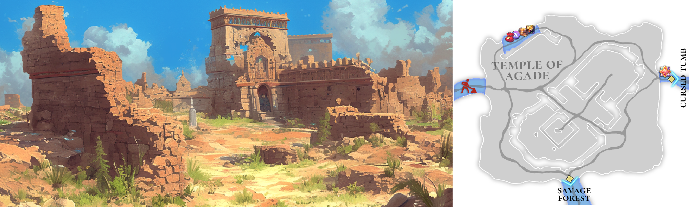

# 🏔️ \~Lv.40 Temple of Agade (PK)

<figure><figcaption></figcaption></figure>



### 🏛 Temple of Agade

At the heart of the Asterica continent stands the **Temple of Agade**,\
a vast sanctuary that once symbolized the glory of the **EXTOCIUM Empire**.

Though only broken pillars and collapsed altars remain today,\
they quietly bear witness to the splendor of the past.\
Within these wind-swept ruins, a lingering sense of divinity and tension can still be felt.

***

The Temple of Agade carries a weight unlike that of previous regions.\
From the moment adventurers step inside,\
they realize this is no longer a simple exploration, but a true proving ground.

It is a place that offers opportunity to those who are prepared,\
and danger to those who let their guard down.

***

Among the shattered pillars and ruined altars,\
artifacts bearing traces of the EXTOCIUM Empire are said to still be found.

Adventurers can gather **Relic Fragments** and **Tablet Fragments**,\
along with valuable resources such as **Iron**, **Cinnabar**, and **Cedar Wood**.

In particular, Relic Fragments and Tablet Fragments\
can be combined with **Mana Orbs** obtained through combat\
to craft **EXTOCIUM Shards**, making the Temple of Agade a land\
where risk and reward coexist.

***

The Temple of Agade is more than an ancient ruin.\
It also serves as a crucial gateway leading toward the capital, **Asterica**.

Those who pass through this place stand between the glory of the past\
and the struggle for survival in the present,\
as they prepare to move on to the next stage of their journey.

***

🍀 **Item Drop Information :**

<table><thead><tr><th width="72">Lv.</th><th>Monster</th><th>Drop1</th><th>Drop2</th><th>Drop3</th><th>Drop4</th></tr></thead><tbody><tr><td>32</td><td>Runaway boar (FIRE)</td><td>Pork belly</td><td>Flint</td><td>Sand</td><td>Rubber</td></tr><tr><td>34</td><td>Skeleton warrior (FORCE)</td><td>Scrap metal</td><td>Magic bead</td><td>Hard bone</td><td>Sand</td></tr><tr><td>36</td><td>Angel slime (LIGHT)</td><td>-</td><td>Jelly</td><td>Powder of blessing</td><td>Piece of jewelry</td></tr><tr><td>38</td><td>Desert spider (STONE)</td><td>Spider venom</td><td>-</td><td>Mud</td><td>Rubber</td></tr><tr><td>40</td><td>Mudman (STONE)</td><td>-</td><td>Mud</td><td>-</td><td>Spider venom</td></tr></tbody></table>

🍀**Gathered items :** Fragments of relics, stone slabs, iron, cinnabar, cedar wood

> 😈**Field Raid :** Lv.40 Humbaba (Stone)
>
> 🕓**Spawn Time (UTC) :** 16:30 / 18:40 / 21:50 / 03:10 / 08:30 / 10:10 / 11:15
>
> **🕓Spawn Time (PHT) :** 00:30 / 02:40 / 05:50 / 11:10 / 16:30 / 18:10 / 19:15
>
> 📦**Drop Item :** Core of protection, Lucky Core, Evil crystal, Rock crystal, Humbaba’s rice balls, Extocium etc…
>
> <a href="https://extocium.com/humbaba/" class="button primary" data-icon="pen-circle">Drop Table Detail...</a>

🍀**Recipe  Drop Information:**

<table><thead><tr><th width="148">Monster</th><th width="152">Drop1</th><th width="137">Drop2</th><th>Drop3</th><th>Drop4</th><th>Drop5</th></tr></thead><tbody><tr><td>Runaway boar</td><td>Reinforced Anvil Recipe</td><td>Wind of Fire Recipe</td><td>Inferno's Necklace Recipe</td><td>Inferno's Bracelet Recipe</td><td>Iron Clasp Recipe</td></tr><tr><td>Skeleton warrior</td><td>Reinforced Anvil Recipe</td><td>Humbaba's Lunchbox Recipe</td><td>Inferno's Bracelet Recipe</td><td>Inferno's Earrings Recipe</td><td>Iron Clasp Recipe</td></tr><tr><td>Angel slime</td><td>Humbaba's Lunchbox Recipe</td><td>Savage Sword Recipe</td><td>Inferno's Earrings Recipe</td><td>Mermaid's Necklace Recipe</td><td>Iron Chain Recipe</td></tr><tr><td>Desert spider</td><td>Wind of Fire Recipe</td><td>Wooden badge Recipe</td><td>Mermaid's Necklace Recipe</td><td>Mermaid's Bracelet Recipe</td><td>Iron Chain Recipe</td></tr><tr><td>Mudman</td><td>Explosion Energy Recipe</td><td>Savage Sword Recipe</td><td>Mermaid's Bracelet Recipe</td><td>-</td><td>Iron Chain Recipe</td></tr><tr><td>Mutated Desert Spider</td><td>Wind of Fire Recipe</td><td>Wooden badge Recipe</td><td>Leather String Recipe</td><td>-</td><td>-</td></tr><tr><td>Mutated Mudman</td><td>Explosion Energy Recipe</td><td>Savage Sword Recipe</td><td>Leather String Recipe</td><td>-</td><td>-</td></tr><tr><td>Burning Angel Slime</td><td>Humbaba's Lunchbox Recipe</td><td>Savage Sword Recipe</td><td>-</td><td>Leather String Recipe</td><td>-</td></tr><tr><td>Burning Mudman</td><td>Explosion Energy Recipe</td><td>Savage Sword Recipe</td><td>-</td><td>Leather String Recipe</td><td>-</td></tr></tbody></table>

🍀 **Weapon Drop Notice (Paid Energy)**

When using Paid Energy, rewards are drawn from the Paid Energy–exclusive reward pool.\
At an extremely low probability, the following weapon items may be dropped.

> **Wooden Sword, Flamberg, Paladin's Sword, Orc eye, Damascus**



### 🏛 아가데 신전 (Temple of Agade)

아스테리카 대륙의 중심부에는, 한때 **엑스토시움 제국**의 영광을 상징했던 거대한 신전,\
**아가데 신전**이 남아 있습니다.

지금은 부서진 기둥과 무너진 제단만이 남아 과거의 찬란함을 조용히 증언하고 있지만,\
바람이 스치는 폐허 속에서는 여전히 신성함과 긴장감이 공존하는 기운이 느껴집니다.

***

아가데 신전은 이전 지역과는 다른 무게감을 지닌 장소입니다.\
이곳에 들어서는 순간, 모험가는 단순한 탐험이 아닌  본격적인 시험의 땅에 발을 들였음을 깨닫게 됩니다.

아가데 신전은 준비된 자에게는 기회를, 방심한 자에게는 위험을 안겨주는 경계의 장소라 할 수 있습니다.

***

부서진 기둥과 제단 사이에서는 \
엑스토시움 제국의 흔적이 담긴 유물들이  지금도 발견되고 있다고 전해집니다.

모험가들은 이곳에서 **유물 조각**과 **석판 조각**을 채집할 수 있으며,\
**철**, **진사**, **백향목**과 같은 귀중한 자원도 함께 획득할 수 있습니다.

특히 유물 조각과 석판 조각은 사냥을 통해 얻은 **마력 구슬**과 결합해\
**엑스토시움 조각**으로 제작할 수 있어, 아가데 신전은 위험과 보상이 공존하는 장소로 알려져 있습니다.

***

아가데 신전은 단순한 고대 유적이 아니라, 수도 **아스테리카**로 향하는 중요한 관문이기도 합니다.

이곳을 지나치는 모험가는 과거 제국의 영광과 현재 자신의 생존을 동시에 마주하며,\
다음 단계의 여정으로 나아가게 됩니다.

***

🍀 **아이템 드랍 정보 :**

<table><thead><tr><th width="87">레벨</th><th>몬스터</th><th>드랍1</th><th>드랍2</th><th>드랍3</th><th>드랍4</th></tr></thead><tbody><tr><td>32</td><td>폭주 멧돼지 (FIRE)</td><td>삼겹살</td><td>부싯돌</td><td>모래</td><td>고무</td></tr><tr><td>34</td><td>해골전사 (FORCE)</td><td>고철조각</td><td>마력구슬</td><td>단단한 뼈</td><td>모래</td></tr><tr><td>36</td><td>엔젤 슬라임 (LIGHT)</td><td>-</td><td>젤리</td><td>축복의 가루</td><td>보석조각</td></tr><tr><td>38</td><td>사막거미 (STONE)</td><td>거미 독</td><td>-</td><td>진흙</td><td>고무</td></tr><tr><td>40</td><td>머드맨 (STONE)</td><td>-</td><td>진흙</td><td>–</td><td>거미 독</td></tr></tbody></table>

🍀**채집 품목 :** 유물조각, 석판조각, 철, 진사, 백향목

> 😈**필드 레이드 :** Lv.40 훔바바
>
> 🕓**출현시간 (KST)** : 01:30 / 03:40 / 06:50 / 12:10 / 17:30 / 19:10 / 20:15
>
> 📦**드랍 아이템 :** 보호의 핵, 행운의 핵, 악의 결정, 바위의 결정, 훔바바의 주먹밥, 엑스토시움 etc…
>
> <a href="https://extocium.com/humbaba/" class="button primary" data-icon="pen-circle">Drop Table Detail...</a>

**🍀레시피 드랍 정보:**

<table><thead><tr><th width="154">Monster</th><th width="145">Drop1</th><th width="128">Drop2</th><th>Drop3</th><th>Drop4</th><th>Drop5</th></tr></thead><tbody><tr><td>폭주 멧돼지</td><td>
강화 모루 

레시피
</td><td>화염의 바람 제작서</td><td>
업화의 

목걸이 

제작서
</td><td>업화의 팔찌 제작서</td><td>철 고리 레시피</td></tr><tr><td>해골전사</td><td>
강화 모루 

레시피
</td><td>
훔바바의 

도시락 레시피
</td><td>
업화의 

팔찌 

제작서
</td><td>업화의 귀걸이 제작서</td><td>철 고리 레시피</td></tr><tr><td>엔젤 슬라임</td><td>
훔바바의 

도시락 레시피
</td><td>
야만의검 

제작서
</td><td>
업화의 

귀걸이 

제작서
</td><td>인어의 목걸이 제작서</td><td>철 사슬 레시피</td></tr><tr><td>사막거미</td><td>
화염의 바람 

제작서
</td><td>
나무 뱃지 

레시피
</td><td>
인어의 

목걸이 

제작서
</td><td>인어의 팔찌 제작서</td><td>철 사슬 레시피</td></tr><tr><td>머드맨</td><td>
폭렬 에너지 

제작서
</td><td>
야만의검 

제작서
</td><td>
인어의 

팔찌 

제작서
</td><td>-</td><td>철 사슬 레시피</td></tr><tr><td>변이된 사막거미</td><td>
화염의 바람 

제작서
</td><td>
나무 뱃지 

레시피
</td><td>
가죽 끈 

레시피
</td><td>-</td><td></td></tr><tr><td>변이된 머드맨</td><td>
폭렬 에너지 

제작서
</td><td>
야만의검 

제작서
</td><td>
가죽 끈 

레시피
</td><td>-</td><td></td></tr><tr><td>불타는 엔젤 슬라임</td><td>
훔바바의 

도시락 레시피
</td><td>
야만의검 

제작서
</td><td>-</td><td>가죽 끈 레시피</td><td></td></tr><tr><td>불타는 머드맨</td><td>
폭렬 에너지 

제작서
</td><td>
야만의검 

제작서
</td><td>-</td><td>가죽 끈 레시피</td><td></td></tr></tbody></table>

🍀 **유료 에너지 사용 시 무기 드랍 안내**

유료 에너지를 사용하면 유료 에너지 풀 전용 보상이 적용됩니다.
\
이때, 매우 희박한 확률로 아래의 무기 아이템이 드랍될 수 있습니다.

> **목검, 플람베르그, 팔라딘의 검, 오크의 눈, 다마스커스**



### 🏛 アガデ神殿（Temple of Agade）

アステリカ大陸の中心部には、かつて**EXTOCIUM帝国**の栄光を象徴していた巨大な神殿、\
**アガデ神殿**が今もその姿を残しています。

現在は崩れた柱や倒壊した祭壇だけが残り、過去の輝かしさを静かに物語っています。\
しかし、風が吹き抜けるこの廃墟には、今なお神聖さと緊張感が共存する気配が漂っています。

***

アガデ神殿は、これまでの地域とは異なる重みを持つ場所です。\
足を踏み入れた瞬間、冒険者はここが単なる探索地ではなく、\
本格的な試練の地であることを悟るでしょう。

準備された者には機会を、油断した者には危険をもたらす、境界の地と言えます。

***

崩れた柱と祭壇の間では、EXTOCIUM帝国の痕跡を残す遺物が\
今も発見されていると言われています。

冒険者はここで、**遺物の欠片**や**石板の欠片**をはじめ、\
**鉄**、**辰砂**、**香り高い杉材**といった 貴重な資源を入手することができます。

特に遺物の欠片と石板の欠片は、戦闘で手に入れた**マナオーブ**と組み合わせることで\
**EXTOCIUMの欠片**を制作できるため、\
アガデ神殿は 危険と報酬が隣り合わせの地として知られています。

***

アガデ神殿は\
単なる古代遺跡ではなく、首都**アステリカ**へと続く重要な関門でもあります。

この地を越えた冒険者は、過去の帝国の栄光と\
現在の生存を同時に突きつけられながら、次なる旅路へと進んでいくことになるでしょう。

***

🍀 **アイテムドロップ情報：**

<table><thead><tr><th width="96">レベル</th><th>モンスター	</th><th>ドロップ1</th><th>ドロップ2</th><th>ドロップ3</th><th>ドロップ4</th></tr></thead><tbody><tr><td>32</td><td>暴走イノシシ (FIRE)</td><td>サムギョプサル</td><td>フリント</td><td>いさご</td><td>ゴム</td></tr><tr><td>34</td><td>骸骨戦士 (FORCE)</td><td>古鉄のかけら</td><td>魔力玉</td><td>固い骨</td><td>いさご</td></tr><tr><td>36</td><td>エンジェルスライム (LIGHT)</td><td>-</td><td>ゼリー</td><td>祝福の粉</td><td>宝石のかけら</td></tr><tr><td>38</td><td>砂漠グモ (STONE)</td><td>クモの毒</td><td>-</td><td>しつこい土</td><td>ゴム</td></tr><tr><td>40</td><td>しつこい土人間 (STONE)</td><td>-</td><td>しつこい土</td><td>–</td><td>クモの毒</td></tr></tbody></table>

🍀**採集品目 :** 遺物彫刻、石板彫刻、鉄、辰巳、白香木

> 😈**フィールドレイド :** Lv.40 フンババ
>
> 🕓**出現時間 (KST)** : 01:30 / 03:40 / 06:50 / 12:10 / 17:30 / 19:10 / 20:15
>
> 📦**ドロップアイテム:** 保護の核、幸運の核、悪の結晶、岩の結晶、フンババのおにぎり、エクストシウムetc···
>
> <a href="https://extocium.com/humbaba/" class="button primary" data-icon="pen-circle">Drop Table Detail...</a>

🍀**レシピドロップ情報:**

<table data-full-width="true"><thead><tr><th width="151">Monster</th><th width="149">Drop1</th><th width="140">Drop2</th><th>Drop3</th><th>Drop4</th><th>Drop5</th></tr></thead><tbody><tr><td>暴走イノシシ</td><td>強化金床レシピ</td><td>火炎の風の製作書</td><td>インフェルノのネックレスレシピ</td><td>インフェルノのブレスレットレシピ</td><td>鉄のリングレシピ</td></tr><tr><td>骸骨戦士</td><td>強化金床レシピ</td><td>フンババのお弁当レシピ</td><td>インフェルノのブレスレットレシピ</td><td>インフェルノのイヤリングレシピ</td><td>鉄のリングレシピ</td></tr><tr><td>エンジェルスライム</td><td>フンババのお弁当レシピ</td><td>野蛮の剣製作書</td><td>インフェルノのイヤリングレシピ</td><td>人魚のネックレスレシピ</td><td>鉄の鎖レシピ</td></tr><tr><td>砂漠グモ</td><td>火炎の風の製作書</td><td>木製バッジレシピ</td><td>人魚のネックレスレシピ</td><td>人魚のブレスレットレシピピ</td><td>鉄の鎖レシピ</td></tr><tr><td>しつこい土人間</td><td>爆裂エネルギー製作書</td><td>野蛮の剣製作書</td><td>人魚のブレスレットレシピ</td><td>-</td><td>鉄の鎖レシピ</td></tr><tr><td>変異砂漠クモ</td><td>火炎の風の製作書</td><td>木製バッジレシピ</td><td>レザーストラップレシピ</td><td>-</td><td></td></tr><tr><td>変異マッドマン</td><td>爆裂エネルギー製作書</td><td>野蛮の剣製作書</td><td>レザーストラップレシピ</td><td>-</td><td></td></tr><tr><td>燃えるエンジェルスライム</td><td>フンババのお弁当レシピ</td><td>野蛮の剣製作書</td><td>-</td><td>レザーストラップレシピ</td><td></td></tr><tr><td>燃えるマッドマン</td><td>爆裂エネルギー製作書</td><td>野蛮の剣製作書</td><td>-</td><td>レザーストラップレシピ</td><td></td></tr></tbody></table>

🍀 **有料エナジー使用時の武器ドロップ案内**

有料エナジーを使用すると、有料エナジー専用報酬プールが適用されます。
\
この際、非常に低い確率で、以下の武器アイテムがドロップする場合があります。

> **木剣, フランベルグ, パラディンの剣, オークの目, ダマスカス**



<em>※ This guide was written based on the game status as of January 23, 2026,</em>  <em>and its contents may change with future updates.</em>

