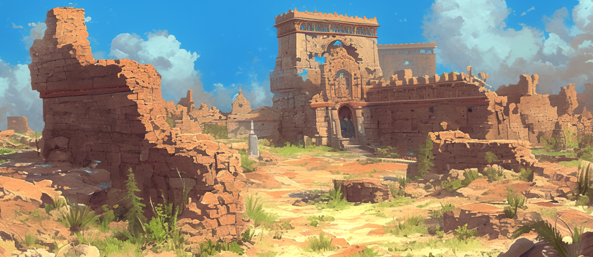
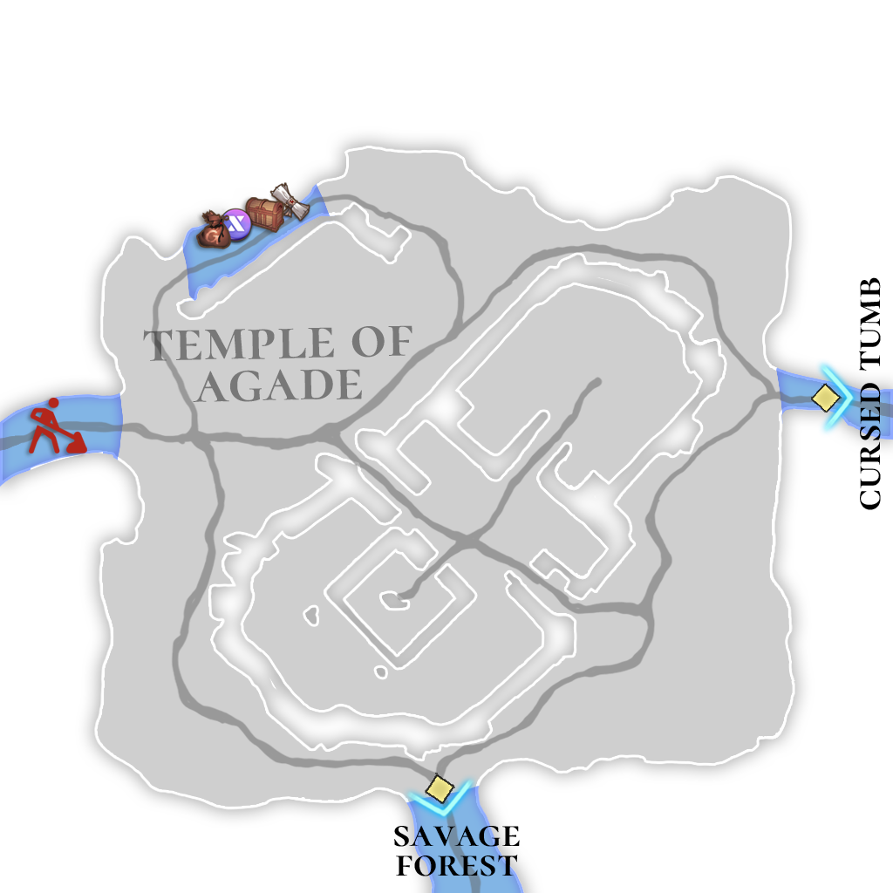

# 🏔️ \~Lv.40 Temple of Agade

<figure><figcaption></figcaption></figure>

<figure><figcaption></figcaption></figure>



📒The Temple of Agade stands as a haunting relic in the heart of the Asterica continent, a crumbled remnant believed to be all that’s left of the once-mighty Extocium Empire. Where grand halls once echoed with divine chants, now only windswept ruins remain, whispering tales of a lost era between their shattered stones. Adventurers flock here to gather relic fragments and tablet shards, alongside iron, cinnabar, and the prized cedarwood that grows in this sacred soil. With these relic fragments, tablet shards, and mana orbs harvested from defeated foes, one can craft fragments of Extocium—a prize that turns this desolate site into a treasure hunter’s dream.

The temple grounds teem with peril. Runaway boars charge with feral grunts, their tusks gleaming with reckless fury. Skeletal warriors rise from the dust, wielding broken bones as weapons and unleashing the wrath of the undead. Angel slimes shimmer with an ethereal glow, luring the unwary before ensnaring them in sticky ambushes. Desert spiders weave massive webs through the sandy haze, lying in wait for prey, while mudmen—hulking figures of animated clay—lumber forward to smother their foes in an instant. For the weak, this is a gauntlet of trials; for the strong, a battlefield ripe with rewards.

Collectors who’ve scoured the temple’s broken pillars and altars swear they’ve unearthed artifacts infused with the magic of Extocium, glowing with an otherworldly light that hints at the power of ancient gods. The cedarwood that thrives here, nourished by the consecrated earth, is prized across Asterica for its strength and subtle fragrance, making it a coveted resource among the continent’s finest craftsmen. Beyond its riches, the Temple of Agade serves as a vital gateway to the capital, Asterica. Travelers passing through feel the weight of its faded glory and the pulse of its enduring challenges—an intersection of history and survival.

<table><thead><tr><th width="72">Lv.</th><th>Monster</th><th>Drop1</th><th>Drop2</th><th>Drop3</th><th>Drop4</th></tr></thead><tbody><tr><td>32</td><td>Runaway boar (FIRE)</td><td>Pork belly</td><td>Flint</td><td>Sand</td><td>Rubber</td></tr><tr><td>34</td><td>Skeleton warrior (FORCE)</td><td>Scrap metal</td><td>Magic bead</td><td>Hard bone</td><td>Sand</td></tr><tr><td>36</td><td>Angel slime (LIGHT)</td><td>-</td><td>Jelly</td><td>Powder of blessing</td><td>Piece of jewelry</td></tr><tr><td>38</td><td>Desert spider (STONE)</td><td>Spider venom</td><td>-</td><td>Mud</td><td>Rubber</td></tr><tr><td>40</td><td>Mudman (STONE)</td><td>-</td><td>Mud</td><td>-</td><td>Spider venom</td></tr></tbody></table>

🍀**Gathered items :** Fragments of relics, stone slabs, iron, cinnabar, cedar wood

> 😈**Field Raid :** Lv.40 Humbaba
>
> 🕓**Spawn Time (UTC)** : 16:30 / 21:50 / 03:10 / 08:30 / 14:00
>
> 📦**Drop Item :** Core of protection, Lucky Core, Evil crystal, Rock crystal, Humbaba’s rice balls, Extocium etc…

🍀**Recipe  Drop Information:**

<table><thead><tr><th width="148">Monster</th><th width="152">Drop1</th><th width="137">Drop2</th><th>Drop3</th></tr></thead><tbody><tr><td>Runaway boar</td><td>Reinforced Anvil Recipe</td><td>Wind of Fire Recipe</td><td>Inferno's Necklace Recipe</td></tr><tr><td>Skeleton warrior</td><td>Reinforced Anvil Recipe</td><td>Humbaba's Lunchbox Recipe</td><td>Inferno's Bracelet Recipe</td></tr><tr><td>Angel slime</td><td>Humbaba's Lunchbox Recipe</td><td>Savage Sword Recipe</td><td>Inferno's Earrings Recipe</td></tr><tr><td>Desert spider</td><td>Wind of Fire Recipe</td><td>Wooden badge Recipe</td><td>Mermaid's Necklace Recipe</td></tr><tr><td>Mudman</td><td>Explosion Energy Recipe</td><td>Savage Sword Recipe</td><td>Mermaid's Bracelet Recipe</td></tr><tr><td>Mutated Desert Spider</td><td>Wind of Fire Recipe</td><td>Wooden badge Recipe</td><td>Leather Strap Recipe</td></tr><tr><td>Mutated Mudman</td><td>Explosion Energy Recipe</td><td>Savage Sword Recipe</td><td>Leather Strap Recipe</td></tr><tr><td>Burning Angel Slime</td><td>Humbaba's Lunchbox Recipe</td><td>Savage Sword Recipe</td><td>-</td></tr><tr><td>Burning Mudman</td><td>Explosion Energy Recipe</td><td>Savage Sword Recipe</td><td>-</td></tr></tbody></table>



📒아가데 신전은 아스테리카 대륙의 신비로운 중심지로, 한때 엑스토시움 제국의 영광을 상징했던 거대한 신전이 지금은 부서진 잔해로만 남아 있는 곳이다. 바람이 쓸쓸히 스치는 이곳에는 돌무더기 사이로 과거의 흔적이 고스란히 묻어나며, 신성함과 폐허의 경계에서 묘한 매력을 뿜어낸다. 모험가들은 이곳에서 유물 조각과 석판 조각을 캐내며, 철과 진사, 그리고 백향목을 채집할 수 있다. 특히 유물 조각과 석판 조각은 사냥으로 얻은 마력 구슬과 결합하면 엑스토시움 조각으로 제작할 수 있어, 많은 이들이 이 땅을 보물섬처럼 여기고 있다.

신전 주변은 위험한 생명체들로 가득하다. 폭주 멧돼지는 거친 숨소리와 함께 돌진하며 모험가들을 위협하고, 해골 전사는 부서진 뼈로 무장한 채 망자의 분노를 풀어놓는다. 엔젤 슬라임은 빛나는 외형으로 유혹하지만, 가까이 다가가면 끈적한 공격을 퍼붓는다. 사막 거미는 모래먼지 속에서 거대한 그물을 치며 먹잇감을 노리고, 머드맨은 진흙으로 만들어진 몸으로 느릿느릿 다가와 순식간에 덮친다. 이곳은 약한 자에게는 시험의 땅이자, 강한 자에게는 보물을 약속하는 전쟁터다.

아가데 신전의 부서진 기둥과 제단 사이에서 수집가들은 엑스토시움 제국의 흔적을 파헤치며 마력이 깃든 유물을 발견했다고 전한다. 그들의 이야기에 따르면, 이곳에서 나온 엑스토시움은 신비로운 빛을 발하며 과거 신들의 힘을 간직하고 있다. 또한, 신전 땅에서 자라나는 백향목은 그 단단함과 은은한 향기로 최고급 목재로 사랑받아, 아스테리카 대륙의 장인들에게 귀한 재료로 쓰인다. 이곳은 단순한 유적지가 아니라 수도 아스테리카로 향하는 중요한 관문이기도 하다. 먼 길을 떠나는 여행자들은 아가데 신전을 지나며 과거의 영광과 현재의 생존을 동시에 느낀다.

<table><thead><tr><th width="87">레벨</th><th>몬스터</th><th>드랍1</th><th>드랍2</th><th>드랍3</th><th>드랍4</th></tr></thead><tbody><tr><td>32</td><td>폭주 멧돼지 (FIRE)</td><td>삼겹살</td><td>부싯돌</td><td>모래</td><td>고무</td></tr><tr><td>34</td><td>해골전사 (FORCE)</td><td>고철조각</td><td>마력구슬</td><td>단단한 뼈</td><td>모래</td></tr><tr><td>36</td><td>엔젤 슬라임 (LIGHT)</td><td>-</td><td>젤리</td><td>축복의 가루</td><td>보석조각</td></tr><tr><td>38</td><td>사막거미 (STONE)</td><td>거미 독</td><td>-</td><td>진흙</td><td>고무</td></tr><tr><td>40</td><td>머드맨 (STONE)</td><td>-</td><td>진흙</td><td>–</td><td>거미 독</td></tr></tbody></table>

🍀**채집 품목 :** 유물조각, 석판조각, 철, 진사, 백향목

> 😈**필드 레이드 :** Lv.40 훔바바
>
> 🕓**출현시간 (KST)** : 01:30 / 06:50 / 12:10 / 17:30 / 23:00
>
> 📦**드랍 아이템 :** 보호의 핵, 행운의 핵, 악의 결정, 바위의 결정, 훔바바의 주먹밥, 엑스토시움 etc…

**🍀레시피 드랍 정보:**

<table><thead><tr><th width="154">Monster</th><th width="145">Drop1</th><th width="136">Drop2</th><th>Drop3</th></tr></thead><tbody><tr><td>폭주 멧돼지</td><td>
강화 모루 

레시피
</td><td>화염의 바람 제작서</td><td>
업화의 

목걸이 

제작서
</td></tr><tr><td>해골전사</td><td>
강화 모루 

레시피
</td><td>
훔바바의 

도시락 레시피
</td><td>
업화의 

팔찌 

제작서
</td></tr><tr><td>엔젤 슬라임</td><td>
훔바바의 

도시락 레시피
</td><td>
야만의검 

제작서
</td><td>
업화의 

귀걸이 

제작서
</td></tr><tr><td>사막거미</td><td>
화염의 바람 

제작서
</td><td>
나무 뱃지 

레시피
</td><td>
인어의 

목걸이 

제작서
</td></tr><tr><td>머드맨</td><td>
폭렬 에너지 

제작서
</td><td>
야만의검 

제작서
</td><td>
인어의 

팔찌 

제작서
</td></tr><tr><td>변이된 사막거미</td><td>
화염의 바람 

제작서
</td><td>
나무 뱃지 

레시피
</td><td>
가죽 끈 

레시피
</td></tr><tr><td>변이된 머드맨</td><td>
폭렬 에너지 

제작서
</td><td>
야만의검 

제작서
</td><td>
가죽 끈 

레시피
</td></tr><tr><td>불타는 엔젤 슬라임</td><td>
훔바바의 

도시락 레시피
</td><td>
야만의검 

제작서
</td><td>-</td></tr><tr><td>불타는 머드맨</td><td>
폭렬 에너지 

제작서
</td><td>
야만의검 

제작서
</td><td>-</td></tr></tbody></table>



📒アガデの神殿は、アステリカ大陸の神秘的な中心に佇む場所で、かつてエクストシウム帝国の栄光を象徴していた巨大な神殿が、今は崩れ落ちた残骸として残っています。風が寂しく吹き抜けるこの地では、瓦礫の間に過去の足跡が色濃く残り、聖なるものと廃墟が混ざり合った不思議な魅力を放っています。冒険者たちはここで遺物のかけらや石板のかけらを掘り出し、鉄や辰砂、そして白檀のような香りのする白香木を集めることができます。特に遺物のかけらと石板のかけらを、狩りで手に入れた魔力の珠と組み合わせると、エクストシウムのかけらを作り出せるんです。だから、この場所は多くの人にとって宝の島のような存在なんですよ。

神殿の周りには危険な生き物たちがうろついています。暴走イノシシは荒々しい息づかいとともに突進し、冒険者を脅かします。骸骨戦士は砕けた骨を武器に、亡者の怒りを解き放つかのように襲いかかってきます。エンジェルスライムは輝く姿で誘い込みますが、近づくとベトベトした攻撃で絡みついてくるんです。砂漠クモは砂埃の中で大きな網を張り、獲物を待ち構え、泥人（マッドマン）は泥でできた体でゆっくり近づいてきて、一瞬で覆いかぶさってきます。弱い者には試練の場であり、強い者には報酬を約束する戦場なんです。

神殿の壊れた柱や祭壇の間で、収集家たちはエクストシウム帝国の痕跡を掘り起こし、魔力の宿った遺物を見つけたと語ります。彼らの話では、ここで見つかるエクストシウムは神秘的な光を放ち、昔の神々の力を今に伝えているんだとか。そして、この神聖な土地に育つ白香木は、その硬さとほのかな香りから最高級の木材として愛され、アステリカ大陸の職人たちに重宝されています。アガデの神殿はただの遺跡じゃない。首都アステリカへと続く大切な関門でもあるんです。遠くへ旅立つ者は、ここを通りながら過去の栄光と今を生き抜く力を同時に感じ取るんですよ。

<table><thead><tr><th width="96">レベル</th><th>モンスター	</th><th>ドロップ1</th><th>ドロップ2</th><th>ドロップ3</th><th>ドロップ4</th></tr></thead><tbody><tr><td>32</td><td>暴走イノシシ (FIRE)</td><td>サムギョプサル</td><td>フリント</td><td>いさご</td><td>ゴム</td></tr><tr><td>34</td><td>骸骨戦士 (FORCE)</td><td>古鉄のかけら</td><td>魔力玉</td><td>固い骨</td><td>いさご</td></tr><tr><td>36</td><td>エンジェルスライム (LIGHT)</td><td>-</td><td>ゼリー</td><td>祝福の粉</td><td>宝石のかけら</td></tr><tr><td>38</td><td>砂漠グモ (STONE)</td><td>クモの毒</td><td>-</td><td>しつこい土</td><td>ゴム</td></tr><tr><td>40</td><td>しつこい土人間 (STONE)</td><td>-</td><td>しつこい土</td><td>–</td><td>クモの毒</td></tr></tbody></table>

🍀**採集品目 :** 遺物彫刻、石板彫刻、鉄、辰巳、白香木

> 😈**フィールドレイド :** Lv.40 フンババ
>
> 🕓**出現時間 (KST)** : 01:30 / 06:50 / 12:10 / 17:30 / 23:00
>
> 📦**ドロップアイテム:** 保護の核、幸運の核、悪の結晶、岩の結晶、フンババのおにぎり、エクストシウムetc···

🍀**レシピドロップ情報:**

<table data-full-width="true"><thead><tr><th width="151">Monster</th><th width="149">Drop1</th><th width="140">Drop2</th><th>Drop3</th></tr></thead><tbody><tr><td>暴走イノシシ</td><td>強化金床レシピ</td><td>火炎の風の製作書</td><td>インフェルノのネックレスレシピ</td></tr><tr><td>骸骨戦士</td><td>強化金床レシピ</td><td>フンババのお弁当レシピ</td><td>インフェルノのブレスレットレシピ</td></tr><tr><td>エンジェルスライム</td><td>フンババのお弁当レシピ</td><td>野蛮の剣製作書</td><td>インフェルノのイヤリングレシピ</td></tr><tr><td>砂漠グモ</td><td>火炎の風の製作書</td><td>木製バッジレシピ</td><td>人魚のネックレスレシピ</td></tr><tr><td>しつこい土人間</td><td>爆裂エネルギー製作書</td><td>野蛮の剣製作書</td><td>人魚のブレスレットレシピ</td></tr><tr><td>変異砂漠クモ</td><td>火炎の風の製作書</td><td>木製バッジレシピ</td><td>レザーストラップレシピ</td></tr><tr><td>変異マッドマン</td><td>爆裂エネルギー製作書</td><td>野蛮の剣製作書</td><td>レザーストラップレシピ</td></tr><tr><td>燃えるエンジェルスライム</td><td>フンババのお弁当レシピ</td><td>野蛮の剣製作書</td><td>-</td></tr><tr><td>燃えるマッドマン</td><td>爆裂エネルギー製作書</td><td>野蛮の剣製作書</td><td>-</td></tr></tbody></table>


