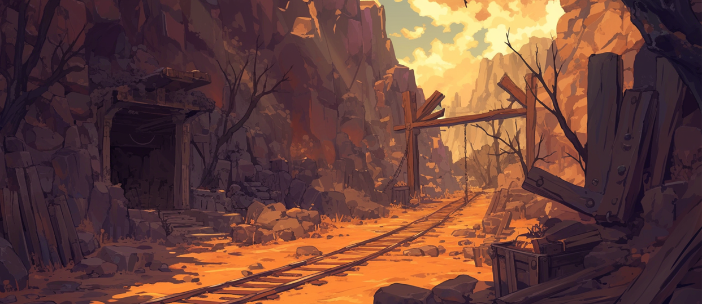
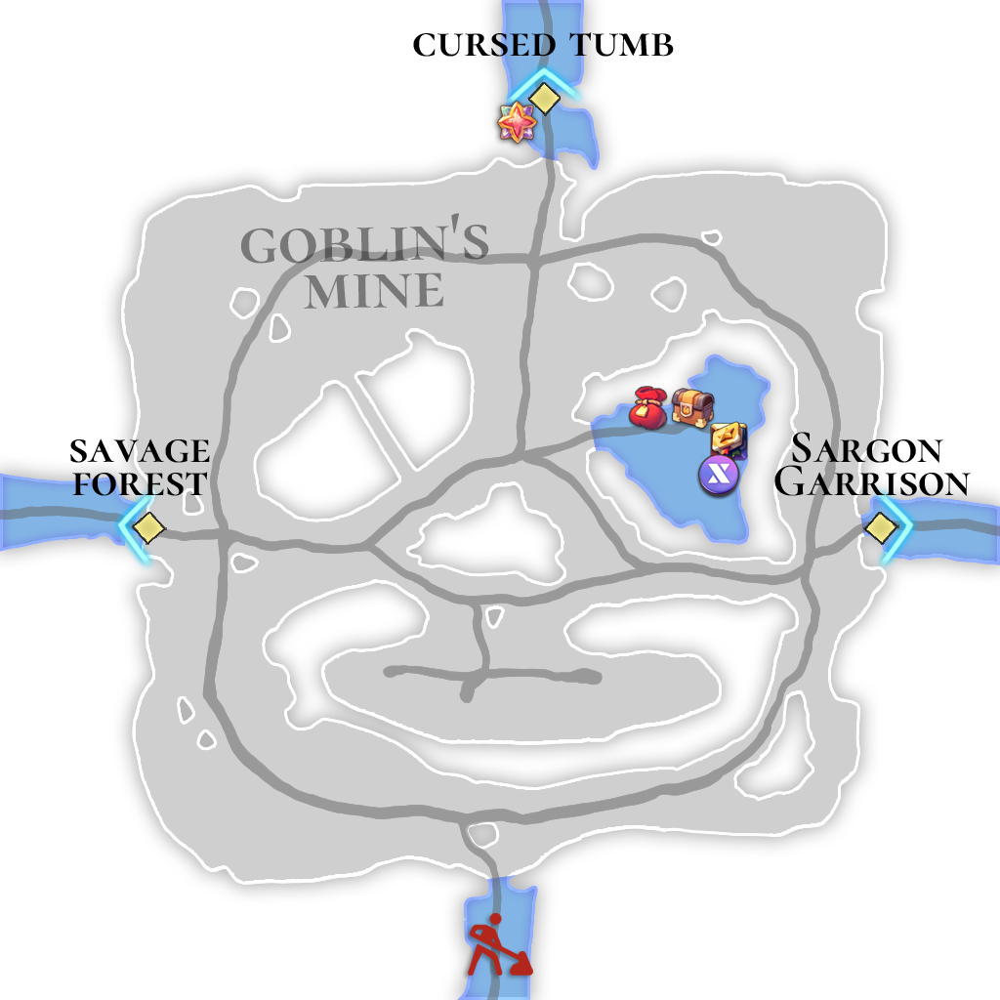

# 🌋 \~Lv.45 Goblin's Mine (PK)

<figure><figcaption></figcaption></figure>

<figure><figcaption></figcaption></figure>



📒Goblin’s Mine burrows deep beneath the Asterica continent, a rugged expanse where veins of precious gold and silver gleam in the dark. For generations, goblins have claimed this land as their own, their sharp claws and greedy gazes ruling the shadowy tunnels. Legend tells of a mighty ancient goblin who once reigned here, amassing all the gold and silver of the world and stashing it within the mine’s depths. Even after death, its spirit is said to linger, singing a haunting song of gold that echoes through the caverns, guarding its hoard. Those who stumble into the mine, it’s whispered, fall prey to an insatiable greed they can’t escape.

This is no place for the faint of heart—combat here is fierce and unforgiving. Standard goblins dart about with swift strikes and crude weapons, while black eagles swoop down from above, talons slashing through the air. Giant bears lumber through the tunnels, their roars shaking the stone and their massive paws crushing anything in their path. Golems, forged from unyielding rock, smash through obstacles with ponderous fists. Red goblin bombers lob explosives that spark chaos, and magician golems unleash bursts of arcane energy to overwhelm their foes. Every encounter in this mine is a brutal test of survival.

The tunnels of Goblin’s Mine shimmer with the allure of gold and silver, but that radiance is a deadly lure for treasure seekers. Rough carvings—perhaps left by the ancient goblin—scar the walls, and the deeper you go, the heavier the air feels, thick with the weight of history. The fabled spirit’s golden song rides the wind that weaves through the mine, stirring the hearts of all who hear it. This is a land woven with wealth, peril, and legend, where only those who can claim the gold and walk away alive truly understand its worth.

👉 [PK Leverage Type 1 Chart (Easy Difficulty) ](../../system/pk/pk-leverage-bonus/bonus-chart.md#pk-leverage-1)

<table><thead><tr><th width="91">Lv.</th><th>Monster</th><th>Drop1</th><th>Drop2</th><th>Drop3</th><th>Drop4</th></tr></thead><tbody><tr><td>41</td><td>Goblin (LEAF)</td><td>Cotton wool</td><td>Sand</td><td>Mud</td><td>Goblin Club</td></tr><tr><td>42</td><td>Black Eagle’s (DARK)</td><td> Cotton wool</td><td> Black feather</td><td>Powder of blessing</td><td>-</td></tr><tr><td>43</td><td>Red Goblin (FIRE)</td><td>Fur</td><td>Goblin Club</td><td>Powder of blessing</td><td>-</td></tr><tr><td>44</td><td>Giant Bear (LIGHT)</td><td>Ammonite</td><td>Mineral</td><td>Fur</td><td>Snow White</td></tr><tr><td>45</td><td>Golem (STONE)</td><td>Ammonite</td><td>Mineral</td><td>Fur</td><td>Snow White</td></tr><tr><td>43</td><td>Red Goblin Bomber (FIRE)</td><td>Fur</td><td>Goblin Club</td><td>Powder of blessing</td><td>-</td></tr><tr><td>45</td><td>Magician Golem (WATER)</td><td>Ammonite</td><td>Mineral</td><td>Fur</td><td>Snow White</td></tr></tbody></table>

🍀**Gathered items :** gold, silver

> 😈**Field Raid :** Lv.50 Ancient Goblin (Fire) / Lv.50 Ancient Goblin Minions (Water)
>
> 🕓**Spawn Time (UTC) :** 14:20 / 19:00 / 00:00 / 05:00 / 10:40
>
> **🕓Spawn Time (PHT) :** 22:20 / 03:00 / 08:00 / 13:00 / 18:40
>
> 📦**Drop Item :** Core of protection, Lucky Core, Evil crystal, Wealth crystal, Lobster, Extocium etc…
>
> <a href="https://extocium.com/ancientgoblin/" class="button primary" data-icon="pen-circle">Drop Table Detail...</a>

🍀**Recipe  Drop Information:**

<table><thead><tr><th width="142">Monster</th><th width="141">Drop1</th><th width="120">Drop2</th><th>Drop3</th></tr></thead><tbody><tr><td>Goblin</td><td>White cloth Recipe</td><td>Summons HP Potion Lv.3 Recipe</td><td>Silver Chain Recipe</td></tr><tr><td>Black Eagle’s</td><td>Thread Recipe</td><td>Tear's Necklace Recipe</td><td>Silver Chain Recipe</td></tr><tr><td>Red Goblin</td><td>Summons HP Potion Lv.3 Recipe</td><td>Tear's Necklace Recipe</td><td>Silver Chain Recipe</td></tr><tr><td>Giant Bear</td><td>White cloth Recipe</td><td>Tear's Necklace Recipe</td><td>Gold Chain Recipe</td></tr><tr><td>Golem</td><td>Thread Recipe</td><td>-</td><td>Gold Chain Recipe</td></tr><tr><td>Red Goblin Bomber</td><td>Summons HP Potion Lv.3 Recipe</td><td>-</td><td>Gold Chain Recipe</td></tr><tr><td>Magician Golem</td><td>Summons HP Potion Lv.3 Recipe</td><td>-</td><td>Gold Chain Recipe</td></tr><tr><td>Mutated Red Goblin</td><td>White cloth Recipe</td><td>-</td><td>Gold Chain Recipe</td></tr><tr><td>Mutated Giant Bear</td><td>White cloth Recipe</td><td>-</td><td>-</td></tr><tr><td>Burning Magician Golem</td><td>Summons HP Potion Lv.3 Recipe</td><td></td><td>-</td></tr></tbody></table>



📒고블린 광산은 아스테리카 대륙의 깊은 지하에 뻗어 있는 거친 땅으로, 황금과 은이 반짝이는 귀한 광맥이 숨 쉬는 곳이다. 대대로 고블린들이 이곳을 터전으로 삼아 살아왔으며, 그들의 날카로운 손톱과 탐욕스러운 눈빛이 광산의 어두운 굴을 지배한다. 전설에 따르면, 먼 옛날 이 땅을 다스리던 강력한 고대 고블린이 세상의 모든 황금과 은을 긁어모아 광산 깊숙한 곳에 숨겼다고 한다. 그 고블린의 혼은 죽은 뒤에도 떠나지 않고, 지금도 황금빛 노래를 부르며 보물을 지키고 있다. 광산에 발을 들인 자는 그 노래에 이끌려 끝없는 탐욕에 사로잡힌다고 전해진다.

이곳은 약한 자가 쉽게 버틸 수 없는 위험한 전장이다. 기본 고블린들은 재빠른 움직임과 날카로운 무기로 위협을 가하며, 검은 독수리는 하늘에서 내려와 날카로운 발톱으로 공격을 퍼붓는다. 자이언트 베어는 우람한 몸집과 굉음 같은 포효로 굴 안을 뒤흔들고, 골렘은 단단한 돌로 만들어진 육중한 주먹으로 모든 것을 짓뭉갠다. 레드 고블린 봄버는 폭발물을 던지며 혼란을 일으키고, 매지션 골렘은 마력을 품은 빛으로 적을 몰아붙인다. 이곳에서의 전투는 단순한 사냥이 아니라 생존을 건 싸움이다.

고블린 광산의 굴은 황금과 은의 빛으로 반짝이지만, 그 빛은 보물을 노리는 자들을 유혹하는 치명적인 함정이기도 하다. 벽면에는 고대 고블린이 남긴 듯한 조잡한 문양이 새겨져 있고, 깊은 곳으로 갈수록 공기마저 무겁게 느껴진다. 전설 속 고대 고블린의 혼이 부르는 황금의 노래는 광산을 떠도는 바람 속에 실려, 듣는 이의 마음을 뒤흔든다. 이곳은 부와 위험, 그리고 전설이 얽힌 땅으로, 황금을 손에 쥐고 살아남을 수 있는 자만이 그 진정한 가치를 알게 된다.

👉[PK 레버리지 타입 1 도표( 쉬움 난이도 ) ](../../system/pk/pk-leverage-bonus/bonus-chart.md#pk-leverage-1)

<table><thead><tr><th width="83">레벨</th><th>몬스터</th><th>드랍1</th><th>드랍2</th><th>드랍3</th><th>드랍4</th></tr></thead><tbody><tr><td>41</td><td>고블린 (LEAF)</td><td> 목화솜</td><td>모래</td><td>진흙</td><td>고블린 클럽</td></tr><tr><td>42</td><td>검은 독수리 (DARK)</td><td> 목화솜</td><td> 검은깃털</td><td>축복의 가루</td><td>-</td></tr><tr><td>43</td><td>레드 고블린 (FIRE)</td><td>털가죽</td><td>고블린 클럽</td><td>축복의 가루</td><td>-</td></tr><tr><td>44</td><td>자이언트 베어 (LIGHT)</td><td>암모나이트</td><td>수정광석</td><td>털가죽</td><td>백설화</td></tr><tr><td>45</td><td>골렘(STONE)</td><td>암모나이트</td><td>수정광석</td><td>털가죽</td><td>백설화</td></tr><tr><td>43</td><td>레드 고블린 봄버 (FIRE)</td><td>털가죽</td><td>고블린 클럽</td><td>축복의 가루</td><td>-</td></tr><tr><td>45</td><td>매지션 골렘 (WATER)</td><td>암모나이트</td><td>수정광석</td><td>털가죽</td><td>백설화</td></tr></tbody></table>

🍀**채집 품목 :** 금, 은

> 😈**필드 레이드 :** Lv.50 고대 고블린
>
> 🕓**출현시간 (KST)** : 23:20 / 04:00 / 09:00 / 14:00 / 19:40
>
> 📦**드랍 아이템 :** 보호의 핵, 행운의 핵, 악의 결정, 부귀의 결정, 랍스터, 엑스토시움 etc…
>
> <a href="https://extocium.com/ancientgoblin/" class="button primary" data-icon="pen-circle">Drop Table Detail...</a>

**🍀레시피 드랍 정보:**

<table><thead><tr><th width="151">Monster</th><th width="146">Drop1</th><th width="138">Drop2</th><th>Drop3</th></tr></thead><tbody><tr><td>고블린</td><td>흰 천 레시피</td><td>소환수 HP 포션 Lv.3 레시피</td><td>은 사슬 레시피</td></tr><tr><td>검은 독수리</td><td>실 레시피</td><td>눈물의 목걸이 제작서</td><td>은 사슬 레시피</td></tr><tr><td>레드 고블린</td><td>소환수 HP 포션 Lv.3 레시피</td><td>눈물의 목걸이 제작서</td><td>은 사슬 레시피</td></tr><tr><td>자이언트 베어</td><td>흰 천 레시피</td><td>눈물의 목걸이 제작서</td><td>금 사슬 레시피</td></tr><tr><td>골렘</td><td>실 레시피</td><td>-</td><td>금 사슬 레시피</td></tr><tr><td>레드고블린 봄버</td><td>소환수 HP 포션 Lv.3 레시피</td><td>-</td><td>금 사슬 레시피</td></tr><tr><td>매지션 골렘</td><td>소환수 HP 포션 Lv.3 레시피</td><td>-</td><td>금 사슬 레시피</td></tr><tr><td>변이된 레드고블린</td><td>흰 천 레시피</td><td>-</td><td>금 사슬 레시피</td></tr><tr><td>변이된 자이언트 베어</td><td>흰 천 레시피</td><td>-</td><td></td></tr><tr><td>불타는 매지션 골렘</td><td>소환수 HP 포션 Lv.3 레시피</td><td></td><td></td></tr></tbody></table>



📒ゴブリン鉱山は、アステリカ大陸の地下深くに広がる荒々しい土地で、金と銀がキラキラ輝く貴重な鉱脈が息づいています。ずっと昔からゴブリンたちがこの場所を住処とし、鋭い爪と欲深い目で暗い坑道を支配してきました。伝説によると、遠い昔、この地を治めていた強力な古代ゴブリンが、世界中の金と銀をかき集めて鉱山の奥深くに隠したんだとか。その魂は死んでも去らず、今でも金の歌を歌いながら宝を守っていると言われています。この鉱山に足を踏み入れた者は、その歌に引き寄せられて止まらない欲望に取り憑かれると囁かれています。

ここは弱い者には耐えられない危険な場所です。普通のゴブリンは素早い動きと粗っぽい武器で襲いかかり、黒い鷲は上空から鋭い爪で切りつけてきます。ジャイアントベアは巨大な体で坑道を震わせ、唸り声とともにすべてを押し潰し、ゴーレムは硬い石でできた重い拳で立ちはだかるものを叩き潰します。レッドゴブリンボマーは爆発物を投げて混乱を引き起こし、マジシャンゴーレムは魔法の光で敵を追い詰めるんです。ここでの戦いはただの狩りじゃなく、生き残りをかけた闘いなんですよ。

ゴブリン鉱山の坑道は金と銀の輝きで照らされていますが、その光は宝を求める者を誘う危険な罠でもあります。壁には古代ゴブリンが残したような粗い模様が刻まれ、奥へ進むほど空気が重く感じられるんです。伝説の古代ゴブリンが歌う金の歌は、鉱山を吹き抜ける風に乗り、聞く者の心をかき乱します。この場所は富と危険、そして伝説が絡み合った土地で、金を手にし生きて帰れる者だけがその本当の価値を知るんです。

👉 [PKレバレッジタイプ1の表（簡単な難易度） ](../../system/pk/pk-leverage-bonus/bonus-chart.md#pk-leverage-1)

<table data-full-width="true"><thead><tr><th width="100" align="center">レベル</th><th width="134" align="center">モンスター</th><th align="center">ドロップ1</th><th align="center">ドロップ2</th><th width="129" align="center">ドロップ3</th><th width="145" align="center">ドロップ4</th></tr></thead><tbody><tr><td align="center">41</td><td align="center">ゴブリン (LEAF)</td><td align="center"> 綿</td><td align="center">いさご</td><td align="center">しつこい土</td><td align="center">ゴブリンクラブ</td></tr><tr><td align="center">42</td><td align="center">黒鷲 (DARK)</td><td align="center"> 綿</td><td align="center">黒い羽毛</td><td align="center">祝福の粉</td><td align="center">-</td></tr><tr><td align="center">43</td><td align="center">レッドゴブリン (FIRE)</td><td align="center">毛皮</td><td align="center">ゴブリンクラブ</td><td align="center">祝福の粉</td><td align="center">-</td></tr><tr><td align="center">44</td><td align="center">ジャイアントベア (LIGHT)</td><td align="center">アンモナイト</td><td align="center">水晶鉱石</td><td align="center">毛皮</td><td align="center">白雪花</td></tr><tr><td align="center">45</td><td align="center">ゴーレム(STONE)</td><td align="center">アンモナイト</td><td align="center">水晶鉱石</td><td align="center">毛皮</td><td align="center">白雪花</td></tr><tr><td align="center">43</td><td align="center">レッドゴブリン ボンバー (FIRE)</td><td align="center">毛皮</td><td align="center">ゴブリンクラブ</td><td align="center">祝福の粉</td><td align="center">-</td></tr><tr><td align="center">45</td><td align="center">マジシャン ゴーレム (WATER)</td><td align="center">アンモナイト</td><td align="center">水晶鉱石</td><td align="center">毛皮</td><td align="center">白雪花</td></tr></tbody></table>

🍀**採集品目 :** 金、銀

> 😈**フィールドレイド :** Lv.50 古代ゴブリン
>
> 🕓**出現時間 (KST)** : 23:20 / 04:00 / 09:00 / 14:00 / 19:40
>
> 📦**ドロップアイテム:** 保護の核、幸運の核、悪の結晶、富貴の結晶、ロブスター、エクストシウムetc···
>
> <a href="https://extocium.com/ancientgoblin/" class="button primary" data-icon="pen-circle">Drop Table Detail...</a>

🍀**レシピドロップ情報:**

<table><thead><tr><th width="134">Monster</th><th width="156">Drop1</th><th width="153">Drop2</th><th>Drop3</th></tr></thead><tbody><tr><td>ゴブリン</td><td>白い布のレシピ</td><td>召喚数 HPポーション Lv.3 レシピ</td><td>銀の鎖レシピ</td></tr><tr><td>黒鷲</td><td>糸レシピ</td><td>涙のネックレスレシピ</td><td>銀の鎖レシピ</td></tr><tr><td>レッドゴブリン</td><td>召喚数 HPポーション Lv.3 レシピ</td><td>涙のネックレスレシピ</td><td>銀の鎖レシピ</td></tr><tr><td>ジャイアントベア</td><td>白い布のレシピ</td><td>涙のネックレスレシピ</td><td>金の鎖レシピ</td></tr><tr><td>ゴーレム</td><td>糸レシピ</td><td>-</td><td>金の鎖レシピ</td></tr><tr><td>レッドゴブリン ボンバー</td><td>召喚数 HPポーション Lv.3 レシピ</td><td>-</td><td>金の鎖レシピ</td></tr><tr><td>マジシャン ゴーレム</td><td>召喚数 HPポーション Lv.3 レシピ</td><td>-</td><td>金の鎖レシピ</td></tr><tr><td>変異レッドゴブリン</td><td>白い布のレシピ</td><td>-</td><td>金の鎖レシピ</td></tr><tr><td>変異ジャイアントベア</td><td>白い布のレシピ</td><td>-</td><td>-</td></tr><tr><td> 燃えるマジシャンゴーレム</td><td>召喚数 HPポーション Lv.3 レシピ</td><td>-</td><td>-</td></tr></tbody></table>



