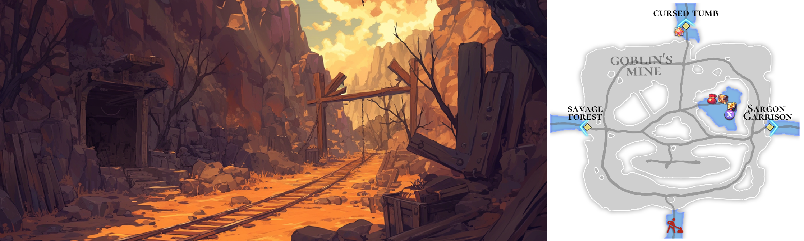

# 🌋 \~Lv.45 Goblin's Mine (PK)

<figure><figcaption></figcaption></figure>



### ⛏️ Goblin’s Mine

Deep beneath the Asterica continent lies\
a harsh underground land where veins of gold and silver shimmer in the darkness.\
This is **Goblin’s Mine**.

Glittering ore veins hidden in shadow\
and roughly carved tunnels reveal that this place is far more than a simple mine.\
It is a land where greed and danger have long coexisted.\
For generations, goblins made this mine their home,\
and traces of their presence still remain deep underground.

***

According to legend,\
a powerful ancient goblin once ruled this land and gathered vast amounts of gold and silver,\
hiding them in the deepest reaches of the mine.

Even after death, the spirit of that goblin is said to linger,\
singing a song of gold as it guards its hidden treasure.\
Those who step into the mine are rumored to be drawn in by that song,\
slowly consumed by endless greed.

***

Crude markings carved into the walls\
are believed to be remnants left behind by ancient goblins,\
and the deeper one ventures, the heavier the air becomes.

The glow of gold and silver lures adventurers in, but that same light can become a deadly trap.

Goblin’s Mine is a land where wealth, danger, and legend intertwine.\
Only those who can grasp gold and still return safely will ever learn its true value.

***

🍀 **Item Drop Information :**

<table><thead><tr><th width="91">Lv.</th><th>Monster</th><th>Drop1</th><th>Drop2</th><th>Drop3</th><th>Drop4</th></tr></thead><tbody><tr><td>41</td><td>Goblin (LEAF)</td><td>Cotton wool</td><td>Sand</td><td>Mud</td><td>Goblin Club</td></tr><tr><td>42</td><td>Black Eagle’s (DARK)</td><td> Cotton wool</td><td> Black feather</td><td>Powder of blessing</td><td>-</td></tr><tr><td>43</td><td>Red Goblin (FIRE)</td><td>Fur</td><td>Goblin Club</td><td>Powder of blessing</td><td>-</td></tr><tr><td>44</td><td>Giant Bear (LIGHT)</td><td>Ammonite</td><td>Mineral</td><td>Fur</td><td>Snow White</td></tr><tr><td>45</td><td>Golem (STONE)</td><td>Ammonite</td><td>Mineral</td><td>Fur</td><td>Snow White</td></tr><tr><td>43</td><td>Red Goblin Bomber (FIRE)</td><td>Fur</td><td>Goblin Club</td><td>Powder of blessing</td><td>-</td></tr><tr><td>45</td><td>Magician Golem (WATER)</td><td>Ammonite</td><td>Mineral</td><td>Fur</td><td>Snow White</td></tr></tbody></table>

🍀**Gathered items :** gold, silver

> 😈**Field Raid :** Lv.50 Ancient Goblin (Fire) / Lv.50 Ancient Goblin Minions (Water)
>
> 🕓**Spawn Time (UTC) :** 14:20 / 19:00 / 00:00 / 05:00 / 10:40
>
> **🕓Spawn Time (PHT) :** 22:20 / 03:00 / 08:00 / 13:00 / 18:40
>
> 📦**Drop Item :** Core of protection, Lucky Core, Evil crystal, Wealth crystal, Lobster, Extocium etc…
>
> <a href="https://extocium.com/ancientgoblin/" class="button primary" data-icon="pen-circle">Drop Table Detail...</a>

🍀**Recipe  Drop Information:**

<table><thead><tr><th width="142">Monster</th><th width="141">Drop1</th><th width="120">Drop2</th><th>Drop3</th><th>Drop4</th><th>Drop5</th></tr></thead><tbody><tr><td>Goblin</td><td>White cloth Recipe</td><td>Summons HP Potion Lv.3 Recipe</td><td>Silver Chain Recipe</td><td>Silver Clasp Recipe</td><td></td></tr><tr><td>Black Eagle’s</td><td>Thread Recipe</td><td>Tear's Necklace Recipe</td><td>Silver Chain Recipe</td><td>Silver Clasp Recipe</td><td></td></tr><tr><td>Red Goblin</td><td>Summons HP Potion Lv.3 Recipe</td><td>Tear's Necklace Recipe</td><td>Silver Chain Recipe</td><td>Silver Clasp Recipe</td><td></td></tr><tr><td>Giant Bear</td><td>White cloth Recipe</td><td>Tear's Necklace Recipe</td><td>Gold Chain Recipe</td><td>Gold Clasp Recipe</td><td></td></tr><tr><td>Golem</td><td>Thread Recipe</td><td>-</td><td>Gold Chain Recipe</td><td>Gold Clasp Recipe</td><td>Leather Strap Recipe</td></tr><tr><td>Red Goblin Bomber</td><td>Summons HP Potion Lv.3 Recipe</td><td>-</td><td>Gold Chain Recipe</td><td>Gold Clasp Recipe</td><td>Leather Strap Recipe</td></tr><tr><td>Magician Golem</td><td>Summons HP Potion Lv.3 Recipe</td><td>-</td><td>Gold Chain Recipe</td><td>Gold Clasp Recipe</td><td>Leather Strap Recipe</td></tr><tr><td>Mutated Red Goblin</td><td>White cloth Recipe</td><td>-</td><td>Gold Chain Recipe</td><td>Gold Clasp Recipe</td><td></td></tr><tr><td>Mutated Giant Bear</td><td>White cloth Recipe</td><td>-</td><td>-</td><td></td><td></td></tr></tbody></table>

🍀 **Weapon Drop Notice (Paid Energy)**

When using Paid Energy, rewards are drawn from the Paid Energy–exclusive reward pool.\
At an extremely low probability, the following weapon items may be dropped.

> **Bronze Sword, Paladin's Sword, Orc eye, Damascus, Savage Sword, Oracle Sword**



### ⛏️ 고블린 광산 (Goblin’s Mine)

아스테리카 대륙의 깊은 지하에는, 황금과 은이 숨 쉬는 거친 땅, **고블린 광산**이 끝없이 이어져 있습니다.

어둠 속에서 반짝이는 광맥과 거칠게 파인 굴은 이곳이 단순한 채굴장이 아니라,\
오래전부터 탐욕과 위험이 공존해 온 장소임을 보여줍니다.\
대대로 고블린들이 이 광산을 터전 삼아 살아왔으며, 그 흔적은 지금도 광산 깊숙한 곳에 남아 있습니다.

***

전설에 따르면, 먼 옛날 이 땅을 다스리던 강력한 고대 고블린이\
세상의 황금과 은을 모아 광산 가장 깊은 곳에 숨겨 두었다고 전해집니다.

그 고블린의 혼은 죽은 뒤에도 이곳을 떠나지 못하고,\
지금도 황금의 노래를 부르며 보물을 지키고 있다고 합니다.\
광산에 발을 들인 자는 그 노래에 이끌려 끝없는 탐욕에 사로잡힌다는 소문도 있습니다.

***

광산의 벽면에는 고대 고블린이 남긴 듯한 조잡한 문양이 새겨져 있으며,\
깊숙한 곳으로 갈수록 공기마저 무겁게 가라앉습니다.

황금과 은의 빛은 보물을 노리는 모험가들을 유혹하지만, 그 빛은 동시에 치명적인 함정이기도 합니다.

고블린 광산은 부와 위험, 그리고 전설이 얽힌 땅으로,\
황금을 손에 쥐고서도 무사히 돌아올 수 있는 자만이 그 진정한 가치를 알게 되는 곳입니다.

***

🍀 **아이템 드랍 정보 :**

<table><thead><tr><th width="83">레벨</th><th>몬스터</th><th>드랍1</th><th>드랍2</th><th>드랍3</th><th>드랍4</th></tr></thead><tbody><tr><td>41</td><td>고블린 (LEAF)</td><td> 목화솜</td><td>모래</td><td>진흙</td><td>고블린 클럽</td></tr><tr><td>42</td><td>검은 독수리 (DARK)</td><td> 목화솜</td><td> 검은깃털</td><td>축복의 가루</td><td>-</td></tr><tr><td>43</td><td>레드 고블린 (FIRE)</td><td>털가죽</td><td>고블린 클럽</td><td>축복의 가루</td><td>-</td></tr><tr><td>44</td><td>자이언트 베어 (LIGHT)</td><td>암모나이트</td><td>수정광석</td><td>털가죽</td><td>백설화</td></tr><tr><td>45</td><td>골렘(STONE)</td><td>암모나이트</td><td>수정광석</td><td>털가죽</td><td>백설화</td></tr><tr><td>43</td><td>레드 고블린 봄버 (FIRE)</td><td>털가죽</td><td>고블린 클럽</td><td>축복의 가루</td><td>-</td></tr><tr><td>45</td><td>매지션 골렘 (WATER)</td><td>암모나이트</td><td>수정광석</td><td>털가죽</td><td>백설화</td></tr></tbody></table>

🍀**채집 품목 :** 금, 은

> 😈**필드 레이드 :** Lv.50 고대 고블린
>
> 🕓**출현시간 (KST)** : 23:20 / 04:00 / 09:00 / 14:00 / 19:40
>
> 📦**드랍 아이템 :** 보호의 핵, 행운의 핵, 악의 결정, 부귀의 결정, 랍스터, 엑스토시움 etc…
>
> <a href="https://extocium.com/ancientgoblin/" class="button primary" data-icon="pen-circle">Drop Table Detail...</a>

**🍀레시피 드랍 정보:**

<table><thead><tr><th width="153.22222900390625">Monster</th><th width="126.00006103515625">Drop1</th><th width="128">Drop2</th><th width="112.4442138671875">Drop3</th><th width="105.77783203125">Drop4</th><th>Drop5</th></tr></thead><tbody><tr><td>고블린</td><td>흰 천 레시피</td><td>소환수 HP 포션 Lv.3 레시피</td><td>은 사슬 레시피</td><td>은 고리 레시피</td><td>-</td></tr><tr><td>검은 독수리</td><td>실 레시피</td><td>눈물의 목걸이 제작서</td><td>은 사슬 레시피</td><td>은 고리 레시피</td><td>-</td></tr><tr><td>레드 고블린</td><td>소환수 HP 포션 Lv.3 레시피</td><td>눈물의 목걸이 제작서</td><td>은 사슬 레시피</td><td>은 고리 레시피</td><td>-</td></tr><tr><td>자이언트 베어</td><td>흰 천 레시피</td><td>눈물의 목걸이 제작서</td><td>금 사슬 레시피</td><td>금 고리 레시피</td><td>-</td></tr><tr><td>골렘</td><td>실 레시피</td><td>-</td><td>금 사슬 레시피</td><td>금 고리 레시피</td><td>가죽 끈 레시피</td></tr><tr><td>레드고블린 봄버</td><td>소환수 HP 포션 Lv.3 레시피</td><td>-</td><td>금 사슬 레시피</td><td>금 고리 레시피</td><td>가죽 끈 레시피</td></tr><tr><td>매지션 골렘</td><td>소환수 HP 포션 Lv.3 레시피</td><td>-</td><td>금 사슬 레시피</td><td>금 고리 레시피</td><td>가죽 끈 레시피</td></tr><tr><td>변이된 레드고블린</td><td>흰 천 레시피</td><td>-</td><td>금 사슬 레시피</td><td>금 고리 레시피</td><td></td></tr><tr><td>변이된 자이언트 베어</td><td>흰 천 레시피</td><td>-</td><td></td><td></td><td></td></tr></tbody></table>

🍀 **유료 에너지 사용 시 무기 드랍 안내**

유료 에너지를 사용하면 유료 에너지 풀 전용 보상이 적용됩니다.
\
이때, 매우 희박한 확률로 아래의 무기 아이템이 드랍될 수 있습니다.

> **청동검, 팔라딘의 검, 오크의 눈, 다마스커스, 야만의검, 오라클 스워드**



### ⛏️ ゴブリン鉱山（Goblin’s Mine）

アステリカ大陸の地下深くには、金と銀の鉱脈が闇の中で輝く、\
荒々しい地下の地、**ゴブリン鉱山**が広がっています。

暗闇に浮かぶ鉱脈と 無数に掘り進められた坑道は、この場所が単なる鉱山ではなく、\
欲望と危険が長きにわたり交錯してきた地であることを物語っています。\
代々ゴブリンたちがこの鉱山を住処としてきた痕跡は、今もなお深部に残されています。

***

伝説によれば、はるか昔、この地を治めていた強大な古代ゴブリンが\
世界中の金と銀を集め、鉱山の最深部に隠したと言われています。

そのゴブリンの魂は死してなおこの地を離れず、\
今も黄金の歌を歌いながら 財宝を守り続けているのだとか。\
鉱山に足を踏み入れた者は、\
その歌声に誘われ、尽きることのない欲望に囚われると噂されています。

***

坑道の壁面には、古代ゴブリンが残したと思われる 粗雑な文様が刻まれており、\
奥へ進むほど 空気は重く沈んでいきます。

金と銀の輝きは 冒険者を惹きつけますが、同時に致命的な罠ともなり得ます。

ゴブリン鉱山は、富と危険、そして伝説が絡み合う地です。\
黄金を手にしながらも 無事に帰還できた者だけが、\
この場所の真の価値を知ることができるでしょう。

***

🍀 **アイテムドロップ情報：**

<table data-full-width="true"><thead><tr><th width="100" align="center">レベル</th><th width="133.99981689453125" align="center">モンスター</th><th width="128" align="center">ドロップ1</th><th align="center">ドロップ2</th><th width="106.5" align="center">ドロップ3</th><th width="116.25" align="center">ドロップ4</th></tr></thead><tbody><tr><td align="center">41</td><td align="center">ゴブリン (LEAF)</td><td align="center"> 綿</td><td align="center">いさご</td><td align="center">しつこい土</td><td align="center">ゴブリンクラブ</td></tr><tr><td align="center">42</td><td align="center">黒鷲 (DARK)</td><td align="center"> 綿</td><td align="center">黒い羽毛</td><td align="center">祝福の粉</td><td align="center">-</td></tr><tr><td align="center">43</td><td align="center">レッドゴブリン (FIRE)</td><td align="center">毛皮</td><td align="center">ゴブリンクラブ</td><td align="center">祝福の粉</td><td align="center">-</td></tr><tr><td align="center">44</td><td align="center">ジャイアントベア (LIGHT)</td><td align="center">アンモナイト</td><td align="center">水晶鉱石</td><td align="center">毛皮</td><td align="center">白雪花</td></tr><tr><td align="center">45</td><td align="center">ゴーレム(STONE)</td><td align="center">アンモナイト</td><td align="center">水晶鉱石</td><td align="center">毛皮</td><td align="center">白雪花</td></tr><tr><td align="center">43</td><td align="center">レッドゴブリン ボンバー (FIRE)</td><td align="center">毛皮</td><td align="center">ゴブリンクラブ</td><td align="center">祝福の粉</td><td align="center">-</td></tr><tr><td align="center">45</td><td align="center">マジシャン ゴーレム (WATER)</td><td align="center">アンモナイト</td><td align="center">水晶鉱石</td><td align="center">毛皮</td><td align="center">白雪花</td></tr></tbody></table>

🍀**採集品目 :** 金、銀

> 😈**フィールドレイド :** Lv.50 古代ゴブリン
>
> 🕓**出現時間 (KST)** : 23:20 / 04:00 / 09:00 / 14:00 / 19:40
>
> 📦**ドロップアイテム:** 保護の核、幸運の核、悪の結晶、富貴の結晶、ロブスター、エクストシウムetc···
>
> <a href="https://extocium.com/ancientgoblin/" class="button primary" data-icon="pen-circle">Drop Table Detail...</a>

🍀**レシピドロップ情報:**

<table><thead><tr><th width="134">Monster</th><th width="151">Drop1</th><th width="139.2498779296875">Drop2</th><th width="121.75">Drop3</th><th>Drop4</th><th>Drop4</th></tr></thead><tbody><tr><td>ゴブリン</td><td>白い布のレシピ</td><td>召喚数 HPポーション Lv.3 レシピ</td><td>銀の鎖レシピ</td><td>銀のリングレシピ</td><td>-</td></tr><tr><td>黒鷲</td><td>糸レシピ</td><td>涙のネックレスレシピ</td><td>銀の鎖レシピ</td><td>銀のリングレシピ</td><td>-</td></tr><tr><td>レッドゴブリン</td><td>召喚数 HPポーション Lv.3 レシピ</td><td>涙のネックレスレシピ</td><td>銀の鎖レシピ</td><td>銀のリングレシピ</td><td>-</td></tr><tr><td>ジャイアントベア</td><td>白い布のレシピ</td><td>涙のネックレスレシピ</td><td>金の鎖レシピ</td><td>金のリングレシピ</td><td>-</td></tr><tr><td>ゴーレム</td><td>糸レシピ</td><td>-</td><td>金の鎖レシピ</td><td>金のリングレシピ</td><td>レザーストラップレシピ</td></tr><tr><td>レッドゴブリン ボンバー</td><td>召喚数 HPポーション Lv.3 レシピ</td><td>-</td><td>金の鎖レシピ</td><td>金のリングレシピ</td><td>レザーストラップレシピ</td></tr><tr><td>マジシャン ゴーレム</td><td>召喚数 HPポーション Lv.3 レシピ</td><td>-</td><td>金の鎖レシピ</td><td>金のリングレシピ</td><td>レザーストラップレシピ</td></tr><tr><td>変異レッドゴブリン</td><td>白い布のレシピ</td><td>-</td><td>金の鎖レシピ</td><td>金のリングレシピ</td><td></td></tr><tr><td>変異ジャイアントベア</td><td>白い布のレシピ</td><td>-</td><td>-</td><td></td><td></td></tr></tbody></table>

🍀 **有料エナジー使用時の武器ドロップ案内**

有料エナジーを使用すると、有料エナジー専用報酬プールが適用されます。
\
この際、非常に低い確率で、以下の武器アイテムがドロップする場合があります。

> **青銅の剣, パラディンの剣, オークの目, ダマスカス, 野蛮の剣, オラクル·スワード**



<em>※ This guide was written based on the game status as of January 23, 2026,</em>  <em>and its contents may change with future updates.</em>

