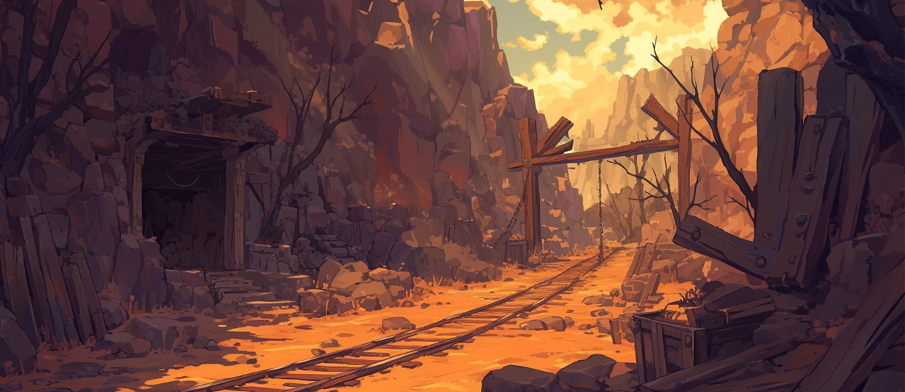

# 🌋 \~Lv.50 Goblin's Mine (PK)

<figure><figcaption></figcaption></figure>

<figure><figcaption></figcaption></figure>



📒This is a land where precious gold and silver are mined, a place where goblins have lived for generations. According to legend, a powerful ancient goblin who once lived in this land gathered all the gold and silver in the world and hid it here. It is said that its spirit still remains in this land, singing the song of gold. Those who mistakenly set foot in the goblin mines are said to become consumed by an unquenchable greed.

👉 [PK Leverage Type 1 Chart (Easy Difficulty) ](../../contents/pk/pk-leverage-bonus/bonus-chart.md#pk-leverage-1)

<table><thead><tr><th width="91">Lv.</th><th>Monster</th><th>Drop1</th><th>Drop2</th><th>Drop3</th><th>Drop4</th></tr></thead><tbody><tr><td>41</td><td>Goblin (LEAF)</td><td>Cotton wool</td><td>Sand</td><td>Mud</td><td>Goblin Club</td></tr><tr><td>42</td><td>Black Eagle’s (DARK)</td><td> Cotton wool</td><td> Black feather</td><td>Powder of blessing</td><td>-</td></tr><tr><td>43</td><td>Red Goblin (FIRE)</td><td>Fur</td><td>Goblin Club</td><td>Powder of blessing</td><td>-</td></tr><tr><td>44</td><td>Giant Bear (LIGHT)</td><td>Ammonite</td><td>Mineral</td><td>Fur</td><td>Snow White</td></tr><tr><td>45</td><td>Golem (STONE)</td><td>Ammonite</td><td>Mineral</td><td>Fur</td><td>Snow White</td></tr><tr><td>43</td><td>Red Goblin Bomber (FIRE)</td><td>Fur</td><td>Goblin Club</td><td>Powder of blessing</td><td>-</td></tr><tr><td>45</td><td>Magician Golem (WATER)</td><td>Ammonite</td><td>Mineral</td><td>Fur</td><td>Snow White</td></tr></tbody></table>

🍀**Gathered items :** gold, silver

> 😈**Field Raid :** Lv.50 Ancient Goblin
>
> 🕓**Spawn Time (UTC)** : 00:00 / 05:00 / 12:00
>
> 📦**Drop Item :** Core of protection, Lucky Core, Evil crystal, Wealth crystal, Lobster, Extocium etc…

🍀**Recipe  Drop Information:**

<table><thead><tr><th width="142">Monster</th><th width="141">Drop1</th><th width="120">Drop2</th><th>Drop3</th></tr></thead><tbody><tr><td>Goblin</td><td>White cloth Recipe</td><td>Summons HP Potion Lv.3 Recipe</td><td>Silver Chain Recipe</td></tr><tr><td>Black Eagle’s</td><td>Thread Recipe</td><td>Tear's Necklace Recipe</td><td>Silver Chain Recipe</td></tr><tr><td>Red Goblin</td><td>Summons HP Potion Lv.3 Recipe</td><td>Tear's Necklace Recipe</td><td>Silver Chain Recipe</td></tr><tr><td>Giant Bear</td><td>White cloth Recipe</td><td>Tear's Necklace Recipe</td><td>Gold Chain Recipe</td></tr><tr><td>Golem</td><td>Thread Recipe</td><td>-</td><td>Gold Chain Recipe</td></tr><tr><td>Red Goblin Bomber</td><td>Summons HP Potion Lv.3 Recipe</td><td>-</td><td>Gold Chain Recipe</td></tr><tr><td>Magician Golem</td><td>Summons HP Potion Lv.3 Recipe</td><td>-</td><td>Gold Chain Recipe</td></tr><tr><td>Mutated Red Goblin</td><td>White cloth Recipe</td><td>-</td><td>Gold Chain Recipe</td></tr><tr><td>Mutated Giant Bear</td><td>White cloth Recipe</td><td>-</td><td>-</td></tr><tr><td>Burning Magician Golem</td><td>Summons HP Potion Lv.3 Recipe</td><td></td><td>-</td></tr></tbody></table>




📒귀한 황금과 은이 나는 땅, 대대로 고블린들이 살아가는 땅이다. 전설에 의하면, 이 땅에 살던 강력한 고대 고블린이 이 세상의 모든 황금과 은을 모아다가 이 땅에 감추어 두었다고 한다. 그 혼은 아직도 이 땅에 남아 황금의 노래를 부른다고 한다. 고블린 광산에 잘못 발을 디딘 자는, 멈출 수 없는 탐욕에 물든다고 전해진다.

👉[PK 레버리지 타입 1 도표( 쉬움 난이도 ) ](../../contents/pk/pk-leverage-bonus/bonus-chart.md#pk-leverage-1)

<table><thead><tr><th width="83">레벨</th><th>몬스터</th><th>드랍1</th><th>드랍2</th><th>드랍3</th><th>드랍4</th></tr></thead><tbody><tr><td>41</td><td>고블린 (LEAF)</td><td> 목화솜</td><td>모래</td><td>진흙</td><td>고블린 클럽</td></tr><tr><td>42</td><td>검은 독수리 (DARK)</td><td> 목화솜</td><td> 검은깃털</td><td>축복의 가루</td><td>-</td></tr><tr><td>43</td><td>레드 고블린 (FIRE)</td><td>털가죽</td><td>고블린 클럽</td><td>축복의 가루</td><td>-</td></tr><tr><td>44</td><td>자이언트 베어 (LIGHT)</td><td>암모나이트</td><td>수정광석</td><td>털가죽</td><td>백설화</td></tr><tr><td>45</td><td>골렘(STONE)</td><td>암모나이트</td><td>수정광석</td><td>털가죽</td><td>백설화</td></tr><tr><td>43</td><td>레드 고블린 봄버 (FIRE)</td><td>털가죽</td><td>고블린 클럽</td><td>축복의 가루</td><td>-</td></tr><tr><td>45</td><td>매지션 골렘 (WATER)</td><td>암모나이트</td><td>수정광석</td><td>털가죽</td><td>백설화</td></tr></tbody></table>

🍀**채집 품목 :** 금, 은

> 😈**필드 레이드 :** Lv.50 고대 고블린
>
> 🕓**출현시간 (KST)** : 09:00 / 14:00 / 21:00
>
> 📦**드랍 아이템 :** 보호의 핵, 행운의 핵, 악의 결정, 부귀의 결정, 랍스터, 엑스토시움 etc…

**🍀레시피 드랍 정보:**

<table><thead><tr><th width="151">Monster</th><th width="146">Drop1</th><th width="138">Drop2</th><th>Drop3</th></tr></thead><tbody><tr><td>고블린</td><td>흰 천 레시피</td><td>소환수 HP 포션 Lv.3 레시피</td><td>은 사슬 레시피</td></tr><tr><td>검은 독수리</td><td>실 레시피</td><td>눈물의 목걸이 제작서</td><td>은 사슬 레시피</td></tr><tr><td>레드 고블린</td><td>소환수 HP 포션 Lv.3 레시피</td><td>눈물의 목걸이 제작서</td><td>은 사슬 레시피</td></tr><tr><td>자이언트 베어</td><td>흰 천 레시피</td><td>눈물의 목걸이 제작서</td><td>금 사슬 레시피</td></tr><tr><td>골렘</td><td>실 레시피</td><td>-</td><td>금 사슬 레시피</td></tr><tr><td>레드고블린 봄버</td><td>소환수 HP 포션 Lv.3 레시피</td><td>-</td><td>금 사슬 레시피</td></tr><tr><td>매지션 골렘</td><td>소환수 HP 포션 Lv.3 레시피</td><td>-</td><td>금 사슬 레시피</td></tr><tr><td>변이된 레드고블린</td><td>흰 천 레시피</td><td>-</td><td>금 사슬 레시피</td></tr><tr><td>변이된 자이언트 베어</td><td>흰 천 레시피</td><td>-</td><td></td></tr><tr><td>불타는 매지션 골렘</td><td>소환수 HP 포션 Lv.3 레시피</td><td></td><td></td></tr></tbody></table>



📒この地は貴重な金と銀が産出される場所で、代々ゴブリンたちが住み着いている土地だ。伝説によると、かつてこの地に住んでいた強力な古代ゴブリンが、この世の全ての金と銀を集め、この土地に隠したと言われている。その霊魂は今でもこの地に残り、金の歌を歌っているという。ゴブリンの鉱山に足を踏み入れた者は、抑えがたい強欲に囚われると伝えられている。

👉 [PKレバレッジタイプ1の表（簡単な難易度） ](../../contents/pk/pk-leverage-bonus/bonus-chart.md#pk-leverage-1)

<table data-full-width="true"><thead><tr><th width="100" align="center">レベル</th><th width="134" align="center">モンスター</th><th align="center">ドロップ1</th><th align="center">ドロップ2</th><th width="129" align="center">ドロップ3</th><th width="145" align="center">ドロップ4</th></tr></thead><tbody><tr><td align="center">41</td><td align="center">ゴブリン (LEAF)</td><td align="center"> 綿</td><td align="center">いさご</td><td align="center">しつこい土</td><td align="center">ゴブリンクラブ</td></tr><tr><td align="center">42</td><td align="center">黒鷲 (DARK)</td><td align="center"> 綿</td><td align="center">黒い羽毛</td><td align="center">祝福の粉</td><td align="center">-</td></tr><tr><td align="center">43</td><td align="center">レッドゴブリン (FIRE)</td><td align="center">毛皮</td><td align="center">ゴブリンクラブ</td><td align="center">祝福の粉</td><td align="center">-</td></tr><tr><td align="center">44</td><td align="center">ジャイアントベア (LIGHT)</td><td align="center">アンモナイト</td><td align="center">水晶鉱石</td><td align="center">毛皮</td><td align="center">白雪花</td></tr><tr><td align="center">45</td><td align="center">ゴーレム(STONE)</td><td align="center">アンモナイト</td><td align="center">水晶鉱石</td><td align="center">毛皮</td><td align="center">白雪花</td></tr><tr><td align="center">43</td><td align="center">レッドゴブリン ボンバー (FIRE)</td><td align="center">毛皮</td><td align="center">ゴブリンクラブ</td><td align="center">祝福の粉</td><td align="center">-</td></tr><tr><td align="center">45</td><td align="center">マジシャン ゴーレム (WATER)</td><td align="center">アンモナイト</td><td align="center">水晶鉱石</td><td align="center">毛皮</td><td align="center">白雪花</td></tr></tbody></table>

🍀**採集品目 :** 金、銀

> 😈**フィールドレイド :** Lv.50 古代ゴブリン
>
> 🕓**出現時間 (KST)** :09:00 / 14:00 / 21:00
>
> 📦**ドロップアイテム:** 保護の核、幸運の核、悪の結晶、富貴の結晶、ロブスター、エクストシウムetc···

🍀**レシピドロップ情報:**

<table><thead><tr><th width="134">Monster</th><th width="156">Drop1</th><th width="153">Drop2</th><th>Drop3</th></tr></thead><tbody><tr><td>ゴブリン</td><td>白い布のレシピ</td><td>召喚数 HPポーション Lv.3 レシピ</td><td>銀の鎖レシピ</td></tr><tr><td>黒鷲</td><td>糸レシピ</td><td>涙のネックレスレシピ</td><td>銀の鎖レシピ</td></tr><tr><td>レッドゴブリン</td><td>召喚数 HPポーション Lv.3 レシピ</td><td>涙のネックレスレシピ</td><td>銀の鎖レシピ</td></tr><tr><td>ジャイアントベア</td><td>白い布のレシピ</td><td>涙のネックレスレシピ</td><td>金の鎖レシピ</td></tr><tr><td>ゴーレム</td><td>糸レシピ</td><td>-</td><td>金の鎖レシピ</td></tr><tr><td>レッドゴブリン ボンバー</td><td>召喚数 HPポーション Lv.3 レシピ</td><td>-</td><td>金の鎖レシピ</td></tr><tr><td>マジシャン ゴーレム</td><td>召喚数 HPポーション Lv.3 レシピ</td><td>-</td><td>金の鎖レシピ</td></tr><tr><td>変異レッドゴブリン</td><td>白い布のレシピ</td><td>-</td><td>金の鎖レシピ</td></tr><tr><td>変異ジャイアントベア</td><td>白い布のレシピ</td><td>-</td><td>-</td></tr><tr><td> 燃えるマジシャンゴーレム</td><td>召喚数 HPポーション Lv.3 レシピ</td><td>-</td><td>-</td></tr></tbody></table>


