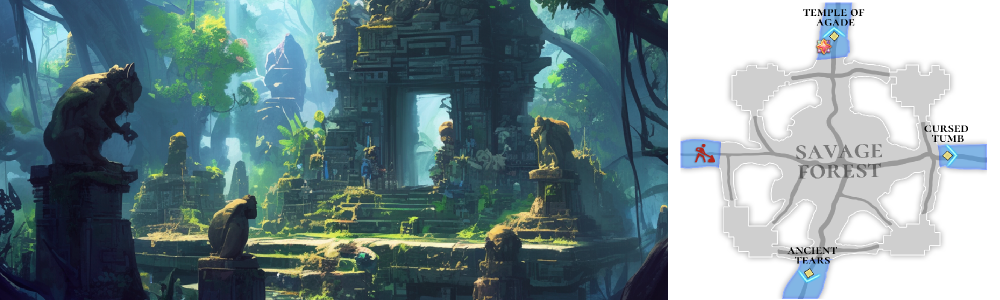

# 🌋 \~Lv.50 Savage Forest (PK)

<figure><figcaption></figcaption></figure>



### 🌲 Savage Forest

Deep within the Asterica continent lies a forest \
where twisted ancient trees block out the sky and thick mist drifts endlessly through the air.\
This is the **Savage Forest**.

Long ago, it is said that an unknown ritual was performed here to bring rain to the land.\
This was no simple ceremony.\
It demanded cruel sacrifices, paid for with countless lives.\
The pain and resentment of that day seeped into the earth,\
leaving behind a curse that has never faded.

***

The traces of that curse still linger throughout the Savage Forest.

The presence of unseen evil can be felt everywhere,\
and cold, damp winds carry sounds that resemble the sobs of those who were sacrificed.\
Those who step into the forest face not only the risk of losing their way,\
but also the fear buried deep within their own hearts.

***

The Savage Forest is a land entwined with the remnants of dark rituals and lingering hatred.\
It bears an eternal curse, the price once paid to bring rain to the land.

Even the living can sense the presence of death here.\
This forest is a dangerous region where a forgotten ancient tragedy still sleeps.

***

🍀 **Item Drop Information :**

<table><thead><tr><th width="88">Lv.</th><th>Monster</th><th>Drop1</th><th>Drop2</th><th>Drop3</th><th>Drop4</th></tr></thead><tbody><tr><td>46</td><td>Ghoul (LEAF)</td><td>Heart of Ghoul</td><td>Blue Statue</td><td>Powder of blessing</td><td>Snow White</td></tr><tr><td>47</td><td>Mutated Ghouls (LIGHT)</td><td>Heart of Ghoul</td><td>Blue Statue</td><td>Powder of blessing</td><td>Snow White</td></tr><tr><td>48</td><td>Blind Shaman (WATER)</td><td>Blue Statue</td><td>Purple Slime</td><td>Eye of Ghoul</td><td>Mutated Mushroom</td></tr><tr><td>49</td><td>Madness (FIRE)</td><td>Blue Statue</td><td>Gilded Fishbone</td><td>Eye of Ghoul</td><td>Mutated Leaf</td></tr><tr><td>50</td><td>Illusions of Evil (DARK)</td><td>Mutated Mushroom</td><td>Gilded Fishbone</td><td>Mutated Leaf</td><td>Sharp Thorn</td></tr></tbody></table>

🍀**Gathered items :** corn, obsidian

> 😈**Field Raid :** Lv.55 Black Lizard (Force)
>
> 🕓**Spawn Time (UTC) :** 14:30 / 05:10 / 10:40
>
> **🕓Spawn Time (PHT) :** 22:30 / 13:10 / 18:40
>
> 📦**Drop Item :** Core of protection, Lucky Core, Evil crystal, Primordial Crystal, Spicy pepper, Extocium etc…
>
> <a href="https://extocium.com/blacklizard/" class="button primary" data-icon="pen-circle">Drop Table Detail...</a>
>
>

🍀**Recipe  Drop Information:**

<table><thead><tr><th width="214">Monster</th><th width="223">Drop1</th><th width="246">Drop2</th></tr></thead><tbody><tr><td>Ghoul</td><td>Primordial doll Recipe</td><td>-</td></tr><tr><td>Mutated Ghouls</td><td>Primordial doll Recipe</td><td>-</td></tr><tr><td>Blind Shaman</td><td>Primordial decoration Recipe</td><td>-</td></tr><tr><td>Madness</td><td>Primordial decoration Recipe</td><td>Primordial Horn Recipe</td></tr><tr><td>Illusions of Evil</td><td>Primordial Horn Recipe</td><td>-</td></tr><tr><td>Mutated Madman</td><td>Primordial decoration Recipe</td><td>Primordial Horn Recipe</td></tr><tr><td>Burning Evil Illusion</td><td>Primordial Horn Recipe</td><td>-</td></tr></tbody></table>

🍀 **Weapon Drop Notice (Paid Energy)**

When using Paid Energy, rewards are drawn from the Paid Energy–exclusive reward pool.\
At an extremely low probability, the following weapon items may be dropped.

> **Steel sword, Damascus, Savage Sword, Oracle Sword, Devil's sword**



### 🌲 야만의 숲 (Savage Forest)

아스테리카 대륙 깊숙한 곳에는, 뒤틀린 고목들이 하늘을 가리고 짙은 안개가 끊임없이 떠도는 숲,\
**야만의 숲**이 자리하고 있습니다.

이 숲에서는 오래전, 비를 내리게 하기 위한 정체불명의 주술이 행해졌다고 전해집니다.\
그 주술은 단순한 의식이 아니라, 수많은 생명을 대가로 한 잔혹한 희생을 요구했습니다.\
그날의 고통과 원망은 대지에 스며들어 지워지지 않는 저주로 남게 되었습니다.

***

야만의 숲에는 그 저주의 흔적이 깊게 남아 있습니다.

눈에 보이지 않는 악의 기운마저 느껴질 정도로 숲 전체가 뒤틀려 있으며,\
차갑고 축축한 바람은 희생자들의 흐느낌이 섞인 듯한 소리를 실어 나릅니다.

이 숲에 발을 들이는 모험가는 길을 잃는 것뿐 아니라, 자신의 마음속 깊은 두려움과 마주하게 됩니다.

***

야만의 숲은 주술의 잔재와 원한이 얽힌 땅이며, \
한때 비를 내리게 한 대가로 영원히 풀리지 않을 저주를 짊어진 장소입니다.

살아 있는 자에게조차 죽음의 기운을 느끼게 하는 이 숲은,\
잊혀진 고대의 비극이 잠들어 있는 위험한 지역입니다.

***

🍀 **아이템 드랍 정보 :**

<table><thead><tr><th width="94">레벨</th><th>몬스터</th><th>드랍1</th><th>드랍2</th><th>드랍3</th><th>드랍4</th></tr></thead><tbody><tr><td>46</td><td>구울 (LEAF)</td><td>구울의 심장</td><td>푸른 조각상</td><td>축복의 가루</td><td>백설화</td></tr><tr><td>47</td><td>변이된 구울 (LIGHT)</td><td>구울의 심장</td><td>푸른 조각상</td><td>축복의 가루</td><td>백설화</td></tr><tr><td>48</td><td>눈 먼 주술가 (WATER)</td><td>푸른 조각상</td><td>보라색 진액</td><td>구울의 눈</td><td>변이된 버섯</td></tr><tr><td>49</td><td>미치광이 (FIRE)</td><td>푸른 조각상</td><td>도금된 생선뼈</td><td>구울의 눈</td><td>변이된 잎사귀</td></tr><tr><td>50</td><td>악의 환영 (DARK)</td><td>변이된 버섯</td><td>도금된 생선뼈</td><td>변이된 잎사귀</td><td>뾰족가시</td></tr></tbody></table>

🍀**채집 품목 :** 옥수수, 흑요석

> 😈**필드 레이드 :** Lv.55 검은 도마뱀
>
> 🕓**출현시간 (KST)** : 23:30 / 14:10 / 19:40
>
> 📦**드랍 아이템 :** 보호의 핵, 행운의 핵, 악의 결정, 태초의 결정, 매운 고추, 엑스토시움 etc…
>
> <a href="https://extocium.com/blacklizard/" class="button primary" data-icon="pen-circle">Drop Table Detail...</a>

**🍀레시피 드랍 정보:**

<table><thead><tr><th width="214">Monster</th><th width="223">Drop1</th><th width="246">Drop2</th></tr></thead><tbody><tr><td>구울</td><td>태초의 인형 레시피</td><td>-</td></tr><tr><td>변이된 구울</td><td>태초의 인형 레시피</td><td>-</td></tr><tr><td>눈 먼 주술가</td><td>태초의 장식레시피</td><td>-</td></tr><tr><td>미치광이</td><td>태초의 장식레시피</td><td>태초의 뿔나팔 레시피</td></tr><tr><td>악의 환영</td><td>태초의 뿔나팔 레시피</td><td>-</td></tr><tr><td>변이된 미치광이</td><td>태초의 장식레시피</td><td>태초의 뿔나팔 레시피</td></tr><tr><td>불타는 악의 환영</td><td>태초의 뿔나팔 레시피</td><td>-</td></tr></tbody></table>

🍀 **유료 에너지 사용 시 무기 드랍 안내**

유료 에너지를 사용하면 유료 에너지 풀 전용 보상이 적용됩니다.
\
이때, 매우 희박한 확률로 아래의 무기 아이템이 드랍될 수 있습니다.

> **강철검, 다마스커스, 야만의검, 오라클 스워드, 악마의 검**



### 🌲 野蛮の森（Savage Forest）

アステリカ大陸の奥深くには、歪んだ古木が空を覆い、\
濃い霧が絶えず漂う森、**野蛮の森**があります。

この森では遠い昔、雨を降らせるための正体不明の呪術が 行われたと伝えられています。\
それは単なる儀式ではなく、無数の命を代償とする残酷な生贄を伴うものでした。\
その日の苦しみと怨みは大地に染み込み、今も消えることのない呪いとして残されています。

***

野蛮の森には、その呪いの痕跡が色濃く残っています。

目に見えない悪意さえ感じられるほど、森全体は歪んだ気配に包まれており、\
冷たく湿った風は 犠牲者のすすり泣きが混じったかのような音を運びます。

この森に足を踏み入れた冒険者は、\
道に迷うだけでなく、自らの心の奥底に潜む恐怖と向き合うことになります。

***

野蛮の森は、呪術の残滓と怨念が絡み合った地であり、\
かつて雨をもたらした代償として、永遠に解かれることのない呪いを背負った場所です。

生きている者にさえ 死の気配を感じさせるこの森は、\
忘れ去られた古代の悲劇が眠る、危険な地域なのです。

***

🍀 **アイテムドロップ情報：**

<table data-full-width="false"><thead><tr><th width="94" align="center">レベル</th><th width="161" align="center">モンスター</th><th width="111" align="center">ドロップ1</th><th width="136" align="center">ドロップ2</th><th align="center">ドロップ3</th><th align="center">ドロップ4</th></tr></thead><tbody><tr><td align="center">46</td><td align="center">グール (LEAF)</td><td align="center">グールの心臓</td><td align="center">青い彫像</td><td align="center">祝福の粉</td><td align="center">白雪花</td></tr><tr><td align="center">47</td><td align="center">変異したボウル (LIGHT)</td><td align="center">グールの心臓</td><td align="center">青い彫像</td><td align="center">祝福の粉</td><td align="center">白雪花</td></tr><tr><td align="center">48</td><td align="center">盲目の呪術家 (WATER)</td><td align="center">青い彫像</td><td align="center">紫色のエキス</td><td align="center">グールの目</td><td align="center">変異したキノコ</td></tr><tr><td align="center">49</td><td align="center">狂人 (FIRE)</td><td align="center">青い彫像</td><td align="center">めっきされた魚の骨</td><td align="center">グールの目</td><td align="center">変異した葉</td></tr><tr><td align="center">50</td><td align="center">悪の幻影 (DARK)</td><td align="center">変異したキノコ</td><td align="center">めっきされた魚の骨</td><td align="center">変異した葉</td><td align="center">尖ったとげ</td></tr></tbody></table>

🍀**採集品目 :** とうもろこし、黒曜石

> 😈**フィールドレイド :** Lv.55 黒いトカゲ
>
> 🕓**出現時間 (KST)** : 23:30 / 14:10 / 19:40
>
> 📦**ドロップアイテム:** 保護の核、幸運の核、悪の結晶、太初の結晶、辛唐辛子、エクストシウムetc…···
>
> <a href="https://extocium.com/blacklizard/" class="button primary" data-icon="pen-circle">Drop Table Detail...</a>

🍀**レシピドロップ情報:**

<table><thead><tr><th width="214">Monster</th><th width="223">Drop1</th><th width="246">Drop2</th></tr></thead><tbody><tr><td>グール</td><td>太初の人形レシピ</td><td>-</td></tr><tr><td>変異したボウル</td><td>太初の人形レシピ</td><td>-</td></tr><tr><td>盲目の呪術家</td><td>太初の飾りレシピ</td><td>-</td></tr><tr><td>狂人</td><td>太初の飾りレシピ</td><td>太初の角ラッパレシピ</td></tr><tr><td>悪の幻影</td><td>太初の角ラッパレシピ</td><td>-</td></tr><tr><td>変異狂人</td><td>太初の飾りレシピ</td><td>太初の角ラッパレシピ</td></tr><tr><td>燃える悪の幻影</td><td>太初の角ラッパレシピ</td><td>-</td></tr></tbody></table>

🍀 **有料エナジー使用時の武器ドロップ案内**

有料エナジーを使用すると、有料エナジー専用報酬プールが適用されます。
\
この際、非常に低い確率で、以下の武器アイテムがドロップする場合があります。

> **鋼鉄の剣, ダマスカス, 野蛮の剣, オラクル·スワード, 悪魔の剣**



<em>※ This guide was written based on the game status as of January 23, 2026,</em>  <em>and its contents may change with future updates.</em>

