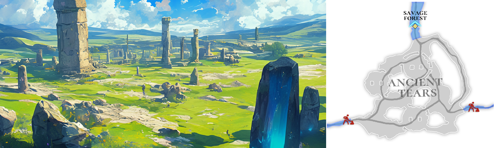

# 🌋 \~Lv.55 Ancient Tears (PK)

<figure><figcaption></figcaption></figure>



### 💧 Ancient Tears

In a mysterious corner of the Asterica continent lies **Ancient Tears**,\
a land layered with past tragedies and ancient myths.

Even after the fall of the Empire of the Gods, \
this place has remained a stage of ancient history, where countless stories continue to linger.\
Once, it was a fertile paradise where fairies danced and life flourished freely,\
until an unknown great flood swept through the land, swallowing everything in its path.

The gentle sound of flowing water and drifting mist seems to preserve the memory of that day,\
leaving visitors with a quiet, indescribable sense of sorrow.

***

People of modern Asterica believe that this great catastrophe was caused by a war\
between the ancients and the giants.

According to legend, the tears shed by the defeated giants hardened into crystal, \
imbued with immense magical power.\
These crystallized tears became the precious treasure sought by adventurers today,\
known as **Ancient Tears**.

***

Adventurers can gather **Ancient Tears** along with **Constellation Tablets** in this region.

Constellation Tablets are mysterious relics believed to contain traces of the ancient giants,\
revealing that this land is not merely a flooded area, \
but a place marked by a forgotten civilization.

***

Another legend tells that the great flood that destroyed this land\
was the work of the mythical beast **Leviathan**.

Some adventurers claim to have seen\
a massive, serpent-like silhouette moving through the mist,\
whispering that it may be a remnant of Leviathan itself.

Ancient Tears is a land where past glory and destruction coexist.\
In this place, where the sorrowful echoes of giants seem to remain trapped within crystal,\
adventurers may find great treasures, but must also be prepared to face\
the ancient secrets sleeping deep beneath the water.

***

🍀 **Item Drop Information :**

<table><thead><tr><th width="90">Lv.</th><th>Monster</th><th>Drop1</th><th>Drop2</th><th>Drop3</th><th>Drop4</th></tr></thead><tbody><tr><td>51</td><td>Bubble (FORCE)</td><td>Soul Bubble</td><td>FlintCotton woolFlint</td><td>Sand</td><td>Water Crystal</td></tr><tr><td>52</td><td>Green Sharit (LEAF)</td><td>Sharit’s Tooth</td><td>Sharit’s Claw</td><td>Water Crystal</td><td>Powder of blessing</td></tr><tr><td>53</td><td>Red Sharit (FIRE)</td><td>Sharit’s Tooth</td><td>Sharit’s Claw</td><td>Water Crystal</td><td>Cotton wool</td></tr><tr><td>54</td><td>Green Ziz (STONE)</td><td>Ziz’s Scale</td><td>Ziz’s Tear</td><td>Water Crystal</td><td>Powder of blessing</td></tr><tr><td>55</td><td>Red Ziz (LIGHT)</td><td>Ziz’s Scale</td><td>Ziz’s Tear</td><td>Water Crystal</td><td>Snow White</td></tr></tbody></table>

🍀**Gathered items :** Tears of the Ancients, Constellation Stone Tablet

> 😈**Field Raid :** Lv.60 Leviathan (WATER)
>
> 🕓**Spawn Time (UTC) :** 15:20 / 05:20 / 10:50
>
> **🕓Spawn Time (PHT) :** 23:20 / 13:20 / 18:50
>
> 📦**Drop Item :** Core of protection, Lucky Core, Evil crystal, Hell Crystal, Leviathan Meat, Extocium etc…
>
> <a href="https://extocium.com/leviathan/" class="button primary" data-icon="pen-circle">Drop Table Detail...</a>

🍀**Recipe  Drop Information:**

<table><thead><tr><th width="214">Monster</th><th width="223">Drop1</th><th width="246">Drop2</th></tr></thead><tbody><tr><td>Bubble</td><td>Noah's Prayer Recipe</td><td>-</td></tr><tr><td>Green Sharit</td><td>Noah's Prayer Recipe</td><td>-</td></tr><tr><td>Red Sharit</td><td>Noah's Prayer Recipe</td><td>-</td></tr><tr><td>Green Ziz</td><td>Sword of light Recipe</td><td>Nebula Claw of Sharit Recipe</td></tr><tr><td>Red Ziz</td><td>Sword of light Recipe</td><td>Soul Star Fragment Recipe</td></tr><tr><td>Mutated Bubble</td><td>Noah's Prayer Recipe</td><td>-</td></tr><tr><td>Burning Red Ziz</td><td>Sword of light Recipe</td><td>-</td></tr></tbody></table>

🍀 **Weapon Drop Notice (Paid Energy)**

When using Paid Energy, rewards are drawn from the Paid Energy–exclusive reward pool.\
At an extremely low probability, the following weapon items may be dropped.

> **Paladin's Sword, Savage Sword, Oracle Sword, Devil's sword,** \
> **\[Lock] Waking Darkness**



### 💧 고대의 눈물 (Ancient Tears)

아스테리카 대륙의 신비로운 구석에는, 과거의 비극과 신화가 겹겹이 쌓인 땅,\
**고대의 눈물**이 자리하고 있습니다.

이곳은 신들의 제국이 무너진 뒤에도 수많은 이야기가 남아 있는 고대사의 무대입니다.\
원래는 요정들이 춤추며 생명을 키우던 비옥한 낙원이었지만,\
알 수 없는 대홍수가 모든 것을 삼켜버렸다고 전해집니다.

잔잔한 물소리와 함께 떠도는 안개는 그날의 흔적을 간직한 듯,\
이곳을 찾는 이들에게 설명하기 어려운 슬픔을 전합니다.

***

현대의 아스테리카 사람들은 이 대재앙의 원인을 고대인과 거인들 사이의 전쟁으로 추측합니다.

전설에 따르면, 싸움에서 패배한 거인들이 흘린 눈물은 굳어져 단단한 수정이 되었고,\
그 수정은 강력한 마법의 힘을 품게 되었습니다.

이렇게 태어난 수정이 바로 모험가들이 찾는 보물, ‘고대의 눈물’입니다.

***

모험가들은 이곳에서 **고대의 눈물**과 함께 **별자리 석판**을 채집할 수 있습니다.

별자리 석판은 고대 거인들의 흔적이 담긴 신비로운 유물로 알려져 있으며,\
이 땅이 단순한 침수 지역이 아니라 잊힌 문명의 흔적임을 보여줍니다.

***

또 다른 전설에 따르면, 이 땅을 멸망으로 몰아넣은 대홍수는\
전설 속 괴수 **레비아탄**의 소행이었다고 합니다.

일부 모험가들은 물안개 사이로 거대한 뱀과 같은 형체를 보았다고 말하며,\
그것이 레비아탄의 잔재일지도 모른다고 수군댑니다.

고대의 눈물은 과거의 영광과 파괴가 공존하는 땅입니다.\
수정 속에 갇힌 거인들의 애잔한 울음이 지금도 들려오는 듯한 이곳에서,\
모험가는 보물과 함께 깊은 물속에 잠든 고대의 비밀과 마주하게 됩니다.

***

🍀 **아이템 드랍 정보 :**

<table><thead><tr><th width="87">레벨</th><th>몬스터</th><th>드랍1</th><th>드랍2</th><th>드랍3</th><th>드랍4</th></tr></thead><tbody><tr><td>51</td><td>버블 (FORCE)</td><td>혼의 거품</td><td>목화솜</td><td>백설화</td><td>물의 결정</td></tr><tr><td>52</td><td>그린 샤리트 (LEAF)</td><td>샤리트의 이빨</td><td>샤리트의 발톱</td><td>물의 결정</td><td>축복의 가루</td></tr><tr><td>53</td><td>레드 샤리트 (FIRE)</td><td>샤리트의 이빨</td><td>샤리트의 발톱</td><td>물의 결정</td><td>목화솜</td></tr><tr><td>54</td><td>그린 지즈 (STONE)</td><td>지즈의 비늘</td><td>지즈의 눈물</td><td>물의 결정</td><td>축복의 가루</td></tr><tr><td>55</td><td>레드 지즈 (LIGHT)</td><td>지즈의 비늘</td><td>지즈의 눈물</td><td>물의 결정</td><td>백설화</td></tr></tbody></table>

🍀**채집 품목 :** 고대의 눈물, 별자리 석판

> 😈**필드 레이드 :** Lv.60 레비아탄 (물속성)
>
> 🕓**출현시간 (KST)** : 00:20 / 14:20 / 19:50
>
> 📦**드랍 아이템 :** 보호의 핵, 행운의 핵, 악의 결정, 지옥의 결정, 레비아탄 고기, 엑스토시움 etc…
>
> <a href="https://extocium.com/leviathan/" class="button primary" data-icon="pen-circle">Drop Table Detail...</a>

**🍀레시피 드랍 정보:**

<table><thead><tr><th width="214">Monster</th><th width="223">Drop1</th><th width="246">Drop2</th></tr></thead><tbody><tr><td>버블</td><td>노아의 기도 레시피</td><td>-</td></tr><tr><td>그린 샤리트</td><td>노아의 기도 레시피</td><td>-</td></tr><tr><td>레드 샤리트</td><td>노아의 기도 레시피</td><td>-</td></tr><tr><td>그린 지즈</td><td>빛의 검 제작서</td><td>샤리트의 성운 발톱 레시피</td></tr><tr><td>레드 지즈</td><td>빛의 검 제작서</td><td>혼의 별조각 레시피</td></tr><tr><td>변이된 버블</td><td>노아의 기도 레시피</td><td>-</td></tr><tr><td>불타는 레드 지즈</td><td>빛의 검 제작서</td><td>-</td></tr></tbody></table>

🍀 **유료 에너지 사용 시 무기 드랍 안내**

유료 에너지를 사용하면 유료 에너지 풀 전용 보상이 적용됩니다.
\
이때, 매우 희박한 확률로 아래의 무기 아이템이 드랍될 수 있습니다.

> **팔라딘의 검, 야만의검, 오라클 스워드, 악마의 검, \[잠김] 깨어나는 어둠**



### 💧 古代の涙（Ancient Tears）

アステリカ大陸の神秘的な一角には、過去の悲劇と神話が幾重にも重なった地、\
**古代の涙**が存在します。

ここは神々の帝国が滅びた後も、数多くの物語が残り続ける古代史の舞台です。\
かつては妖精たちが舞い、命が豊かに育まれていた楽園でしたが、\
正体不明の大洪水がすべてを飲み込んだと伝えられています。

静かに流れる水音と立ちこめる霧は、あの日の記憶を今も留めているかのように、\
この地を訪れる者に 言葉では言い表せない哀しみを伝えます。

***

現代のアステリカの人々は、この大災厄の原因を\
古代人と巨人族との戦争によるものだと考えています。

伝説によれば、敗北した巨人たちが流した涙は やがて固く結晶化し、\
強大な魔力を宿すようになったといいます。

こうして生まれた結晶こそが、冒険者たちが求める宝、「古代の涙」なのです。

***

冒険者はこの地で、**古代の涙**とともに **星座の石板**を採集することができます。

星座の石板は、古代の巨人たちの痕跡が刻まれた 神秘的な遺物として知られており、\
この場所が単なる水没地帯ではなく、失われた文明の名残であることを示しています。

***

別の伝説では、この地を滅亡へと導いた大洪水は、\
伝説の怪物 **レヴィアタン** の仕業だったとも語られています。

一部の冒険者は、霧の中に巨大な蛇のような影を見たと語り、\
それがレヴィアタンの残滓ではないかと囁いています。

古代の涙は、過去の栄光と破壊が共存する地です。\
結晶の中に閉じ込められた巨人たちの哀しき記憶が 今もなお残るこの場所で、\
冒険者は宝とともに、水底に眠る古代の秘密と向き合うことになるでしょう。

***

🍀 **アイテムドロップ情報：**

<table data-full-width="true"><thead><tr><th width="77">レベル</th><th width="125">モンスター</th><th width="148">ドロップ1</th><th width="126">ドロップ2</th><th width="104">ドロップ3</th><th>ドロップ4</th></tr></thead><tbody><tr><td>51</td><td>バブル (FORCE)</td><td>魂の泡</td><td>綿</td><td>白雪花</td><td>水の結晶</td></tr><tr><td>52</td><td>グリーンシャリット (LEAF)</td><td>シャリットの歯</td><td>シャリットの爪</td><td>水の結晶</td><td>祝福の粉</td></tr><tr><td>53</td><td>レッド·シャリット (FIRE)</td><td>シャリットの歯</td><td>シャリットの爪</td><td>水の結晶</td><td>綿</td></tr><tr><td>54</td><td>グリーン·ジーズ (STONE)</td><td>ジーズのうろこ</td><td>ジズの涙</td><td>水の結晶</td><td>祝福の粉</td></tr><tr><td>55</td><td>レッド·ジーズ (LIGHT)</td><td>ジーズのうろこ</td><td>ジズの涙</td><td>水の結晶</td><td>白雪花</td></tr></tbody></table>

🍀**採集品目 :** 古代の涙、星座石板

> 😈**フィールドレイド :** Lv.60 レヴィアタン（水）
>
> 🕓**出現時間 (KST)** : 00:20 / 14:20 / 19:50
>
> 📦**ドロップアイテム:** 保護の核、幸運の核、悪の結晶、地獄の結晶、レヴィアタン肉、エクストシウムetc···
>
> <a href="https://extocium.com/leviathan/" class="button primary" data-icon="pen-circle">Drop Table Detail...</a>

🍀**レシピドロップ情報:**

<table><thead><tr><th width="214">Monster</th><th width="223">Drop1</th><th width="246">Drop2</th></tr></thead><tbody><tr><td>バブル</td><td>ノアの祈りのレシピ</td><td>-</td></tr><tr><td>グリーンシャリット</td><td>ノアの祈りのレシピ</td><td>-</td></tr><tr><td>レッド·シャリット</td><td>ノアの祈りのレシピ</td><td>-</td></tr><tr><td>グリーン·ジーズ</td><td>光の剣の製造書</td><td>シャリトの星雲の爪のレシピ</td></tr><tr><td>レッド·ジーズ</td><td>光の剣の製造書</td><td>魂の星の欠片のレシピ</td></tr><tr><td>変異バブル</td><td>ノアの祈りのレシピ</td><td>-</td></tr><tr><td>燃えるレッドジズ</td><td>光の剣の製造書</td><td>-</td></tr></tbody></table>

🍀 **有料エナジー使用時の武器ドロップ案内**

有料エナジーを使用すると、有料エナジー専用報酬プールが適用されます。
\
この際、非常に低い確率で、以下の武器アイテムがドロップする場合があります。

> **パラディンの剣, 野蛮の剣, オラクル·スワード, 悪魔の剣, \[ロック] 目覚める闇**



<em>※ This guide was written based on the game status as of January 23, 2026,</em>  <em>and its contents may change with future updates.</em>

