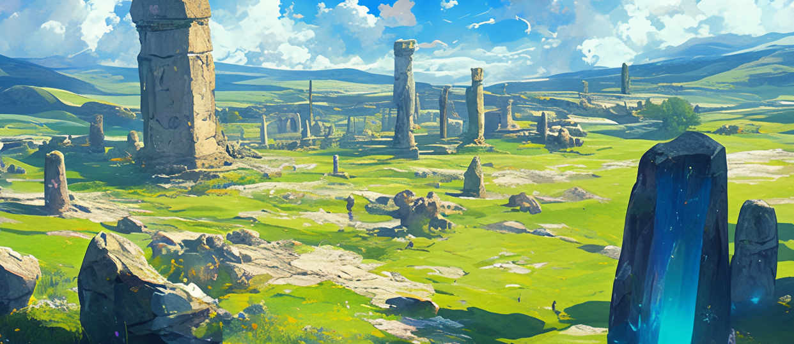

# 🌋 \~Lv.55 Ancient Tears (PK)

<figure><figcaption></figcaption></figure>

<figure><figcaption></figcaption></figure>



📒Ancient Tears lies tucked away in a mysterious corner of the Asterica continent, a land steeped in the tragedies and myths of a bygone era. It is a place where the echoes of history lingered long after the fall of the divine empire. Once a fertile paradise where fairies danced and life flourished, this land was ravaged by a cataclysmic flood for reasons lost to time, leaving it a shattered remnant of its former glory. The gentle murmur of water and the ever-present mist seem to cradle the memory of that devastation, wrapping visitors in an unspoken melancholy. Modern Astericans speculate that this disaster stemmed from a war between ancient humans and giants. The giants, defeated for some unknown cause, shed tears that hardened into resilient crystals—known as the ‘Ancient Tears.’ Infused with potent magical energy, these crystals are a coveted resource among adventurers.

The land teems with strange creatures. Bubbles drift through the air, their translucent, water-like forms delivering deceptively soft attacks. Green Charites and Red Charites—sharp, crystalline beings in verdant and crimson hues—dart forward with lethal precision. Green Zizzes and Red Zizzes, massive entities with shimmering hides, lumber slowly but strike with overwhelming force. Adventurers can harvest Ancient Tears and Constellation Tablets here, the latter believed to bear the cryptic legacy of the giants.

Legends whisper that the flood that drowned this land was unleashed by the mythical Leviathan. Some adventurers claim to have glimpsed a serpentine specter coiled within the mists—a lingering shadow of that ancient beast. Ancient Tears is a realm where past splendor and destruction intertwine, where the sorrowful cries of giants seem to resonate within the crystals. Those who venture here may claim treasures, but they must be prepared to face the secrets submerged in its watery depths.

👉 [PK Leverage Type 3 (Hard Difficulty)](../../system/pk/pk-leverage-bonus/bonus-chart.md#pk-leverage-3)

<table><thead><tr><th width="90">Lv.</th><th>Monster</th><th>Drop1</th><th>Drop2</th><th>Drop3</th><th>Drop4</th></tr></thead><tbody><tr><td>51</td><td>Bubble (FORCE)</td><td>Soul Bubble</td><td>FlintCotton woolFlint</td><td>Sand</td><td>Water Crystal</td></tr><tr><td>52</td><td>Green Sharit (LEAF)</td><td>Sharit’s Tooth</td><td>Sharit’s Claw</td><td>Water Crystal</td><td>Powder of blessing</td></tr><tr><td>53</td><td>Red Sharit (FIRE)</td><td>Sharit’s Tooth</td><td>Sharit’s Claw</td><td>Water Crystal</td><td>Cotton wool</td></tr><tr><td>54</td><td>Green Ziz (STONE)</td><td>Ziz’s Scale</td><td>Ziz’s Tear</td><td>Water Crystal</td><td>Powder of blessing</td></tr><tr><td>55</td><td>Red Ziz (LIGHT)</td><td>Ziz’s Scale</td><td>Ziz’s Tear</td><td>Water Crystal</td><td>Snow White</td></tr></tbody></table>

🍀**Gathered items :** Tears of the Ancients, Constellation Stone Tablet

> 😈**Field Raid :** Lv.60 Leviathan (WATER)
>
> 🕓**Spawn Time (UTC) :** 15:20 / 05:20 / 10:50
>
> **🕓Spawn Time (PHT) :** 23:20 / 13:20 / 18:50
>
> 📦**Drop Item :** Core of protection, Lucky Core, Evil crystal, Hell Crystal, Leviathan Meat, Extocium etc…
>
> <a href="https://extocium.com/leviathan/" class="button primary" data-icon="pen-circle">Drop Table Detail...</a>

🍀**Recipe  Drop Information:**

<table><thead><tr><th width="214">Monster</th><th width="223">Drop1</th><th width="246">Drop2</th></tr></thead><tbody><tr><td>Bubble</td><td>Noah's Prayer Recipe</td><td>-</td></tr><tr><td>Green Sharit</td><td>Noah's Prayer Recipe</td><td>-</td></tr><tr><td>Red Sharit</td><td>Noah's Prayer Recipe</td><td>-</td></tr><tr><td>Green Ziz</td><td>Sword of light Recipe</td><td>Nebula Claw of Sharit Recipe</td></tr><tr><td>Red Ziz</td><td>Sword of light Recipe</td><td>Soul Star Fragment Recipe</td></tr><tr><td>Mutated Bubble</td><td>Noah's Prayer Recipe</td><td>-</td></tr><tr><td>Burning Red Ziz</td><td>Sword of light Recipe</td><td>-</td></tr></tbody></table>



📒고대의 눈물은 아스테리카 대륙의 신비로운 구석에 자리 잡은 땅으로, 과거의 비극과 신화가 얽힌 곳이다. 이곳은 신들의 제국이 무너진 뒤에도 수많은 이야기가 쌓여온 고대사의 무대다. 원래는 요정들이 춤추며 생명을 키우던 비옥한 낙원이었으나, 알 수 없는 이유로 대홍수가 휩쓸고 지나가며 모든 것을 집어삼켰다. 잔잔한 물소리와 함께 떠도는 안개는 마치 그때의 흔적을 간직한 듯, 이곳을 찾는 이들에게 묘한 슬픔을 전한다. 현대의 아스테리카 사람들은 이 대재앙을 고대인과 거인들 사이의 전쟁으로 추측한다. 거인들은 어떤 이유로 싸움에 패배했고, 그들이 흘린 눈물은 단단한 수정으로 굳어졌다. 이 수정, 즉 ‘고대의 눈물’은 강력한 마법의 힘을 품고 있어 모험가들에게 귀중한 보물로 여겨진다.

이곳에는 독특한 생명체들이 서식한다. 버블은 물방울처럼 투명한 몸으로 떠다니며 부드럽게 공격하고, 그린 샤리트와 레드 샤리트는 각각 초록과 붉은빛을 띤 날카로운 결정체로, 빠르게 돌진해 위협을 가한다. 그린 지즈와 레드 지즈는 거대한 몸집에 반짝이는 외피를 지닌 괴생명체로, 느리지만 강력한 힘을 자랑한다. 모험가들은 이곳에서 고대의 눈물과 별자리 석판을 채집할 수 있는데, 별자리 석판은 고대 거인들의 흔적이 담긴 신비로운 유물로 알려져 있다.

전설에 따르면, 이 땅을 멸망으로 몰아넣은 대홍수는 전설 속 괴수 레비아탄의 소행이었다고 한다. 일부 모험가들은 물안개 사이로 거대한 뱀 같은 망령을 보았다며, 그것이 레비아탄의 잔재일지도 모른다고 수군거린다. 고대의 눈물은 과거의 영광과 파괴가 공존하는 땅으로, 수정 속에 갇힌 거인들의 애잔한 울음이 아직도 들리는 듯하다. 이곳을 찾는 자는 보물을 얻을 수도 있지만, 깊은 물속에 잠든 고대의 비밀과 마주할 각오를 해야 한다.

👉[PK 레버리지 타입 3 ( 어려움 난이도 )](../../system/pk/pk-leverage-bonus/bonus-chart.md#pk-leverage-3)

<table><thead><tr><th width="87">레벨</th><th>몬스터</th><th>드랍1</th><th>드랍2</th><th>드랍3</th><th>드랍4</th></tr></thead><tbody><tr><td>51</td><td>버블 (FORCE)</td><td>혼의 거품</td><td>목화솜</td><td>백설화</td><td>물의 결정</td></tr><tr><td>52</td><td>그린 샤리트 (LEAF)</td><td>샤리트의 이빨</td><td>샤리트의 발톱</td><td>물의 결정</td><td>축복의 가루</td></tr><tr><td>53</td><td>레드 샤리트 (FIRE)</td><td>샤리트의 이빨</td><td>샤리트의 발톱</td><td>물의 결정</td><td>목화솜</td></tr><tr><td>54</td><td>그린 지즈 (STONE)</td><td>지즈의 비늘</td><td>지즈의 눈물</td><td>물의 결정</td><td>축복의 가루</td></tr><tr><td>55</td><td>레드 지즈 (LIGHT)</td><td>지즈의 비늘</td><td>지즈의 눈물</td><td>물의 결정</td><td>백설화</td></tr></tbody></table>

🍀**채집 품목 :** 고대의 눈물, 별자리 석판

> 😈**필드 레이드 :** Lv.60 레비아탄 (물속성)
>
> 🕓**출현시간 (KST)** : 00:20 / 14:20 / 19:50
>
> 📦**드랍 아이템 :** 보호의 핵, 행운의 핵, 악의 결정, 지옥의 결정, 레비아탄 고기, 엑스토시움 etc…

**🍀레시피 드랍 정보:**

<table><thead><tr><th width="214">Monster</th><th width="223">Drop1</th><th width="246">Drop2</th></tr></thead><tbody><tr><td>버블</td><td>노아의 기도 레시피</td><td>-</td></tr><tr><td>그린 샤리트</td><td>노아의 기도 레시피</td><td>-</td></tr><tr><td>레드 샤리트</td><td>노아의 기도 레시피</td><td>-</td></tr><tr><td>그린 지즈</td><td>빛의 검 제작서</td><td>샤리트의 성운 발톱 레시피</td></tr><tr><td>레드 지즈</td><td>빛의 검 제작서</td><td>혼의 별조각 레시피</td></tr><tr><td>변이된 버블</td><td>노아의 기도 레시피</td><td>-</td></tr><tr><td>불타는 레드 지즈</td><td>빛의 검 제작서</td><td>-</td></tr></tbody></table>



📒古代の涙は、アステリカ大陸の神秘的な一角にひっそりと佇む土地で、過去の悲劇と神話が織り交ざった場所です。神々の帝国が崩壊した後も、ここには数々の歴史が積み重なってきました。かつては妖精たちが踊り、生命が溢れる豊かな楽園だったこの地は、何かの理由で大洪水に襲われ、すべてが壊されてしまいました。水の静かな音と漂う霧は、その時の記憶を抱いているかのように、訪れる者に切ない気持ちを伝えます。今のアステリカの人々は、この大災害が古代人と巨人たちの戦争だったのではないかと推測しています。巨人は何らかの理由で戦いに敗れ、その流した涙が硬い結晶に変わったんです。この結晶、「古代の涙」は強い魔法の力を宿していて、冒険者にとって貴重な宝なんですよ。

この場所には変わった生き物たちが住んでいます。バブルは水滴のような透明な体でふわふわ浮かび、優しく攻撃してきます。グリーンシャリットとレッドシャリットは、緑と赤に輝く鋭い結晶で、素早く突進して脅威を与えます。グリーン・ジズとレッド・ジズは大きな体とキラキラした外皮を持つ怪生物で、動きは遅いけど力強いんです。ここでは古代の涙と星座の石板を採ることができて、星座の石板は巨人の遺産が込められた不思議な遺物と言われています。

伝説では、この地を滅ぼした大洪水は、伝説の怪物レヴィアタンが引き起こしたものだとか。霧の中で巨大な蛇のような亡魂を見たという冒険者もいて、それがレヴィアタンの残影かもしれないと囁かれています。古代の涙は、昔の栄光と破壊が共存する土地で、結晶の中に閉じ込められた巨人の悲しい泣き声が今も聞こえてくるようです。ここを訪れる者は宝を手に入れられるかもしれないけど、深い水底に眠る古代の秘密と向き合う覚悟が必要なんです。

👉[ PKレバレッジタイプ3（高い難易度）](../../system/pk/pk-leverage-bonus/bonus-chart.md#pk-leverage-3)

<table data-full-width="true"><thead><tr><th width="77">レベル</th><th width="125">モンスター</th><th width="148">ドロップ1</th><th width="126">ドロップ2</th><th width="104">ドロップ3</th><th>ドロップ4</th></tr></thead><tbody><tr><td>51</td><td>バブル (FORCE)</td><td>魂の泡</td><td>綿</td><td>白雪花</td><td>水の結晶</td></tr><tr><td>52</td><td>グリーンシャリット (LEAF)</td><td>シャリットの歯</td><td>シャリットの爪</td><td>水の結晶</td><td>祝福の粉</td></tr><tr><td>53</td><td>レッド·シャリット (FIRE)</td><td>シャリットの歯</td><td>シャリットの爪</td><td>水の結晶</td><td>綿</td></tr><tr><td>54</td><td>グリーン·ジーズ (STONE)</td><td>ジーズのうろこ</td><td>ジズの涙</td><td>水の結晶</td><td>祝福の粉</td></tr><tr><td>55</td><td>レッド·ジーズ (LIGHT)</td><td>ジーズのうろこ</td><td>ジズの涙</td><td>水の結晶</td><td>白雪花</td></tr></tbody></table>

🍀**採集品目 :** 古代の涙、星座石板

> 😈**フィールドレイド :** Lv.60 レヴィアタン（水）
>
> 🕓**出現時間 (KST)** : 00:20 / 14:20 / 19:50
>
> 📦**ドロップアイテム:** 保護の核、幸運の核、悪の結晶、地獄の結晶、レヴィアタン肉、エクストシウムetc···

🍀**レシピドロップ情報:**

<table><thead><tr><th width="214">Monster</th><th width="223">Drop1</th><th width="246">Drop2</th></tr></thead><tbody><tr><td>バブル</td><td>ノアの祈りのレシピ</td><td>-</td></tr><tr><td>グリーンシャリット</td><td>ノアの祈りのレシピ</td><td>-</td></tr><tr><td>レッド·シャリット</td><td>ノアの祈りのレシピ</td><td>-</td></tr><tr><td>グリーン·ジーズ</td><td>光の剣の製造書</td><td>シャリトの星雲の爪のレシピ</td></tr><tr><td>レッド·ジーズ</td><td>光の剣の製造書</td><td>魂の星の欠片のレシピ</td></tr><tr><td>変異バブル</td><td>ノアの祈りのレシピ</td><td>-</td></tr><tr><td>燃えるレッドジズ</td><td>光の剣の製造書</td><td>-</td></tr></tbody></table>


