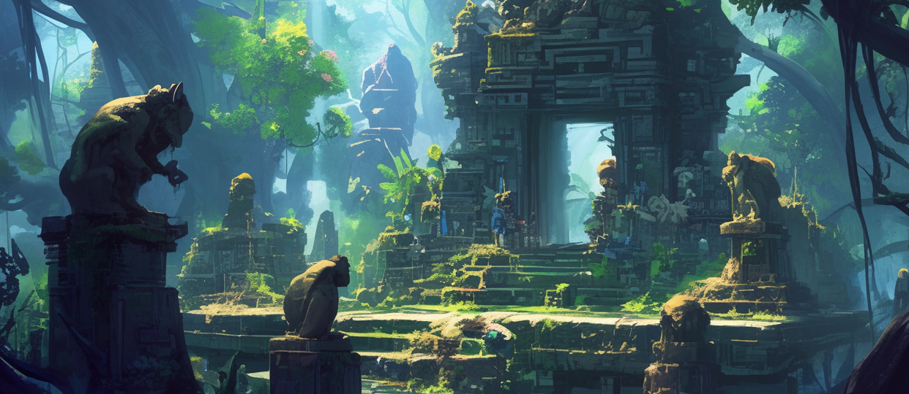
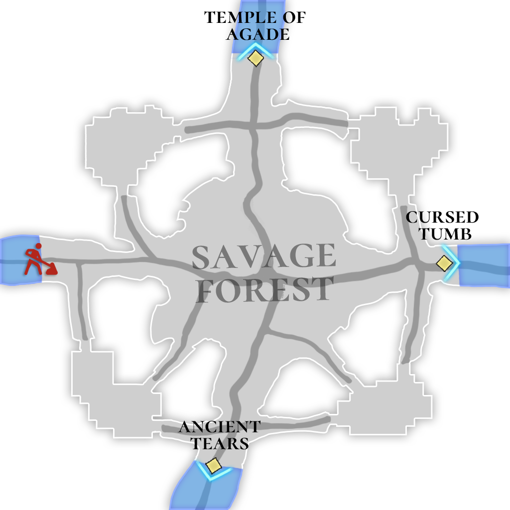

# 🌋 \~Lv.55 Savage Forest (PK)

<figure><figcaption></figcaption></figure>

<figure><figcaption></figcaption></figure>



📒The Savage Forest sprawls deep within the Asterica continent, a grim woodland where gnarled ancient trees stretch their twisted branches to blot out the sky, and a thick, unrelenting fog clings to the earth. Long ago, this land was the site of an enigmatic ritual meant to summon rain—an act shrouded in mystery and steeped in darkness. That ritual was no mere ceremony; it demanded cruel sacrifices, claiming lives in exchange for its power. Those who perished in its grip died in agony, their screams and grievances soaking into the soil, festering into a bitter resentment. That resentment breathed unnatural life into the dead, transforming them into ghouls, and now the forest echoes with their ceaseless wails, a cursed domain born of sorrow.

The malice here is so potent that it’s said the very shape of ‘evil’—invisible to the naked eye elsewhere—can be glimpsed within these woods. Ghouls, with rotting flesh and jagged claws, lunge at the living in a frenzy of hunger. Mutated ghouls, warped further by the curse, emerge as grotesque abominations that inspire dread. Blind shamans, remnants of that ancient rite, murmur incantations in the shadows, as if still pleading with the heavens. The madness—wild-eyed lunatics—roam the forest, their maniacal laughter cutting through the silence. And illusions of evil materialize as intangible specters, sowing chaos in the minds of those they ensnare, dragging them into a mire of fear.

The Savage Forest is a tangle of ritual remnants and vengeful spite. The wind that slithers through the trees is cold and damp, carrying whispers that sound like the sobs of the sacrificed. To step into this place is to risk more than losing your way—it’s to confront the primal terror rising from within. Legend holds that the curse laid upon this forest, a price paid for rain, is doomed to endure forever. The Savage Forest is a resting place for ancient tragedy, where even the living can taste the scent of death in the air.

👉 [PK Leverage Type 2 (Medium Difficulty) ](../../contents/pk/pk-leverage-bonus/bonus-chart.md#pk-leverage-2)

<table><thead><tr><th width="88">Lv.</th><th>Monster</th><th>Drop1</th><th>Drop2</th><th>Drop3</th><th>Drop4</th></tr></thead><tbody><tr><td>46</td><td>Ghoul (LEAF)</td><td>Heart of Ghoul</td><td>Blue Statue</td><td>Powder of blessing</td><td>Snow White</td></tr><tr><td>47</td><td>Mutated Ghouls (LIGHT)</td><td>Heart of Ghoul</td><td>Blue Statue</td><td>Powder of blessing</td><td>Snow White</td></tr><tr><td>48</td><td>Blind Shaman (WATER)</td><td>Blue Statue</td><td>Purple Slime</td><td>Eye of Ghoul</td><td>Mutated Mushroom</td></tr><tr><td>49</td><td>Madness (FIRE)</td><td>Blue Statue</td><td>Gilded Fishbone</td><td>Eye of Ghoul</td><td>Mutated Leaf</td></tr><tr><td>50</td><td>Illusions of Evil (DARK)</td><td>Mutated Mushroom</td><td>Gilded Fishbone</td><td>Mutated Leaf</td><td>Sharp Thorn</td></tr></tbody></table>

🍀**Gathered items :** corn, obsidian

> 😈**Field Raid :** Lv.55 Black Lizard (Force)
>
> 🕓**Spawn Time (UTC)** : 15:10 / 05:10 / 12:10
>
> 📦**Drop Item :** Core of protection, Lucky Core, Evil crystal, Primordial Crystal, Spicy pepper, Extocium etc…

🍀**Recipe  Drop Information:**

<table><thead><tr><th width="214">Monster</th><th width="223">Drop1</th><th width="246">Drop2</th></tr></thead><tbody><tr><td>Ghoul</td><td>Primordial doll Recipe</td><td>-</td></tr><tr><td>Mutated Ghouls</td><td>Primordial doll Recipe</td><td>-</td></tr><tr><td>Blind Shaman</td><td>Primordial decoration Recipe</td><td>-</td></tr><tr><td>Madness</td><td>Primordial decoration Recipe</td><td>Primordial Horn Recipe</td></tr><tr><td>Illusions of Evil</td><td>Primordial Horn Recipe</td><td>-</td></tr><tr><td>Mutated Madman</td><td>Primordial decoration Recipe</td><td>Primordial Horn Recipe</td></tr><tr><td>Burning Evil Illusion</td><td>Primordial Horn Recipe</td><td>-</td></tr></tbody></table>



📒야만의 숲은 아스테리카 대륙의 깊숙한 곳에 자리 잡은 음산한 수림으로, 고목들이 뒤틀린 가지를 뻗어 하늘을 가리고, 땅 위로는 짙은 안개가 끊임없이 떠도는 곳이다. 고대에 이 땅에서는 비를 내리게 하기 위한 알 수 없는 주술이 행해졌다고 전해진다. 그 주술은 단순한 의식이 아니라, 생명을 대가로 한 잔혹한 희생을 요구했다. 주술에 쓰인 이들은 끔찍한 고통 속에서 숨을 거두었고, 그들의 비명과 억울함은 대지에 깊이 스며들어 원념으로 변했다. 그 원념은 죽은 자들을 구울로 되살려냈고, 이제 이 숲은 그들의 울부짖음이 메아리치는 저주의 영역이 되었다.

이곳에서만은 악의 기운이 너무나 강렬해서, 육안으로도 보이지 않는 ‘악’의 형체가 떠도는 것을 느낄 수 있다고 한다. 구울은 썩은 살점과 날카로운 손톱으로 살아있는 자를 덮치며, 변이된 구울은 저주의 힘으로 더욱 흉측하게 뒤틀린 모습으로 공포를 자아낸다. 눈 먼 주술가는 과거의 의식을 되풀이하듯 어둠 속에서 주문을 읊고, 미치광이는 광기 어린 웃음소리를 내며 숲을 배회한다. 그리고 악의 환영은 실체 없는 그림자로 나타나, 사람의 정신을 혼란에 빠뜨리고 공포 속으로 몰아넣는다.

야만의 숲은 주술의 잔재와 원한이 얽힌 땅이다. 나무 사이로 스며드는 바람은 차갑고 축축하며, 희생자들의 흐느낌이 섞인 듯한 소리를 실어 나른다. 이곳에 발을 들이는 자는 단순히 길을 잃는 것을 넘어, 마음속 깊은 곳에서 솟아오르는 두려움과 마주하게 된다. 전설에 따르면, 이 숲의 저주는 비를 내리게 한 대가로 영원히 풀리지 않을 운명이라고 한다. 야만의 숲은 살아있는 자에게조차 죽음의 냄새를 풍기는, 잊혀진 고대의 비극이 잠든 곳이다.

👉[PK 레버리지 타입 2 ( 중간 난이도 )](../../contents/pk/pk-leverage-bonus/bonus-chart.md#pk-leverage-2)

<table><thead><tr><th width="94">레벨</th><th>몬스터</th><th>드랍1</th><th>드랍2</th><th>드랍3</th><th>드랍4</th></tr></thead><tbody><tr><td>46</td><td>구울 (LEAF)</td><td>구울의 심장</td><td>푸른 조각상</td><td>축복의 가루</td><td>백설화</td></tr><tr><td>47</td><td>변이된 구울 (LIGHT)</td><td>구울의 심장</td><td>푸른 조각상</td><td>축복의 가루</td><td>백설화</td></tr><tr><td>48</td><td>눈 먼 주술가 (WATER)</td><td>푸른 조각상</td><td>보라색 진액</td><td>구울의 눈</td><td>변이된 버섯</td></tr><tr><td>49</td><td>미치광이 (FIRE)</td><td>푸른 조각상</td><td>도금된 생선뼈</td><td>구울의 눈</td><td>변이된 잎사귀</td></tr><tr><td>50</td><td>악의 환영 (DARK)</td><td>변이된 버섯</td><td>도금된 생선뼈</td><td>변이된 잎사귀</td><td>뾰족가시</td></tr></tbody></table>

🍀**채집 품목 :** 옥수수, 흑요석

> 😈**필드 레이드 :** Lv.55 검은 도마뱀
>
> 🕓**출현시간 (KST)** : 00:10 / 14:10 / 21:10
>
> 📦**드랍 아이템 :** 보호의 핵, 행운의 핵, 악의 결정, 태초의 결정, 매운 고추, 엑스토시움 etc…

**🍀레시피 드랍 정보:**

<table><thead><tr><th width="214">Monster</th><th width="223">Drop1</th><th width="246">Drop2</th></tr></thead><tbody><tr><td>구울</td><td>태초의 인형 레시피</td><td>-</td></tr><tr><td>변이된 구울</td><td>태초의 인형 레시피</td><td>-</td></tr><tr><td>눈 먼 주술가</td><td>태초의 장식레시피</td><td>-</td></tr><tr><td>미치광이</td><td>태초의 장식레시피</td><td>태초의 뿔나팔 레시피</td></tr><tr><td>악의 환영</td><td>태초의 뿔나팔 레시피</td><td>-</td></tr><tr><td>변이된 미치광이</td><td>태초의 장식레시피</td><td>태초의 뿔나팔 레시피</td></tr><tr><td>불타는 악의 환영</td><td>태초의 뿔나팔 레시피</td><td>-</td></tr></tbody></table>



📒野蛮の森は、アステリカ大陸の奥深くに広がる不気味な森で、歪んだ古木が枝を広げて空を覆い、地面には濃い霧が絶えず漂っています。遠い昔、この土地では雨を降らせるための知られざる呪術が行われたとされています。その呪術はただの儀式じゃなく、命を捧げる残酷な犠牲を求めるものでした。呪術に使われた者たちは激しい痛みの中で息を引き取り、その叫び声と無念は大地に染み込んで怨念となりました。その怨念は死者をグールとして蘇らせ、今この森は彼らの嘆きが響き渡る呪われた領域なんです。

この場所では、悪の気があまりにも強いため、普段は目に見えない「悪」の姿さえも感じ取れると言われています。グールは腐った肉と鋭い爪で生きる者を襲い、変異したグールは呪いの力でさらに恐ろしく歪んだ姿で恐怖を振りまいています。盲目の呪術家は、昔の儀式を繰り返すように闇の中で呪文をつぶやき、狂人は狂った笑い声を響かせながら森を彷徨っています。そして悪の幻影は実体のない影となって現れ、見る者の心を乱し、恐怖の淵へと引きずり込むんです。

野蛮の森は、呪術の残滓と恨みが絡み合った土地です。木々の間を抜ける風は冷たく湿っていて、犠牲者たちのすすり泣きのような音を運んできます。この場所に足を踏み入れる者は、道を見失うだけでなく、心の奥底から湧き上がる恐れと向き合うことになるんです。伝説では、この森にかかった呪いは雨を降らせた代償として永遠に解けない運命なんだとか。野蛮の森は、生きている者にも死の匂いを感じさせる、忘れられた古代の悲劇が眠る場所なんです。

👉 [PKレバレッジタイプ2（中間の難易度） ](../../contents/pk/pk-leverage-bonus/bonus-chart.md#pk-leverage-2)

<table data-full-width="false"><thead><tr><th width="94" align="center">レベル</th><th width="161" align="center">モンスター</th><th width="111" align="center">ドロップ1</th><th width="136" align="center">ドロップ2</th><th align="center">ドロップ3</th><th align="center">ドロップ4</th></tr></thead><tbody><tr><td align="center">46</td><td align="center">グール (LEAF)</td><td align="center">グールの心臓</td><td align="center">青い彫像</td><td align="center">祝福の粉</td><td align="center">白雪花</td></tr><tr><td align="center">47</td><td align="center">変異したボウル (LIGHT)</td><td align="center">グールの心臓</td><td align="center">青い彫像</td><td align="center">祝福の粉</td><td align="center">白雪花</td></tr><tr><td align="center">48</td><td align="center">盲目の呪術家 (WATER)</td><td align="center">青い彫像</td><td align="center">紫色のエキス</td><td align="center">グールの目</td><td align="center">変異したキノコ</td></tr><tr><td align="center">49</td><td align="center">狂人 (FIRE)</td><td align="center">青い彫像</td><td align="center">めっきされた魚の骨</td><td align="center">グールの目</td><td align="center">変異した葉</td></tr><tr><td align="center">50</td><td align="center">悪の幻影 (DARK)</td><td align="center">変異したキノコ</td><td align="center">めっきされた魚の骨</td><td align="center">変異した葉</td><td align="center">尖ったとげ</td></tr></tbody></table>

🍀**採集品目 :** とうもろこし、黒曜石

> 😈**フィールドレイド :** Lv.55 黒いトカゲ
>
> 🕓**出現時間 (KST)** : 00:10 / 14:10 / 21:10
>
> 📦**ドロップアイテム:** 保護の核、幸運の核、悪の結晶、太初の結晶、辛唐辛子、エクストシウムetc…···

🍀**レシピドロップ情報:**

<table><thead><tr><th width="214">Monster</th><th width="223">Drop1</th><th width="246">Drop2</th></tr></thead><tbody><tr><td>グール</td><td>太初の人形レシピ</td><td>-</td></tr><tr><td>変異したボウル</td><td>太初の人形レシピ</td><td>-</td></tr><tr><td>盲目の呪術家</td><td>太初の飾りレシピ</td><td>-</td></tr><tr><td>狂人</td><td>太初の飾りレシピ</td><td>太初の角ラッパレシピ</td></tr><tr><td>悪の幻影</td><td>太初の角ラッパレシピ</td><td>-</td></tr><tr><td>変異狂人</td><td>太初の飾りレシピ</td><td>太初の角ラッパレシピ</td></tr><tr><td>燃える悪の幻影</td><td>太初の角ラッパレシピ</td><td>-</td></tr></tbody></table>


