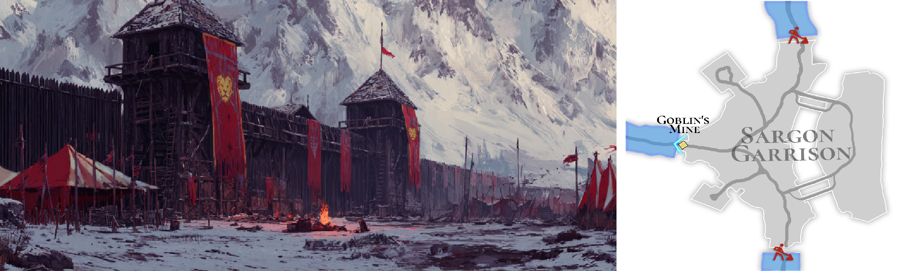

# 🌋 \~Lv.59 Sargon Garrison (PK)

<figure><figcaption></figcaption></figure>



### 🛡️ Sargon Garrison

When the **Golden Rule** was broken, waves of monsters surged down from the north,\
threatening the fertile farmlands of Rahan.

To stop the invasion, the kingdom mobilized all of its forces.\
At the very front line of this desperate defense stood **Sargon Garrison**.

***

Seeking redemption for his past sins, \
**Sargon** appointed himself as the commander of the garrison.\
He refused to retreat, fighting the monster hordes with his life on the line.

**Iskandal** also joined the defense, raising iron walls to hold the front.\
Yet even together, human strength alone proved insufficient \
against the overwhelming power of the Dragonkin leading the invading forces.

***

The battles fought here were unlike anything before.

Endless enemies, brutal and crushing attacks,\
and a battlefield where even a single moment of hesitation could mean death.

Sargon Garrison is not merely a defensive outpost.\
It is a proving ground that forces adventurers to confront the true weight of war.

Those who pass through this place are no longer beginners.\
Sargon Garrison stands as a harsh gateway, marking the transition to the next stage of battle.

***

🍀 **Item Drop Information :**

<table data-header-hidden><thead><tr><th width="68.9090576171875"></th><th></th><th width="123.45458984375"></th><th width="126.181884765625"></th><th width="119.818115234375"></th><th></th></tr></thead><tbody><tr><td>56</td><td>
Guardian of the Basilisk

(STONE)
</td><td>Petrified Scale</td><td>Monocular Gem</td><td>Snow White</td><td>-</td></tr><tr><td>57</td><td>
Scout of the Cyclops

(LEAF)
</td><td>Petrified Scale</td><td>Monocular Gem</td><td>Crimson Claw</td><td>Snow White</td></tr><tr><td>58</td><td>
Crimson Soldier of Cornix

(FIRE)
</td><td>Petrified Scale</td><td>Monocular Gem</td><td>Crimson Claw</td><td>Snow White</td></tr><tr><td>59</td><td>
Degenerate Dragon of Skolix

(WATER)
</td><td>Degenerate Drake Scale</td><td>Corrupted Horn</td><td>Crimson Claw</td><td>Snow White</td></tr><tr><td>60</td><td>
Mutated Archer Captain

(DARK)
</td><td>Degenerate Drake Scale</td><td>Corrupted Horn</td><td>Wraith Arrowhead</td><td>Snow White</td></tr></tbody></table>

🍀**Gathered items :** Læraðr’s Golden Leaves, Læraðr’s Blessed Sap

> 😈**Field Raid :** Lv.67 Insane Sargon (LIGHT)\
> 🕓**Spawn Time (UTC) :** 15:40 / 05:40 / 11:10\
> **🕓Spawn Time (PHT) :** 23:40 / 13:40 / 19:10\
> 📦**Drop Item :** Core of protection, Lucky Core, Evil crystal, **Cursed Heart, Mark of Evil, Mark of Humanity**, Extocium etc…
>
> <a href="https://extocium.com/insanesargon/" class="button primary" data-icon="pen-circle">Drop Table Detail...</a>

🍀**Recipe Drop Information:**

| Guardian of the Basilisk    | Orb of Yin and Yang Recipe          | -                    |
| --------------------------- | ----------------------------------- | -------------------- |
| Scout of the Cyclops        | Petrified Butterfly Scale Recipe    | -                    |
| Crimson Soldier of Cornix   | Bloodstained Butterfly Heart Recipe | -                    |
| Degenerate Dragon of Skolix | Wings of the Transcendent Recipe    | -                    |
| Mutated Archer Captain      | Awakening Stone Recipe              | Ancient Power Recipe |

🍀 **Weapon Drop Notice (Paid Energy)**

When using Paid Energy, rewards are drawn from the Paid Energy–exclusive reward pool.\
At an extremely low probability, the following weapon items may be dropped.

> **Devil's sword, \[Lock] Waking Darkness**



### 🛡️ 사르곤 주둔지 (Sargon Garrison)

황금의 규칙이 무너지자, 북쪽에서 밀려온 마물의 군세가 라한의 곡창지대를 위협하기 시작했습니다.

왕국은 이 위기를 막기 위해 모든 병력을 총동원했고,\
그 최전선에 세워진 곳이 바로 **사르곤 주둔지**입니다.

***

사르곤은 과거의 죄를 씻기 위해 스스로 주둔지의 수장이 되었습니다.\
그는 물러서지 않고, 목숨을 걸고 마물들과 맞서 싸웠습니다.

이스칸달 또한 철로 된 방벽을 세워 전선을 지켰지만,\
용족이 이끄는 마물들의 압도적인 힘을 인간의 힘만으로 막아내기에는 역부족이었습니다.

***

이곳에서의 전투는 이전까지와는 차원이 달랐습니다.

끊임없이 밀려오는 적, 거칠고 무거운 공격, 한순간의 방심도 허용되지 않는 전장.

사르곤 주둔지는 단순한 방어 거점이 아니라,\
모험가에게 진정한 전투의 무게를 깨닫게 하는 시험의 장소입니다.

이곳을 지나가는 자는 더 이상 초보 모험가가 아닙니다.\
사르곤 주둔지는 다음 단계의 전장으로 나아가기 위한 가혹한 관문입니다.

***

🍀 **아이템 드랍 정보 :**

<table data-header-hidden><thead><tr><th width="66.1817626953125"></th><th></th><th></th><th width="128"></th><th></th><th></th></tr></thead><tbody><tr><td>56</td><td>
바실리스크의 파수꾼

(STONE)
</td><td>석화된 비늘</td><td>외눈 보석</td><td>백설화</td><td>-</td></tr><tr><td>57</td><td>
키클롭스의 수색자

(LEAF)
</td><td>석화된 비늘</td><td>외눈 보석</td><td>핏빛 발톱</td><td>백설화</td></tr><tr><td>58</td><td>
코르닉스의 붉은 병사

(FIRE)
</td><td>석화된 비늘</td><td>외눈 보석</td><td>핏빛 발톱</td><td>백설화</td></tr><tr><td>59</td><td>
스콜릭스의 퇴화룡

(WATER)
</td><td>퇴화된 용비늘</td><td>용의 썩은 뿔</td><td>핏빛 발톱</td><td>백설화</td></tr><tr><td>60</td><td>
변이된 궁병대장

(DARK)
</td><td>퇴화된 용비늘</td><td>용의 썩은 뿔</td><td>망령의 화살촉</td><td>백설화</td></tr></tbody></table>

🍀**채집 품목 :** 레라드의 황금 나뭇잎, 레라드의 축복받은 수액

> 😈**필드 레이드 :** Lv.67 미쳐버린 사르곤 (광속성)
>
> 🕓**출현시간 (KST)** : 00:40 / 14:40 / 20:10
>
> 📦**드랍 아이템 :** 보호의 핵, 행운의 핵, 악의 결정, 저주받은 심장, 악의 징표, 인간의 징표, 엑스토시움 etc…
>
> <a href="https://extocium.com/insanesargon/" class="button primary" data-icon="pen-circle">Drop Table Detail...</a>

**🍀레시피 드랍 정보:**

| 바실리스크의 파수꾼  | 음양의 구슬 레시피    | -         |
| ----------- | ------------- | --------- |
| 키클롭스의 수색자   | 석화된 나비 비늘 레시피 | -         |
| 코르닉스의 붉은 병사 | 핏빛 나비 심장 레시피  | -         |
| 스콜릭스의 퇴화룡   | 초인의 날개 레시피    | -         |
| 변이된 궁병대장    | 각성석 레시피       | 고대의 힘 레시피 |

🍀 **유료 에너지 사용 시 무기 드랍 안내**

유료 에너지를 사용하면 유료 에너지 풀 전용 보상이 적용됩니다.
\
이때, 매우 희박한 확률로 아래의 무기 아이템이 드랍될 수 있습니다.

> **악마의 검, \[잠김] 깨어나는 어둠**



### 🛡️ サルゴン駐屯地（Sargon Garrison）

**黄金の規則**が崩れたとき、北方から押し寄せる魔物の軍勢が\
ラハンの穀倉地帯を脅かし始めました。

この危機を食い止めるため、王国はすべての兵力を総動員し、\
その最前線として築かれたのが **サルゴン駐屯地**です。

***

過去の罪を悔い、贖うために、**サルゴン**は自ら駐屯地の指揮官となりました。\
彼は退くことなく、命を懸けて魔物の軍勢と戦い続けます。

**イスカンダル**もまた、鉄の防壁を築いて防衛に加わりましたが、\
ドラゴン族に率いられた魔物たちの 圧倒的な力を、\
人の力だけで食い止めるには限界がありました。

***

ここで繰り広げられた戦いは、それまでとはまったく異なるものでした。

絶え間なく押し寄せる敵、重く荒々しい攻撃、一瞬の油断も許されない戦場。

サルゴン駐屯地は、単なる防衛拠点ではありません。\
冒険者に「戦争の重さ」を突きつける、過酷な試練の地です。

この場所を越えた者は、もはや初心者ではありません。\
サルゴン駐屯地は、次なる戦場へと進むための 厳しい関門なのです。

***

🍀 **アイテムドロップ情報：**

<table data-header-hidden><thead><tr><th width="68.90911865234375"></th><th></th><th></th><th></th><th></th><th></th></tr></thead><tbody><tr><td>56</td><td>
バジリスクの番人

(STONE)
</td><td>石化した鱗</td><td>単眼の宝石</td><td>白雪花</td><td>-</td></tr><tr><td>57</td><td>
キュクロプスの探索者

(LEAF)
</td><td>石化した鱗</td><td>単眼の宝石</td><td>血染めの爪</td><td>白雪花</td></tr><tr><td>58</td><td>
コルニクスの赤き兵士

(FIRE)
</td><td>石化した鱗</td><td>単眼の宝石</td><td>血染めの爪</td><td>白雪花</td></tr><tr><td>59</td><td>
スコリクスの退化竜

(WATER)
</td><td>退化した竜の鱗</td><td>竜の腐った角</td><td>血染めの爪</td><td>白雪花</td></tr><tr><td>60</td><td>
変異した弓兵隊長

(DARK)
</td><td>退化した竜の鱗</td><td>竜の腐った角</td><td>亡霊の矢じり</td><td>白雪花</td></tr></tbody></table>

🍀**採集品目 :** レラードの黄金の葉, レラードの祝福された樹液

> 😈**フィールドレイド :** Lv.67 狂気のサルゴン（光属性）
>
> 🕓**出現時間 (KST)** : 00:40 / 14:40 / 20:10
>
> 📦**ドロップアイテム:** 守護の核、幸運の核、悪意の結晶、呪われた心臓、悪意の証、 人間の証、エクストシウム など
>
> <a href="https://extocium.com/insanesargon/" class="button primary" data-icon="pen-circle">Drop Table Detail...</a>

🍀**レシピドロップ情報:**

| バジリスクの番人   | 陰陽の珠レシピ    | -       |
| ---------- | ---------- | ------- |
| キュクロプスの探索者 | 石化蝶の鱗レシピ   | -       |
| コルニクスの赤き兵士 | 血染め蝶の心臓レシピ | -       |
| スコリクスの退化竜  | 超人の翼レシピ    | -       |
| 変異した弓兵隊長   | 覚醒石レシピ     | 古代の力レシピ |

🍀 **有料エナジー使用時の武器ドロップ案内**

有料エナジーを使用すると、有料エナジー専用報酬プールが適用されます。
\
この際、非常に低い確率で、以下の武器アイテムがドロップする場合があります。

> **悪魔の剣, \[ロック] 目覚める闇**



<em>※ This guide was written based on the game status as of January 23, 2026,</em>  <em>and its contents may change with future updates.</em>

