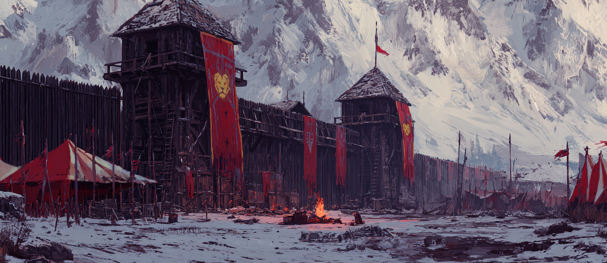
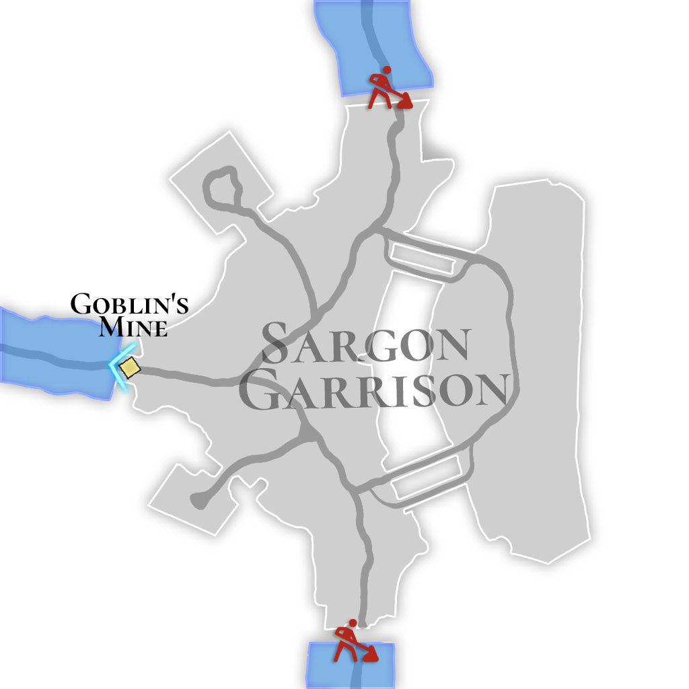

# 🌋 \~Lv.59 Sargon Garrison (PK)

<figure><figcaption></figcaption></figure>

<figure><figcaption></figcaption></figure>



📒When the Golden Rule was broken, the horde of monsters surging from the north threatened Rahan’s granary lands, and the kingdom’s entire army was mobilized to stop them. Sargon, seeking atonement, took command of the garrison himself and gave his life to repel the monsters. Iskandar too raised a wall of iron to aid him, yet human strength alone was no match for the overwhelming might of the dragonkin. A brutal and perilous battle unlike any they had faced before awaited them.

👉 [PK Leverage Type 3 (Hard Difficulty)](https://app.gitbook.com/o/V5Jg2dsXws3Kv6MsJo91/s/koBEJEqnxv6otqQj6uFt/system/pk/pk-leverage-bonus/bonus-chart#pk-leverage-3)​

<table data-header-hidden><thead><tr><th width="68.9090576171875"></th><th></th><th width="123.45458984375"></th><th width="126.181884765625"></th><th width="119.818115234375"></th><th></th></tr></thead><tbody><tr><td>56</td><td>
Guardian of the Basilisk

(STONE)
</td><td>Petrified Scale</td><td>Monocular Gem</td><td>Snow White</td><td>-</td></tr><tr><td>57</td><td>
Scout of the Cyclops

(LEAF)
</td><td>Petrified Scale</td><td>Monocular Gem</td><td>Crimson Claw</td><td>Snow White</td></tr><tr><td>58</td><td>
Crimson Soldier of Cornix

(FIRE)
</td><td>Petrified Scale</td><td>Monocular Gem</td><td>Crimson Claw</td><td>Snow White</td></tr><tr><td>59</td><td>
Degenerate Dragon of Skolix

(WATER)
</td><td>Degenerate Drake Scale</td><td>Corrupted Horn</td><td>Crimson Claw</td><td>Snow White</td></tr><tr><td>60</td><td>
Mutated Archer Captain

(DARK)
</td><td>Degenerate Drake Scale</td><td>Corrupted Horn</td><td>Wraith Arrowhead</td><td>Snow White</td></tr></tbody></table>

🍀**Gathered items :** Læraðr’s Golden Leaves, Læraðr’s Blessed Sap

> 😈**Field Raid :** Lv.67 Insane Sargon (LIGHT)\
> 🕓**Spawn Time (UTC) :** 15:40 / 05:40 / 11:10\
> **🕓Spawn Time (PHT) :** 23:40 / 13:40 / 19:10\
> 📦**Drop Item :** Core of protection, Lucky Core, Evil crystal, **Cursed Heart, Mark of Evil, Mark of Humanity**, Extocium etc…
>
> <a href="https://extocium.com/insanesargon/" class="button primary" data-icon="pen-circle">Drop Table Detail...</a>

🍀**Recipe Drop Information:**

| Guardian of the Basilisk    | Orb of Yin and Yang Recipe          | -                    |
| --------------------------- | ----------------------------------- | -------------------- |
| Scout of the Cyclops        | Petrified Butterfly Scale Recipe    | -                    |
| Crimson Soldier of Cornix   | Bloodstained Butterfly Heart Recipe | -                    |
| Degenerate Dragon of Skolix | Wings of the Transcendent Recipe    | -                    |
| Mutated Archer Captain      | Awakening Stone Recipe              | Ancient Power Recipe |

🍀 **Weapon Drop Notice (Paid Energy)**

When using Paid Energy, rewards are drawn from the Paid Energy–exclusive reward pool.\
At an extremely low probability, the following weapon items may be dropped.

> **Devil's sword, \[Lock] Waking Darkness**



📒황금의 규칙이 깨지자 북쪽에서 밀려오는 마물의 군세가 라한의 곡창지대를 위협했고, 왕국의 모든 병력이 이를 막기 위해 총동원 되었다. 죄를 뉘우치려 했던 사르곤은 스스로 주둔지의 수장이 되어 목숨을 바쳐 마물들을 물리친다. 이스칸달 역시 철의 장벽을 세워 그를 도왔지만, 용족의 막강한 힘을 인간의 힘으로 막기엔 역부족이었다. 이전까지는 겪어본 적 없던 거칠고 험난한 전투가 기다리고 있었다.

👉 [PK Leverage Type 3 (Hard Difficulty)](https://app.gitbook.com/o/V5Jg2dsXws3Kv6MsJo91/s/koBEJEqnxv6otqQj6uFt/system/pk/pk-leverage-bonus/bonus-chart#pk-leverage-3)​

<table data-header-hidden><thead><tr><th width="66.1817626953125"></th><th></th><th></th><th width="128"></th><th></th><th></th></tr></thead><tbody><tr><td>56</td><td>
바실리스크의 파수꾼

(STONE)
</td><td>석화된 비늘</td><td>외눈 보석</td><td>백설화</td><td>-</td></tr><tr><td>57</td><td>
키클롭스의 수색자

(LEAF)
</td><td>석화된 비늘</td><td>외눈 보석</td><td>핏빛 발톱</td><td>백설화</td></tr><tr><td>58</td><td>
코르닉스의 붉은 병사

(FIRE)
</td><td>석화된 비늘</td><td>외눈 보석</td><td>핏빛 발톱</td><td>백설화</td></tr><tr><td>59</td><td>
스콜릭스의 퇴화룡

(WATER)
</td><td>퇴화된 용비늘</td><td>용의 썩은 뿔</td><td>핏빛 발톱</td><td>백설화</td></tr><tr><td>60</td><td>
변이된 궁병대장

(DARK)
</td><td>퇴화된 용비늘</td><td>용의 썩은 뿔</td><td>망령의 화살촉</td><td>백설화</td></tr></tbody></table>

🍀**채집 품목 :** 레라드의 황금 나뭇잎, 레라드의 축복받은 수액

> 😈**필드 레이드 :** Lv.67 미쳐버린 사르곤 (광속성)
>
> 🕓**출현시간 (KST)** : 00:40 / 14:40 / 20:10
>
> 📦**드랍 아이템 :** 보호의 핵, 행운의 핵, 악의 결정, 저주받은 심장, 악의 징표, 인간의 징표, 엑스토시움 etc…
>
> <a href="https://extocium.com/insanesargon/" class="button primary" data-icon="pen-circle">Drop Table Detail...</a>

**🍀레시피 드랍 정보:**

| 바실리스크의 파수꾼  | 음양의 구슬 레시피    | -         |
| ----------- | ------------- | --------- |
| 키클롭스의 수색자   | 석화된 나비 비늘 레시피 | -         |
| 코르닉스의 붉은 병사 | 핏빛 나비 심장 레시피  | -         |
| 스콜릭스의 퇴화룡   | 초인의 날개 레시피    | -         |
| 변이된 궁병대장    | 각성석 레시피       | 고대의 힘 레시피 |

🍀 **유료 에너지 사용 시 무기 드랍 안내**

유료 에너지를 사용하면 유료 에너지 풀 전용 보상이 적용됩니다.
\
이때, 매우 희박한 확률로 아래의 무기 아이템이 드랍될 수 있습니다.

> **악마의 검, \[잠김] 깨어나는 어둠**



📒黄金の規律が破られると、北から押し寄せる魔物の軍勢がラハンの穀倉地帯を脅かし、王国の全兵力がこれを阻むため総動員された。贖罪を望んだサルゴンは、自ら駐屯地の長となり、命を賭して魔物を打ち払った。イスカンダルもまた鉄の障壁を築いて彼を助けたが、竜族の圧倒的な力を人の力で防ぐには力及ばなかった。これまでに経験したことのない荒々しく苛烈な戦いが待ち受けていた。

👉 [PK Leverage Type 3 (Hard Difficulty)](https://app.gitbook.com/o/V5Jg2dsXws3Kv6MsJo91/s/koBEJEqnxv6otqQj6uFt/system/pk/pk-leverage-bonus/bonus-chart#pk-leverage-3)​

<table data-header-hidden><thead><tr><th width="68.90911865234375"></th><th></th><th></th><th></th><th></th><th></th></tr></thead><tbody><tr><td>56</td><td>
バジリスクの番人

(STONE)
</td><td>石化した鱗</td><td>単眼の宝石</td><td>白雪花</td><td>-</td></tr><tr><td>57</td><td>
キュクロプスの探索者

(LEAF)
</td><td>石化した鱗</td><td>単眼の宝石</td><td>血染めの爪</td><td>白雪花</td></tr><tr><td>58</td><td>
コルニクスの赤き兵士

(FIRE)
</td><td>石化した鱗</td><td>単眼の宝石</td><td>血染めの爪</td><td>白雪花</td></tr><tr><td>59</td><td>
スコリクスの退化竜

(WATER)
</td><td>退化した竜の鱗</td><td>竜の腐った角</td><td>血染めの爪</td><td>白雪花</td></tr><tr><td>60</td><td>
変異した弓兵隊長

(DARK)
</td><td>退化した竜の鱗</td><td>竜の腐った角</td><td>亡霊の矢じり</td><td>白雪花</td></tr></tbody></table>

🍀**採集品目 :** レラードの黄金の葉, レラードの祝福された樹液

> 😈**フィールドレイド :** Lv.67 狂気のサルゴン（光属性）
>
> 🕓**出現時間 (KST)** : 00:40 / 14:40 / 20:10
>
> 📦**ドロップアイテム:** 守護の核、幸運の核、悪意の結晶、呪われた心臓、悪意の証、 人間の証、エクストシウム など
>
> <a href="https://extocium.com/insanesargon/" class="button primary" data-icon="pen-circle">Drop Table Detail...</a>

🍀**レシピドロップ情報:**

| バジリスクの番人   | 陰陽の珠レシピ    | -       |
| ---------- | ---------- | ------- |
| キュクロプスの探索者 | 石化蝶の鱗レシピ   | -       |
| コルニクスの赤き兵士 | 血染め蝶の心臓レシピ | -       |
| スコリクスの退化竜  | 超人の翼レシピ    | -       |
| 変異した弓兵隊長   | 覚醒石レシピ     | 古代の力レシピ |

🍀 **有料エナジー使用時の武器ドロップ案内**

有料エナジーを使用すると、有料エナジー専用報酬プールが適用されます。
\
この際、非常に低い確率で、以下の武器アイテムがドロップする場合があります。

> **悪魔の剣, \[ロック] 目覚める闇**



<em>※ This guide was written based on the game status as of January 7, 2026,</em>  <em>and its contents may change with future updates.</em>

