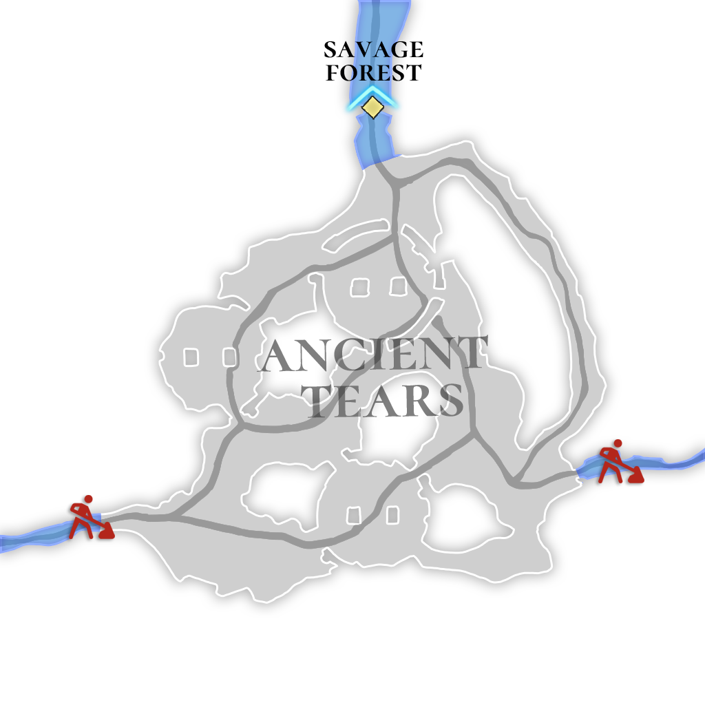

# 🌋 \~Lv.60 Ancient Tears (PK)

<figure><figcaption></figcaption></figure>

<figure><figcaption></figcaption></figure>



📒After the fall of the empire of gods, it is said that many events took place in ancient history. This place was originally a fertile fairy land, but for some reason, it was completely destroyed by a great flood. Modern Astericans probably believe that incident was a war between the ancients and giants. For some reason, the giants ultimately lost the war, and the tears they shed turned into sturdy crystals. These crystals possess magical power, making them an extremely valuable resource. Among adventurers, some claim to have witnessed the lingering spirit of the Leviathan that brought about the destructive great flood to this land.

👉 [PK Leverage Type 3 (Hard Difficulty)](../../contents/pk/pk-leverage-bonus/bonus-chart.md#pk-leverage-3)

<table><thead><tr><th width="90">Lv.</th><th>Monster</th><th>Drop1</th><th>Drop2</th><th>Drop3</th><th>Drop4</th></tr></thead><tbody><tr><td>51</td><td>Bubble (FORCE)</td><td>Soul Bubble</td><td>FlintCotton woolFlint</td><td>Sand</td><td>Water Crystal</td></tr><tr><td>52</td><td>Green Sharit (LEAF)</td><td>Sharit’s Tooth</td><td>Sharit’s Claw</td><td>Water Crystal</td><td>Powder of blessing</td></tr><tr><td>53</td><td>Red Sharit (FIRE)</td><td>Sharit’s Tooth</td><td>Sharit’s Claw</td><td>Water Crystal</td><td>Cotton wool</td></tr><tr><td>54</td><td>Green Ziz (STONE)</td><td>Ziz’s Scale</td><td>Ziz’s Tear</td><td>Water Crystal</td><td>Powder of blessing</td></tr><tr><td>55</td><td>Red Ziz (LIGHT)</td><td>Ziz’s Scale</td><td>Ziz’s Tear</td><td>Water Crystal</td><td>Snow White</td></tr></tbody></table>

🍀**Gathered items :** Tears of the Ancients, Constellation Stone Tablet

> 😈**Field Raid :** Lv.60 Leviathan (WATER)
>
> 🕓**Spawn Time (UTC)** : 15:20 / 05:20 / 12:20
>
> 📦**Drop Item :** Core of protection, Lucky Core, Evil crystal, Hell Crystal, Leviathan Meat, Extocium etc…

🍀**Recipe  Drop Information:**

<table><thead><tr><th width="214">Monster</th><th width="223">Drop1</th><th width="246">Drop2</th></tr></thead><tbody><tr><td>Bubble</td><td>Noah's Prayer Recipe</td><td>-</td></tr><tr><td>Green Sharit</td><td>Noah's Prayer Recipe</td><td>-</td></tr><tr><td>Red Sharit</td><td>Noah's Prayer Recipe</td><td>-</td></tr><tr><td>Green Ziz</td><td>Sword of light Recipe</td><td>-</td></tr><tr><td>Red Ziz</td><td>Sword of light Recipe</td><td>-</td></tr><tr><td>Mutated Bubble</td><td>Noah's Prayer Recipe</td><td>-</td></tr><tr><td>Burning Red Ziz</td><td>Sword of light Recipe</td><td>-</td></tr></tbody></table>



📒신들의 제국이 무너지고 난 후, 고대사에도 많은 일들이 있었다고 한다. 이곳은 본디 비옥한 요정의 땅이였는데, 어떠한 연유로 대홍수를 맞이하게 되어 완전히 파괴되었다. 현대의 아스테리카 사람들은 아마도 그 사건이 고대인과 거인들간의 전쟁이었다고 여긴다. 거인들은 모종의 이유로 전쟁에서 결국 패배했고, 그들이 흘린 눈물이 견고한 수정이 되었다. 이 수정은 마법의 힘을 지니고 있어 매우 귀중한 자원이다. 모험가들 사이에선, 이 땅에 멸망의 대홍수를 몰고 왔던 레비아탄의 망령을 본 이들이 있다고 한다.

👉[PK 레버리지 타입 3 ( 어려움 난이도 )](../../contents/pk/pk-leverage-bonus/bonus-chart.md#pk-leverage-3)

<table><thead><tr><th width="87">레벨</th><th>몬스터</th><th>드랍1</th><th>드랍2</th><th>드랍3</th><th>드랍4</th></tr></thead><tbody><tr><td>51</td><td>버블 (FORCE)</td><td>혼의 거품</td><td>목화솜</td><td>백설화</td><td>물의 결정</td></tr><tr><td>52</td><td>그린 샤리트 (LEAF)</td><td>샤리트의 이빨</td><td>샤리트의 발톱</td><td>물의 결정</td><td>축복의 가루</td></tr><tr><td>53</td><td>레드 샤리트 (FIRE)</td><td>샤리트의 이빨</td><td>샤리트의 발톱</td><td>물의 결정</td><td>목화솜</td></tr><tr><td>54</td><td>그린 지즈 (STONE)</td><td>지즈의 비늘</td><td>지즈의 눈물</td><td>물의 결정</td><td>축복의 가루</td></tr><tr><td>55</td><td>레드 지즈 (LIGHT)</td><td>지즈의 비늘</td><td>지즈의 눈물</td><td>물의 결정</td><td>백설화</td></tr></tbody></table>

🍀**채집 품목 :** 고대의 눈물, 별자리 석판

> 😈**필드 레이드 :** Lv.60 레비아탄 (물속성)
>
> 🕓**출현시간 (KST)** : 00:20 / 14:20 / 21:20
>
> 📦**드랍 아이템 :** 보호의 핵, 행운의 핵, 악의 결정, 지옥의 결정, 레비아탄 고기, 엑스토시움 etc…

**🍀레시피 드랍 정보:**

<table><thead><tr><th width="214">Monster</th><th width="223">Drop1</th><th width="246">Drop2</th></tr></thead><tbody><tr><td>버블</td><td>노아의 기도 레시피</td><td>-</td></tr><tr><td>그린 샤리트</td><td>노아의 기도 레시피</td><td>-</td></tr><tr><td>레드 샤리트</td><td>노아의 기도 레시피</td><td>-</td></tr><tr><td>그린 지즈</td><td>빛의 검 제작서</td><td>-</td></tr><tr><td>레드 지즈</td><td>빛의 검 제작서</td><td>-</td></tr><tr><td>변이된 버블</td><td>노아의 기도 레시피</td><td>-</td></tr><tr><td>불타는 레드 지즈</td><td>빛의 검 제작서</td><td>-</td></tr></tbody></table>



📒神々の帝国が滅びた後、古代史にはたくさんの出来事があったと言われている。この場所は本来、妖精たちの肥沃な土地であったが、何らかの理由で大洪水に見舞われ、完全に破壊された。現代のアステリカの人々は、おそらくその出来事は古代人と巨人たちの間の戦争であったと考えている。巨人たちは何らかの理由で最終的に戦争に敗れ、彼らが流した涙が頑丈な水晶となった。この水晶には魔力が宿っているため、非常に貴重な資源となっている。冒険家たちの間では、この土地に滅びの大洪水をもたらしたレビアタンの亡霊を目撃した者がいると言われている。

👉[ PKレバレッジタイプ3（高い難易度）](../../contents/pk/pk-leverage-bonus/bonus-chart.md#pk-leverage-3)

<table data-full-width="true"><thead><tr><th width="77">レベル</th><th width="125">モンスター</th><th width="148">ドロップ1</th><th width="126">ドロップ2</th><th width="104">ドロップ3</th><th>ドロップ4</th></tr></thead><tbody><tr><td>51</td><td>バブル (FORCE)</td><td>魂の泡</td><td>綿</td><td>白雪花</td><td>水の結晶</td></tr><tr><td>52</td><td>グリーンシャリット (LEAF)</td><td>シャリットの歯</td><td>シャリットの爪</td><td>水の結晶</td><td>祝福の粉</td></tr><tr><td>53</td><td>レッド·シャリット (FIRE)</td><td>シャリットの歯</td><td>シャリットの爪</td><td>水の結晶</td><td>綿</td></tr><tr><td>54</td><td>グリーン·ジーズ (STONE)</td><td>ジーズのうろこ</td><td>ジズの涙</td><td>水の結晶</td><td>祝福の粉</td></tr><tr><td>55</td><td>レッド·ジーズ (LIGHT)</td><td>ジーズのうろこ</td><td>ジズの涙</td><td>水の結晶</td><td>白雪花</td></tr></tbody></table>

🍀**採集品目 :** 古代の涙、星座石板

> 😈**フィールドレイド :** Lv.60 レヴィアタン（水）
>
> 🕓**出現時間 (KST)** : 00:20 / 14:20 / 21:20
>
> 📦**ドロップアイテム:** 保護の核、幸運の核、悪の結晶、地獄の結晶、レヴィアタン肉、エクストシウムetc···

🍀**レシピドロップ情報:**

<table><thead><tr><th width="214">Monster</th><th width="223">Drop1</th><th width="246">Drop2</th></tr></thead><tbody><tr><td>バブル</td><td>ノアの祈りのレシピ</td><td>-</td></tr><tr><td>グリーンシャリット</td><td>ノアの祈りのレシピ</td><td>-</td></tr><tr><td>レッド·シャリット</td><td>ノアの祈りのレシピ</td><td>-</td></tr><tr><td>グリーン·ジーズ</td><td>光の剣の製造書</td><td>-</td></tr><tr><td>レッド·ジーズ</td><td>光の剣の製造書</td><td>-</td></tr><tr><td>変異バブル</td><td>ノアの祈りのレシピ</td><td>-</td></tr><tr><td>燃えるレッドジズ</td><td>光の剣の製造書</td><td>-</td></tr></tbody></table>


