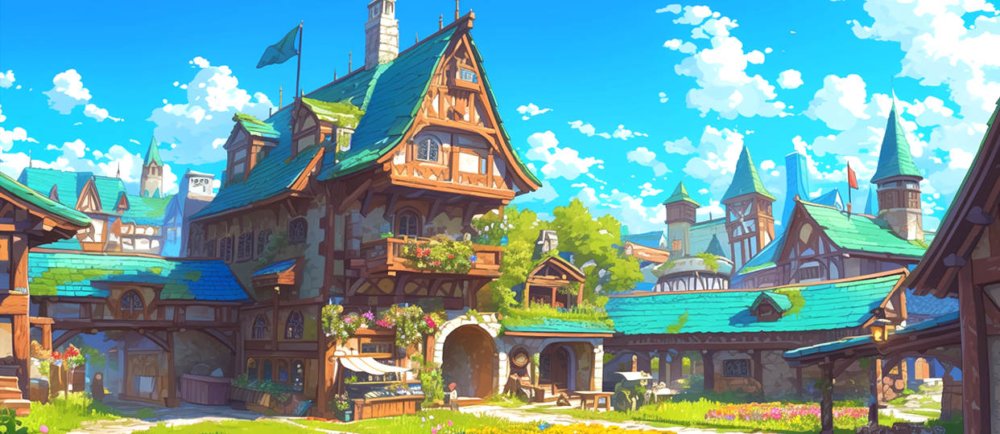

# 🏠 Rotten Hill

<figure><figcaption></figcaption></figure>

<figure><figcaption></figcaption></figure>



📒Rotten Hill is a small village where Ishtar and Elena were born and raised, home to the orphanage where they spent their childhood. The village is made up of old timber and creaking signs battered by the wind, appearing as though it’s been crushed under the weight of time. True to its name, “Rotten Hill,” it’s a poor and dilapidated place. The buildings are mostly crumbling and tilted, their roofs covered in thick patches of moss, while the uneven cobblestone paths turn into muddy quagmires whenever it rains. Yet, despite all this, Rotten Hill exudes a certain warmth and human touch that feels oddly comforting.

Just beyond the village lies an endless expanse of green fields, a place famous among adventurers as the starting point where they hone their combat skills before embarking on their first quests. The fields are dotted with low grasses swaying in the breeze and a scattering of ancient trees that serve as simple targets for novice adventurers to practice on. Occasionally, the distant cries of wild animals echo from the field’s edge, and the scent of grass carried on the wind fills visitors with a subtle mix of excitement and tension.

Thanks to these adventurers, Rotten Hill barely manages to sustain itself. The villagers offer warm soup and crusty but lovingly baked bread at the rundown inn, along with straw bedding and thin blankets for weary travelers to rest on. Ishtar and Elena, who grew up in the orphanage, also spent their childhood helping out with these adventurers. They gathered firewood or served dishes at the shabby tavern, contributing to the village’s survival while listening to the adventurers’ tales, which sparked their dreams of exploring the wider world.

Though Rotten Hill is a poor and decaying village, it serves as a humble but sturdy stepping stone for those dreaming of new beginnings. Here, adventurers test their limits, and like Ishtar and Elena, prepare to one day venture out into the greater world.

<table data-view="cards"><thead><tr><th></th><th></th><th></th><th data-hidden data-card-target data-type="content-ref"></th><th data-hidden data-card-cover data-type="files"></th></tr></thead><tbody><tr><td>💡<strong>The Rooftop Hollow</strong></td><td>Test your hero and sword!</td><td></td><td><a href="../../contents/my-home/the-rooftop-hollow.md">the-rooftop-hollow.md</a></td><td><a href="../../.gitbook/assets/KakaoTalk_20250722_143232981_02.png">KakaoTalk_20250722_143232981_02.png</a></td></tr><tr><td>💡<strong>Arena Waiting Room</strong></td><td>Do you want to join the arena?</td><td></td><td><a href="arena-waiting-room.md">arena-waiting-room.md</a></td><td><a href="../../.gitbook/assets/KakaoTalk_20250722_143232981_04.png">KakaoTalk_20250722_143232981_04.png</a></td></tr><tr><td>💡<strong>Magic Shop</strong></td><td>Important enhancement tasks such as skill reload, equipment destruction, and hero succession are all done here!</td><td></td><td><a href="magic-shop/">magic-shop</a></td><td><a href="../../.gitbook/assets/KakaoTalk_20250722_143232981.png">KakaoTalk_20250722_143232981.png</a></td></tr><tr><td>💡<strong>Rottenhill NPC</strong></td><td>Look for convenient features for hunting, like banks and storage!</td><td></td><td><a href="npc-rotten-hill.md">npc-rotten-hill.md</a></td><td><a href="../../.gitbook/assets/KakaoTalk_20250722_143232981_03.png">KakaoTalk_20250722_143232981_03.png</a></td></tr></tbody></table>



📒로튼힐은 이슈타르와 엘레나가 어린 시절을 보내며 나고 자란 고아원이 자리 잡고 있는 작은 마을이다. 이곳은 오래된 목재와 바람에 삐걱거리는 간판들로 이루어진, 세월의 무게에 짓눌린 듯한 가난한 마을로, 그 이름처럼 ‘썩은 언덕(Rotten Hill)’이라는 뜻을 가진 로튼힐이라 불린다. 마을의 건물들은 대개 낡고 기울어져 있으며, 지붕 위로는 이끼가 덕지덕지 붙어 있고, 울퉁불퉁한 돌길은 비가 오면 진흙탕으로 변하곤 한다. 하지만 그럼에도 불구하고, 로튼힐에는 어딘가 모르게 따뜻하고 인간적인 정취가 감돌고 있다.

마을 바로 앞에는 끝없이 펼쳐진 푸른 들판이 자리 잡고 있는데, 이곳은 모험가들이 첫 번째 모험을 준비하며 전투 기술을 연마하기 위해 자주 찾는 장소로 유명하다. 들판에는 키 낮은 풀이 바람에 흔들리고, 오래된 나무 몇 그루가 드문드문 서 있어 초보 모험가들에게 간단한 표적 연습을 제공한다. 이따금 들판 끝자락에서 들려오는 야생 동물의 울음소리와 바람에 실려오는 풀 내음은 이곳을 찾는 이들에게 아직은 미약하지만 설렘과 긴장감을 안겨준다.

로튼힐은 이러한 모험가들 덕분에 간신히 생계를 유지하고 있다. 마을 주민들은 낡은 여관에서 따뜻한 수프와 딱딱하지만 정성스레 구운 빵을 제공하며, 잠자리로 삼을 수 있는 건초 더미와 얇은 담요를 내어준다. 고아원 출신인 이슈타르와 엘레나 역시 어린 시절, 이곳에서 모험가들을 돕는 일을 하며 자랐다. 그들은 땔감을 모으거나 허름한 식당에서 접시를 나르는 일을 통해 마을에 보탬이 되고자 했고, 그 과정에서 모험가들의 이야기를 들으며 먼 세상으로의 꿈을 키워왔다.

로튼힐은 비록 가난하고 쇠락한 마을일지언정, 새로운 시작을 꿈꾸는 이들에게는 소박하지만 단단한 발판이 되어주는 곳이다. 이곳에서 모험가들은 자신의 한계를 시험하고, 이슈타르와 엘레나처럼 언젠가 더 큰 세상으로 나아갈 준비를 한다.

<table data-view="cards"><thead><tr><th></th><th></th><th></th><th data-hidden data-card-cover data-type="files"></th><th data-hidden data-card-target data-type="content-ref"></th></tr></thead><tbody><tr><td>💡옥상 공터</td><td>영웅과 검을 테스트해보세요!</td><td></td><td><a href="../../.gitbook/assets/화면 캡처 2025-02-21 131428.png">화면 캡처 2025-02-21 131428.png</a></td><td><a href="../../contents/my-home/the-rooftop-hollow.md">the-rooftop-hollow.md</a></td></tr><tr><td>💡<strong>아레나 대기실</strong></td><td>아레나에 참여하고 싶으신가요?</td><td></td><td><a href="../../.gitbook/assets/화면 캡처 2025-02-21 131529.png">화면 캡처 2025-02-21 131529.png</a></td><td><a href="arena-waiting-room.md">arena-waiting-room.md</a></td></tr><tr><td>💡<strong>마법상점</strong></td><td>스킬 리로드, 장비 파괴, 영웅 계승 등 중요한 강화 작업은 이 곳에서!</td><td></td><td><a href="../../.gitbook/assets/화면 캡처 2025-02-21 131623.png">화면 캡처 2025-02-21 131623.png</a></td><td><a href="magic-shop/">magic-shop</a></td></tr><tr><td>💡<strong>로튼힐 NPC</strong></td><td>은행, 창고 등 사냥을 편리하게 해 줄 기능을 찾아보세요!</td><td></td><td><a href="../../.gitbook/assets/NPC_Yeyilel.png">NPC_Yeyilel.png</a></td><td><a href="npc-rotten-hill.md">npc-rotten-hill.md</a></td></tr></tbody></table>



📒ロットンヒルは、イシュタールとエレナが幼少期を過ごし、育った孤児院がある小さな村だ。この村は古い木材と風に揺れるきしむ看板でできており、まるで時の重さに押し潰されたかのような貧しく荒廃した場所だ。「腐った丘（Rotten Hill）」という名前の通り、その名にふさわしい姿を呈している。村の建物はほとんどが老朽化して傾いており、屋根にはコケがびっしりと生え、でこぼこした石畳の道は雨が降ると泥沼と化してしまう。しかし、それでもロットンヒルにはどこか温かく、人間的な趣が漂っている。

村のすぐ外には、果てしなく広がる青い野原が広がっており、冒険者たちが最初の冒険の準備として戦闘技術を磨く場所としてよく訪れる名所だ。野原には低い草が風にそよぎ、ところどころに古木が点在しており、初心者冒険者たちにとって簡単な標的練習の場となっている。時折、野原の端から聞こえる野生動物の遠吠えや、風に運ばれる草の香りが、この地を訪れる人々にまだわずかながらもわくわく感と緊張感を与える。

ロットンヒルはこうした冒険者たちのおかげで何とか生計を立てている。村人たちは古びた宿で温かいスープと、固いが愛情を込めて焼いたパンを提供し、疲れた旅人には干し草のベッドと薄い毛布を用意している。孤児院出身のイシュタールとエレナも、幼少期にこの冒険者たちを手伝いながら育った。彼女たちは薪を集めたり、ボロボロの食堂で皿を運ぶ仕事をすることで村に貢献し、冒険者たちの話に耳を傾けながら、遠くの広い世界への夢を育ててきた。

ロットンヒルは貧しく荒廃した村ではあるが、新たな始まりを夢見る者たちにとって、質素だがしっかりとした足がかりとなる場所だ。ここで冒険者たちは自分の限界に挑戦し、イシュタールやエレナのように、いつか大きな世界へと踏み出す準備をする。

<table data-view="cards"><thead><tr><th></th><th></th><th></th><th data-hidden data-card-cover data-type="files"></th><th data-hidden data-card-target data-type="content-ref"></th></tr></thead><tbody><tr><td>💡<strong>屋上の空地</strong></td><td>ヒーローと剣をテストしてみましょう！</td><td></td><td><a href="../../.gitbook/assets/화면 캡처 2025-02-21 131428.png">화면 캡처 2025-02-21 131428.png</a></td><td><a href="../../contents/my-home/the-rooftop-hollow.md">the-rooftop-hollow.md</a></td></tr><tr><td>💡<strong>アリーナロビー</strong></td><td>アリーナに参加しますか？</td><td></td><td><a href="../../.gitbook/assets/화면 캡처 2025-02-21 131529.png">화면 캡처 2025-02-21 131529.png</a></td><td><a href="arena-waiting-room.md">arena-waiting-room.md</a></td></tr><tr><td>💡<strong>魔法の店</strong></td><td>スキルリロード、装備破壊、ヒーローの継承などの重要な強化作業はここで行います！</td><td></td><td><a href="../../.gitbook/assets/화면 캡처 2025-02-21 131623.png">화면 캡처 2025-02-21 131623.png</a></td><td><a href="magic-shop/">magic-shop</a></td></tr><tr><td>💡<strong>ロットンヒルNPC</strong></td><td>銀行、倉庫など、狩りを便利にする機能を探してみてください！</td><td></td><td><a href="../../.gitbook/assets/NPC_Yeyilel.png">NPC_Yeyilel.png</a></td><td><a href="npc-rotten-hill.md">npc-rotten-hill.md</a></td></tr></tbody></table>



