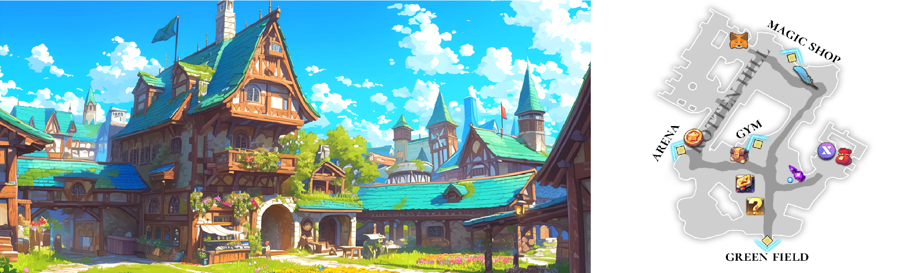

# 🏠 Rotten Hill

<figure><figcaption></figcaption></figure>



#### 📒 Rotten Hill

**Rotten Hill** is a small town where **Ishtar and Elena** spent their childhood,\
home to the orphanage where their story first began.\
Built from aged timber and creaking signboards worn by the wind,\
the town carries the weight of time in every corner.\
Though poor and weathered, Rotten Hill holds a quiet warmth that never fades.

Most of the buildings lean with age, their roofs covered in patches of moss,\
while uneven stone roads turn muddy whenever it rains.\
True to its name, Rotten Hill appears fragile at first glance,\
yet it endures, shaped by years of hardship and resilience.

Just beyond the town lies the **Green Field**,\
a wide open plain where adventurers prepare for their first battles.\
Swaying grass and a handful of old trees create a simple training ground,\
perfect for beginners testing their skills and courage.\
The scent of grass carried by the wind\
and distant cries of wildlife bring both excitement and tension\
to those taking their first steps into adventure.

Rotten Hill survives thanks to the adventurers who pass through.\
In its worn-down tavern, warm soup and simple bread are served,\
along with hay piles and thin blankets for rest.\
As children from the orphanage, Ishtar and Elena grew up helping these travelers,\
gathering firewood and carrying dishes,\
while listening to stories of lands far beyond the Green Field.

Rotten Hill is not a place of glory or wealth.\
But for those dreaming of something more, it is a humble yet solid starting point.\
Every journey begins somewhere, and for many adventurers, it begins here.



#### 📒 로튼힐

로튼힐은 이슈타르와 엘레나가 어린 시절을 보냈던 고아원이 자리한 작은 마을입니다.\
오래된 목재 건물과 바람에 삐걱거리는 간판들, 세월의 흔적이 그대로 남아 있는 가난한 마을이지만,\
그 안에는 묘하게 따뜻한 온기가 흐르고 있습니다.

마을의 건물들은 대부분 낡고 기울어져 있으며,\
이끼가 내려앉은 지붕과 울퉁불퉁한 돌길은 이곳이 오랜 시간 버텨온 장소임을 말해 줍니다.\
‘썩은 언덕(Rotten Hill)’이라는 이름처럼 겉모습은 초라하지만, \
쉽게 무너지지 않는 삶의 흔적이 남아 있습니다.

로튼힐 앞에는 끝없이 펼쳐진 푸른 들판이 자리하고 있습니다.\
이곳은 모험가들이 처음 전투를 연습하고, 자신의 가능성을 시험하는 첫 번째 무대입니다.\
바람에 흔들리는 풀과 드문드문 서 있는 나무들은 초보 모험가들에게 조용한 연습장이 되어 줍니다.

이 마을은 모험가들이 오가며 간신히 생계를 이어가는 곳이기도 합니다.\
낡은 여관에서는 따뜻한 수프와 소박한 빵이 제공되고, \
주민들은 부족한 형편 속에서도 머물 곳과 휴식을 내어줍니다.

로튼힐은 화려하지 않습니다.\
그러나 새로운 시작을 꿈꾸는 이들에게는 가장 단단한 출발점이 되어 주는 마을입니다.\
모든 모험은, 언제나 이곳에서 시작됩니다.



#### 📒 ロットンヒル（Rotten Hill）

**ロットンヒル**は、イシュタルとエレナが幼少期を過ごした孤児院がある小さな町です。\
風にきしむ看板や古びた木造の建物が並び、町の至るところに長い年月の重みが刻まれています。\
貧しく荒れた外見とは裏腹に、ロットンヒルにはどこか温かい空気が流れています。

町の建物の多くは傾き、屋根には苔が広がり、\
石畳の道は雨が降るとすぐにぬかるんでしまいます。\
「腐った丘（Rotten Hill）」という名の通り、一見すると脆く見える町ですが、\
長年の苦難を乗り越え、今も静かに在り続けています。

町のすぐ外には、広大な **グリーンフィールド（Green Field）**&#x304C;広がっています。\
ここは冒険者たちが最初の戦いに備え、戦闘の基礎を学ぶ場所です。\
風に揺れる草原と、点在する古木は、初心者にとって最適な訓練の場となっています。\
草の香りと遠くから聞こえる野生動物の声は、冒険の始まりに小さな緊張と期待をもたらします。

ロットンヒルは、行き交う冒険者たちによってかろうじて支えられています。\
古びた宿屋では、温かいスープと素朴なパンが振る舞われ、\
干し草と薄い毛布が休息の場として用意されています。\
孤児院で育ったイシュタルとエレナもまた、\
薪を集めたり皿を運んだりしながら冒険者を手助けし、\
遠い世界の物語に耳を傾けて育ちました。

ロットンヒルは、栄光や富に満ちた町ではありません。\
それでも、新たな一歩を夢見る者にとって、ここは確かな出発点となる場所です。\
すべての旅には始まりがあります。\
多くの冒険者にとって、その始まりがこのロットンヒルなのです。



<table data-view="cards"><thead><tr><th align="center"></th><th></th><th></th><th data-hidden data-card-target data-type="content-ref"></th><th data-hidden data-card-cover data-type="image">Cover image</th></tr></thead><tbody><tr><td align="center"><strong>Rotten Hill NPCs</strong></td><td>Meet the people who keep Rotten Hill running.</td><td>From helpful guides to key service NPCs, this is where your journey truly begins.</td><td><a href="npc-rotten-hill.md">npc-rotten-hill.md</a></td><td><a href="../../.gitbook/assets/KakaoTalk_20250722_143232981_03 (1).png">KakaoTalk_20250722_143232981_03 (1).png</a></td></tr><tr><td align="center"><strong>Magic Shop</strong></td><td>A hub for growth and preparation.</td><td>Strengthen your heroes before heading back into the field.</td><td><a href="magic-shop/">magic-shop</a></td><td><a href="../../.gitbook/assets/KakaoTalk_20250722_143232981.png">KakaoTalk_20250722_143232981.png</a></td></tr><tr><td align="center"><strong>The Rusty Tankard</strong></td><td>A lively tavern where adventurers gather.</td><td>Step inside to find portals leading to major battle content.</td><td></td><td><a href="../../.gitbook/assets/signal-2026-01-20-155119_003.png">signal-2026-01-20-155119_003.png</a></td></tr><tr><td align="center"><strong>Clientelas Lobby</strong></td><td>Join a Clientelas and manage your connections.</td><td>Access your Club Room and oversee Patrons and Clients from here.</td><td></td><td><a href="../../.gitbook/assets/signal-2026-01-20-155119_002.png">signal-2026-01-20-155119_002.png</a></td></tr></tbody></table>

<em>※ This guide was written based on the game status as of January 20, 2026,</em>  <em>and its contents may change with future updates.</em>

