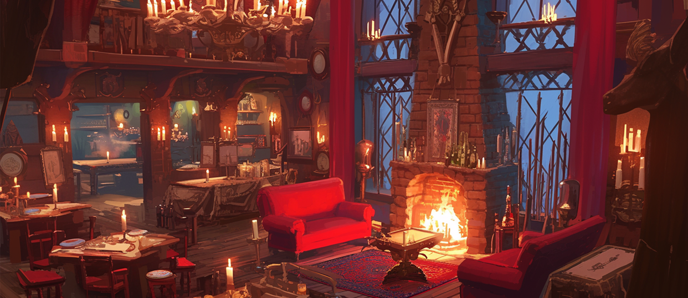
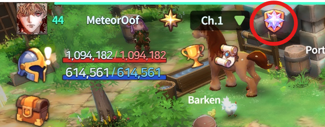

# 🍷 Clientelas Lobby

<figure><figcaption></figcaption></figure>



### 🏛 **Clientelas Lobby – Where Connections Begin**

Welcome to the **Clientelas Lobby**—the central hub for all things club-related.\
This is where Wizards can **find their community**, form lasting bonds,\
and unlock powerful bonuses through club-based features.

***

#### 🚪 How to Enter

There are two easy ways to access the Clientelas Lobby:

1️⃣ **Enter via the portal in the southwest area of The Rusty Tankard**

<figure><figcaption></figcaption></figure>

2️⃣ **Click the ‘Clientelas Lobby’ button from the main HUD**

<figure><figcaption></figcaption></figure>

***

#### 🧙 Learn More About Club NPCs

Curious about the NPCs that run the club system?\
👉 [Click here for Club NPC Info](npc-clientelas.md#eng)

#### 🏛 **Club Lobby Main Features**

🔹 [**Create & Join a Club**](../../clientelas-club/club/#eng) – Talk to **Sitael** to establish or join an existing club\
🔹 [**Manage Patrons & Clients**](../../clientelas-club/patron-and-client.md#eng) – Speak with **Hagiel** to **use referral codes, form sponsorships, and earn extra Gold bonuses**\
🔹 [**Enter Club Room**](../../clientelas-club/club/join.md#eng) – Access your club’s exclusive space

💡 **Find your place and build strong connections at the Clientelas Club Lobby!**

***

**Adventure is powerful alone—but it’s even greater with allies.**\
Step into the lobby, and claim your place in the world of Extocium. ✨




### 🏛 클리엔텔라스 로비 – 유대의 시작

클럽 활동의 중심지, \*\*클리엔텔라스 로비(Clientellas Lobby)\*\*에 오신 걸 환영합니다.\
이곳은 위자드님이 **자신의 소속을 찾고, 유대를 맺으며**\
엑스토시움 속에서 더 강력한 커뮤니티 활동을 시작할 수 있는 특별한 공간이에요.

***

#### 🚪 입장 방법

클리엔텔라스 로비에 들어가는 방법은 두 가지예요.\
가장 편한 경로로 진입해 보세요!

1️⃣ **녹슨 술잔 남서쪽에 위치한 포털을 통해 입장**

<figure><figcaption></figcaption></figure>

2️⃣ **메인 HUD의 상단 메뉴에서 ‘클리엔텔라스 로비’ 버튼 클릭**

<figure><figcaption></figcaption></figure>

***

#### 🧙 클럽 관련 NPC 안내

클럽 기능과 NPC 정보가 궁금하다면?\
👉 [클럽 NPC 정보 바로가기](npc-clientelas.md#undefined-1)

#### 🏛 **클럽 로비 주요 기능**

🔹 [**클럽 창설 & 가입**](../../clientelas-club/club/#undefined-1) – **시타엘**을 통해 클럽을 만들거나 기존 클럽에 가입 가능\
🔹 [**페이트론 & 클라이언트 관리**](../../clientelas-club/patron-and-client.md#undefined-1) – **하지엘**과 대화하여 **레퍼럴 코드로 후원 관계를 맺고 추가 골드 보너스 획득**\
🔹 [**클럽 룸 입장**](../../clientelas-club/club/join.md#undefined-1) – 소속된 클럽의 전용 공간으로 이동

💡 **클리엔탈라스 클럽 로비에서 소속을 찾고, 강한 유대를 만들어보세요!**

***

**혼자만의 모험도 멋지지만, 함께할 동료가 있다면 더 강해질 수 있어요.**\
지금, 클럽 로비에서 당신의 자리를 찾아보세요! 🛡️✨



#### 🏛**クライエンテラス・ロビー – 絆が始まる場所**

ようこそ、**クライエンテラス・ロビー（Clientelas Lobby）へ。**\
**ここは、クラブ関連のすべてが集まる中心地です。**\
**ウィザード様が自分の所属先を見つけ、信頼関係を築く**ための特別な場所となっています。

***

#### 🚪 入場方法

クライエンテラス・ロビーへは、以下の2つの方法で入場できます：

1️⃣ **The Rusty Tankardの南西エリアにあるポータルから入場**

<figure><figcaption></figcaption></figure>

2️⃣ **メインHUD上部の「Clientelas Lobby」ボタンをクリック**

<figure><figcaption></figcaption></figure>

***

#### 🧙 クラブNPCの情報はこちら

クラブ関連のNPCが気になる方は、こちらをご確認ください：\
👉 [クラブNPC情報を見る](npc-clientelas.md#ri-ben-yu)

#### 🏛 **クラブロビーの主な機能**

🔹 [**クラブ創設＆加入**](../../clientelas-club/club/#ri-ben-yu) – **シタエル**に話しかけてクラブを作成・加入\
🔹 [**パトロン＆クライアント管理**](../../clientelas-club/patron-and-client.md#ri-ben-yu) – **ハジエル**と会話して、**リファラルコードを使い、支援関係を結び、追加ゴールドボーナスを獲得**\
🔹 [**クラブルーム入場** ](../../clientelas-club/club/join.md#ri-ben-yu)– 所属クラブの専用スペースへ移動

💡 **クリエンタラス・クラブロビーで仲間を見つけ、強い絆を築こう！**

***

**一人での冒険も良いですが、仲間がいればもっと強くなれます。**\
今すぐクラブロビーで、あなたの居場所を見つけてくださいね 🛡️✨



