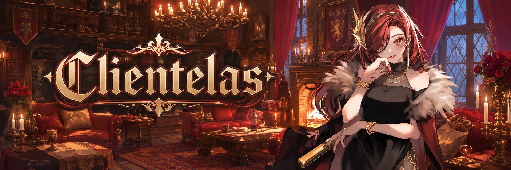

# 🍷 Clientelas Lobby

<figure><figcaption></figcaption></figure>



### 🏛  Clientelas Lobby

The Clientelas Lobby is a community space\
where adventurers begin forming connections and building relationships.

Here, adventurers can join clubs, set up patron relationships with other players,\
and start engaging in a variety of community activities within EXTOCIUM.

***

### ◾ How to Enter

You can enter the Clientellas Lobby using one of the methods below.\
Choose the option that works best for you.

1️⃣ Use the portal located at the **southwest side of The Rusty Tankard**

<figure><figcaption></figcaption></figure>

2️⃣ Select **“Clientellas Lobby”** from the top menu of the Main HUD

<figure><figcaption></figcaption></figure>

***

### ◾ Key NPCs

The Clientellas Lobby is home to NPCs who manage various community-related features,\
including club activities and patron relationships.

Through these NPCs, adventurers can\
choose an affiliation or form special connections with other players.

👇 For detailed NPC information, please refer to **NPC – Clientelas**.


[npc-clientelas.md](npc-clientelas.md)


***

### ◾ Main Features of the Clientelas Lobby

#### 🔹 Create & Join Clubs

* Talk to **NPC Sitael** to create a new club or join an existing one.


[club](../../../clientelas-club/club/)


***

#### 🔹 Patron & Client Management

* Speak with **NPC Haziel** to set up a patron relationship using a referral code.
* Forming a patron relationship grants additional Gold bonuses.


[patron-and-client.md](../../../clientelas-club/patron-and-client.md)


***

#### 🔹 Enter the Club Room

* Move to your club’s exclusive space, the **Club Room**, if you are a club member.

<figure><figcaption></figcaption></figure>

***

### ✨

> **The Clientelas Lobby is the starting point for adventures shared with others.**\
> **Solo journeys have their charm, but with companions,** \
> **the road stretches even further.**
>
> **Your place begins here.**



### 🏛 클리엔텔라스 로비 (Clientellas Lobby)

클리엔텔라스 로비는 **모험가들이 관계를 맺고 교류를 시작하는 커뮤니티 공간**입니다.

이곳에서 모험가는 클럽에 가입하거나, 다른 모험가와 후원 관계를 맺는 등\
엑스토시움 속 다양한 커뮤니티 활동을 시작할 수 있습니다.

***

### ◾ 입장 방법

클리엔텔라스 로비에는 아래 두 가지 방법으로 입장할 수 있습니다.\
편한 방법을 선택해 주세요.

1️⃣ **녹슨 술잔 남서쪽에 위치한 포털 이용**

<figure><figcaption></figcaption></figure>

2️⃣ **메인 HUD 상단 메뉴에서 ‘클리엔텔라스 로비’ 버튼 선택**

<figure><figcaption></figcaption></figure>

***

### ◾ 주요 NPC 안내

클리엔텔라스 로비에는 **클럽 활동과 후원 관계 설정 등**,\
다양한 커뮤니티 기능을 담당하는 NPC들이 모여 있습니다.\
이곳의 NPC를 통해 소속을 정하거나, 다른 위자드와 특별한 관계를 맺을 수 있습니다.

👇 자세한 NPC 정보는 아래 **NPC - 클리엔텔라스** 안내를 참고해 주세요.


[npc-clientelas.md](npc-clientelas.md)


***

### ◾ 클리엔텔라스 로비 주요 기능

#### 🔹 클럽 창설 & 가입

* NPC **시타엘**을 통해 새로운 클럽을 만들거나 이미 존재하는 클럽에 가입할 수 있습니다.


[club](../../../clientelas-club/club/)


***

#### 🔹 페이트론 & 클라이언트 관리

* NPC **하지엘**과 대화하여 레퍼럴 코드를 사용한 후원 관계를 설정할 수 있습니다.
* 후원 관계를 맺으면 추가 골드 보너스를 획득할 수 있습니다.


[patron-and-client.md](../../../clientelas-club/patron-and-client.md)


***

#### 🔹 클럽 룸 입장

* 자신이 소속된 클럽의 전용 공간인 **클럽 룸**으로 이동할 수 있습니다.

<figure><figcaption></figcaption></figure>

***

### ✨

> **클리엔텔라스 로비는 혼자가 아닌, 함께하는 모험의 시작점입니다.**\
> **혼자서 떠나는 모험도 좋지만, 동료와 함께라면 더 넓은 길을 걸을 수 있습니다.**\
> **당신의 자리는, 이곳에서 시작됩니다.**



### 🏛 クリエンテラス・ロビー（Clientellas Lobby）

クリエンテラス・ロビーは、\
冒険者たちがつながりを築き、交流を始めるコミュニティ空間です。

ここでは、クラブに参加したり、他の冒険者と後援関係を結んだりしながら、\
EXTOCIUMのさまざまなコミュニティ活動を始めることができます。

***

### ◾ 入場方法

クリエンテラス・ロビーへは、以下のいずれかの方法で入場できます。\
利用しやすい方法を選んでください。

1️⃣ **The Rusty Tankard** 南西にあるポータルを利用

<figure><figcaption></figcaption></figure>

2️⃣ メインHUD上部メニューから **「クリエンテラス・ロビー」**&#x3092;選択

<figure><figcaption></figcaption></figure>

***

### ◾ 主要NPC案内

クリエンテラス・ロビーには、クラブ活動や後援関係の設定など、\
さまざまなコミュニティ機能を担当するNPCが集まっています。

これらのNPCを通じて、所属先を決めたり、他の冒険者と特別な関係を結ぶことができます。

👇 詳しいNPC情報は **NPC – クリエンテラス**の案内をご確認ください。


[npc-clientelas.md](npc-clientelas.md)


***

### ◾ クリエンテラス・ロビーの主な機能

#### 🔹 クラブ設立・加入

* NPC **シタエル**と会話することで、新しいクラブを設立したり、\
  既存のクラブに加入することができます。


[club](../../../clientelas-club/club/)


***

#### 🔹 パトロン＆クライアント管理

* NPC **ハジエル**と会話し、リファラルコードを使って後援関係を設定できます。
* 後援関係を結ぶと、追加のゴールドボーナスを獲得できます。


[patron-and-client.md](../../../clientelas-club/patron-and-client.md)


***

#### 🔹 クラブルーム入場

* 所属しているクラブの 専用空間である**クラブルーム**へ移動できます。

<figure><figcaption></figcaption></figure>

***

### ✨

> **クリエンテラス・ロビーは、ひとりではなく、誰かと共に歩む冒険の始まりの場所です。**\
> **ひとり旅も素敵ですが、仲間となら、より遠くまで進むことができるでしょう。**
>
> **あなたの居場所は、ここから始まります。**



<em>※ This guide was written based on the game status as of January 22, 2026,</em>  <em>and its contents may change with future updates.</em>

