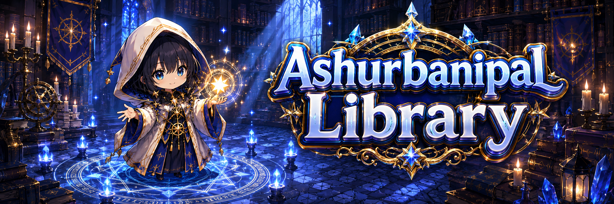

# 🕍 Ashurbanipal Library

<figure><figcaption></figcaption></figure>



### 📚 Ashurbanipal Library Guide

If you want to make your heroes stronger, welcome to the **Ashurbanipal Library**.

The Ashurbanipal Library is a dedicated space where you can access\
core hero growth content such as [**Hero Synthesis**](../../../../growth/hero-ascension/synthesis.md), [**Succession**](../../../../growth/hero-ascension/succession/), and [**Reload**](../../../../growth/hero-ascension/reload/).

Here, you can reorganize the heroes you own,\
experiment with new possibilities,\
and guide them toward becoming even more powerful.

***

### ◾ Ashurbanipal Library Location

The Ashurbanipal Library is located inside the **Magic Shop**,\
positioned in the north-central area of **Rotten Hill**.

1️⃣ Move to the **Magic Shop**.

<figure><figcaption></figcaption></figure>

2️⃣ Use the portal leading to the **second floor** inside the Magic Shop.

<figure><figcaption></figcaption></figure>

3️⃣ Passing through the portal will take you to the Ashurbanipal Library.

<figure><figcaption></figcaption></figure>

***

### ◾ Library Usage Guide

In the Ashurbanipal Library,\
you can access various hero-related functions through multiple NPCs.

For detailed information on each feature, please refer to the NPC guide pages below.

👇 **Go to the Ashurbanipal Library NPC List**


[npc-library.md](npc-library.md)


***

✨

> **The Ashurbanipal Library is a place where you can rediscover your heroes’ potential**\
> **and redesign their path of growth.**
>
> **If you’re preparing for the next stage of your heroes,** \
> **this is where new possibilities begin.**



### 📚 아슈르바니팔 도서관 가이드

영웅을 더 강력한 존재로 성장시키고 싶다면, 아슈르바니팔 도서관을 찾아오세요.

아슈르바니팔 도서관은 영웅의 [**합성**](../../../../growth/hero-ascension/synthesis.md), [**계승**](../../../../growth/hero-ascension/succession/), [**리로드**](../../../../growth/hero-ascension/reload/) 등\
영웅 성장과 관련된 핵심 콘텐츠를 이용할 수 있는 공간입니다.

이곳에서는 보유한 영웅을 재정비하고, 새로운 가능성을 시험하며 \
더 강력한 영웅으로 성장시킬 수 있습니다.

***

### ◾ 아슈르바니팔 도서관 위치 안내

아슈르바니팔 도서관은 **로튼힐 북쪽 중앙에 위치한 Magic Shop** 내부에 있습니다.

1️⃣ **Magic Shop**으로 이동합니다.

<figure><figcaption></figcaption></figure>

2️⃣ Magic Shop 내부의 **2층으로 향하는 포탈**을 이용합니다.

<figure><figcaption></figcaption></figure>

3️⃣ 포탈을 통과하면 아슈르바니팔 도서관에 도착합니다.

<figure><figcaption></figcaption></figure>

***

### ◾ 도서관 이용 안내

아슈르바니팔 도서관에서는 여러 NPC를 통해 영웅과 관련된 다양한 기능을 이용할 수 있습니다.\
자세한 내용은 아래의 **NPC 안내 페이지**에서 확인할 수 있습니다.

👇 **아슈르바니팔 도서관 NPC 목록 바로가기**


[npc-library.md](npc-library.md)


***

✨

> **아슈르바니팔 도서관은**\
> **영웅의 잠재력을 다시 발견하고, 성장의 방향을 새롭게 설계할 수 있는 공간입니다.**\
> **영웅의 다음 단계를 준비하고 싶다면, 이곳에서 그 가능성을 열어 보세요.**



### 📚 アシュルバニパル図書館ガイド

英雄をさらに強力な存在へと成長させたいなら、 **アシュルバニパル図書館**を訪れてください。

アシュルバニパル図書館は、英雄の[**合成**](../../../../growth/hero-ascension/synthesis.md)**・**[**継承**](../../../../growth/hero-ascension/succession/)**・**[**リロード**](../../../../growth/hero-ascension/reload/)など、\
英雄成長に関わる主要コンテンツを利用できる特別な空間です。

ここでは、所持している英雄を整え直し、新たな可能性を試しながら、\
より強力な英雄へと成長させることができます。

***

### ◾ アシュルバニパル図書館の場所

アシュルバニパル図書館は、**ロッテンヒル北中央に位置するマジックショップ**の内部にあります。

1️⃣ **マジックショップ**へ移動します。

<figure><figcaption></figcaption></figure>

2️⃣ マジックショップ内部の**2階へ向かうポータル**を利用します。

<figure><figcaption></figcaption></figure>

3️⃣ ポータルを通過すると、アシュルバニパル図書館に到着します。

<figure><figcaption></figcaption></figure>

***

### ◾ 図書館の利用案内

アシュルバニパル図書館では、\
複数のNPCを通じて、英雄に関するさまざまな機能を利用できます。

各機能の詳細は、以下の**NPC案内ページ**からご確認ください。

👇 **アシュルバニパル図書館 NPC一覧へ**


[npc-library.md](npc-library.md)


***

✨

> **アシュルバニパル図書館は、**\
> **英雄の潜在能力を再発見し、成長の方向性を新たに設計できる場所です。**
>
> **英雄の次なる段階を目指すなら、この場所でその可能性を切り開いてみましょう。**



<em>※ This guide was written based on the game status as of January 21, 2026,</em>  <em>and its contents may change with future updates.</em>

