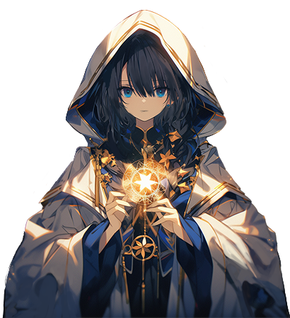
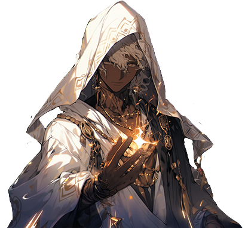

# 😎 NPC - Library

## ✅Seheiah - 세헤이아 - セヘイア

<figure><figcaption></figcaption></figure>

<figure><figcaption></figcaption></figure>


[succession](../../../../growth/powering-up-the-hero/succession/)


**You can meet Seheiah, the Gatekeeper of Souls, in the Library of Ashurbanipal, inside the Magic Shop in Rotten Hill. She will succeed your Hero to a higher level.**\
\
로튼힐의 마법상점 안, 아슈바니팔 도서관에서 영혼의 문지기 세헤이아를 만날 수 있습니다. 세헤이아는 당신의 영웅을 더 높은 단계로 승계시켜 줄 것입니다.\
\
ロートンヒルの魔法商店の中、アシュバニパル図書館で魂の門番セヘイアに出会うことができます。 セヘイアはあなたのヒーローをより高い段階に継承させてくれます。

## ✅Chavakiah - 차바키아 - チャヴァキア

<figure><figcaption></figcaption></figure>

<figure><figcaption></figcaption></figure>


[synthesis.md](../../../../growth/powering-up-the-hero/synthesis.md)


**Want to make your hero stronger? Visit Chavakia in Ashurbanipal Library and he can synthesise your heroes.**\
\
당신의 영웅을 더 강하게 만들 고 싶으신가요? 아슈바니팔 도서관의 차바키아를 찾아가세요. 당신의 영웅들을 합성시킬 수 있습니다.\
\
あなたのヒーローをもっと強くしたいですか？ アシュバニパル図書館のチャバキアを訪ねてください。 あなたのヒーローたちを合成させることができます。

## ✅Lelahel - 레라엘 - レラエル

<figure><figcaption></figcaption></figure>

<figure><figcaption></figcaption></figure>


[reload](../../../../growth/powering-up-the-hero/reload/)


**By paying Lelahel, the gatekeeper of souls, you can reload your hero to its original state. Don't forget that everything is reset.**\
\
영혼의 문지기 레라엘에게 대가를 지불하면 당신의 영웅을 태초의 상태로 리로드할 수 있습니다. 모든것이 초기화 된다는걸 잊지 마세요.\
\
魂の門番、レラエルに代価を払えば、あなたの英雄を胎初の状態でリロードすることができます。 すべてが初期化されることを忘れないでください。

## ✅Omael - 오마엘 - オマエル

<figure><figcaption></figcaption></figure>

<figure><figcaption></figcaption></figure>


[skill-rune-crafting.md](../../../../growth/powering-up-the-hero/succession/skill-rune-crafting.md)


**Have you acquired a '**[**Succession Hero**](../../../../growth/powering-up-the-hero/succession/)**'? If so, you can now use skill runes! Omael will craft skill runes for you using the materials you have collected.**

'[계승 영웅](../../../../growth/powering-up-the-hero/succession/)'을 획득하셨나요? 그렇다면 스킬 룬을 사용할 수 있겠군요! 오마엘은 당신이 모아 온 재료로 스킬 룬을 제작해 준답니다.

「[継承ヒーロー](../../../../growth/powering-up-the-hero/succession/)」を獲得しましたか？そうであれば、スキルルーンを使用できるようになりますね！オマエルが、あなたが集めた材料でスキルルーンを作成してくれます。
