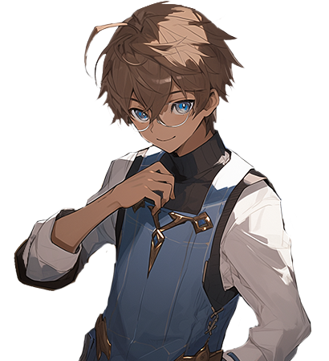

# 😎 NPC - Magic Shop

## ✅Eligos - 엘리고스 - エレゴス

<figure><figcaption></figcaption></figure>

<figure><figcaption></figcaption></figure>


[equipment-destruction.md](../../../contents/equipment-care/equipment-destruction.md)




#### 🛠️ **Eligos & Equipment Destruction System**

🔹 **Eligos** can be found at the **Magic Shop in Rottenhill**.\
🔹 **Bring weapons or orbs to Eligos to safely destroy them!**\
🔹 **Destroying equipment may sometimes yield valuable items!** 🎁

💡 **Clear out unnecessary gear and seize the chance for unexpected rewards!**



#### 🛠️ **엘리고스 & 장비 파괴 시스템**

🔹 **엘리고스**는 **로튼힐의 마법상점**에서 만날 수 있습니다.\
🔹 **무기나 오브를 엘리고스에게 가져가면 안전하게 파괴 가능!**\
🔹 **장비를 파괴하면 가끔 특별한 아이템을 획득할 수도 있습니다!** 🎁

💡 **필요 없는 장비를 정리하고, 예상치 못한 보상의 기회를 잡아보세요!**



#### 🛠️ **エリゴス＆装備破壊システム**

🔹 **エリゴス**は**ロッテンヒルのマジックショップ**で会えます。\
🔹 **武器やオーブを持っていくと、安全に破壊可能！**\
🔹 **装備を破壊すると、まれに貴重なアイテムを獲得できることも！** 🎁

💡 **不要な装備を整理し、思いがけない報酬を手に入れよう！**



## ✅Barbatos - 바르바토스 - バルバトス

<figure><figcaption></figcaption></figure>

<figure><figcaption></figcaption></figure>


[reload-weapon.md](../../../contents/equipment-care/reload-weapon.md)




#### 🔨 **Barbatos & Weapon Reload System**

🛠️ **Barbatos is a master blacksmith** found at the **Magic Shop in Rottenhill**.\
🛠️ **Want to reset your weapon to its original state? Visit Barbatos!**\
⚠️ **Be aware that reloading a weapon will reset both its skill level and enhancement stats!**

💡 **If you're looking for a fresh start with a new weapon, Barbatos is the one to see!!**



#### 🔨 **바르바토스 & 무기 리로드 시스템**

🛠️ **바르바토스는 로튼힐의 무기 장인**으로, **마법상점에서 만날 수 있습니다.**\
🛠️ **무기를 리로드하여 태초의 상태로 되돌리고 싶다면 바르바토스를 찾아가세요!**\
⚠️ **단, 무기를 리로드하면 스킬 레벨과 강화 수치가 초기화되니 주의하세요!**

💡 **새로운 무기로 전투 전략을 리셋하고 싶다면, 바르바토스를 방문해 보세요!**



#### 🔨 **バルバトス＆武器リロードシステム**

🛠️ **バルバトスはロッテンヒルの武器職人**で、**マジックショップで会えます。**\
🛠️ **武器を初期状態に戻したいなら、バルバトスを訪ねましょう！**\
⚠️ **ただし、武器をリロードするとスキルレベルと強化値がリセットされるので注意！**

💡 **新しい武器で戦略を一新したいなら、バルバトスに相談しよう！**



## ✅Amonas - 아모나스 - アモナス

<figure><figcaption></figcaption></figure>

<figure><figcaption></figcaption></figure>


[exp-tp-magic-vial.md](../../../contents/exp-tp-magic-vial.md)




#### 🧪 **Amonas & The Magic Vial**

🔹 **Amonas is a renowned alchemist** found in the Magic Shop.\
🔹 **Bring a Magic Vial to Amonas, and you can store your efforts inside!**

💡 **Need to save EXP or TP? Visit Amonas!**



#### 🧪 **아모나스 & 마법 호리병**

🔹 **아모나스는 유명한 연금술사**로, 마법상점에서 만날 수 있습니다.\
🔹 **마법 호리병을 들고 아모나스를 찾아가면, 당신의 노력을 호리병에 담을 수 있습니다.**

💡 **EXP와 TP를 보관하고 싶다면, 아모나스를 방문해보세요!**



#### 🧪 **アモナス＆魔法のフラスコ**

🔹 **アモナスは有名な錬金術師**で、マジックショップで会えます。\
🔹 **魔法のフラスコを持ってアモナスを訪ねると、あなたの努力をフラスコに封じ込めることができます。**

💡 **EXPやTPを保存したいなら、アモナスに相談しよう！**


