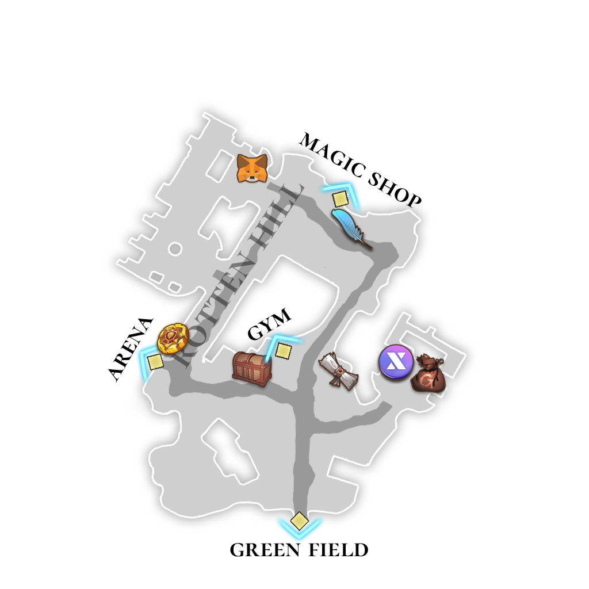
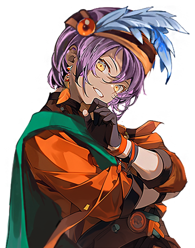
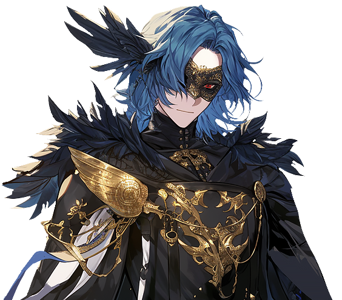

# 😎 NPC - Rotten Hill

### <mark style="color:purple;">**📜Guide List**</mark>

* [✅PARASIEL - 파라시엘 - パラシエル](npc-rotten-hill.md#parasiel-parashieru) : Purchase items
* [✅YEYILEL - 예이렐 - イェイレル](npc-rotten-hill.md#yeyilel-yeireru) : Bank
* [✅MEBAHEL - 메바헬 - メバヘル](npc-rotten-hill.md#mebahel-mebaheru) : Storage
* [✅GILGAMESH - 길가메시 - ギルガメッシュ](npc-rotten-hill.md#gilgamesh-girugamesshu) : Abandoned letter
* [✅Hermaion - 헤르마이온 - ヘルメイオン](npc-rotten-hill.md#hermaion-herumeion): Arena Coin Roulette
* [✅Niberius - 니베리우스 - ニベリウス](npc-rotten-hill.md#niberius-niberiusu) : Remove PK score

<figure><figcaption></figcaption></figure>

## ✅PARASIEL - 파라시엘 - パラシエル

<figure><figcaption></figcaption></figure>

<figure><figcaption></figcaption></figure>

💡 **Trader Parasiel purchases items from adventurers.**

> 💡 **상인 파라시엘은 여행자들로부터 아이템을 매입합니다.**\
> 💡 **商人パラシエルは旅行者からアイテムを買い取ります。**

## ✅YEYILEL - 예이렐 - イェイレル

<figure><figcaption></figcaption></figure>

<figure><figcaption></figcaption></figure>

💡**At Banker Yeyilel, you can access the** [**Gold Safe service**](../../xto-token/gold-safe-service.md) **and** [**XTO Swap service**](../../xto-token/xto-swap-service/)**.**

> 💡 **뱅커 예이렐에게 가면** [**골드 보관 서비스**](../../xto-token/gold-safe-service.md)**와** [**XTO 스왑 서비스**](../../xto-token/xto-swap-service/)**를 이용할 수 있습니다.**\
> 💡 **銀行家イェレルでは、**[**ゴールド保管サービス**](../../xto-token/gold-safe-service.md)**と**[**XTOスワップサービス**](../../xto-token/xto-swap-service/)**を利用できます。**

## ✅MEBAHEL - 메바헬 - メバヘル

<figure><figcaption></figcaption></figure>

<figure><figcaption></figcaption></figure>

💡 **Porter Mebahel stores items for adventurers, providing a total of 100 storage slots.**

> 💡 **짐꾼 메바헬은 여행자들을 위해 아이템을 보관해 주며, 총 100개의 보관 슬롯을 제공합니다.**\
> 💡 **ポーターのメバヘルは旅行者のためにアイテムを保管し、合計100個の保管スロットを提供します。**

## ✅GILGAMESH - 길가메시 - ギルガメッシュ

<figure><figcaption></figcaption></figure>

<figure><figcaption></figcaption></figure>

💡 **Gilgamesh collects abandoned letters. Bring the letters dropped by monsters to him, and he’ll buy them for a good price.**

> 💡 **길가메시는 버려진 편지를 수집합니다. 몬스터가 드롭한 편지를 가져가면 좋은 값에 사들입니다.**\
> 💡 **ギルガメッシュは捨てられた手紙を収集しています。モンスターがドロップした手紙を持って行くと、高値で買い取ってくれます。**

## ✅Hermaion - 헤르마이온 - ヘルメイオン

<figure><figcaption></figcaption></figure>

<figure><figcaption></figcaption></figure>

💡 **Hermion offers a** [**roulette service**](../../gamemode/1vs1-arena/arena-roulette.md)**. Spend a certain amount of Gold and Arena Coins to spin the wheel. Try your luck!**

> 💡 **헤르마이온은**[ **룰렛 서비스**](../../gamemode/1vs1-arena/arena-roulette.md)**를 제공합니다. 일정량의 골드와 아레나 코인으로 룰렛을 돌려보세요. 당신의 행운을 시험해 보세요!**\
> 💡 **ヘルマイオンは**[**ルーレットサービス**](../../gamemode/1vs1-arena/arena-roulette.md)**を提供しています。一定量のGoldとアリーナコインでルーレットを回せます。あなたの運を試してみましょう！**

## ✅Niberius - 니베리우스 - ニベリウス

<figure><figcaption></figcaption></figure>

<figure><figcaption></figcaption></figure>

💡 **Niberius offers contracts to players who want to quickly lower their** [**PK score**](../../contents/pk/)**.**\
Contracts require **Gold and a Pen of Oblivion**, with the **Gold amount varying based on the Hero's level**.\
The **Pen of Oblivion** can be obtained from [**Hermion’s Roulette**](../../gamemode/1vs1-arena/arena-roulette.md).

> 💡 **니베리우스는**[ **PK 점수**](../../contents/pk/)**를 빠르게 감소시키고 싶은 플레이어들과 계약을 맺습니다.**\
> 계약에는 **골드와 망각의 펜**이 필요하며, **필요한 골드의 양은 영웅의 레벨에 따라 다릅니다.**\
> **망각의 펜**은 [**헤르마이온의 룰렛**](../../gamemode/1vs1-arena/arena-roulette.md)**에서 획득할 수 있습니다.**
>
> 💡 **ニベリウスは、**[**PKポイント**](../../contents/pk/)**を素早く減らしたいプレイヤーと契約を結びます。**\
> 契約には**ゴールドと忘却のペン**が必要で、**必要なゴールドの量は英雄のレベルによって異なります。**\
> **忘却のペン**は[**ヘルマイオンのルーレット**](../../gamemode/1vs1-arena/arena-roulette.md)**で入手できます。**

