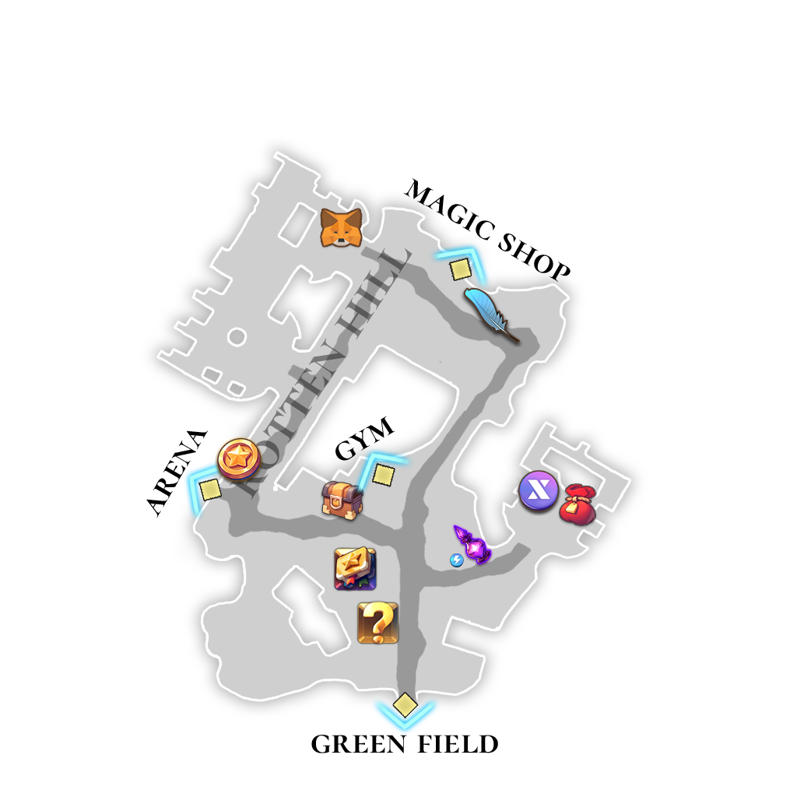

# 😎 NPC - Rotten Hill

<figure><figcaption></figcaption></figure>

<figure><figcaption></figcaption></figure>

## 🧾 _PARASIEL - Trader of Rotten Hill_&#x20;



#### PARASIEL

> _**Trader of Rotten Hill**_

A calm and friendly trader who buys items from adventurers.\
Check the list of items currently being purchased \
and sell what you have to earn Gold for your next journey.



#### 파라시엘

> _**로튼힐의 상인**_

모험가로부터 아이템을 매입하는 차분하고 친절한 상인입니다.\
현재 매입 중인 아이템 목록을 확인한 뒤,\
보유한 아이템을 판매해 다음 모험을 위한 골드를 획득하세요.



#### パラシエル

> _**ロットンヒルの商人**_

冒険者からアイテムを買い取る、穏やかで親しみやすい商人です。\
現在買い取り中のアイテム一覧を確認し、所持しているアイテムを売却して、\
次の冒険に必要なゴールドを手に入れましょう。



<figure><figcaption></figcaption></figure>

## 🏦 _**YEYILEL -** Banker of Rotten Hill_



#### **YEYILEL**

> _**Banker of Rotten Hill**_

YEYILEL is the banker of Rotten Hill,\
offering secure [Gold storage services](../../xto-token/gold-safe-service.md) for adventurers.\
She also provides [**XTO swap services**](../../xto-token/xto-swap-service/) when available.

Manage your assets safely and prepare for your next journey  with the help of YEYILEL.



#### **예이렐**

> _**로튼힐의 뱅커**_

예이렐은 로튼힐의 뱅커로, 모험가를 위한 [골드 보관 서비스](../../xto-token/gold-safe-service.md)를 제공합니다.\
또한 조건을 충족하면 [**XTO 스왑 서비스**](../../xto-token/xto-swap-service/)를 이용할 수 있습니다.

예이렐을 통해 자산을 안전하게 관리하고, 다음 모험을 준비해 보세요.



#### **イェイレル**

> **ロットンヒルのバンカー**

イェイレルはロットンヒルのバンカーとして、冒険者向けの[ゴールド保管サービス](../../xto-token/gold-safe-service.md)を提供しています。\
また、条件を満たすことで [**XTOスワップサービス**](../../xto-token/xto-swap-service/)を利用できます。

資産を安全に管理し、次の冒険に備えましょう。



<figure><figcaption></figcaption></figure>

## 📦 _**MEBAHEL -** Porter of Rotten Hill_



#### **MEBAHEL**

> _**Porter of Rotten Hill**_

MEBAHEL is the porter of Rotten Hill, safely storing items for passing adventurers.\
He provides up to **100 storage slots**, allowing you to manage your inventory with ease.\
Storage services require a fee.

👉 Check [**Warehouse Fee Rates**](warehouse-fee-rates.md) for detailed costs.



#### **메바헬**

> _**로튼힐의 짐꾼**_

메바헬은 로튼힐의 짐꾼으로, 모험가를 위해 아이템 보관 서비스를 제공합니다.\
총 **100개의 보관 슬롯**을 이용할 수 있어, 가방이 가득 찼을 때 유용하게 활용할 수 있습니다.\
보관 서비스에는 비용이 발생합니다.

👉 자세한 비용은 [**Warehouse Fee Rates**](warehouse-fee-rates.md)에서 확인해 주세요.



#### **メバヘル**

> _**ロットンヒルのポーター**_

メバヘルはロットンヒルのポーターとして、冒険者のアイテムを安全に保管します。\
合計 **100個の保管スロット** を利用でき、インベントリ管理に役立ちます。\
保管サービスには料金がかかります。

👉 詳細な料金は [**Warehouse Fee Rates**](warehouse-fee-rates.md) をご確認ください。



<figure><figcaption></figcaption></figure>

## ✉️ _**GILGAMESH -** Collector of Abandoned Letters_



#### **GILGAMESH**

> _**Collector of Abandoned Letters**_

GILGAMESH collects abandoned letters found throughout the field.\
Bring him letters dropped by monsters, and he will purchase them for a fair price.



#### **길가메시**

> _**버려진 편지 수집가**_

길가메시는 필드 곳곳에 흩어진 버려진 편지를 수집하는 인물입니다.\
몬스터가 드롭한 편지를 가져가면, 적절한 가격으로 매입해 줍니다.



#### **ギルガメッシュ**

> _**捨てられた手紙の収集家**_

ギルガメッシュは、
フィールドに散らばった手紙を収集しています。
\
モンスターがドロップした手紙を持って行くと、
適正な価格で買い取ってくれます。



<figure><figcaption></figcaption></figure>

## 🎰 _**HERMAION -** Roulette Dealer_



#### **HERMAION**

> _**Roulette Dealer**_

HERMAION offers a roulette service for adventurers.\
Spend Gold and Arena Coins to spin the wheel and test your luck.



#### **헤르마이온**

> _**룰렛 상인**_

헤르마이온은 모험가를 위한 룰렛 서비스를 제공합니다.\
골드와 아레나 코인을 사용해 룰렛을 돌리고, 행운을 시험해 보세요.



#### **ヘルメイオン**

> _**ルーレット商人**_

ヘルメイオンは、冒険者向けのルーレットサービスを提供しています。\
ゴールドとアリーナコインを使用して ルーレットを回し、運試しをしてみましょう。



<figure><figcaption></figcaption></figure>

## ⚖️ _**NIBERIUS -** PK Contract Broker_



#### **NIBERIUS**

> _**PK Contract Broker**_

NIBERIUS offers contracts for adventurers who wish to quickly reduce their [PK score](../../system/pk/).\
Each contract requires **Gold** and a **Pen of Oblivion**,  \
with the Gold cost varying based on the Hero’s level.

The Pen of Oblivion can be obtained from [**HERMAION’s Roulette**](../../gamemode/1vs1-arena/arena-roulette.md).



#### **니베리우스**

> _**PK 계약 브로커**_

니베리우스는 [PK 점수](../../system/pk/)를 빠르게 낮추고 싶은 모험가를 위해 특별한 계약을 제공합니다.\
계약에는 **골드**와 **망각의 펜**이 필요하며, 필요한 골드의 양은 영웅의 레벨에 따라 달라집니다.

망각의 펜은 [**헤르마이온의 룰렛**](../../gamemode/1vs1-arena/arena-roulette.md)을 통해 획득할 수 있습니다.



#### **ニベリウス**

> _**PK契約の仲介人**_

ニベリウスは、[PKポイント](../../system/pk/)を素早く下げたい冒険者向けに 特別な契約を提供しています。\
契約には **ゴールド** と **忘却のペン** が必要で、\
必要なゴールドの量は英雄のレベルによって異なります。

忘却のペンは、[**ヘルメイオンのルーレット**](../../gamemode/1vs1-arena/arena-roulette.md)から入手できます。



<em>※ This guide was written based on the game status as of January 21, 2026,</em>  <em>and its contents may change with future updates.</em>

