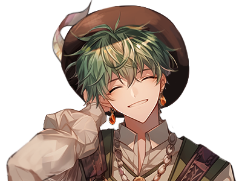
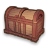
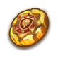

# 😎 NPC - Rotten Hill

### <mark style="color:purple;">**📜Guide List**</mark>

* [✅PARASIEL - 파라시엘 - パラシエル](npc-rotten-hill.md#parasiel-parashieru) : Purchase items
* [✅YEYILEL - 예이렐 - イェイレル](npc-rotten-hill.md#yeyilel-yeireru) : Bank
* [✅MEBAHEL - 메바헬 - メバヘル](npc-rotten-hill.md#mebahel-mebaheru) : Storage
* [✅GILGAMESH - 길가메시 - ギルガメッシュ](npc-rotten-hill.md#gilgamesh-girugamesshu) : Abandoned letter
* [✅Hermaion - 헤르마이온 - ヘルメイオン](npc-rotten-hill.md#hermaion-herumeion): Arena Coin Roulette
* [✅Niberius - 니베리우스 - ニベリウス](npc-rotten-hill.md#niberius-niberiusu) : Remove PK score

<figure><figcaption></figcaption></figure>

## ✅PARASIEL - 파라시엘 - パラシエル

<figure><figcaption></figcaption></figure>

<figure><figcaption></figcaption></figure>

💡**Trader Parasiel buys products from the adventurers.**\
💡상인 파라시엘은 여행자들로부터 물건들을 구입합니다.\
💡商人のパラシエルは旅行者から物を購入します。

## ✅YEYILEL - 예이렐 - イェイレル

<figure><figcaption></figcaption></figure>

<figure><figcaption></figcaption></figure>

💡**You can use the** [**Gold safe service**](../../xto-token/gold-safe-service.md)**,** [**XTO Swap service**](../../xto-token/xto-swap-service/)**, and** [**XTO holding service**](../../xto-token/xto-holding-service/) **at Banker Yeyilel.**\
💡뱅커 예이렐에게 가면 [골드 보관 서비스](../../xto-token/gold-safe-service.md)와 [XTO Swap 서비스](../../xto-token/xto-swap-service/), [XTO 홀딩 서비스](../../xto-token/xto-holding-service/)를 이용할 수 있습니다.\
💡銀行家イェレルに行けば、[ゴールド保管サービス](../../xto-token/gold-safe-service.md)、[XTOスワップサービス](../../xto-token/xto-swap-service/)、[XTOホールディングサービス](../../xto-token/xto-holding-service/)を利用できます。

## ✅MEBAHEL - 메바헬 - メバヘル

<figure><figcaption></figcaption></figure>

<figure><figcaption></figcaption></figure>

The Porter Mebahel stores items for adventurers. There are 100 storage slots in total.

짐꾼 메바헬은 여행자들을 위해 아이템을 보관해 줍니다. 보관 슬롯은 총 100개 입니다.

ポーターのメバヘルは旅行者のためにアイテムを保管してくれます。 保管スロットは全部で100個です。

## ✅GILGAMESH - 길가메시 - ギルガメッシュ

<figure><figcaption></figcaption></figure>

<figure><figcaption></figcaption></figure>

**Gilgamesh collects the abandoned letters. Take the abandoned letters dropped by the monsters to Gilgamesh. He'll buy them for a good price.**

길가메시는 버려진 편지들을 수집합니다. 몬스터가 드랍한 버려진 편지들을 가지고 길가메시에게 가면 좋은 값에 구매합니다.

ギルガメッシュは捨てられた手紙を収集します。 モンスターがドロップした捨てられた手紙を持ってギルガメッシュに行くと良い値段で購入します。

## ✅Hermaion - 헤르마이온 - ヘルメイオン

<figure><figcaption></figcaption></figure>

<figure><figcaption></figcaption></figure>

[**Hermion offers a roulette service.**](../../gamemode/1vs1-arena/arena-roulette.md) **You can spin the roulette wheel for a certain amount of Gold and Arena Coins. Try your luck!**

[헤르마이온은 룰렛 서비스를 제공합니다.](../../gamemode/1vs1-arena/arena-roulette.md) 일정량의 골드와 아레나 코인으로 룰렛을 돌릴 수 있습니다. 당신의 행운을 시험해 보세요!&#x20;

[ヘルマイオンはルーレット サービスを提供します。](../../gamemode/1vs1-arena/arena-roulette.md) 一定量のGoldとアリーナコインでルーレットを回すことができます。 あなたの幸運を試してください！

## ✅Niberius - 니베리우스 - ニベリウス

<figure><figcaption></figcaption></figure>

<figure><figcaption></figcaption></figure>

**Niberius offers contracts for players who want to quickly reduce their** [**PK score**](../../contents/pk/)**. Contracts require Gold and a Pen of Oblivion. The amount of Gold required depends on the Hero's level. The Pen of Oblivion can be obtained from** [**Hermion's Roulette**](../../gamemode/1vs1-arena/arena-roulette.md)**.**

니베리우스는 [PK점수](../../contents/pk/)를 빠르게 감소시키고 싶은 플레이어들과 계약을 맺습니다. 계약에는 골드와 망각의 펜이 필요합니다. 필요한 골드의 양은 영웅의 레벨마다 차등 적용됩니다. 망각의 펜은 [헤르마이온의 룰렛](../../gamemode/1vs1-arena/arena-roulette.md)에서 얻을 수 있습니다.

ニベリウスは[PK](../../contents/pk/)点を早く減少させたいプレイヤーと契約を結びます。 契約にはゴールドと忘却のペンが必要です。 必要なゴールドの量は、ヒーローのレベルごとに差等適用されます。忘却のペンは、[ハーマイオニーのルーレットで手に入れることができます。](../../gamemode/1vs1-arena/arena-roulette.md)
