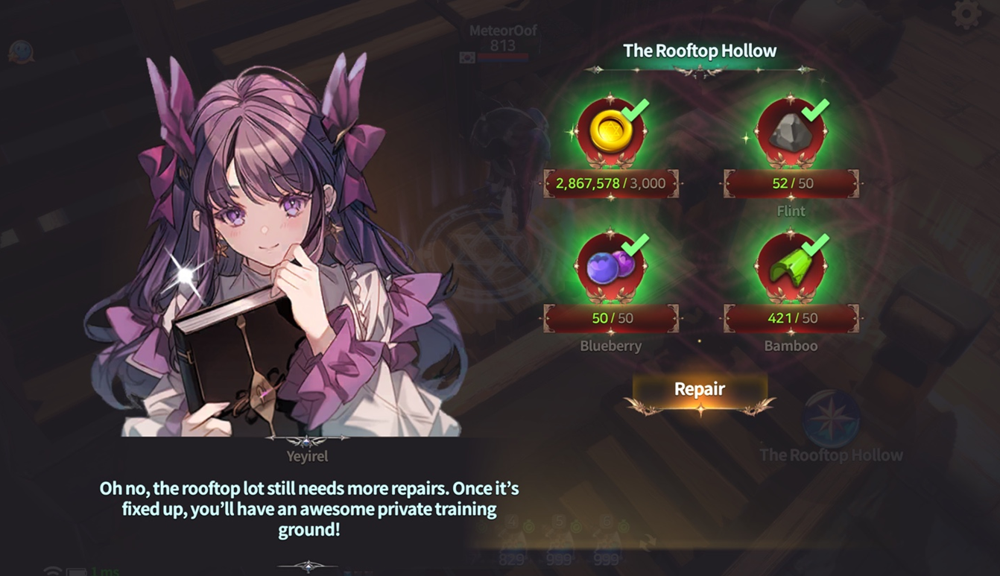

# 🏹 The Rooftop Hollow



💡 **Hero and weapon testing has moved to the Rooftop Hollow!**\
Before heading into battle, this is your go-to space to experiment, strategize, and fine-tune your ideal playstyle.

***

#### 📍How to Enter the Rooftop Hollow

**① Go to** [**My Home**](../../../contents/my-home/#eng)

The Rooftop Hollow is located inside **My Home**.

<figure><figcaption></figcaption></figure>

***

**② Tap the Rooftop Hollow Icon**

Inside My Home, tap on the **Rooftop Hollow icon** to access it.

<figure><figcaption></figcaption></figure>

***

**③ Check Required Materials for Unlock**ing

The Rooftop Hollow is **locked at first**,\
but don’t worry — the materials required are **easy to collect!**

<figure><figcaption></figcaption></figure>

***

**④ Unlock Complete – Access Granted!**

Once unlocked, you can enter the training space freely.

<figure><figcaption></figcaption></figure>

***

#### 🎯 What You Can Do in the Rooftop Hollow

**🔹 Hero Testing**

* Try out **various heroes and their skills**—no ownership required.
* Practice skill combos, animations, and find what suits your strategy.

<figure><figcaption></figcaption></figure>

**🔹 Weapon Testing**

* Use different weapons freely!
* **Weapon skills are randomly assigned**, so feel free to experiment.

<figure><figcaption></figcaption></figure>

**🔹 Training Slimes**

* Your sparring partners are none other than **training slimes**!
* Perfect for stress-free testing and refining your play.

***

#### 🛡️ Yeyilel’s Tip

Victory comes from preparation.\
**Find your best build**, test thoroughly, and head into battle with confidence! 🌟



💡 **영웅과 무기 테스트는 이제 ‘옥상공터’에서!**\
전투를 시작하기 전, 이곳에서 충분히 실험하고 조합을 연구해보세요.\
자신에게 맞는 스킬과 무기를 직접 체험할 수 있는 **완벽한 연습 공간**입니다.

***

#### 📍 옥상공터 진입 방법

**①** [**마이홈**](../../../contents/my-home/#undefined-1)**으로 이동**

옥상공터는 **마이홈** 안에 있어요.

<figure><figcaption></figcaption></figure>

***

**② 옥상공터 아이콘 클릭**

마이홈 내부에서 **옥상공터 아이콘**을 눌러주세요.

<figure><figcaption></figcaption></figure>

***

**③ 해금에 필요한 재료 확인**

최초 진입 시 옥상공터는 잠겨 있어요.\
🔓 하지만, **해금에 필요한 재료는 쉽게 구할 수 있으니 걱정 마세요!**

<figure><figcaption></figcaption></figure>

***

**④ 해금 완료 → 잠금 해제!**

재료를 제출하면 옥상공터가 개방됩니다.\
이제 자유롭게 테스트를 시작할 수 있어요.

<figure><figcaption></figcaption></figure>

***

#### 🎯 옥상공터에서 할 수 있는 것

**🔹 영웅 테스트**

* 보유 여부와 관계없이 다양한 **영웅의 스킬을 체험**할 수 있어요.
* 실전 투입 전, **스킬 구성과 반응을 직접 확인**해보세요!

<figure><figcaption></figcaption></figure>

**🔹 무기 테스트**

* 여러 무기를 자유롭게 사용 가능!
* 무기 스킬은 **랜덤으로 설정**되어 실험됩니다.
* 다양한 무기 스킬을 체험하며 스타일을 점검해보세요.

<figure><figcaption></figcaption></figure>

**🔹 연습용 슬라임**&#x20;

* 테스트 대상은 바로 귀여운(?) **연습용 슬라임**!
* 부담 없이 실험하고 **전투 감각을 익히기**에 제격이죠.

***

#### 🛡️ 예이렐의 한 마디

실전은 단 한 번의 판단이 승패를 가르죠.\
옥상공터에서 충분히 실험하고,\
**나만의 최강 조합**을 실전에 데려가 보세요! 🌟



💡 ヒーローと武器のテスト機能は、**屋上の空地**に移動しました！\
戦闘前にこの場所でじっくり実験し、自分に合ったスタイルを見つけましょう。

***

#### 📍 屋上の空地への入り方

**①** [**マイホーム**](../../../contents/my-home/#ri-ben-yu)**へ移動**

屋上の空地は**マイホーム**内にあります。

<figure><figcaption></figcaption></figure>

***

**② 屋上の空地アイコンをタップ**

マイホーム内で**屋上の空地アイコン**をタップしてください。

<figure><figcaption></figcaption></figure>

***

**③ 必要な素材を確認**

初回は**ロック状態**ですが、\
🔓 必要な素材は**簡単に集まるものばかり**なので安心してください！

<figure><figcaption></figcaption></figure>

***

**④ 解放完了 → 入場可能！**

素材を使えばロックが解除され、自由に出入りできます。

<figure><figcaption></figcaption></figure>

***

#### 🎯 屋上の空地でできること

**🔹 ヒーローテスト**

* 所持していないヒーローでも、**自由にスキルを試すことができます。**
* 実戦前にスキルの動作や組み合わせをチェックしましょう！

<figure><figcaption></figcaption></figure>

**🔹 武器テスト**

* さまざまな武器を自由に使用できます。
* 武器スキルは**ランダムで付与**されるため、試行錯誤してみてください。

<figure><figcaption></figcaption></figure>

**🔹 練習用スライム**

* 相手はかわいらしい（？）**練習用スライム**！
* 気軽にスキルやコンボを試すのにぴったりです。

***

#### 🛡️ イェイレルからの一言

勝利を決めるのは、準備の差です。\
ここでしっかり試して、**あなたの最強ビルド**を見つけてくださいね！🌟



