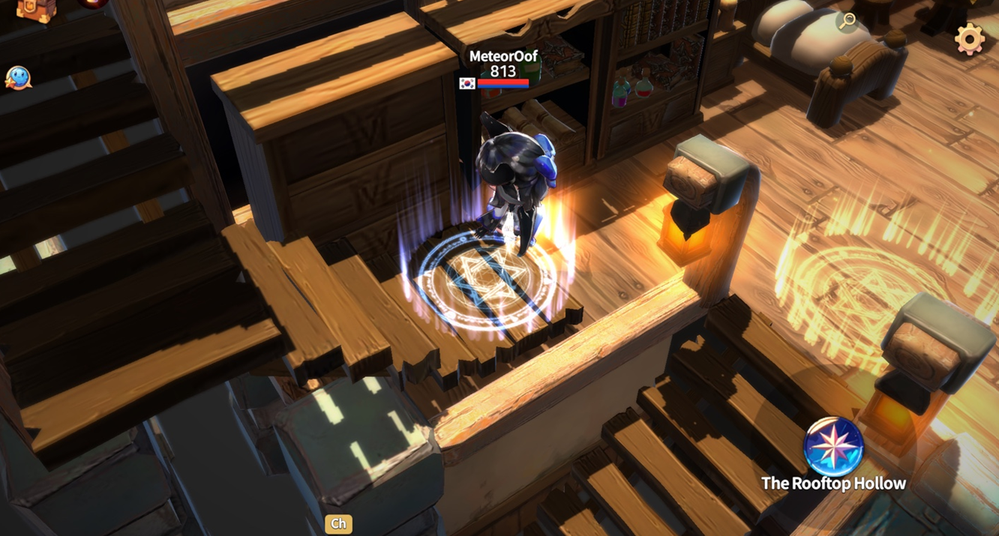
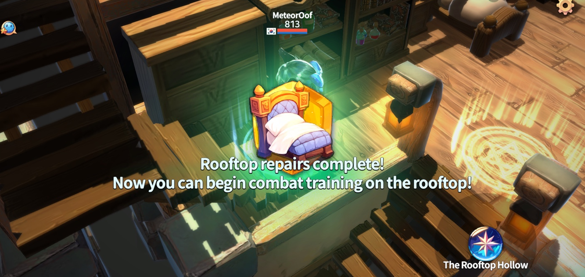
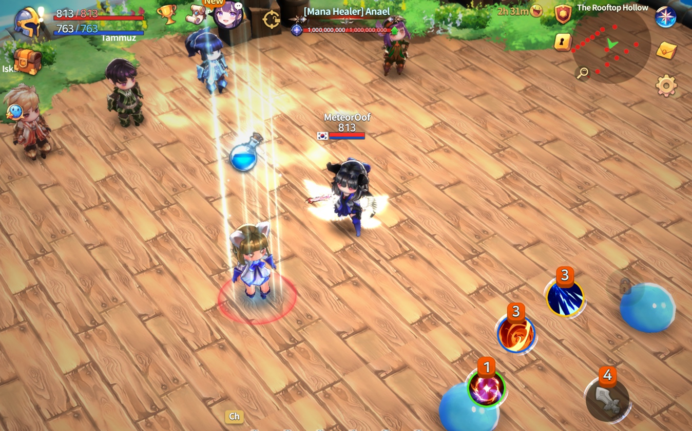
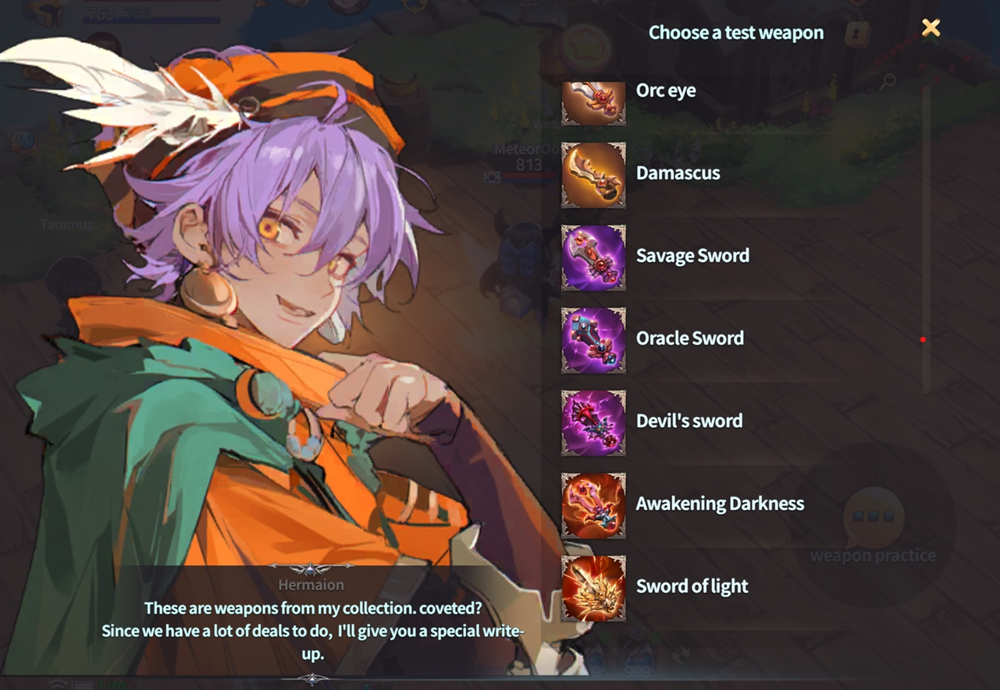

# 🍺 The Rusty Tankard



### 🍻 The Rusty Tankard

The Rusty Tankard is a small tavern located in Rotten Hill.\
At first glance, it may seem like a simple place to rest,\
but it actually serves as an important hub for combat practice\
and access to various game contents.

Here, you can spar with friends, move to multiple content waiting rooms,\
and soak in the world’s atmosphere through NPC conversations.

<figure><figcaption></figcaption></figure>

***

### ◾ Location

* Rotten Hill, right next to the porter NPC **Mebahel**

<figure><figcaption></figcaption></figure>

***

### ◾ Battle Zone

Inside the Rusty Tankard, you’ll find a small combat training area.

* Practice mock battles with friends
* Test different skill combinations
* Check weapon performance

<figure><figcaption></figcaption></figure>

***

### ◾ Portals

The Rusty Tankard contains portals that lead to various content areas.

***

#### 1️⃣ Frost War Waiting Room Portal

* Small-scale siege-style PvP content
* Strategy and teamwork are key
* Short but intense battles

<figure><figcaption></figcaption></figure>

***

#### 2️⃣ Free Arena Waiting Room Portal

* A casual space to practice combat with friends
* Form teams or fight freely
* PvP content with no pressure

<figure><figcaption></figcaption></figure>

***

#### 3️⃣ Rabbit Rush Waiting Room Portal

* Betting-based PvP content
* Transform into a Level 10 rabbit to participate
* If the rabbit matching your ticket color survives to the end, you win

<figure><figcaption></figcaption></figure>

***

#### 4️⃣ Clientellas Lobby Portal

The central hub for club activities.

* Create or join a club
* Manage Patrons & Clients
* Enter club rooms
* Access various community features

<figure><figcaption></figcaption></figure>

***

### ◾ Return to Rotten Hill

To leave the Rusty Tankard, you can:

* Use the portal back to Rotten Hill

<figure><figcaption></figcaption></figure>

* Exit instantly via the map at the top-right of the screen

<figure><figcaption></figcaption></figure>

***

### ✨&#x20;

> **A place where warriors naturally gather before battle.**\
> **Amid the quiet noise, take a moment to picture your next journey.**



### 🍻 녹슨 술잔 (The Rusty Tankard)

녹슨 술잔은 로튼힐 마을에 있는 작은 술집입니다.\
하지만 이곳은 단순한 휴식 공간이 아니라, 전투 연습과 다양한 콘텐츠로 이어지는 중요한 거점 공간입니다.

친구와 모의 전투를 즐기거나, 여러 콘텐츠 대기실로 이동할 수 있으며,\
NPC들의 대화를 통해 세계관의 분위기도 느낄 수 있습니다.

<figure><figcaption></figcaption></figure>

***

### ◾ 녹슨 술잔 입장 위치

* 위치: 로튼힐  NPC 짐꾼 메바헬 바로 옆

<figure><figcaption></figcaption></figure>

***

### ◾ Battle Zone

녹슨 술잔 내부에는 소규모 전투 연습 공간이 마련되어 있습니다.

* 친구와 모의 전투 가능
* 스킬 조합 테스트
* 무기 성능 확인

<figure><figcaption></figcaption></figure>

***

### ◾ 포털 안내

녹슨 술잔에는 다양한 콘텐츠로 이어지는 포털이 있습니다.

***

#### 1️⃣ 프로스트워 대기실 포털

* 소규모 미니 공성전 콘텐츠
* 전략과 협동이 중요한 PvP
* 짧지만 긴장감 있는 전투를 경험할 수 있습니다

<figure><figcaption></figcaption></figure>

***

#### 2️⃣ 자유 아레나 대기실 포털

* 친구들과 자유로운 전투 연습 공간
* 팀을 나누어 연습하거나 가볍게 대결 가능
* 부담 없이 즐길 수 있는 PvP 콘텐츠입니다

<figure><figcaption></figcaption></figure>

***

#### 3️⃣ 토끼러시 대기실 포털

* 배팅형 PvP 콘텐츠
* 레벨 10 토끼로 변신해 참가
* 선택한 티켓 색상의 토끼가 끝까지 살아남으면 승리합니다

<figure><figcaption></figcaption></figure>

***

#### 4️⃣ 클리엔텔라스 로비 포털

클럽 활동의 중심 공간입니다.

* 클럽 창설 및 가입
* 페이트론 & 클라이언트 관리
* 클럽 룸 입장
* 다양한 커뮤니티 기능 이용 가능

<figure><figcaption></figcaption></figure>

***

### ◾ 로튼힐로 돌아가기

녹슨 술잔을 나가려면 아래 방법을 이용할 수 있습니다.

* 로튼힐로 이어지는 포털 이용

<figure><figcaption></figcaption></figure>

* 화면 우측 상단 맵을 통해 즉시 퇴장

<figure><figcaption></figcaption></figure>

***

### ✨&#x20;

> **전투를 준비하는 이들이 자연스럽게 모이는 곳.**\
> **잔잔한 소음 속에서 다음 여정을 마음속으로 그려보세요.**



### 🍻 錆びた酒杯（The Rusty Tankard）

錆びた酒杯は、ロッテンヒルの村にある小さな酒場です。\
しかしここは、ただ休むだけの場所ではありません。\
戦闘の練習や、さまざまなコンテンツへとつながる 重要な拠点となる空間です。

仲間と模擬戦闘を楽しんだり、複数のコンテンツ待機室へ移動したり、\
NPCたちの会話を通して世界観の雰囲気を感じることもできます。

<figure><figcaption></figcaption></figure>

***

### ◾ 錆びた酒杯 入場位置

* 場所：ロッテンヒル、ポーターNPC「メバヘル」のすぐ隣

<figure><figcaption></figcaption></figure>

***

### ◾ バトルゾーン

錆びた酒杯の中には、小規模な戦闘練習エリアが用意されています。

* 仲間との模擬戦闘が可能
* スキルの組み合わせをテスト
* 武器性能の確認

<figure><figcaption></figcaption></figure>

***

### ◾ ポータル案内

錆びた酒杯には、さまざまなコンテンツへとつながるポータルがあります。

***

#### 1️⃣ フロストウォー待機室ポータル

* 小規模なミニ攻城戦コンテンツ
* 戦略と協力が重要なPvP
* 短時間ながら緊張感のある戦闘を楽しめます

<figure><figcaption></figcaption></figure>

***

#### 2️⃣ フリーアリーナ待機室ポータル

* 仲間と自由に戦闘練習ができる空間
* チームを組んで練習したり、気軽に対戦可能
* 気負わず楽しめるPvPコンテンツです

<figure><figcaption></figcaption></figure>

***

#### 3️⃣ ラビットラッシュ待機室ポータル

* ベッティング型PvPコンテンツ
* レベル10のウサギに変身して参加
* 選んだチケットの色と同じウサギが 最後まで生き残れば勝利となります

<figure><figcaption></figcaption></figure>

***

#### 4️⃣ クリエンテラス・ロビーポータル

クラブ活動の中心となる空間です。

* クラブの設立・加入
* パトロン＆クライアント管理
* クラブルームへの入場
* 各種コミュニティ機能の利用

<figure><figcaption></figcaption></figure>

***

### ◾ ロッテンヒルへ戻る

錆びた酒杯から出る場合は、以下の方法を利用できます。

* ロッテンヒルへ戻るポータルを使用

<figure><figcaption></figcaption></figure>

* 画面右上のマップから即時退出

<figure><figcaption></figcaption></figure>

***

### ✨&#x20;

> **戦いに備える者たちが、自然と集まる場所。**\
> **静かなざわめきの中で、次の旅路を思い描いてみてください。**



<em>※ This guide was written based on the game status as of January 22, 2026,</em>  <em>and its contents may change with future updates.</em>

