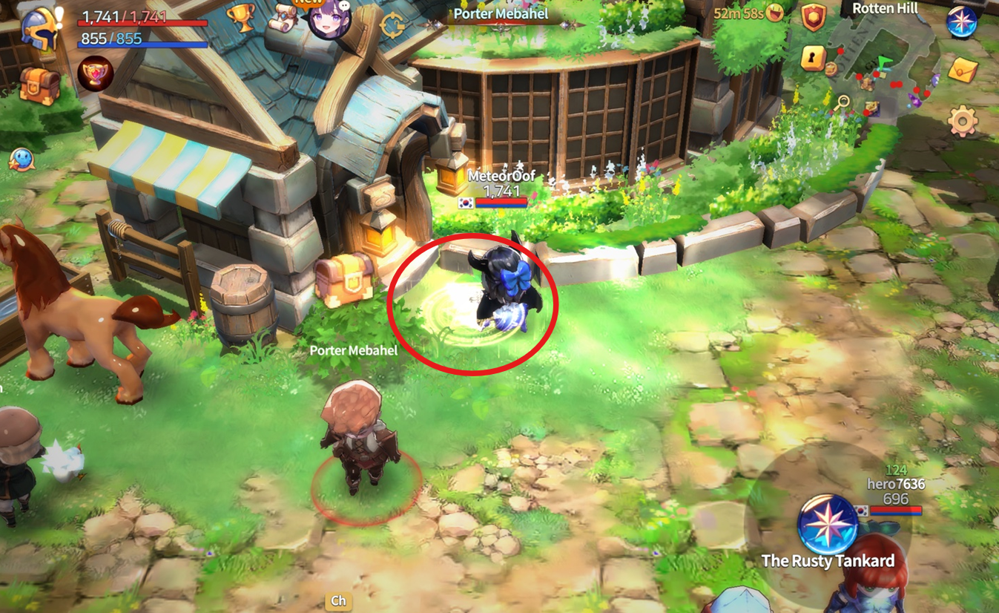
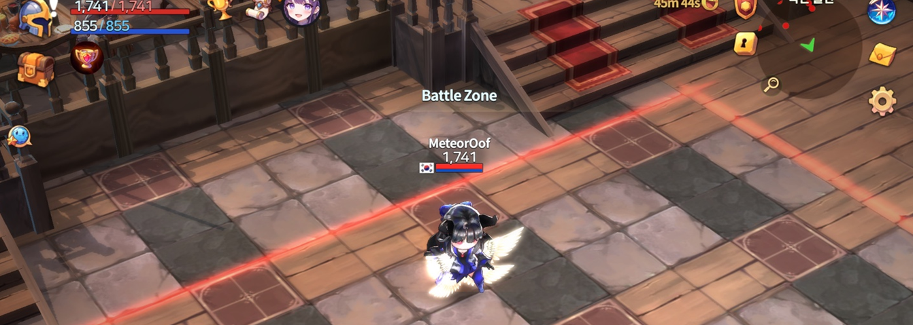
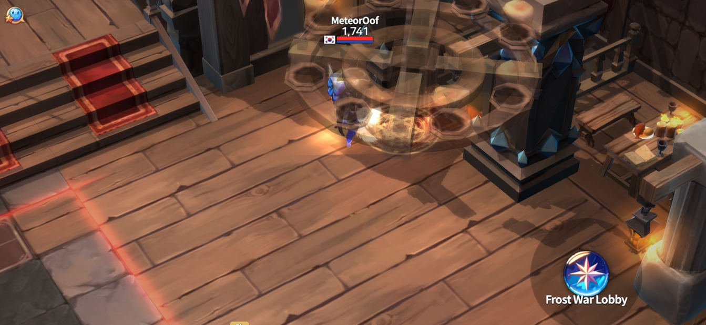
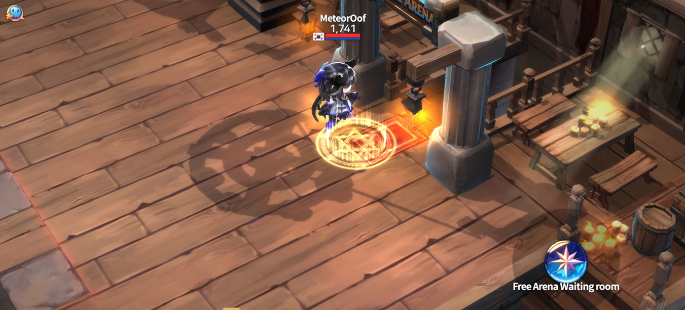
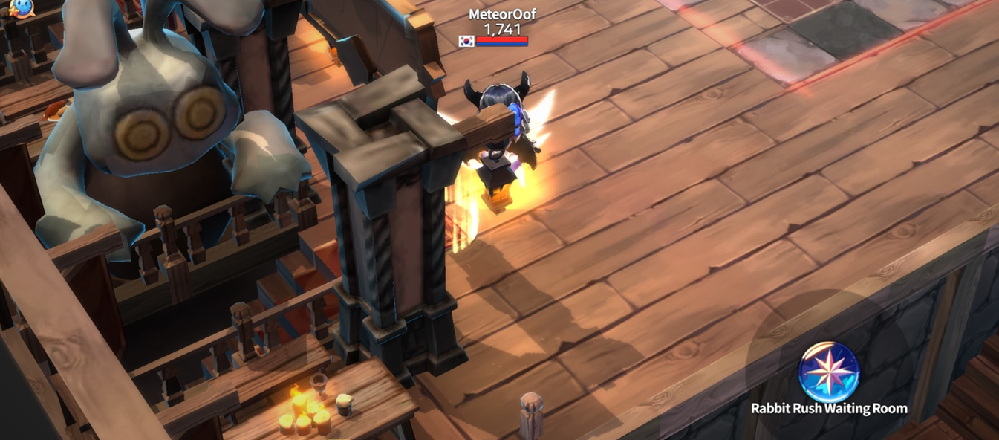
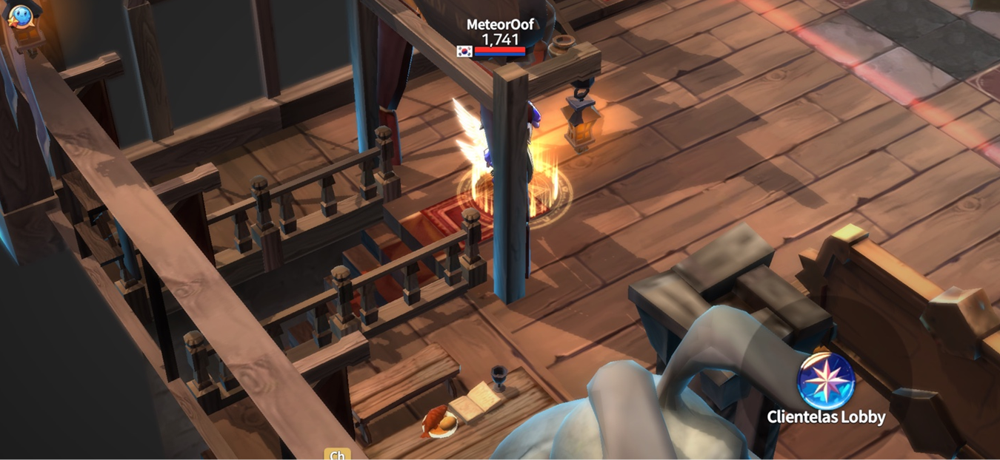
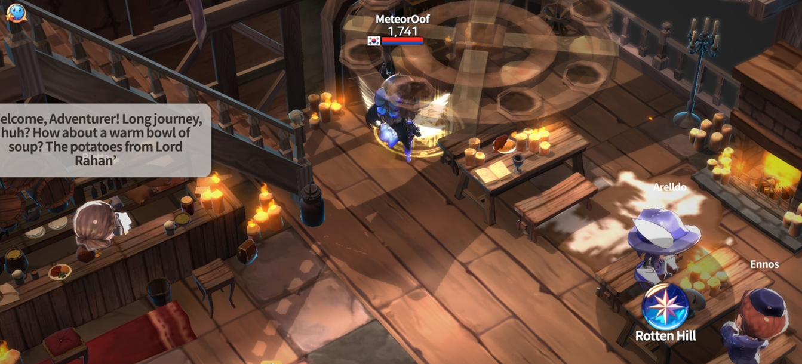

# 🍺 The Rusty Tankard



### 🍻 Welcome to **The Rusty Tankard**

Tucked away in **Rotten Hill**,\
**The Rusty Tankard** may look like an ordinary pub…\
but inside, you'll find a **friendly battle zone**,\
**portals to major game content**, and even some chatty NPCs with stories to tell.

***

#### 🗺️ How to Get There

The entrance is **right next to Porter Mebahel** at the Rotten Hill village entrance.\
It’s easy to miss, so keep an eye out for the hidden path beside the stone walkway.

<figure><figcaption></figcaption></figure>

***

#### ⚔️Battle Zone – Friendly PvP

Inside the pub, you’ll find a **small PvP zone** where you can\
spar with friends, test skill builds, or simply have fun without pressure.

<figure><figcaption></figcaption></figure>

***

#### 🌀 Portals – Your Gateway to Game Modes

**1. Frost War Waiting Room**

_Mini-scale siege battle!_\
Team-based PvP with tight spaces and intense strategy.

<figure><figcaption></figcaption></figure>

**2. Free Arena Waiting Room**

_Casual test matches with friends._\
Try out combos, roles, or just have a friendly brawl.

<figure><figcaption></figcaption></figure>

**3. Rabbit Rush Waiting Room**

_Betting-style PvP with a twist!_\
You’ll **transform into a level 10 rabbit**,\
and hope the rabbit matching **your ticket color survives** to the end.\
Fast, chaotic, and packed with adrenaline!

<figure><figcaption></figcaption></figure>

**4. Clientellas Lobby**

_Club activity hub._

* Create or join a club
* Manage Patrons & Clients
* Enter club rooms\
  Perfect for community-driven gameplay.

<figure><figcaption></figcaption></figure>

***

#### 🌀 Return to Rotten Hill

You can leave the pub anytime via the **portal to Rotten Hill**,\
or just use the **mini-map in the upper right corner** for quick exit.

<figure><figcaption></figcaption></figure>

***

#### 💬 A Word from Yeyilel

The Rusty Tankard isn’t just a pub—it’s a crossroads of stories and strategy.\
And if you stop and listen…\
some of those NPCs might just whisper secrets of the world to you. 🍂



### 🍻 The Rusty Tankard – 로튼힐의 소문난 술집

로튼힐에 있는 작은 술집, 녹슨 술잔은 단순한 휴식 공간이 아니에요.\
여기선 친구와 함께 모의 전투를 하거나, 다양한 콘텐츠 대기실로 이어지는 **포털들을 탐험**할 수 있어요. 떠들썩한 NPC들의 수다는 덤이죠!

***

#### 🗺️ 입장 위치 안내

**로튼힐 마을 입구의 짐꾼 메바헬 바로 옆**에 술집 입구가 있어요.\
돌길 옆에 조용히 숨겨져 있으니, 처음 방문하는 위자드님이라면 잘 살펴보세요.

<figure><figcaption></figcaption></figure>

***

#### ⚔️ Battle Zone – 친구와 모의 전투

술집 내부에는 **소규모 전투 구역**이 마련돼 있어요.\
친구와 1:1로 실험해보거나,\
스킬과 무기 조합을 테스트할 수 있는 공간이랍니다.

<figure><figcaption></figcaption></figure>

***

#### 🌀 포털 안내 – 콘텐츠 대기실로 이어지는 관문들

**1. 프로스트워 대기실 포털**

_**작지만 치열한 미니 공성전!**_\
전략과 협동이 중요한 소규모 PvP 콘텐츠입니다.

<figure><figcaption></figcaption></figure>

**2. 자유 아레나 대기실 포털**

_친구들과 함께하는 모의 전투 공간._\
팀을 짜서 자유롭게 연습하거나, 재미로 붙어볼 수도 있어요.

<figure><figcaption></figcaption></figure>

**3. 토끼러시 대기실 포털**

_**배팅형 PvP 콘텐츠!**_\
레벨 10의 **토끼로 변신**해 경기에 참가하게 되며,\
**내가 선택한 티켓 색상의 토끼가 끝까지 살아남아야** 승리할 수 있어요.\
운과 전략이 동시에 요구되는 짜릿한 생존 배틀!

<figure><figcaption></figcaption></figure>

**4. 클리엔텔라스 로비 포털**

**클럽 활동의 중심지!**

* 클럽 창설 및 가입
* 페이트론 & 클라이언트 관리
* 클럽 룸 입장\
  다양한 커뮤니티 기능이 이 로비에 모여 있어요.

<figure><figcaption></figcaption></figure>

***

#### 🌀 로튼힐로 돌아가기

술집을 나가고 싶다면,\
**로튼힐 마을로 돌아가는 포털**을 이용하거나\
우측 상단**의 미니맵**을 통해 즉시 퇴장할 수 있어요.

<figure><figcaption></figcaption></figure>

***

#### 💬 예이렐의 한 마디

전투 전에 한 번쯤 들러볼 만한 이 공간,\
**The Rusty Tankard**는 단순한 술집이 아니에요.\
NPC들의 대화 속에는 **세계관의 힌트**나 **은근한 떡밥**이 숨어 있을지도?

잠시 멈춰 서서 들어보는 건 어떨까요?



### 🍻 ようこそ、**The Rusty Tankard**へ

**ロットンヒルの奥にある小さな酒場、**\
**The Rusty Tankardはただの休憩所ではありません。**\
**ここでは友達と模擬戦**を楽しんだり、\
さまざまなコンテンツの**待機ポータルにアクセス**したりできます。\
そして、おしゃべり好きなNPCたちの話に耳を傾けるのも一興です。

***

#### 🗺️ 行き方

酒場の入口は、ロットンヒル入口にいるポーター・メバヘルのすぐ隣にあります。 \
石道のわきにある、見落としやすい小道を探してみてください。

<figure><figcaption></figcaption></figure>

***

#### ⚔️ バトルゾーン – 友達との模擬戦

店内には**小さなバトルエリア**があり、\
友達とPvPの練習をしたり、スキル構成を試したりできます。\
気軽に実験できる、ちょうどいい戦場です！

<figure><figcaption></figcaption></figure>

***

#### 🌀 ポータル案内 – 各コンテンツへの入口

**1. フロストウォー待機室**

_小規模ながら激戦必至のミニ攻城戦！_\
チーム戦で戦略と連携が試されます。

<figure><figcaption></figcaption></figure>

**2. フリーアリーナ待機室**

_友達と自由に戦える練習アリーナ。_\
コンボの確認やロールの試用にもぴったりです。

<figure><figcaption></figcaption></figure>

**3. ラビットラッシュ待機室**

_変身＆ベット型PvPコンテンツ！_\
レベル10のウサギに**変身して対戦に参加**し、\
**自分の購入したチケットの色のウサギ**が最後まで生き残れば勝利！\
スピーディーでスリル満点の戦いが楽しめます。

<figure><figcaption></figcaption></figure>

**4. クライエンテラス・ロビー**

_クラブ活動の中心拠点！_

* クラブの作成・参加
* パトロン＆クライアントの管理
* クラブルームへの入場\
  交流・戦略・管理がここに集まります。

<figure><figcaption></figcaption></figure>

***

#### 🌀 ロットンヒルへの帰還

酒場を出たいときは、\
**ロットンヒルに戻るポータル**を使うか、\
画面右上の**ミニマップから即時退出**も可能です。

<figure><figcaption></figcaption></figure>

***

#### 💬 イェイレルのひとこと

この酒場はただの休憩所ではありません。\
物語と戦略が交差する場所。\
NPCのさりげない一言が、\
世界の真実に近づく鍵になるかもしれませんよ🍂


