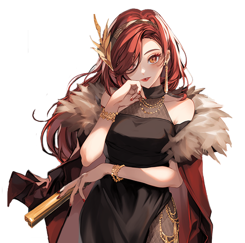

# 😎 NPC - Club

> ## Sitael - 시타엘 - シタエル

<figure><figcaption></figcaption></figure>


[club](../../../../clientelas-club/club/)




#### 🎭 **Sitael & The Club System**

🔹 **Sitael is the Club Master**, located in **Clientela's**.\
🔹 **Want to create or join a club? Visit Sitael!**

💡 **Looking for allies and a strong community? Start your club today!**



#### 🎭 **시타엘 & 클럽 시스템**

🔹 **시타엘은 클럽 마스터**로, **Clientela's**에서 만날 수 있습니다.\
🔹 **클럽을 창설하거나 가입하고 싶다면 시타엘을 찾아가세요!**

💡 **강한 유대와 함께할 동료를 찾고 있다면, 클럽을 시작해보세요!**



#### 🎭 **シタエル＆クラブシステム**

🔹 **シタエルはクラブマスター**で、**Clientela's**にいます。\
🔹 **クラブを創設・加入したいなら、シタエルを訪ねましょう！**

💡 **仲間と共に強くなりたいなら、クラブを始めてみよう！**



