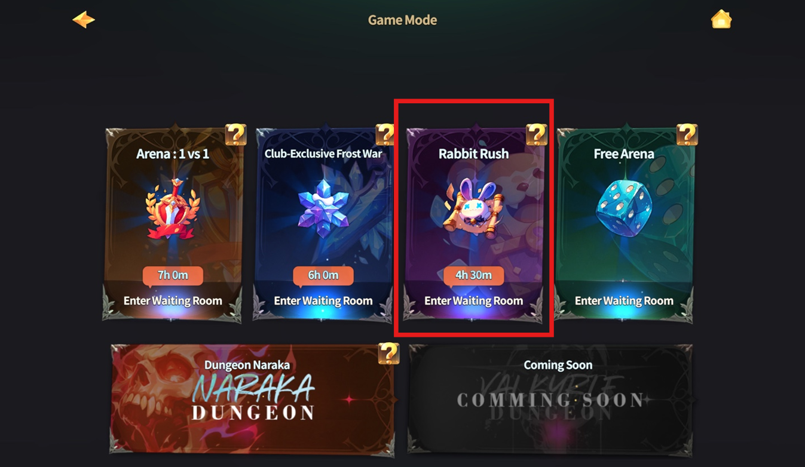

# 🐰 Rabbit Rush Waiting Room



💡**There are two ways to enter the Rabbit Rush waiting room!**

### 🐇 How to Enter the Waiting Room

1️⃣ **Via the Rusty Tankard (Southwest Side)**

* Move to the **southwest area** inside _The Rusty Tankard_
* Enter through the **Rabbit Rush portal**

<figure><figcaption></figcaption></figure>

2️⃣ **Via Main HUD**

* Click the **icon to the left of the mini-map**

<figure><figcaption></figcaption></figure>

* Then click the **Rabbit Rush Waiting Room** button at the top

<figure><figcaption></figcaption></figure>

Once you follow these steps, you will enter the **Rabbit Rush Waiting Room**.

\
🔗 **For more details about Rabbit Rush, check the link below!**


[rabbit-rush](../../../gamemode/rabbit-rush/)




💡 **Rabbit Rush 대기실에 입장하는 방법은 두 가지입니다!**

### 🐇 **대기실 입장 방법**

1️⃣ **녹슨 술잔(The Rusty Tankard) 남서쪽에서 입장**

* 녹슨 술잔 내부에서 **남서쪽 지역**으로 이동
* **Rabbit Rush 대기실 포털**을 통해 진입

<figure><figcaption></figcaption></figure>

2️⃣ **메인 HUD에서 입장**

* 화면 **미니맵 좌측 아이콘 클릭**

<figure><figcaption></figcaption></figure>

* 상단 메뉴에서 **Rabbit Rush 대기실 입장 버튼** 클릭

<figure><figcaption></figcaption></figure>

이렇게 하면 **Rabbit Rush 대기실로 입장**할 수 있습니다.

\
🔗 **Rabbit Rush에 대한 자세한 내용은 아래 링크를 참고하세요!**


[rabbit-rush](../../../gamemode/rabbit-rush/)




💡 Rabbit Rushの待機室へ入る方法は2つあります！

### 🐇 入場方法

1️⃣ **The Rusty Tankard（酒場）の南西側から入場**

* _The Rusty Tankar&#x64;_&#x5185;の**南西エリア**へ移動
* **Rabbit Rush待機室ポータル**から入場

<figure><figcaption></figcaption></figure>

2️⃣ メインHUDから入場

* 画面右上の**ミニマップ左側のアイコン**をクリック

<figure><figcaption></figcaption></figure>

* 上部メニューの「Rabbit Rush 待機室」ボタンを選択**中央の「ラビットラッシュ待機室入室ボタン」**&#x3092;押してください。

<figure><figcaption></figcaption></figure>

これで**ラビットラッシュ待機室へ入室**できます。

\
🔗 **ラビットラッシュの詳細については、以下のリンクをご参照ください！**


[rabbit-rush](../../../gamemode/rabbit-rush/)




