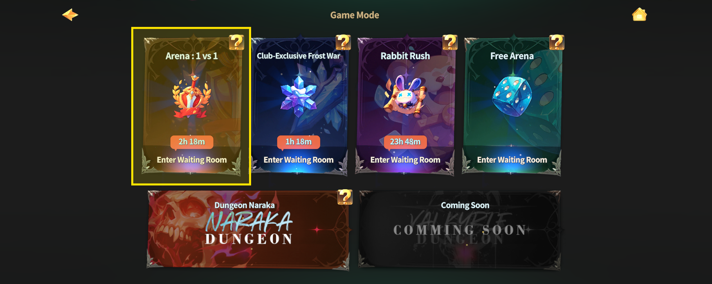

# 🏆 1vs1 Arena

<figure><figcaption></figcaption></figure>



### 🏆 1vs1 Arena

The 1vs1 Arena is **EXTOCIUM’s core PvP content**.\
Face off against another adventurer in a **true one-on-one battle**,\
where victory is decided by **skill and strategy alone**.

No luck-based elements.\
No additional buffs.\
Every match is fought under **equal conditions**.

Test your combat skills and challenge yourself to become a true champion.

***

### ◾ Arena Format

* **Weekly Ranking System**\
  A new ranking competition begins every week.
* **No Energy Cost**\
  Enter the arena freely without consuming energy.

***

### ◾ How to Enter the Arena

Follow the steps below to enter the 1vs1 Arena.

1️⃣ Tap the **Arena Emblem icon** on the left side of the minimap.

<figure><figcaption></figcaption></figure>

2️⃣ Tap **“Enter Waiting Room”** at the top-left of the screen.

<figure><figcaption></figcaption></figure>

***

✨

> **Victory is earned through skill, not numbers.**\
> **Step into the 1vs1 Arena and prove your strength.**



### 🏆 1vs1 아레나

1vs1 아레나는 EXTOCIUM의 대표적인 **PvP 콘텐츠**입니다.\
다른 모험가와 **1대1로 직접 대결**하며, 오직 **실력과 전략**으로 승부가 결정됩니다.

운에 의한 요소나 추가 버프는 적용되지 않으며, 모든 전투는 **동일한 조건**에서 진행됩니다.\
자신의 전투 실력을 시험하고, 진정한 강자에 도전해 보세요.

***

### ◾ 아레나 운영 방식

* **주 단위 랭킹제**\
  매주 새로운 랭킹 경쟁이 진행됩니다.
* **에너지 소모 없음**\
  부담 없이 참여할 수 있습니다.

***

### ◾ 아레나 입장 방법

아래 순서에 따라 1vs1 아레나에 입장할 수 있습니다.

1️⃣ 미니맵 좌측에 있는 **‘아레나 인장’ 아이콘**을 터치합니다.

<figure><figcaption></figcaption></figure>

2️⃣ 좌측 상단의 **‘아레나 대기실 입장’** 버튼을 터치합니다.

<figure><figcaption></figcaption></figure>

***

✨

> **승부는 숫자가 아닌 실력으로 결정됩니다.**\
> **지금, 1vs1 아레나에서 당신의 강함을 증명해 보세요.**



### 🏆 1vs1アリーナ

1vs1アリーナは、**EXTOCIUM**を代表する**PvPコンテンツ**です。\
ほかの冒険者と **1対1で直接対決**し、勝敗は **実力と戦略のみ** で決まります。

運に左右される要素や、追加バフは一切適用されません。\
すべてのバトルは **同じ条件** で行われます。

自分の戦闘スキルを試し、真の強者に挑戦しましょう。

***

### ◾ アリーナ運営方式

* **週単位ランキング制**\
  毎週、新たなランキング競争が始まります。
* **エネルギー消費なし**\
  いつでも気軽に参加できます。

***

### ◾ アリーナ入場方法

以下の手順で、1vs1アリーナに入場できます。

1️⃣ ミニマップ左側にあ&#x308B;**「アリーナの印章」アイコン** をタッチします。

<figure><figcaption></figcaption></figure>

2️⃣ 左上の **「アリーナ待機室へ入場」** ボタンをタッチします。

<figure><figcaption></figcaption></figure>

***

✨

> **勝負は数字ではなく、実力で決まる。**\
> **今こそ、1vs1アリーナで あなたの強さを証明しましょう。**




[game-rules.md](game-rules.md)



[league-and-trophy.md](league-and-trophy.md)



[ranking-rewards.md](ranking-rewards.md)



[arena-roulette.md](arena-roulette.md)


<em>※ This guide was written based on the game status as of January 13, 2026,</em>  <em>and its contents may change with future updates.</em>

