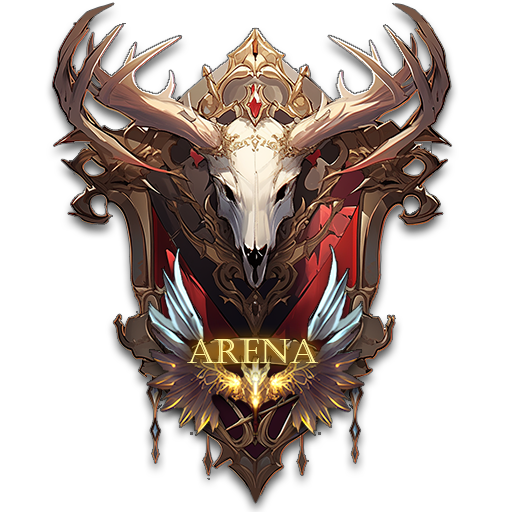

# 🏆 1vs1 Arena

<figure><figcaption></figcaption></figure>

⚡Energy Requirement: ❌



💡The 1vs1 arena is one of the most important PvP contents in EXTOCIUM.&#x20;

This content is a match to select the strongest hero in the server, without any separate random mechanisms or buffs.

&#x20;The arena matches are held on a weekly cycle, and special rewards are given according to the weekly ranking.



💡1vs1 아레나는 EXTOCIUM의 가장 중요한 PvP 컨텐츠 중 하나입니다.

\
이 컨텐츠는 별도의 랜덤한 장치나 버프 없이,  서버 내에서 가장 순수하게 강한 영웅을 뽑는 경기입니다.&#x20;

아레나 경기는 1주일을 한번의 주기로 운영하며, 주간 랭킹에 따라 특별한 보상이 주어집니다.

<figure><figcaption></figcaption></figure>

<figure><figcaption></figcaption></figure>



💡1vs1アリーナはEXTOCIUMで最も重要なPvPコンテンツの1つです。

このコンテンツは別のランダム装置やバフなしで、サーバー内で最も純粋に強いヒーローを選ぶ競技です。

アリーナ競技は1週間を1つの周期として運営され、週間ランキングに応じて特別な報酬が与えられます。




[game-rules.md](game-rules.md)



[league-and-trophy.md](league-and-trophy.md)



[ranking-rewards.md](ranking-rewards.md)



[arena-roulette.md](arena-roulette.md)

