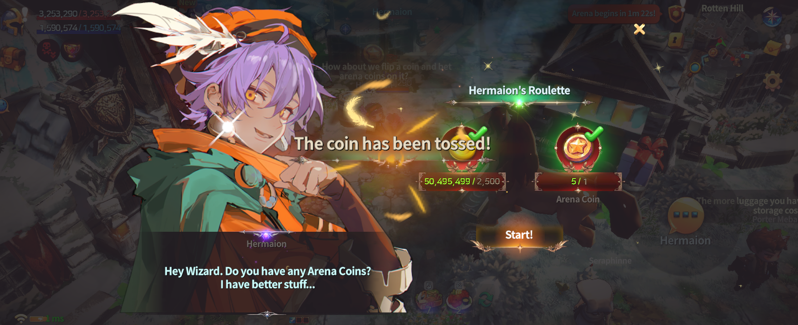

# 📁 Arena-Roulette



### 📜 Arena Roulette Guide

Wondering where to use the **Arena Coins** you earn from victories?\
**Arena Roulette** is a content feature where you can spend\
Arena Coins and Gold to receive **random rewards**.

***

### ◾ What Is Arena Roulette?

Arena Roulette is a system that allows you to use **Arena Coins obtained from Arena battles**\
to randomly acquire a variety of items.

Some **crafting materials and special items** can only be obtained through Arena Roulette.

***

### ◾ How to Use Arena Roulette

Arena Roulette can be accessed through the [NPC **Hermaion**](../../field-info/rotten-hill/npc-rotten-hill.md#hermaion-herumeion).

1️⃣ Prepare **Arena Coins** and a small amount of **Gold**.

2️⃣ Talk to **NPC Hermaion**.

<figure><figcaption></figcaption></figure>

3️⃣ Start the Arena Roulette to instantly receive a **random reward**.

<figure><figcaption></figcaption></figure>

***

### ◾ NPC Hermaion

Hermaion is the NPC in charge of **Arena Roulette**.

* Provides roulette rewards in exchange for Arena Coins.
* Certain crafting materials are **exclusive to Hermaion**.
* The roulette reward pool may **expand with future updates**.

***

### ◾ Roulette Reward Pool

For a full list of items that can be obtained from Arena Roulette, please refer to the table below.

| **Item**                      | **amount** | **prob** |
| ----------------------------- | ---------- | -------- |
| Ancient arena seal            | 1          | 6.000%   |
| Crystal of destruction        | 2          | 1.000%   |
| Crystal of courage            | 2          | 1.000%   |
| Mystic stone                  | 1          | 0.100%   |
| Lucky core                    | 1          | 1.000%   |
| Extocium                      | 1          | 2.000%   |
| Arena Coin                    | 1          | 3.000%   |
| Arena seal                    | 1          | 3.000%   |
| Pen of Oblivion               | 1          | 8.000%   |
| Corn                          | 2          | 1.200%   |
| Gold                          | 5          | 2.000%   |
| Silver                        | 5          | 2.000%   |
| Core of protection            | 1          | 2.000%   |
| Regression fabric             | 1          | 0.100%   |
| Regression thread             | 1          | 0.100%   |
| Extocium Fragment             | 1          | 3.000%   |
| Healing Vortex Recipe         | 1          | 2.000%   |
| Magic Vortex Recipe           | 1          | 2.000%   |
| Cotton wool                   | 5          | 5.000%   |
| Snow White                    | 5          | 5.000%   |
| Lemon juice                   | 1          | 6.000%   |
| Red fur                       | 1          | 0.500%   |
| Red dye                       | 2          | 1.000%   |
| Anti-magic stone              | 1          | 0.500%   |
| Obsidian                      | 5          | 4.000%   |
| Crystal ornament              | 1          | 1.000%   |
| Advanced HP potion            | 5          | 2.000%   |
| Advanced MP potion            | 5          | 2.500%   |
| Thread                        | 1          | 2.000%   |
| White cloth                   | 1          | 2.000%   |
| Dream catcher                 | 1          | 1.000%   |
| Witchcraft liquid Recipe      | 1          | 2.000%   |
| Summoning Necklace Recipe     | 1          | 2.000%   |
| Waking darkness Recipe        | 1          | 1.000%   |
| Rainbow Recipe                | 1          | 1.000%   |
| Broken Power                  | 20         | 1.000%   |
| Water Wrath Recipe            | 1          | 1.000%   |
| Tears of the Ancients         | 5          | 1.000%   |
| Constellation Stone Tablet    | 5          | 1.000%   |
| Emperor's Necklace Recipe     | 1          | 1.500%   |
| Emperor's Bracelet Recipe     | 1          | 1.500%   |
| Emperor's Earrings Recipe     | 1          | 1.500%   |
| Lava Hammer Recipe            | 1          | 1.500%   |
| Gold Chain Recipe             | 1          | 1.500%   |
| Gold Ring Recipe              | 1          | 1.500%   |
| Exquisite Silver Clasp Recipe | 1          | 1.500%   |
| Crafted Silver Chain Recipe   | 1          | 1.500%   |
| Exquisite Gold Clasp Recipe   | 1          | 1.500%   |
| Crafted Gold Chain Recipe     | 1          | 1.500%   |
| Fine Gem Ornament Recipe      | 1          | 1.500%   |
| Magic Gem Ornament Recipe     | 1          | 1.500%   |



### 📜 아레나 룰렛 가이드

아레나에서 승리하며 획득한 **아레나 코인**, 어디에 사용하면 좋을까요?\
**아레나 룰렛**은 아레나 코인과 골드를 사용해 **랜덤 보상**을 획득할 수 있는 콘텐츠입니다.

***

### ◾ 아레나 룰렛이란?

아레나 룰렛은 아레나 보상으로 얻은 **아레나 코인**을 사용해\
다양한 아이템을 **랜덤으로 획득**할 수 있는 시스템입니다.

일부 **제작 재료와 특수 아이템**은 아레나 룰렛을 통해서만 획득할 수 있습니다.

***

### ◾ 아레나 룰렛 이용 방법

아레나 룰렛은 [NPC **헤르마이온(Hermaion)**](../../field-info/rotten-hill/npc-rotten-hill.md#hermaion-herumeion) 을 통해 이용할 수 있습니다.

1️⃣ 아레나 코인과 **소정의 골드**를 준비합니다.

2️⃣ NPC 헤르마이온과 대화합니다.

<figure><figcaption></figcaption></figure>

3️⃣ 아레나 룰렛을 시작하면, 랜덤 보상이 즉시 지급됩니다.

<figure><figcaption></figcaption></figure>

***

### ◾ NPC 헤르마이온 소개

헤르마이온은 **아레나 룰렛을 담당하는 NPC**입니다.

* 아레나 코인을 사용해 룰렛 보상을 제공합니다.
* 일부 제작 재료는 **헤르마이온을 통해서만 획득**할 수 있습니다.
* 룰렛의 보상 풀은 **업데이트에 따라 확장**될 수 있습니다.

***

### ◾ 룰렛 보상 풀

아레나 룰렛에서 획득할 수 있는 보상 아이템 목록은 아래 표를 참고해 주세요.

| **아이템**      | **수량** | **확률** |
| ------------ | ------ | ------ |
| 고대 아레나 인장    | 1      | 6.000% |
| 파괴의 결정       | 2      | 1.000% |
| 용기의 결정       | 2      | 1.000% |
| 신비의 돌        | 1      | 0.100% |
| 행운의 핵        | 1      | 1.000% |
| 엑스토시움        | 1      | 2.000% |
| 아레나 코인       | 1      | 3.000% |
| 아레나 인장       | 1      | 3.000% |
| 망각의 펜        | 1      | 8.000% |
| 옥수수          | 2      | 1.200% |
| 금            | 5      | 2.000% |
| 은            | 5      | 2.000% |
| 보호의 핵        | 1      | 2.000% |
| 회귀의 천        | 1      | 0.100% |
| 회귀의 실        | 1      | 0.100% |
| 엑스토시움 조각     | 1      | 3.000% |
| 치유의 소용돌이 레시피 | 1      | 2.000% |
| 마력의 소용돌이 레시피 | 1      | 2.000% |
| 목화솜          | 5      | 5.000% |
| 백설화          | 5      | 5.000% |
| 레몬즙          | 1      | 6.000% |
| 붉은 털가죽       | 1      | 0.500% |
| 붉은 염료        | 2      | 1.000% |
| 항마석          | 1      | 0.500% |
| 흑요석          | 5      | 4.000% |
| 수정장식         | 1      | 1.000% |
| 고급 체력포션      | 5      | 2.000% |
| 고급 마나포션      | 5      | 2.500% |
| 실            | 1      | 2.000% |
| 흰 천          | 1      | 2.000% |
| 드림캐쳐         | 1      | 1.000% |
| 주술액 레시피      | 1      | 2.000% |
| 소환의 목걸이 레시피  | 1      | 2.000% |
| 깨어나는 어둠 제작서  | 1      | 1.000% |
| 레인보우 제작서     | 1      | 1.000% |
| 부서진 힘        | 20     | 1.000% |
| 물의 분노 제작서    | 1      | 1.000% |
| 고대의 눈물       | 5      | 1.000% |
| 별자리 석판       | 5      | 1.000% |
| 제왕의 목걸이 제작서  | 1      | 1.500% |
| 제왕의 팔찌 제작서   | 1      | 1.500% |
| 제왕의 귀걸이 제작서  | 1      | 1.500% |
| 용암 망치 레시피    | 1      | 1.500% |
| 금 사슬 레시피     | 1      | 1.500% |
| 금 고리 레시피     | 1      | 1.500% |
| 정교한 은 고리 레시피 | 1      | 1.500% |
| 세공된 은 사슬 레시피 | 1      | 1.500% |
| 정교한 금 고리 레시피 | 1      | 1.500% |
| 세공된 금 사슬 레시피 | 1      | 1.500% |
| 고급 보석 장식 레시피 | 1      | 1.500% |
| 마법 보석 장식 레시피 | 1      | 1.500% |



### 📜 アリーナルーレットガイド

アリーナで勝利して獲得した **アリーナコイン**、どこで使えばいいか迷っていませんか？

**アリーナルーレット**は、\
アリーナコインとゴールドを使用して **ランダム報酬** を獲得できるコンテンツです。

***

### ◾ アリーナルーレットとは？

アリーナルーレットは、\
アリーナ報酬として獲得した **アリーナコイン** を使用し、\
さまざまなアイテムを **ランダム** に獲得できるシステムです。

一部の **制作素材** や **特殊アイテム** は、アリーナルーレットでのみ入手できます。

***

### ◾ アリーナルーレットの利用方法

アリーナルーレットは [NPC **ヘルマイオン**](../../field-info/rotten-hill/npc-rotten-hill.md#hermaion-herumeion)**（Hermaion）** を通じて利用できます。

1️⃣ **アリーナコイン** と **少量のゴールド** を準備します。

2️⃣ NPC **ヘルマイオン** と会話します。

<figure><figcaption></figcaption></figure>

3️⃣ アリーナルーレットを開始すると、**ランダム報酬が即座に獲得** されます。

<figure><figcaption></figcaption></figure>

***

### ◾ NPC ヘルマイオン紹介

ヘルマイオンは、**アリーナルーレットを担当するNPC** です。

* アリーナコインを使用して ルーレット報酬を提供します。
* 一部の制作素材は **ヘルマイオンからのみ入手可能** です。
* ルーレットの報酬プールは、**アップデートにより拡張** される場合があります。

***

### ◾ ルーレット報酬プール

アリーナルーレットで獲得できる 報酬アイテムの一覧は、以下の表をご確認ください。

| アイテム        | 数量 | 確率     |
| ----------- | -- | ------ |
| 古代アリーナの印章   | 1  | 6.000% |
| 破壊の結晶       | 2  | 1.000% |
| 勇気の結晶       | 2  | 1.000% |
| 神秘の石        | 1  | 0.100% |
| 幸運の核        | 1  | 1.000% |
| エクストシウム     | 1  | 2.000% |
| アリーナコイン     | 1  | 3.000% |
| アリーナの印章     | 1  | 3.000% |
| 忘却のペン       | 1  | 8.000% |
| トウモロコシ      | 2  | 1.200% |
| 金           | 5  | 2.000% |
| 銀           | 5  | 2.000% |
| 守護の核        | 1  | 2.000% |
| 回帰の布        | 1  | 0.100% |
| 回帰の糸        | 1  | 0.100% |
| エクストシウムの欠片  | 1  | 3.000% |
| 癒しの渦レシピ     | 1  | 2.000% |
| 魔力の渦レシピ     | 1  | 2.000% |
| 綿花          | 5  | 5.000% |
| 白雪花         | 5  | 5.000% |
| レモン汁        | 1  | 6.000% |
| 赤い毛皮        | 1  | 0.500% |
| 赤い染料        | 2  | 1.000% |
| 抗魔石         | 1  | 0.500% |
| 黒曜石         | 5  | 4.000% |
| 水晶装飾        | 1  | 1.000% |
| 高級体力ポーション   | 5  | 2.000% |
| 高級マナポーション   | 5  | 2.500% |
| 糸           | 1  | 2.000% |
| 白い布         | 1  | 2.000% |
| ドリームキャッチャー  | 1  | 1.000% |
| 呪術液レシピ      | 1  | 2.000% |
| 召喚の首飾りレシピ   | 1  | 2.000% |
| 目覚める闇の製作書   | 1  | 1.000% |
| レインボー製作書    | 1  | 1.000% |
| 砕けた力        | 20 | 1.000% |
| 水の怒り製作書     | 1  | 1.000% |
| 古代の涙        | 5  | 1.000% |
| 星座の石板       | 5  | 1.000% |
| 帝王の首飾り製作書   | 1  | 1.500% |
| 帝王の腕輪製作書    | 1  | 1.500% |
| 帝王のイヤリング製作書 | 1  | 1.500% |
| 溶岩ハンマーレシピ   | 1  | 1.500% |
| 金の鎖レシピ      | 1  | 1.500% |
| 金の指輪レシピ     | 1  | 1.500% |
| 精巧な銀の指輪レシピ  | 1  | 1.500% |
| 彫刻された銀の鎖レシピ | 1  | 1.500% |
| 精巧な金の指輪レシピ  | 1  | 1.500% |
| 彫刻された金の鎖レシピ | 1  | 1.500% |
| 高級宝石装飾レシピ   | 1  | 1.500% |
| 魔法宝石装飾レシピ   | 1  | 1.500% |



<em>※ This guide was written based on the game status as of January 14, 2026,</em>  <em>and its contents may change with future updates.</em>

