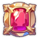

# 📁 League & Trophy

<figure><figcaption>
Trophy
</figcaption></figure>



### 📜 League & Trophy Guide

In the 1vs1 Arena, you earn or lose **Trophies** based on match results.\
Your total Trophies determine your **League placement** and **Rankings**.

***

### ◾ What Are Trophies?

Trophies represent your performance in Arena battles.

* **Win a match** to gain Trophies.
* **Lose a match** to lose Trophies.
* Trophies are accumulated on an **account-wide basis**.

***

### ◾ Ranking Calculation

* Rankings are determined by the **number of Trophies earned each week**.
* Competition takes place **within each League** on a weekly basis.

***

### ◾ League Assignment

Leagues are not selected manually.\
Your League is **automatically assigned**\
based on the **highest-level Hero owned on your account**.

***

### ◾ Weekly Trophy Reset

* Trophies are reset every **Monday at 00:00 (KST)**.
* After the reset, your Trophy count is set to\
  the **starting Trophy value of your League**.

#### Example

* If the highest-level Hero on your account is **Level 45**,\
  you will be placed in the **Emperor League**.
* If the starting Trophy value for that League is **1,452**,\
  your Trophies will reset to **1,452** every Monday at 00:00 (KST).

***

### ◾ Trophy Decay (Inactivity Penalty)

* At **00:00 (KST) each day**,\
  accounts that did **not participate in the Arena at all that day&#x20;**<mark style="color:red;">**will lose 25**</mark>**&#x20;Trophies**.

***

### ◾ Sleep Account Notice

* If an account does **not participate in the Arena even once during the week before a reset**,\
  it will be marked as a **Sleep Account**.
* Sleep Accounts **do not receive the weekly Trophy reset**.

#### Example

* Emperor League
* No Arena participation during the previous week
* 7 consecutive days of inactivity

→ **1,452 − (25 × 7) = 1,277 Trophies**

In this case,\
the new week will start at **1,277 Trophies** instead of the League’s starting value.

***

### ◾ League & Trophy Table

Starting Trophy values and Trophy ranges for each League can be found in the table below.

<table data-header-hidden data-full-width="true"><thead><tr><th width="186.54150390625" align="center"></th><th width="100" align="center"></th><th width="112.5416259765625" align="center"></th><th width="92" align="center"></th><th width="108.8333740234375" align="center"></th><th width="117" align="center"></th></tr></thead><tbody><tr><td align="center"><strong>League</strong></td><td align="center"><strong>Name</strong></td><td align="center"></td><td align="center"><strong>Level</strong></td><td align="center"><strong>Win Trophy</strong></td><td align="center"><strong>Lose</strong> <strong>Trophy</strong></td></tr><tr><td align="center"></td><td align="center">Bronze</td><td align="center"><mark style="color:purple;"><strong>0~</strong></mark></td><td align="center">20~25</td><td align="center">5</td><td align="center">-2</td></tr><tr><td align="center"></td><td align="center">Silver</td><td align="center"><mark style="color:purple;"><strong>152~</strong></mark></td><td align="center">26~30</td><td align="center">6</td><td align="center">-3</td></tr><tr><td align="center"></td><td align="center">Gold</td><td align="center"><mark style="color:purple;"><strong>452~</strong></mark></td><td align="center">31~35</td><td align="center">7</td><td align="center">-5</td></tr><tr><td align="center"></td><td align="center">Nobless</td><td align="center"><mark style="color:purple;"><strong>902~</strong></mark></td><td align="center">36~44</td><td align="center">8</td><td align="center">-6</td></tr><tr><td align="center"></td><td align="center">Emperor</td><td align="center"><mark style="color:purple;"><strong>1452~</strong></mark></td><td align="center">45~60</td><td align="center">10</td><td align="center">-8</td></tr></tbody></table>

***

### ◾ Trophy Adjustment System

In the Arena, Trophy gains and losses are\
**slightly adjusted based on the level difference** between players.

* This system accounts for difficulty differences\
  between higher-level and lower-level opponents.

#### Example

* If you **lose to an opponent who is 9 levels higher than you**:
  * Base Trophy loss: −5
  * After adjustment: **−1**

***

### ◾ Trophy Adjustment Criteria

Detailed Trophy adjustment values based on level differences\
can be found in the table below.

<table data-full-width="true"><thead><tr><th align="center">Level gap</th><th align="center">Win Trophy Bonus</th><th align="center">Draw</th><th align="center">Lose Trophy Bonus</th></tr></thead><tbody><tr><td align="center">+9~10</td><td align="center">+4</td><td align="center">0</td><td align="center">-4</td></tr><tr><td align="center">+7~8</td><td align="center">+3</td><td align="center">0</td><td align="center">-3</td></tr><tr><td align="center">+6</td><td align="center">+2</td><td align="center">0</td><td align="center">-2</td></tr><tr><td align="center">+0~5</td><td align="center">0</td><td align="center">0</td><td align="center">0</td></tr></tbody></table>

***

✨

> **Trophies are a record of your skill.**\
> **Leagues show where you stand, and the Arena gives you the chance to change it.**



### 📜 리그 & 트로피 가이드

1vs1 아레나에서는 전투 결과에 따라 **트로피**를 획득하거나 잃게 되며,\
트로피를 기준으로 **리그와 랭킹**이 결정됩니다.

***

### ◾ 트로피란?

트로피는 아레나에서의 **승패 성과를 나타내는 점수**입니다.

* 아레나에서 **승리하면 트로피를 획득**합니다.
* 아레나에서 **패배하면 트로피를 잃습니다.**
* 트로피는 **계정 단위로 누적**됩니다.

***

### ◾ 랭킹 산정 방식

* 랭킹은 **주간 트로피 획득량**을 기준으로 산정됩니다.
* 매주 리그별로 경쟁이 진행됩니다.

***

### ◾ 리그 배정 기준

리그는 수동으로 선택하지 않으며, \
**계정 내 보유 중인 영웅의 최대 레벨**을 기준으로 자동 배정됩니다.

***

### ◾ 주간 트로피 초기화

* 트로피는 **매주 월요일 00:00 (KST)** 기준으로 초기화됩니다.
* 초기화 시, 해당 리그의 **시작 트로피 점수**로 설정됩니다.

#### 예시

* 계정 내 최고 레벨 영웅이 **45레벨**일 경우\
  → **엠퍼러 리그**에 배정됩니다.
* 해당 리그의 시작 트로피가 **1,452점**이라면\
  → 매주 월요일 00:00에 **1,452점으로 초기화**됩니다.

***

### ◾ 트로피 감소(미참여 페널티)

* **매일 KST 00:00 기준**,\
  해당 날짜에 아레나에 **한 번도 참여하지 않은 계정**은 트로피가 <mark style="color:red;">**25점씩 감소**</mark>합니다.

***

### ◾ 슬립 계정 안내

* 리셋 주간 **이전 주에 아레나에 단 한 번도 참여하지 않은 경우**, 해당 계정은 **슬립 계정**으로 처리됩니다.
* 슬립 계정은 **트로피 초기화가 적용되지 않습니다.**

#### 예시

* 엠퍼러 리그 소속
* 지난주 아레나 미참여
* 총 7일 미참여 시\
  → **1,452 − (25 × 7) = 1,277점**

이 경우, 이번 주는 **1,277점에서 그대로 시작**합니다.

***

### ◾ 리그 & 트로피 점수표

리그별 시작 트로피와 점수 구간은 아래 표를 참고해 주세요.

<table data-header-hidden data-full-width="true"><thead><tr><th width="186.54150390625" align="center"></th><th width="100" align="center"></th><th width="112.5416259765625" align="center"></th><th width="92" align="center"></th><th width="108.8333740234375" align="center"></th><th width="117" align="center"></th></tr></thead><tbody><tr><td align="center"><strong>League</strong></td><td align="center"><strong>Name</strong></td><td align="center"></td><td align="center"><strong>Level</strong></td><td align="center"><strong>Win Trophy</strong></td><td align="center"><strong>Lose</strong> <strong>Trophy</strong></td></tr><tr><td align="center"></td><td align="center">Bronze</td><td align="center"><mark style="color:purple;"><strong>0~</strong></mark></td><td align="center">20~25</td><td align="center">5</td><td align="center">-2</td></tr><tr><td align="center"></td><td align="center">Silver</td><td align="center"><mark style="color:purple;"><strong>152~</strong></mark></td><td align="center">26~30</td><td align="center">6</td><td align="center">-3</td></tr><tr><td align="center"></td><td align="center">Gold</td><td align="center"><mark style="color:purple;"><strong>452~</strong></mark></td><td align="center">31~35</td><td align="center">7</td><td align="center">-5</td></tr><tr><td align="center"></td><td align="center">Nobless</td><td align="center"><mark style="color:purple;"><strong>902~</strong></mark></td><td align="center">36~44</td><td align="center">8</td><td align="center">-6</td></tr><tr><td align="center"></td><td align="center">Emperor</td><td align="center"><mark style="color:purple;"><strong>1452~</strong></mark></td><td align="center">45~60</td><td align="center">10</td><td align="center">-8</td></tr></tbody></table>

***

### ◾ 트로피 보정 시스템

아레나에서는 상대와의 **레벨 차이**에 따라 트로피 획득량 또는 손실량이 **소폭 조정**됩니다.

* 고레벨 vs 저레벨 간의 난이도 차이를 고려한 보정 시스템입니다.

#### 예시

* 내가 **9레벨 높은 상대에게 패배**한 경우
  * 기본 손실: −5
  * 보정 적용 후: **−1**

***

### ◾ 트로피 보정 기준

레벨 차이에 따른 트로피 보정 수치는 아래 표에서 확인할 수 있습니다.

<table data-full-width="true"><thead><tr><th align="center">Level gap</th><th align="center">Win Trophy Bonus</th><th align="center">Draw</th><th align="center">Lose Trophy Bonus</th></tr></thead><tbody><tr><td align="center">+9~10</td><td align="center">+4</td><td align="center">0</td><td align="center">-4</td></tr><tr><td align="center">+7~8</td><td align="center">+3</td><td align="center">0</td><td align="center">-3</td></tr><tr><td align="center">+6</td><td align="center">+2</td><td align="center">0</td><td align="center">-2</td></tr><tr><td align="center">+0~5</td><td align="center">0</td><td align="center">0</td><td align="center">0</td></tr></tbody></table>

***

✨

> **트로피는 실력의 기록입니다.**\
> **리그는 당신의 위치를 보여주고, 아레나는 그 위치를 바꿀 기회를 줍니다.**



### 📜 リーグ＆トロフィーガイド

1vs1アリーナでは、\
試合結果に応じて **トロフィー** を獲得、または失います。\
トロフィーを基準に、**リーグ** と **ランキング** が決定されます。

***

### ◾ トロフィーとは？

トロフィーは、アリーナでの勝敗結果を表す **評価ポイント** です。

* アリーナで **勝利するとトロフィーを獲得** します。
* アリーナで **敗北するとトロフィーを失います**。
* トロフィーは **アカウント単位で累積** されます。

***

### ◾ ランキング算出方法

* ランキングは **週間で獲得したトロフィー数** を基準に算出されます。
* 毎週、**リーグごとにランキング競争** が行われます。

***

### ◾ リーグ配属基準

リーグは手動で選択することはできません。\
**アカウント内で所持している英雄の最大レベル** を基準に、リーグが **自動的に配属** されます。

***

### ◾ 週間トロフィーリセット

* トロフィーは **毎週月曜日 00:00（KST）** を基準にリセットされます。
* リセット後は、**所属リーグの開始トロフィー数** に設定されます。

#### 例

* アカウント内で最もレベルが高い英雄が **レベル45** の場合\
  → **エンペラーリーグ** に配属されます。
* そのリーグの開始トロフィーが **1,452** の場合\
  → 毎週月曜日 00:00（KST）に **1,452** にリセットされます。

***

### ◾ トロフィー減少（未参加ペナルティ）

* **毎日 00:00（KST）** を基準に、その日にアリーナへ **一度も参加していないアカウント** は、\
  トロフィーが <mark style="color:red;">**25ポイント減少**</mark> します。

***

### ◾ スリープアカウントについて

* リセット週の **前週に一度もアリーナへ参加していない場合**、\
  そのアカウントは **スリープアカウント** として処理されます。
* スリープアカウントには **週間トロフィーリセットが適用されません**。

#### 例

* エンペラーリーグ所属
* 前週アリーナ未参加
* 7日間連続未参加の場合

→ **1,452 −（25 × 7）＝ 1,277**

この場合、今週は **1,277トロフィー** からスタートします。

***

### ◾ リーグ＆トロフィー表

リーグ別の開始トロフィー数や トロフィー区間については、以下の表をご確認ください。

<table data-header-hidden data-full-width="true"><thead><tr><th width="186.54150390625" align="center"></th><th width="100" align="center"></th><th width="112.5416259765625" align="center"></th><th width="92" align="center"></th><th width="108.8333740234375" align="center"></th><th width="117" align="center"></th></tr></thead><tbody><tr><td align="center"><strong>League</strong></td><td align="center"><strong>Name</strong></td><td align="center"></td><td align="center"><strong>Level</strong></td><td align="center"><strong>Win Trophy</strong></td><td align="center"><strong>Lose</strong> <strong>Trophy</strong></td></tr><tr><td align="center"></td><td align="center">Bronze</td><td align="center"><mark style="color:purple;"><strong>0~</strong></mark></td><td align="center">20~25</td><td align="center">5</td><td align="center">-2</td></tr><tr><td align="center"></td><td align="center">Silver</td><td align="center"><mark style="color:purple;"><strong>152~</strong></mark></td><td align="center">26~30</td><td align="center">6</td><td align="center">-3</td></tr><tr><td align="center"></td><td align="center">Gold</td><td align="center"><mark style="color:purple;"><strong>452~</strong></mark></td><td align="center">31~35</td><td align="center">7</td><td align="center">-5</td></tr><tr><td align="center"></td><td align="center">Nobless</td><td align="center"><mark style="color:purple;"><strong>902~</strong></mark></td><td align="center">36~44</td><td align="center">8</td><td align="center">-6</td></tr><tr><td align="center"></td><td align="center">Emperor</td><td align="center"><mark style="color:purple;"><strong>1452~</strong></mark></td><td align="center">45~60</td><td align="center">10</td><td align="center">-8</td></tr></tbody></table>

***

### ◾ トロフィー補正システム

アリーナでは、対戦相手との **レベル差** に応じて、\
トロフィーの **獲得量・減少量が微調整** されます。

* これは、高レベルと低レベル間の難易度差を考慮したシステムです。

#### 例

* 自分より9レベル高い相手に敗北した場合
  * 基本減少量：−5
  * 補正後：**−1**

***

### ◾ トロフィー補正基準

レベル差による トロフィー補正の詳細は、以下の表をご確認ください。

<table data-full-width="true"><thead><tr><th align="center">Level gap</th><th align="center">Win Trophy Bonus</th><th align="center">Draw</th><th align="center">Lose Trophy Bonus</th></tr></thead><tbody><tr><td align="center">+9~10</td><td align="center">+4</td><td align="center">0</td><td align="center">-4</td></tr><tr><td align="center">+7~8</td><td align="center">+3</td><td align="center">0</td><td align="center">-3</td></tr><tr><td align="center">+6</td><td align="center">+2</td><td align="center">0</td><td align="center">-2</td></tr><tr><td align="center">+0~5</td><td align="center">0</td><td align="center">0</td><td align="center">0</td></tr></tbody></table>

***

✨

> **トロフィーは、あなたの実力の記録。**\
> **リーグは現在地を示し、アリーナは、その位置を変えるチャンスを与えてくれます。**



<em>※ This guide was written based on the game status as of January 13, 2026,</em>  <em>and its contents may change with future updates.</em>

