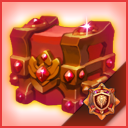

# 📁 Ranking Rewards

### <mark style="color:purple;">**📜Header List**</mark>

* ✅[Ranking Rules](ranking-rewards.md#trophy)
* ✅[Weekly Rewards](ranking-rewards.md#trophy-1)
* ✅[Ranking Buffs](ranking-rewards.md#trophy-2)

<figure><figcaption></figcaption></figure>

## ✅Ranking Rules 



💡Your **Arena Rank** is determined based on the **number of trophies** you earn.\
If multiple players have the **same trophy count**, the player with **higher total EXP** ranks higher.

📌 **Ranking Rules for Ties**

* If **Player A and Player B** have **the same trophies & EXP**, they **both rank 1st**.
* The next rank starts at **3rd place** (Player C = 3rd).

📅 **Ranking & Rewards**

* **Trophy accumulation period**: KST **Monday 00:00 \~ Sunday 23:59**
* **Rewards are distributed weekly** via mail based on the **rankings at Sunday 23:59 KST**
* **Ranking board displays up to Top 200 players**



💡아레나에서 획득한 **트로피 개수**를 기준으로 **아레나 랭크**가 부여됩니다.\
**트로피가 동일할 경우**, **누적 EXP가 높은 유저가 상위 랭크**를 차지합니다.

📌 **동점 시 랭킹 규칙**

* A와 B가 **트로피 개수 + 누적 EXP 동일** → **둘 다 1위**
* 다음 순위는 **3위부터 시작** (C는 3위)

📅 **랭킹 산정 & 보상 지급**

* **트로피 적립 기간**: KST **월요일 00:00 \~ 일요일 23:59**
* **보상 지급**: KST **일요일 23:59 기준 순위**에 따라 **우편 지급 (주 1회)**
* **랭킹 보드 표시 범위**: **최대 200위까지 공개**



💡アリーナで獲得した**トロフィーの数**に応じて**アリーナランク**が決まります。\
**トロフィー数が同じ場合**、**累積EXPが高いプレイヤーが上位**になります。

📌 **同点時のランク決定ルール**

* **AとB**が**トロフィー数＆累積EXP同じ** → **両方が1位**
* 次の順位は**3位から** (C = 3位)

📅 **ランキング集計＆報酬**

* **トロフィー獲得期間**: KST **月曜 00:00 \~ 日曜 23:59**
* **報酬配布**: KST **日曜 23:59時点の順位**に基づき、**毎週1回メールで配布**
* **ランキングボードは200位まで表示**



## ✅Weekly Rewards 

<figure><figcaption></figcaption></figure>

<table data-header-hidden><thead><tr><th></th><th></th><th width="149"></th><th></th><th></th></tr></thead><tbody><tr><td><strong>Rank</strong></td><td><strong>Arena Seal</strong></td><td><strong>Arena Coin</strong></td><td><strong>Gold</strong></td><td><strong>XTO</strong></td></tr><tr><td>1</td><td>100</td><td>100</td><td>     40,000,000</td><td>500</td></tr><tr><td>2</td><td>90</td><td>90</td><td>     35,000,000</td><td>400</td></tr><tr><td>3</td><td>85</td><td>85</td><td>     30,000,000</td><td>300</td></tr><tr><td>4</td><td>80</td><td>80</td><td>      25,000,000</td><td>200</td></tr><tr><td>5</td><td>75</td><td>75</td><td>      18,000,000</td><td>100</td></tr><tr><td>6</td><td>72</td><td>72</td><td>      14,000,000</td><td></td></tr><tr><td>7</td><td>70</td><td>70</td><td>      11,000,000</td><td></td></tr><tr><td>8</td><td>68</td><td>68</td><td>      9,000,000</td><td></td></tr><tr><td>9</td><td>66</td><td>66</td><td>      8,000,000</td><td></td></tr><tr><td>10</td><td>64</td><td>64</td><td>       6,000,000</td><td></td></tr><tr><td>11</td><td>60</td><td>60</td><td>       4,000,000</td><td></td></tr><tr><td>12</td><td>58</td><td>58</td><td>       3,500,000</td><td></td></tr><tr><td>13</td><td>56</td><td>56</td><td>       3,000,000</td><td></td></tr><tr><td>14</td><td>54</td><td>54</td><td>       2,800,000</td><td></td></tr><tr><td>15</td><td>52</td><td>52</td><td>       2,600,000</td><td></td></tr><tr><td>16</td><td>50</td><td>50</td><td>       2,400,000</td><td></td></tr><tr><td>17</td><td>48</td><td>48</td><td>       2,200,000</td><td></td></tr><tr><td>18</td><td>46</td><td>46</td><td>       2,100,000</td><td></td></tr><tr><td>19</td><td>44</td><td>44</td><td>       2,000,000</td><td></td></tr><tr><td>20</td><td>42</td><td>42</td><td>       1,900,000</td><td></td></tr><tr><td>21</td><td>40</td><td>40</td><td>       1,800,000</td><td></td></tr><tr><td>22</td><td>39</td><td>39</td><td>       1,700,000</td><td></td></tr><tr><td>23</td><td>38</td><td>38</td><td>       1,600,000</td><td></td></tr><tr><td>24</td><td>37</td><td>37</td><td>       1,500,000</td><td></td></tr><tr><td>25</td><td>36</td><td>36</td><td>       1,400,000</td><td></td></tr><tr><td>26</td><td>35</td><td>35</td><td>       1,300,000</td><td></td></tr><tr><td>27</td><td>34</td><td>34</td><td>       1,200,000</td><td></td></tr><tr><td>28</td><td>33</td><td>33</td><td>       1,100,000</td><td></td></tr><tr><td>29</td><td>32</td><td>32</td><td>       1,000,000</td><td></td></tr><tr><td>30</td><td>31</td><td>31</td><td>         900,000</td><td></td></tr><tr><td>31</td><td>30</td><td>30</td><td>         800,000</td><td></td></tr><tr><td>32</td><td>29</td><td>29</td><td>         700,000</td><td></td></tr><tr><td>33</td><td>28</td><td>28</td><td>         600,000</td><td></td></tr><tr><td>34</td><td>27</td><td>27</td><td>         550,000</td><td></td></tr><tr><td>35</td><td>26</td><td>26</td><td>         530,000</td><td></td></tr><tr><td>36</td><td>25</td><td>25</td><td>         510,000</td><td></td></tr><tr><td>37</td><td>24</td><td>24</td><td>         490,000</td><td></td></tr><tr><td>38</td><td>23</td><td>23</td><td>         470,000</td><td></td></tr><tr><td>39</td><td>22</td><td>22</td><td>         450,000</td><td></td></tr><tr><td>40</td><td>21</td><td>21</td><td>         430,000</td><td></td></tr><tr><td>41</td><td>20</td><td>20</td><td>         410,000</td><td></td></tr><tr><td>42</td><td>19</td><td>19</td><td>         390,000</td><td></td></tr><tr><td>43</td><td>18</td><td>18</td><td>         380,000</td><td></td></tr><tr><td>44</td><td>17</td><td>17</td><td>         360,000</td><td></td></tr><tr><td>45</td><td>16</td><td>16</td><td>         350,000</td><td></td></tr><tr><td>46</td><td>15</td><td>15</td><td>         340,000</td><td></td></tr><tr><td>47</td><td>14</td><td>14</td><td>         300,000</td><td></td></tr><tr><td>48</td><td>13</td><td>13</td><td>         280,000</td><td></td></tr><tr><td>49</td><td>12</td><td>12</td><td>         270,000</td><td></td></tr><tr><td>50</td><td>11</td><td>11</td><td>         260,000</td><td></td></tr><tr><td>10%</td><td>6</td><td>6</td><td>         250,000</td><td></td></tr><tr><td>30%</td><td>4</td><td>4</td><td>         100,000</td><td></td></tr><tr><td>60%</td><td>2</td><td>2</td><td>           50,000</td><td></td></tr></tbody></table>

&#x20;                                                             _Weekly Ranking Rewards_

## ✅Ranking Buffs 

<figure><figcaption>
Arena Ranker Effect
</figcaption></figure>



#### 🏆 Arena TOP 10 Perks!

Players ranked **1st \~ 10th** in the Arena receive:\
✅ **Real-time Damage Boost Buff**\
✅ **Exclusive Ranker Effect**

🔥 **Only the strongest can claim these rewards!**\
Stay in the **TOP 10** and enjoy your **powerful buffs & flashy effects!**



#### 🏆 **아레나 TOP 10 특전!**

아레나 **랭킹 1위 \~ 10위** 유저는 **랭킹을 유지하는 동안**\
✅ **실시간 데미지 증가 버프**\
✅ **랭커 전용 이펙트**\
를 부여받습니다!

🔥 **강자만이 누릴 수 있는 특권!**\
TOP 10을 유지하며 **강력한 버프와 화려한 이펙트**를 경험하세요!



#### 🏆 アリーナTOP10特典！

**アリーナランキング1位～10位**のプレイヤーは、\
✅ **リアルタイムでダメージ増加バフ**\
✅ **ランカー専用エフェクト**\
を獲得できます！

🔥 **強者だけの特権！**\
**TOP10を維持して、特別なバフと華やかなエフェクトを体験しましょう！**



<table><thead><tr><th width="150.33333333333331" align="center">Rank</th><th width="373" align="center">Buff</th></tr></thead><tbody><tr><td align="center">1</td><td align="center">Damage +5%</td></tr><tr><td align="center">2</td><td align="center">Damage +4.6%</td></tr><tr><td align="center">3</td><td align="center">Damage +4.2%</td></tr><tr><td align="center">4</td><td align="center">Damage +3.8%</td></tr><tr><td align="center">5</td><td align="center">Damage +3.4%</td></tr><tr><td align="center">6</td><td align="center">Damage +3%</td></tr><tr><td align="center">7</td><td align="center">Damage +2.6%</td></tr><tr><td align="center">8</td><td align="center">Damage +2.2%</td></tr><tr><td align="center">9</td><td align="center">Damage +1.8%</td></tr><tr><td align="center">10</td><td align="center">Damage +1.4%</td></tr></tbody></table>
