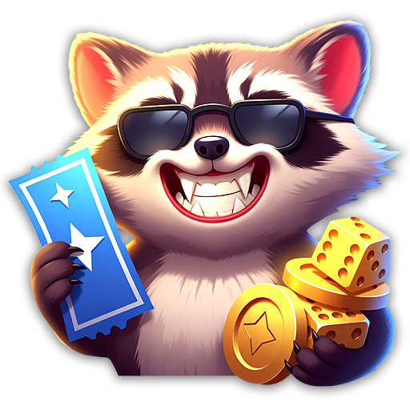
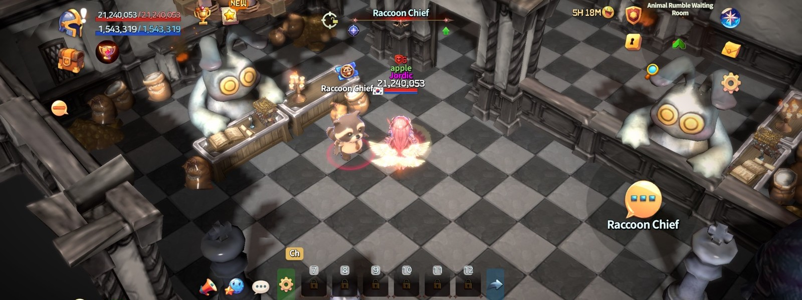
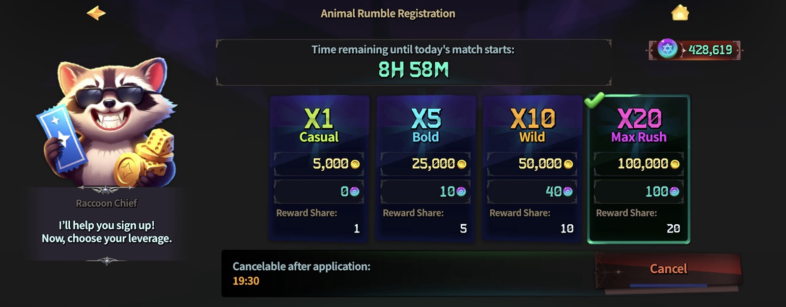

# 🎲 Animal Rumble

<figure><figcaption></figcaption></figure>



### 💰 Animal Rumble – Game Rules Guide

The rules of Animal Rumble are a little different from a normal match.\
But don't worry. Once you understand the steps below, anyone can jump right in.

***

#### ◾ Goal of Animal Rumble

Animal Rumble is a high-stakes team survival mode. Your goal is simple.


👉 **Get assigned to a team, survive longer than everyone else, and claim a share of the prize pool.**


You stake an entry fee to join.


👉 **Win, and you split the entire prize pool. Lose, and your entry fee is gone — so choose your leverage wisely.**


***

#### ◾ How to Enter

* From the main HUD, tap the **shield-shaped Mode button** to enter the Animal Rumble lobby.

<figure><figcaption></figcaption></figure>

* Talk to **Raccoon Chief** to open the next-match info and the leverage selection popup.

<figure><figcaption></figcaption></figure>

* Choose your leverage and confirm the entry fee to become a registered participant.

<figure><figcaption></figcaption></figure>

* Your entry fee is **deducted immediately** on confirmation.


**📌 Important!**

Once the match reaches its **start-lock point**, you **cannot change your leverage or cancel your entry**.


***

#### ◾ Entry Requirements & Currency


💡 **Minimum requirement to play:** a cumulative **500 TP** or more on your account.

👉 **Accepted currency:** Gold and TP.


**Base Entry Fee & Leverage**

* Your entry fee is calculated as **Base Entry Fee × Leverage**.
* Leverage only adjusts your **risk and reward share**. It does **not** affect character stats, skill drop rate, or team-assignment priority.
* Using leverage also consumes a portion of your TP.

| Leverage | Display Name | Entry Fee    | Entry Fee +α | Reward Share |
| -------- | ------------ | ------------ | ------------ | ------------ |
| x1       | Casual       | 5,000 Gold   | —            | 1            |
| x5       | Bold         | 25,000 Gold  | 10 TP        | 5            |
| x10      | Wild         | 50,000 Gold  | 40 TP        | 10           |
| x20      | Max Rush     | 100,000 Gold | 100 TP       | 20           |

**Confirm, Change & Cancel**

| Situation                     | What Happens                                                                                                                                                             |
| ----------------------------- | ------------------------------------------------------------------------------------------------------------------------------------------------------------------------ |
| Entry confirmed               | Your stake is deducted immediately at the chosen leverage, and your entry is saved as "Waiting."                                                                         |
| Change leverage               | Allowed only before Lock. Your old stake is refunded, then the new stake is charged. If it fails, your original entry is kept.                                           |
| Cancel entry                  | Allowed only before Lock. Your stake is refunded 100%, and the entry is marked "Canceled."                                                                               |
| Match canceled / server error | If the entry is not yet "Settled," the stake is refunded 100%. Settlement is idempotent.                                                                                 |
| Disconnection                 | Disconnecting before Lock keeps your entry. Disconnecting after the match starts means no refund — and if your team wins, the Gold reward is still paid out immediately. |

***

#### ◾ What Happens When the Match Starts

* When the match begins, participants are randomly assigned to one of the animal teams.
* The teams are: **Red Bear, Turtle, Raccoon, Fox, and Black Cat**.
* After entering the arena, a 3-2-1 countdown plays — then the match begins.
* A match lasts **5 minutes**. In the final 2 minutes, a **Red Ring** closes in — anyone caught outside it is eliminated.


**📌 Important!**

Team colors are assigned **completely at random**.\
The team you back is decided by your entry — **not your choice**.


***

#### ◾ How Combat Works

* At the start, you can only use **basic attacks**.
* Skill items and stat-boost items spawn all across the map — pick them up.
* Picking up a **Skill item** equips a random skill into your skill slot, which you can then use.
* Picking up a **Meteor item** launches a meteor at a random spot on the map.

***

#### ◾ How to Win

<figure><figcaption></figcaption></figure>

A team claims victory under any of these conditions, checked in order:

* **Last team standing** — the only team with survivors remaining.
* **On timeout** — the team with the most survivors wins.
* **Tie-breaker** — if survivor counts are equal, the team with the highest combined remaining HP wins.


🏆 **Rewards**

* **Winning team** — players split the entire prize pool according to each player's entry-fee share.
* **Losing team** — players forfeit their entry fee.
* Rewards are paid out **immediately** once the match result is decided.


***

#### ◾ Quick Tips

* New to the mode? Start at x1 "Casual" to learn the flow before raising your stake.
* Leverage changes your payout, not your power — a high stake won't make you stronger in the arena.
* Watch the clock. Once the Red Ring appears, position matters as much as combat.

***

✨

> **Animal Rumble is a mode where your nerve, your timing, and your stake all matter.**\
> **Pick your leverage and rumble! 🐾🔥**



### 💰 애니멀 럼블 게임 룰 가이드

애니멀 럼블의 룰은 일반 경기와 조금 다릅니다.\
하지만 걱정하지 마세요. 아래 순서대로만 이해하면 누구나 바로 플레이할 수 있습니다.

***

#### ◾ 애니멀 럼블의 목표

애니멀 럼블은 참가비를 거는 하이리스크 팀 생존 모드입니다. 목표는 간단합니다.


👉 **팀에 배정받아 끝까지 살아남고, 상금 풀의 지분을 차지하세요.**


참가에는 참가비가 필요합니다.


👉 **우승하면 전체 상금 풀을 나눠 받고, 패배하면 참가비를 잃습니다. 그러니 레버리지는 신중하게 선택하세요.**


***

#### ◾ 참여 방법

* 메인 HUD에서 **방패 모양 모드 버튼**을 눌러 애니멀 럼블 대기실에 진입합니다.

<figure><figcaption></figcaption></figure>

* 너구리 과장(Raccoon Chief)과 대화하면 다음 경기 정보와 레버리지 선택 팝업이 출력됩니다.

<figure><figcaption></figcaption></figure>

* 레버리지를 선택하고 참가비를 확정하면 참가 대기자가 됩니다.

<figure><figcaption></figcaption></figure>

* 참가비는 확정 즉시 **바로 차감**됩니다.


**📌 중요!**

경기 시작 **잠금 시점** 이후에는 **레버리지 변경과 참가 취소가 불가능**합니다.


***

#### ◾ 참여 조건 및 참가 재화


💡 **게임 참여 최소 조건:** 계정 내 누적 **500 TP** 이상

👉 **참가 재화:** 골드, TP


**기본 참가비와 레버리지**

* 참가비는 **기본 참가비 × 레버리지**로 계산됩니다.
* 레버리지는 **리스크 / 보상 지분만** 조절합니다. 캐릭터 능력치, 스킬 드랍률, 팀 배정 우선권에는 **영향을 주지 않습니다**.
* 레버리지를 사용할 때는 사용자 TP를 일부 차감합니다.

| 레버리지 | 표시명      | 참가비        | 참가비 +α | 보상 지분 |
| ---- | -------- | ---------- | ------ | ----- |
| x1   | Casual   | 5,000 골드   | —      | 1     |
| x5   | Bold     | 25,000 골드  | 10 TP  | 5     |
| x10  | Wild     | 50,000 골드  | 40 TP  | 10    |
| x20  | Max Rush | 100,000 골드 | 100 TP | 20    |

**참가 확정 · 변경 · 취소**

| 상황            | 처리 방식                                                                        |
| ------------- | ---------------------------------------------------------------------------- |
| 참가 확정         | 선택한 레버리지 기준으로 참가비를 즉시 차감하고, 참가 상태를 '대기(Waiting)'로 저장합니다.                     |
| 레버리지 변경       | 잠금(Lock) 전까지만 가능합니다. 기존 참가비를 환불한 뒤 신규 참가비를 재차감합니다. 실패 시 기존 참가 상태가 유지됩니다.     |
| 참가 취소         | 잠금 전까지만 가능합니다. 참가비를 100% 환불하며, 참가 상태가 '취소(Canceled)'로 변경됩니다.                 |
| 경기 취소 / 서버 오류 | 참가 상태가 '정산 완료(Settled)'가 아니라면 참가비를 100% 환불합니다. 정산은 중복 없이(idempotency) 처리됩니다. |
| 접속 종료         | 잠금 전 접속 종료는 참가가 유지됩니다. 경기 시작 후 접속 종료는 환불이 없으며, 우승 시 골드 보상은 그대로 즉시 지급됩니다.     |

***

#### ◾ 경기가 시작되면 이렇게 진행됩니다

* 경기가 시작되면 참가자는 각 동물 팀에 랜덤으로 배정됩니다.
* 팀 구성: **레드 베어, 거북이, 너구리, 여우, 검은 고양이**
* 경기장 입장 후 3-2-1 카운트가 지나면 게임이 진행됩니다.
* 경기 시간은 총 **5분**이며, 종료 2분 전부터 **레드 링**이 거리를 좁혀옵니다. 레드 링 밖에 있으면 사망합니다.


**📌 중요!**

팀(동물 색깔)은 **완전 랜덤**으로 배정됩니다.\
내가 응원하는 팀은 참가 결과로 정해지며 **직접 고를 수 없습니다**.


***

#### ◾ 전투는 이렇게 진행됩니다

* 게임 시작 시에는 **일반 공격만** 가능합니다.
* 맵 곳곳에 스킬 아이템과 능력치 업 아이템이 스폰됩니다 — 획득하세요.
* **스킬 아이템**을 먹으면 내 스킬 슬롯에 랜덤한 스킬이 장착되어 사용이 가능해집니다.
* **메테오 아이템**을 먹으면 맵의 랜덤한 곳에 메테오를 발사합니다.

***

#### ◾ 우승 룰

<figure><figcaption></figcaption></figure>

아래 조건을 순서대로 판정하여 우승 팀을 결정합니다.

* **최후의 생존 팀** — 마지막까지 생존자가 남은 팀.
* **타임아웃 시** — 가장 많이 생존한 팀이 우승합니다.
* **동점 판정** — 생존 인원이 같을 경우, 팀별 HP 합산이 가장 많이 남은 팀이 우승합니다.


🏆 **보상**

* **우승팀** — 참가자는 전체 상금 풀을 각자의 참가비 지분대로 나눠 받습니다.
* **패배팀** — 참가자는 참가비를 잃습니다.
* 승리 보상은 게임 판정 후 **즉시 지급**됩니다.


***

#### ◾ 간단 팁

* 처음이라면 x1 'Casual'로 시작해 흐름을 익힌 뒤 판돈을 올리세요.
* 레버리지는 보상 지분을 바꿀 뿐, 전투력은 바꾸지 않습니다 — 높은 판돈이 경기장에서 더 강하게 만들어 주지 않습니다.
* 시계를 보세요. 레드 링이 등장한 뒤에는 전투만큼 위치 선정이 중요합니다.

***

✨

> **애니멀 럼블은 배짱과 타이밍, 그리고 판돈이 모두 중요한 모드입니다.**\
> **레버리지를 골라 럼블에 뛰어드세요! 🐾🔥**



### 💰 アニマルランブル ゲームルールガイド

アニマルランブルのルールは、通常の試合とは少し違います。\
でも安心してください。\
下の順番どおりに読めば、誰でもすぐにプレイできます。

***

#### ◾ アニマルランブルの目的

アニマルランブルは、参加費を賭けるハイリスクのチームサバイバルモードです。目的はシンプルです。


👉 **チームに配属され、最後まで生き残り、賞金プールの分け前を獲得しましょう。**


参加には参加費が必要です。


👉 **優勝すれば賞金プール全体を分け合い、敗北すれば参加費を失います。レバレッジは慎重に選びましょう。**


***

#### ◾ 参加方法

* メインHUDから**盾の形のモードボタン**をタップして、アニマルランブルの待機室に入ります。

<figure><figcaption></figcaption></figure>

* アライグマ課長（Raccoon Chief）と会話すると、次の試合情報とレバレッジ選択ポップアップが表示されます。

<figure><figcaption></figcaption></figure>

* レバレッジを選択し、参加費を確定すると参加待機者になります。

<figure><figcaption></figcaption></figure>

* 参加費は確定すると**即座に差し引かれます**。


**📌 重要！**

試合開始の**ロック時点**を過ぎると、**レバレッジの変更や参加のキャンセルはできません**。


***

#### ◾ 参加条件と参加通貨


💡 **プレイの最低条件:** アカウント内の累計 **500 TP** 以上

👉 **参加通貨:** ゴールド、TP


**基本参加費とレバレッジ**

* 参加費は**基本参加費 × レバレッジ**で計算されます。
* レバレッジは**リスクと報酬の分け前のみ**を調整します。キャラクターの能力値、スキルのドロップ率、チーム配属の優先権には**影響しません**。
* レバレッジを使用する際は、ユーザーのTPを一部差し引きます。

| レバレッジ | 表示名      | 参加費          | 参加費 +α | 報酬の分け前 |
| ----- | -------- | ------------ | ------ | ------ |
| x1    | Casual   | 5,000 ゴールド   | —      | 1      |
| x5    | Bold     | 25,000 ゴールド  | 10 TP  | 5      |
| x10   | Wild     | 50,000 ゴールド  | 40 TP  | 10     |
| x20   | Max Rush | 100,000 ゴールド | 100 TP | 20     |

**参加の確定・変更・キャンセル**

| 状況                | 処理内容                                                                 |
| ----------------- | -------------------------------------------------------------------- |
| 参加確定              | 選択したレバレッジに基づき参加費を即座に差し引き、参加状態を「待機（Waiting）」として保存します。                 |
| レバレッジ変更           | ロック前まで可能です。既存の参加費を返金した後、新しい参加費を再度差し引きます。失敗した場合は元の参加状態が維持されます。        |
| 参加キャンセル           | ロック前まで可能です。参加費を100％返金し、参加状態が「キャンセル（Canceled）」になります。                  |
| 試合キャンセル / サーバーエラー | 参加状態が「精算済み（Settled）」でなければ、参加費を100％返金します。精算は重複なし（idempotency）で処理されます。 |
| 接続終了              | ロック前の接続終了は参加が維持されます。試合開始後の接続終了は返金がなく、優勝した場合のゴールド報酬はそのまま即座に支給されます。    |

***

#### ◾ 試合が始まるとこうなります

* 試合が始まると、参加者は各動物チームにランダムで配属されます。
* チーム構成: **レッドベア、カメ、アライグマ、キツネ、黒猫**
* アリーナに入場後、3-2-1のカウントが終わると試合が進行します。
* 試合時間は合計**5分**で、終了2分前から**レッドリング**が距離を縮めてきます。レッドリングの外にいると死亡します。


**📌 重要！**

チーム（動物の色）は**完全ランダム**で配属されます。\
応援するチームは参加結果で決まり、**自分で選ぶことはできません**。


***

#### ◾ バトルの進み方

* 試合開始時は**通常攻撃のみ**が可能です。
* マップの各所にスキルアイテムと能力値アップアイテムが出現します — 拾いましょう。
* **スキルアイテム**を取得すると、自分のスキルスロットにランダムなスキルが装備され、使用できるようになります。
* **メテオアイテム**を取得すると、マップのランダムな場所にメテオを発射します。

***

#### ◾ 優勝ルール

<figure><figcaption></figcaption></figure>

以下の条件を順番に判定して、優勝チームを決定します。

* **最後まで生き残ったチーム** — 最後まで生存者が残っているチーム。
* **タイムアウト時** — 最も多く生存したチームが優勝します。
* **同点判定** — 生存人数が同じ場合、チームごとのHP合計が最も多く残っているチームが優勝します。


🏆 **報酬**

* **優勝チーム** — 参加者は賞金プール全体を、各自の参加費の分け前に応じて分配して受け取ります。
* **敗北チーム** — 参加者は参加費を失います。
* 勝利報酬は試合の判定後、**即座に支給**されます。


***

#### ◾ ちょっとしたコツ

* 初めての方は x1「Casual」から始めて流れを覚えてから、賭け金を上げましょう。
* レバレッジは報酬の分け前を変えるだけで、戦闘力は変わりません — 高い賭け金がアリーナで強くしてくれるわけではありません。
* 時計を見ましょう。レッドリングが出現した後は、戦闘と同じくらい立ち位置が重要になります。

***

✨

> **アニマルランブルは、度胸・タイミング・賭け金のすべてが重要なモードです。**\
> **レバレッジを選んで、ランブルに飛び込もう！ 🐾🔥**



