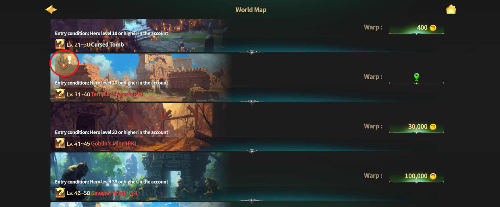
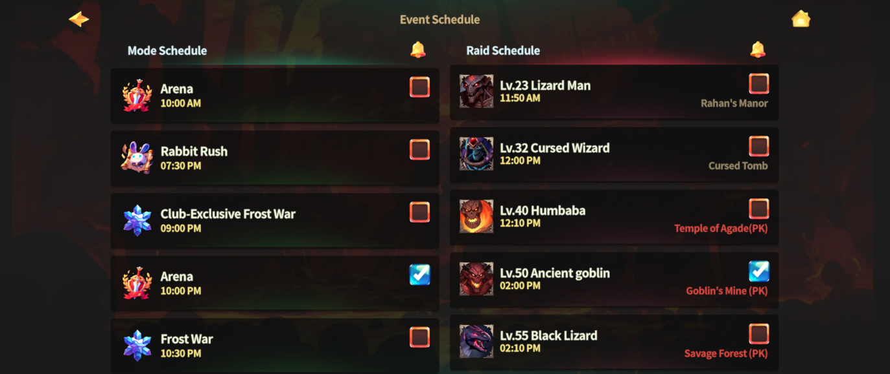

# 😈 Field Raid (Field Boss)

<figure><figcaption></figcaption></figure>



### 😈 Field Raid Guide

Field Raids are large-scale combat events \
where powerful **Field Bosses** appear at scheduled times.\
These bosses are far stronger than normal monsters, \
so teaming up with other adventurers is highly recommended.

***

#### ◾ How to Check Field Boss Spawn Notifications

You can check Field Boss spawn status and schedules in the following ways:

**① World Map**

* Open the World Map to see which fields currently have an active Field Boss.

<figure><figcaption></figcaption></figure>

**② In-Game Screen**

* Tap the ⭐ **star icon** at the top-left of the game screen.

<figure><figcaption></figcaption></figure>

* Check **Today's To-Do** to see today’s Field Boss information.

<figure><figcaption></figcaption></figure>

* Tap **Event Schedule** to view the full schedule.

<figure><figcaption></figcaption></figure>

**③ Set Boss Alerts**

* In the Event Schedule, enable the checkbox to receive **Field Boss alerts**.
* Alert times are displayed based on your **local time zone**.

***

#### ◾ Reward Criteria: Raid Points (Damage Contribution)

When a Field Boss is defeated, rewards are distributed based on your **personal Raid Points**,\
which are calculated from your **damage contribution** during the raid.

Regardless of the map or boss type, **all Field Raids share the same reward structure**.

***

#### ◾ Reward Pool Stages

Raid rewards are assigned according to your **Raid Point ranking**,\
with different **Item Pools** applied by rank.

_📌 Reward Pools are applied **automatically** once conditions are met._

| Reward Pool  | Requirement                  |
| ------------ | ---------------------------- |
| Item Pool 1  | Raid Points Rank 1           |
| Item Pool 2  | Raid Points Rank 2           |
| Item Pool 3  | Raid Points Rank 3           |
| Item Pool 4  | Raid Points Rank 4           |
| Item Pool 5  | Raid Points Rank 5           |
| Item Pool 6  | Raid Points Rank 6           |
| Item Pool 7  | Raid Points Rank 7           |
| Item Pool 8  | Raid Points Rank 8           |
| Item Pool 9  | Raid Points Rank 9           |
| Item Pool 10 | Raid Points Rank 10          |
| Item Pool 11 | Raid Points Rank 11–15       |
| Item Pool 12 | Raid Points Rank 21 or lower |



### 😈 필드 레이드 가이드

필드 레이드는 일정 시간마다 강력한 **필드 보스**가 등장하는 콘텐츠입니다.\
필드 보스는 매우 강력하므로, 여러 모험가와 협력해 공략하는 것이 좋습니다.

***

#### ◾ 필드 보스 등장 알림 확인 방법

필드 보스의 등장 여부와 일정은 아래 방법으로 확인할 수 있습니다.

**① 월드맵에서 확인하기**

* 월드맵에서 보스가 등장한 맵을 체크할 수 있습니다.

<figure><figcaption></figcaption></figure>

**② 게임 화면에서 확인하기**

* 게임 화면 좌측 상단의 ⭐ 별 모양 아이콘을 터치합니다.

<figure><figcaption></figcaption></figure>

* **Today's To-Do**에서 오늘의 보스 정보를 확인할 수 있습니다.

<figure><figcaption></figcaption></figure>

* **이벤트 스케줄**을 터치하면 전체 스케줄을 확인할 수 있습니다.

<figure><figcaption></figcaption></figure>

**③ 알람 설정하기**

* 이벤트 스케줄에서 체크박스를 선택하면 **보스 등장 알람을 설정**할 수 있습니다.
* 알람 시간은 **접속 중인 지역의 현지 시간** 기준으로 표시됩니다.

***

#### ◾ 보상 지급 기준: 레이드 포인트(데미지 기여도)

필드 보스를 처치하면,\
개인 **레이드 포인트( 데미지 기여도)** 를 기준으로 보상이 지급됩니다.

맵과 보스 종류에 관계없이, 모든 필드 레이드는 **동일한 보상 구조**를 사용합니다.

***

#### ◾ 보상 풀 단계 안내

레이드 보상은 **레이드 포인트 순위**에 따라 아이템 풀이 단계별로 적용됩니다.

| 보상 풀     | 달성 조건           |
| -------- | --------------- |
| 아이템 풀 1  | 레이드 포인트 1위      |
| 아이템 풀 2  | 레이드 포인트 2위      |
| 아이템 풀 3  | 레이드 포인트 3위      |
| 아이템 풀 4  | 레이드 포인트 4위      |
| 아이템 풀 5  | 레이드 포인트 5위      |
| 아이템 풀 6  | 레이드 포인트 6위      |
| 아이템 풀 7  | 레이드 포인트 7위      |
| 아이템 풀 8  | 레이드 포인트 8위      |
| 아이템 풀 9  | 레이드 포인트 9위      |
| 아이템 풀 10 | 레이드 포인트 10위     |
| 아이템 풀 11 | 레이드 포인트 11\~15위 |
| 아이템 풀 12 | 레이드 포인트 21위 이상  |

_📌 보상 풀은 조건에 따라 **자동 적용**됩니다._



### 😈 フィールドレイドガイド

フィールドレイドは、一定時間ごとに強力な**フィールドボス**が出現するコンテンツです。\
フィールドボスは通常のモンスターよりもはるかに強力なため、\
複数の冒険者と協力して討伐することをおすすめします。

***

#### ◾ フィールドボス出現通知の確認方法

フィールドボスの出現状況やスケジュールは、以下の方法で確認できます。

**① ワールドマップで確認**

* ワールドマップを開くと、フィールドボスが出現しているマップを確認できます。

<figure><figcaption></figcaption></figure>

**② ゲーム画面から確認**

* ゲーム画面左上の ⭐ **星アイコン**をタップします。

<figure><figcaption></figcaption></figure>

* **Today's To-Do** から、本日のフィールドボス情報を確認できます。

<figure><figcaption></figcaption></figure>

* **イベントスケジュール**をタップすると、全体スケジュールを確認できます。

<figure><figcaption></figcaption></figure>

**③ アラーム設定**

* イベントスケジュールでチェックボックスを選択すると、\
  フィールドボス出現アラームを設定できます。
* アラーム時間は、**現在接続している地域の現地時間**で表示されます。

***

#### ◾ 報酬付与基準：レイドポイント（ダメージ貢献度）

フィールドボスを討伐すると、\
個人の**レイドポイント（ダメージ貢献度）**&#x306B;応じて報酬が支給されます。

マップやボスの種類に関係なく、すべてのフィールドレイドは**共通の報酬構造**を使用します。

***

#### ◾ 報酬プール段階案内

レイド報酬は、**レイドポイントの順位**に応じて 段階別の**アイテムプール**が適用されます。

_📌 報酬プールは条件を満たすと**自動的に適用**されます。_

| アイテムプール    | 達成条件           |
| ---------- | -------------- |
| アイテムプール 1  | レイドポイント 1位     |
| アイテムプール 2  | レイドポイント 2位     |
| アイテムプール 3  | レイドポイント 3位     |
| アイテムプール 4  | レイドポイント 4位     |
| アイテムプール 5  | レイドポイント 5位     |
| アイテムプール 6  | レイドポイント 6位     |
| アイテムプール 7  | レイドポイント 7位     |
| アイテムプール 8  | レイドポイント 8位     |
| アイテムプール 9  | レイドポイント 9位     |
| アイテムプール 10 | レイドポイント 10位    |
| アイテムプール 11 | レイドポイント 11～15位 |
| アイテムプール 12 | レイドポイント 21位以下  |




[fields-by-level](../field-info/fields-by-level/)


<em>※ This guide was written based on the game status as of January 16, 2026,</em>  <em>and its contents may change with future updates.</em>

