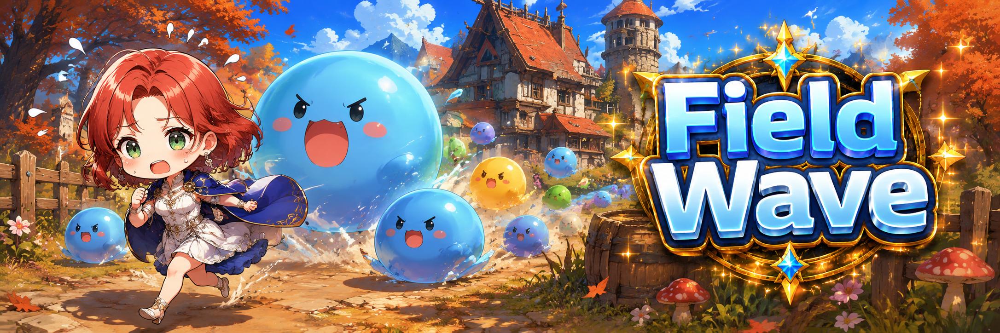

# 🎃 Field Wave

<figure><figcaption></figcaption></figure>



### 🎃 Field Wave Guide

<figure><figcaption></figcaption></figure>

Field Waves can occur **without warning** in any field.\
When a Field Wave begins, a large number of **Enhanced-type monsters** appear alongside normal monsters, threatening the hunting area.


When a Field Wave starts, **monster locations are displayed on the minimap**.\
If monsters begin to swarm all at once, be prepared. A Field Wave is in progress.


<figure><figcaption></figcaption></figure>

***

#### ◾ What Are Enhanced-Type Monsters?

During a Field Wave, special monsters appear in addition to normal enemies.\
These monsters have prefixes such as **“Giant,” “Burning,”** or **“Mutated”** in their names.

Enhanced-type monsters:

* Are **much stronger** than normal monsters
* Move in groups and patrol the field
* Can be extremely dangerous if your combat power is low

🔥 Defeating **“Burning” type monsters** grants a chance to obtain [**Lucky Boxes**](../economy/loot-box-info/lucky-box.md).

<figure><figcaption></figcaption></figure>

***

#### ◾ Field Wave Monsters by Area

* **Green Field**\
  Giant Squirrel, Giant Elk, Golden Slime, Golden Giant Slime
* **Rahan's Manor**\
  Rampaging Giant Pig, Giant Slime, Golden Slime, Golden Giant Slime
* **Cursed Tomb**\
  Mutated Magic Elk, Burning Crow, Golden Slime, Golden Giant Slime
* **Temple of Agade**\
  Mutated Desert Spider, Mutated Mudman, Burning Angel Slime, Burning Mudman,\
  Defector, Defector Action Leader, Defector Boss,\
  Golden Slime, Golden Giant Slime
* **Goblin's Mine**\
  Mutated Red Goblin, Mutated Giant Bear, Burning Magician Golem,\
  Bandit, Bandit Mage, Bandit Assassin,\
  Golden Slime, Golden Giant Slime
* **Savage Forest**\
  Mutated Madman, Burning Evil Illusion,\
  Blood Cult Apprentice, Blood Cult 3rd Rank Warrior, Blood Cult 3rd Rank Mage,\
  Golden Slime, Golden Giant Slime
* **Ancient Tears**\
  Mutated Bubble, Burning Red Ziz,\
  Blood Cult Apprentice, Blood Cult 3rd Rank Warrior, Blood Cult 3rd Rank Mage,\
  Golden Slime, Golden Giant Slime
* **Sargon Garrison**\
  Mutated Archer Captain, Burning Archer Captain, Valkyrie Mimic,\
  Golden Slime, Golden Giant Slime



### 🎃 필드 웨이브 가이드

<figure><figcaption></figcaption></figure>

각 필드에서는 예고 없이 **필드 웨이브(Field Wave)** 가 발생합니다.\
웨이브가 시작되면, 기존 몬스터와 함께 **강화 타입 몬스터**가 대량으로 등장해 사냥터를 위협합니다.


필드 웨이브가 시작되면
&#x20;**미니맵에 몬스터 위치가 표시**됩니다.
\
몬스터가 한꺼번에 몰려온다면,
&#x20;필드 웨이브를 대비하세요.


<figure><figcaption></figcaption></figure>

***

#### ◾ 강화 타입 몬스터란?

필드 웨이브에서는 일반 몬스터 외에 \
이름 앞에 **‘거대’**, **‘불타는’**, **‘변이된’** 등의 수식어가 붙은 강화 타입 몬스터가 등장합니다.

* 일반 몬스터보다 **훨씬 강력**
* 다수로 이동하며 사냥터를 순회
* 전투력이 낮다면 매우 위험할 수 있음

🔥 특히 **‘불타는’ 타입 몬스터** 처치 시 [**럭키 박스**](../economy/loot-box-info/lucky-box.md)를 획득할 수 있습니다.

<figure><figcaption></figcaption></figure>

***

#### ◾ 필드별 웨이브 등장 몬스터

* **푸른들판**\
  거대 다람쥐, 거대 엘크, 황금 슬라임, 황금 거대 슬라임
* **라한 영지**\
  거대 폭주 돼지, 거대 슬라임, 황금 슬라임, 황금 거대 슬라임
* **저주받은 무덤**\
  변이된 매직 엘크, 불타는 까마귀, 황금 슬라임, 황금 거대 슬라임
* **아가데 신전**\
  변이된 사막거미, 변이된 머드맨, 불타는 엔젤 슬라임, 불타는 머드맨, 이탈자, 이탈자 행동대장\
  이탈자 우두머리, 황금 슬라임, 황금 거대 슬라임
* **고블린 광산**\
  변이된 레드 고블린, 변이된 자이언트 베어, 불타는 매지션 골렘, 도적단원, 도적단 마법사\
  도적단 암살자, 황금 슬라임, 황금 거대 슬라임
* **야만의 숲**\
  변이된 미치광이, 불타는 악의 환영, 견습 혈교원, 혈교 3위계 전투원, 혈교 3위계 마법사\
  황금 슬라임, 황금 거대 슬라임
* **고대의 눈물**\
  변이된 버블, 불타는 레드 지즈, 견습 혈교원, 혈교 3위계 전투원, 혈교 3위계 마법사, 황금 슬라임\
  황금 거대 슬라임
* **사르곤 주둔지**\
  변이된 궁병대장, 불타는 궁병대장, 발키리 미믹, 황금 슬라임, 황금 거대 슬라임



### 🎃 ヴァルキリーミミック

<figure><figcaption></figcaption></figure>

各フィールドでは、予告なしに**フィールドウェーブ（Field Wave）**&#x304C;発生します。\
ウェーブが始まると、通常モンスターに加えて\
**強化タイプのモンスター**が大量に出現し、狩場を脅かします。


フィールドウェーブが発生すると、**ミニマップにモンスターの位置が表示されます。**\
モンスターが一気に押し寄せてきたら、フィールドウェーブを警戒しましょう。


<figure><figcaption></figcaption></figure>

***

#### ◾ 強化タイプモンスターとは？

フィールドウェーブでは、通常モンスターとは別に 名前の前に\
&#xNAN;**「巨大」「燃える」「変異した」** などの修飾語が付いた 強化タイプモンスターが出現します。

・通常モンスターよりはるかに強力\
・集団で移動し、狩場を巡回\
・戦闘力が低い場合は非常に危険

🔥 **特に「燃える」タイプのモンスターを討伐すると、**[**ラッキーボックス**](../economy/loot-box-info/lucky-box.md)**を獲得できます。**

<figure><figcaption></figcaption></figure>

***

#### ◾ フィールド別 ウェーブ出現モンスター

* **青い野原**\
  巨大リス、巨大エルク、黄金のスライム、黄金の巨大スライム
* **ラハン領地**\
  暴走巨大豚、巨大スライム、黄金のスライム、黄金の巨大スライ**ム**
* **呪われた墓**\
  変異マジックエルク、燃えるカラス、黄金のスライム、黄金の巨大スライム
* **アガデ神殿**\
  変異砂漠クモ、変異マッドマン、燃えるエンジェルスライム、燃えるマッドマン、\
  脱走者、脱走者行動隊長、脱走者ボス、黄金のスライム、黄金の巨大スライム
* **ゴブリン鉱山**\
  変異レッドゴブリン、変異ジャイアントベア、燃えるマジシャンゴーレム、\
  盗賊団員、盗賊団魔法使い、盗賊団暗殺者、黄金のスライム、黄金の巨大スライム
* **野蛮の森**\
  変異狂人、燃える悪の幻影、血教徒の見習い、血教三位階戦士、血教三位階魔法使い、\
  黄金のスライム、黄金の巨大スライム
* **古代の涙**\
  変異バブル、燃えるレッドジズ、血教徒の見習い、血教三位階戦士、血教三位階魔法使い、\
  黄金のスライム、黄金の巨大スライム
* **サルゴン駐屯地**\
  変異した弓兵隊長、燃える弓兵隊長、ヴァルキリーミミック、\
  黄金のスライム、黄金の巨大スライム



<em>※ This guide was written based on the game status as of January 16, 2026,</em>  <em>and its contents may change with future updates.</em>

