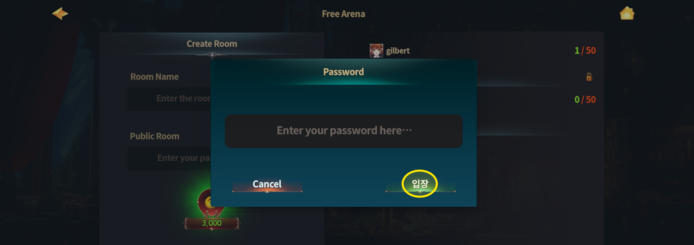
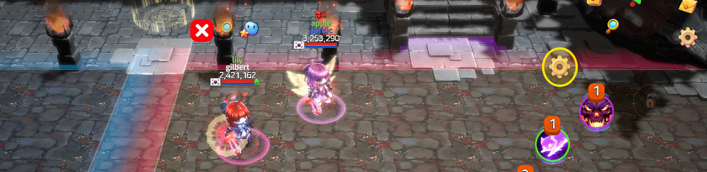
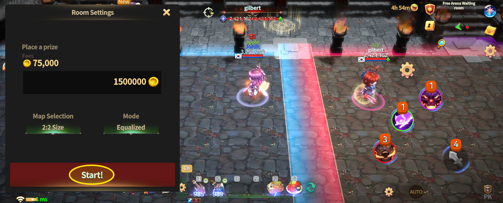
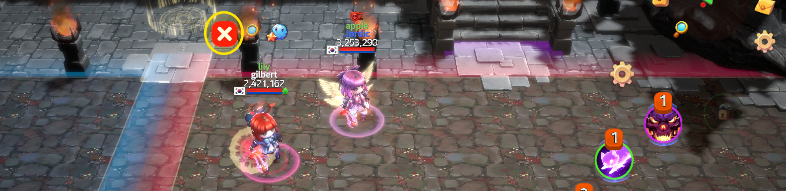

# 📁 Enterance



### 📜 Free Arena Entry Guide

Free Arena is a **practice-focused PvP mode** that you can enter at any time.\
Create your own room or join an existing one to enjoy friendly battles with friends.

***

### ◾ How to Enter Free Arena

Follow the steps below to enter Free Arena.

1️⃣ Tap the **Game Mode icon** on the left side of the minimap.

<figure><figcaption></figcaption></figure>

2️⃣ From the menu screen, tap **“Enter Free Arena”** on the **right side**.

<figure><figcaption></figcaption></figure>

3️⃣ On the Free Arena screen, choose one of the following:

* **Left**: Create a room
* **Right list**: Join an existing room

<figure><figcaption></figcaption></figure>

4️⃣ If the room is **password-protected**, enter the password using the keyboard to join.

<figure><figcaption></figcaption></figure>

***

### ◾ Host Features & Management Menu

If you create a room, you will have access to host-only features.

* **Gear icon**\
  → Opens the room management menu

<figure><figcaption></figcaption></figure>

* **Start Game button**\
  → Starts a **friendly Free Arena match**

<figure><figcaption></figcaption></figure>

***

### ◾ Player Management

* When you move close to a player inside the room, an **X-shaped button** will appear.
* Tap this button to **remove that player from the room**.

<figure><figcaption></figcaption></figure>

***

✨

> **Practice freely and improve without pressure.**\
> **Free Arena is the best place to prepare for real battles.**



### 📜 자유 아레나 입장 가이드

자유 아레나는 언제든지 참여할 수 있는 **연습용 PvP 콘텐츠**입니다.\
방을 직접 만들거나, 이미 생성된 방에 입장해 친구들과 모의 전투를 즐길 수 있습니다.

***

### ◾ 자유 아레나 입장 방법

아래 순서에 따라 자유 아레나에 입장할 수 있습니다.

1️⃣ 미니맵 좌측에 있는 **게임 모드 아이콘**을 터치합니다.

<figure><figcaption></figcaption></figure>

2️⃣ 메뉴 화면에서 우측에 있는 **‘자유 아레나 입장’** 버튼을 터치합니다.

<figure><figcaption></figcaption></figure>

3️⃣ 자유 아레나 화면에서

* **좌측**: 방 생성
* **우측 리스트**: 기존 방 입장\
  중 원하는 방법을 선택합니다.

<figure><figcaption></figcaption></figure>

4️⃣ **비밀번호가 설정된 방**일 경우, 키보드로 비밀번호를 입력한 후 입장합니다.

<figure><figcaption></figcaption></figure>

***

### ◾ 방장 기능 & 관리 메뉴

방을 생성한 경우, 방장 전용 기능을 사용할 수 있습니다.

* **톱니바퀴 아이콘**\
  → 방 관리 메뉴를 열 수 있습니다.

<figure><figcaption></figcaption></figure>

* **게임 시작 버튼**\
  → 자유 아레나 **친선 경기**를 시작합니다.

<figure><figcaption></figcaption></figure>

***

### ◾ 멤버 관리 안내

* 방 안에서 **멤버 근처로 이동하면 X 모양 버튼**이 표시됩니다.
* 해당 버튼을 터치하면 **해당 유저를 방에서 내보낼 수 있습니다.**

<figure><figcaption></figcaption></figure>

***

✨

> **자유롭게 연습하고, 부담 없이 실력을 키워보세요.**\
> **자유 아레나는, 전투를 준비하는 가장 좋은 공간입니다.**



### 📜 フリーアリーナ入場ガイド

フリーアリーナは、いつでも参加できる **練習向けPvPコンテンツ** です。\
自分でルームを作成したり、すでに作成されたルームに入場して、\
友達と模擬バトルを楽しむことができます。

***

### ◾ フリーアリーナ入場方法

以下の手順でフリーアリーナに入場できます。

1️⃣ ミニマップ左側にある **ゲームモードアイコン** をタップします。

<figure><figcaption></figcaption></figure>

2️⃣ メニュー画面で、右側にある **「フリーアリーナ入場」** ボタンをタッチします。

<figure><figcaption></figcaption></figure>

3️⃣ フリーアリーナ画面で、以下のいずれかを選択します。

* **左側**：ルーム作成
* **右側リスト**：既存ルームに入場

<figure><figcaption></figcaption></figure>

4️⃣ **パスワードが設定されたルーム** の場合、キーボードでパスワードを入力して入場します。

<figure><figcaption></figcaption></figure>

***

### ◾ ホスト機能＆管理メニュー

ルームを作成した場合、ホスト専用の機能を利用できます。

* **歯車アイコン**\
  → ルーム管理メニューを開きます。

<figure><figcaption></figcaption></figure>

* **ゲーム開始ボタン**\
  → フリーアリーナの **親善試合** を開始します。

<figure><figcaption></figcaption></figure>

***

### ◾ メンバー管理案内

* ルーム内で **メンバーの近くに移動すると、Xマークのボタン** が表示されます。
* そのボタンをタッチすると、**該当メンバーをルームから退出させることができます**。

<figure><figcaption></figcaption></figure>

***

✨

> **自由に練習し、気軽に実力を磨きましょう。**\
> **フリーアリーナは、本番の戦いに備えるための最適な場所です。**



<em>※ This guide was written based on the game status as of January 14, 2026,</em>  <em>and its contents may change with future updates.</em>

