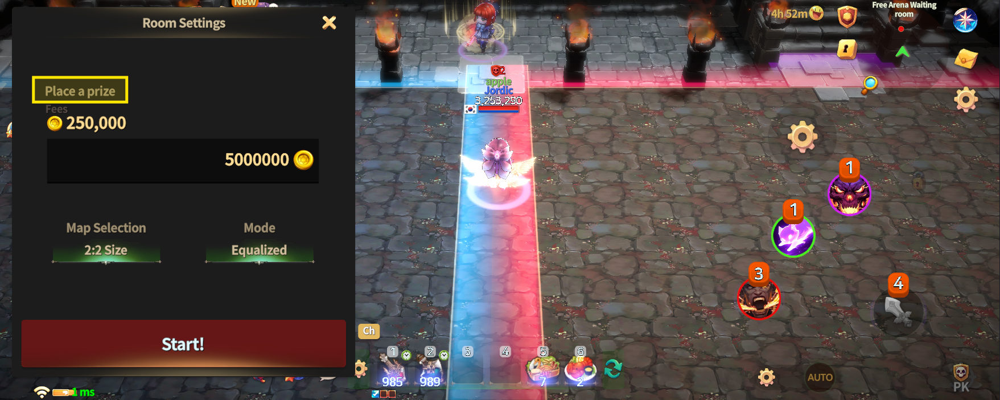
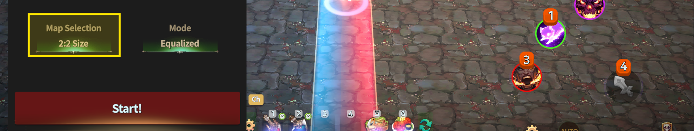
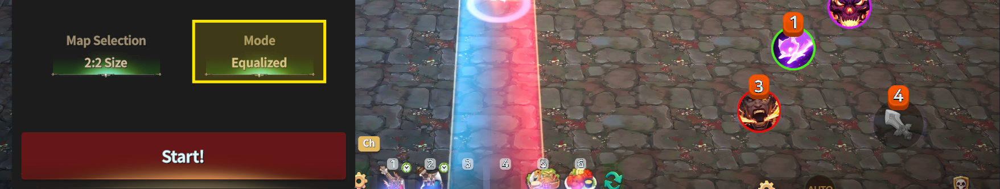
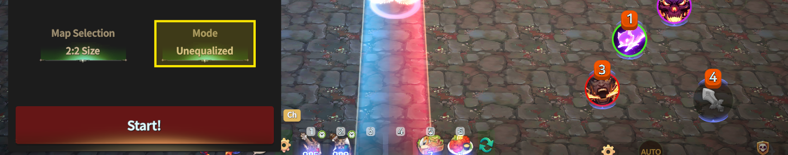

# 📁 Game Options



### 📜 Free Arena – Game Options Guide

After entering a Free Arena room, the host can open **Admin Mode** to configure match settings.\
In **Room Settings**, the host can adjust the following three game options.

***

### ◾ Reward (Gold) Settings

The host can set a **Gold reward** for the match.

* The configured Gold reward is distributed to the **winning team**,\
  evenly split **(1/n)** after a **10% fee** is deducted.
* Matches can also be played **without setting any reward**.

<figure><figcaption></figcaption></figure>

***

### ◾ Map Size Settings

Choose the arena **map size** based on your preferred combat style.

<figure><figcaption></figcaption></figure>

Four map sizes are available:

* **Small Map (2v2)**\
  Best for fast and focused battles.
* **Medium Map (4v4)**\
  A balanced battlefield for strategic team play.
* **Large Map (10v10)**\
  Allows tactical movement and wider combat space.
* **Extra Large Map (20v20)**\
  Designed for large-scale battles and chaotic team fights.

***

### ◾ Game Mode Settings

Select one of the following two game modes.

#### ⚖️ Equalized Mode

<figure><figcaption></figcaption></figure>

* All players’ stats are **equalized**.
* Equipment and character stats do not affect combat.
* Victory is decided purely by **skill and strategy**.
* Recommended for fair and competitive matches.

#### ⚔️ Unequalized Mode

<figure><figcaption></figcaption></figure>

* Players fight with their **current equipment and stats**.
* Your character enters battle exactly as built.
* Ideal for showcasing **character growth and gear setups**.

***

✨

> **Free Arena begins the moment you choose the rules.**\
> **Set up the match your way and create the most enjoyable battle experience.**



### 📜 자유 아레나 – 게임 옵션 가이드

자유 아레나 방에 입장하면, 방장은 **관리자 모드**를 통해 게임 옵션을 직접 설정할 수 있습니다.\
관리자 모드의 **룸 세팅**에서는 아래 3가지 옵션을 조정할 수 있습니다.

***

### ◾ 상금 설정

방장은 한 판의 경기에서 사용할 **상금을 설정**할 수 있습니다.

* 설정된 상금은 **10% 수수료를 제외**한 뒤,
  &#x20;**우승팀에게 1/n로 균등 분배**됩니다.
* 상금을 설정하지 않고, **베팅 없이 경기를 진행**할 수도 있습니다.

<figure><figcaption></figcaption></figure>

***

### ◾ 맵 사이즈 설정

전투 스타일에 맞게 아레나의 **맵 크기**를 선택할 수 있습니다.

<figure><figcaption></figcaption></figure>

맵은 총 **4가지 크기**가 제공됩니다.

* **소형 맵 (2:2)**\
  빠르고 집중적인 전투에 적합합니다.
* **중형 맵 (4:4)**\
  전략적인 팀플레이가 가능한 균형 잡힌 전장입니다.
* **대형 맵 (10:10)**\
  넓은 공간에서 전술적인 이동과 전투가 가능합니다.
* **초대형 맵 (20:20)**\
  대규모 전투와 혼전 속에서 승부를 가릴 수 있습니다.

***

### ◾ 게임 모드 설정

게임 진행 방식은 아래 두 가지 모드 중 하나를 선택할 수 있습니다.

#### ⚖️ 평준화 모드 (Equalized)

<figure><figcaption></figcaption></figure>

* 모든 플레이어의 능력치가 **동일하게 조정**됩니다.
* 장비와 스탯의 영향을 받지 않으며, **실력과 전략이 승부를 결정**합니다.
* 공정한 대결을 원할 경우 적합한 모드입니다.

#### ⚔️ 비평준화 모드 (Unequalized)

<figure><figcaption></figcaption></figure>

* 플레이어의 **장비와 스탯이 그대로 적용**됩니다.
* 자신이 육성한 캐릭터 상태 그대로 전투에 참여할 수 있습니다.
* 캐릭터 성장과 장비 세팅을 적극적으로 활용하고 싶을 때 적합합니다.

***

✨

> **자유 아레나는, 규칙을 고르는 순간부터 시작됩니다.**\
> **원하는 방식으로 설정하고, 가장 즐거운 전투를 만들어 보세요.**



### 📜 フリーアリーナ ― ゲームオプションガイド

フリーアリーナのルームに入場すると、ホストは **管理者モード** を使って\
ゲームオプションを直接設定できます。\
**ルーム設定** では、以下の3つのオプションを調整できます。

***

### ◾ 報酬（ゴールド）設定

ホストは、1試合で使用する **ゴールド報酬** を設定できます。

* 設定されたゴールドは **10%の手数料を差し引いた後**、**勝利チームに1/nで均等分配** されます。
* 報酬を設定せず、**ベットなしで試合を行うことも可能** です。

<figure><figcaption></figcaption></figure>

***

### ◾ マップサイズ設定

戦闘スタイルに合わせて、アリーナの **マップサイズ** を選択できます。

<figure><figcaption></figcaption></figure>

マップは **全4種類** 用意されています。

* **小型マップ（2対2）**\
  素早く集中した戦闘に適しています。
* **中型マップ（4対4）**\
  戦略的なチームプレイが楽しめる、\
  バランスの取れた戦場です。
* **大型マップ（10対10）**\
  広い空間で戦術的な移動と戦闘が可能です。
* **超大型マップ（20対20）**\
  大規模戦闘や混戦を楽しめるマップです。

***

### ◾ ゲームモード設定

ゲームの進行方式は、以下の2つのモードから選択できます。

#### ⚖️ 平準化モード（Equalized）

<figure><figcaption></figcaption></figure>

* すべてのプレイヤーの能力値が **同じ条件に調整** されます。
* 装備やステータスの影響を受けず、**実力と戦略が勝敗を決めます**。
* 公平な対戦を楽しみたい場合に適したモードです。

#### ⚔️ 非平準化モード（Unequalized）

<figure><figcaption></figcaption></figure>

* プレイヤーの **装備とステータスがそのまま反映** されます。
* 育成したキャラクターの状態で そのまま戦闘に参加できます。
* キャラクター成長や装備構成を 最大限に活かしたい場合に適しています。

***

✨

> **フリーアリーナは、ルールを選んだ瞬間から始まります。**\
> **自分だけの設定で、最高のバトルを楽しみましょう。**



<em>※ This guide was written based on the game status as of January 14, 2026,</em>  <em>and its contents may change with future updates.</em>

