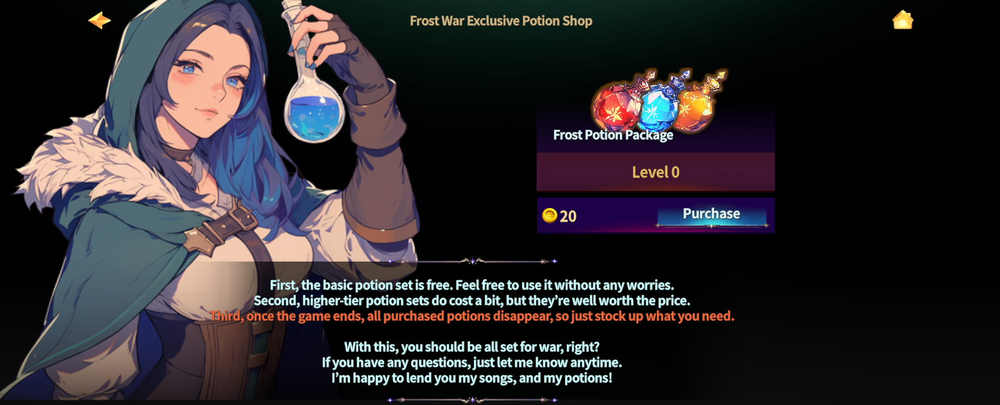
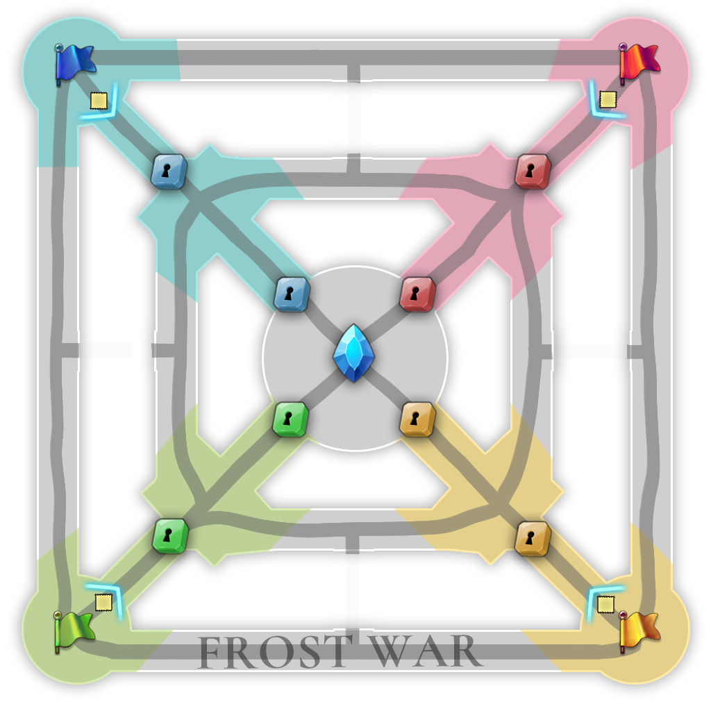

# ❄️ Frost War



### 📜 Frost War Guide

A small battlefield with intense action.\
**Frost War** is a mini siege-style PvP mode where strategy and teamwork decide victory.

Enjoy the thrill of large-scale PvP in a fast and focused format.\
This is not just about getting kills. **Objectives and coordination matter most.**

***

### ◾ How to Enter

Follow the steps below to join Frost War.

1️⃣ Tap the **Game Mode icon** on the left side of the minimap.

<figure><figcaption></figcaption></figure>

2️⃣ Select **Frost War Lobby** from the top menu.

<figure><figcaption></figcaption></figure>

***

### ◾ Schedule

* Starts **daily at** 🎯**13:30 UTC** 🎯**08:30 ETC (UTC-5)**
* The battle starts automatically at the scheduled time.

⚠️ Make sure to enter the lobby before the match begins.

***

### ◾ Participation Rules

* Participation is determined by the **character that enters the lobby**.
* When the battle starts, **all food and buff effects are removed automatically**.\
  → Everyone begins the fight under the same conditions.

<table><thead><tr><th width="233.5556640625">Character Level</th><th>Entry Conditions</th></tr></thead><tbody><tr><td>Level 48+</td><td>Join with your current gear and stats</td></tr><tr><td>Below Level 48</td><td>Join with AI-set stats, gear, and random skills</td></tr><tr><td>Gear Setting</td><td>Stats based on "Awakening Darkness +0" equipment</td></tr></tbody></table>

***

### ◾ Battle Preparation – Potion Purchase

You can purchase **Frost Potion Packages** from NPC **Rena** inside the lobby.

<figure><figcaption></figcaption></figure>

#### 📦 Basic Potion Package (Level 0)

* HP Potion × 10
* MP Potion × 10
* Summon HP Potion × 10


#### ⚠️ Important Notes

* Potions are **single-use only**.
* Any unused potions are **deleted automatically** after the battle ends.\
  → Use them wisely when the timing matters.


#### 📦 Potion packages are also available by level.

| Potion Level | Price (Gold) | Total Potions (each: HP, MP, Summon HP) |
| ------------ | ------------ | --------------------------------------- |
| Lv.0         | Default      | 10                                      |
| Lv.1         | 20           | 20                                      |
| Lv.2         | 100          | 30                                      |
| Lv.3         | 500          | 40                                      |
| Lv.4         | 2,500        | 50                                      |
| Lv.5         | 6,000        | 60                                      |
| Lv.6         | 15,000       | 70                                      |
| Lv.7         | 30,000       | 80                                      |
| Lv.8         | 50,000       | 90                                      |
| Lv.9         | 80,000       | 100                                     |
| Lv.10        | 100,000      | 110                                     |

***

### ◾ Team Formation

* Participants are randomly divided into **4 teams**.
* Each team consists of:
  * **7 player characters (PCs)**
  * **Up to 40 minions**
* If there are not enough players, **AI-controlled units are added automatically**.

***

### ◾ Battlefield Structure & Starting Positions

<figure><figcaption></figcaption></figure>

* Each team starts from **one of the four corners of the map**.
* The battlefield is fully open, allowing free movement and flexible strategies.

***

### ◾ Combat Rules

* Defeating an enemy **player character** increases your team’s **minion level**.
* Minion Effects:
  * **+20% attack power per level**
  * Can grow up to **Level 20**
* **AI-controlled PCs do not count toward PK totals.**

***

### ◾ Victory Conditions

Achieve **one** of the following to win:

* Destroy **two enemy gates**
* Reach the **central control stone**
* Win by **total damage contribution** to the control stone

💡 This mode rewards objective play and teamwork, not just eliminations.

***

### ◾ Reward System

Frost War rewards are divided into two categories:

* **HOT5 Rewards**
* **Win / Loss Rewards**

<mark style="background-color:$success;">**If you are not selected for HOT5, you will receive only the win or loss reward.**</mark>

***

### ◾ HOT5 Selection Criteria

HOT5 players are selected based on **Battle Score**.

#### 📊 Battle Score Formula

```
(Gate 1 Contribution × 1.2)
+ (Gate 2 Contribution × 1.2)
+ (Control Stone Contribution × 1.5)
+ (PK Contribution × 1.2)
= Battle Score
```


#### 🔍 Contribution Details

* **Control Stone Contribution**\
  → Damage dealt to the control stone ÷ Total HP of the control stone
* **PK Contribution**\
  → Your PK count ÷ Total PK count of all players in the match


***

### ◾ Rank-Based Rewards (Arena Rank)

**■ Arena Emperor & Noblesse**

| Rank       | Item          | Count | Gold (🛡️Club) | Gold (🧍Solo) |
| ---------- | ------------- | ----- | -------------- | ------------- |
| PK\_RANK 1 | Red Lucky Box | 3     | 900,000        | 400,000       |
| PK\_RANK 2 | Red Lucky Box | 2     | 800,000        | 300,000       |
| PK\_RANK 3 | Red Lucky Box | 1     | 600,000        | 200,000       |
| PK\_RANK 4 | Arena Coin    | 1     | 300,000        | 100,000       |
| PK\_RANK 5 | Arena Coin    | 1     | 100,000        | 50,000        |
| Winner     | -             | -     | 500,000        | 400,000       |
| Defeated   | -             | -     | 10,000         | 10,000        |

**■ Arena Gold & Silver**

| Rank       | Item          | Count | Gold (🛡️Club) | Gold (🧍Solo) |
| ---------- | ------------- | ----- | -------------- | ------------- |
| PK\_RANK 1 | Red Lucky Box | 3     | 800,000        | 350,000       |
| PK\_RANK 2 | Red Lucky Box | 2     | 700,000        | 250,000       |
| PK\_RANK 3 | Red Lucky Box | 1     | 500,000        | 150,000       |
| PK\_RANK 4 | Arena Coin    | 1     | 250,000        | 80,000        |
| PK\_RANK 5 | Arena Coin    | 1     | 80,000         | 40,000        |
| Winner     | -             | -     | 350,000        | 360,000       |
| Defeated   | -             | -     | 8,000          | 10,000        |


**■ Arena Bronze**

| Rank       | Item          | Count | Gold (🛡️Club) | Gold (🧍Solo) |
| ---------- | ------------- | ----- | -------------- | ------------- |
| PK\_RANK 1 | Red Lucky Box | 3     | 700,000        | 300,000       |
| PK\_RANK 2 | Red Lucky Box | 2     | 600,000        | 200,000       |
| PK\_RANK 3 | Red Lucky Box | 1     | 400,000        | 100,000       |
| PK\_RANK 4 | Arena Coin    | 1     | 150,000        | 70,000        |
| PK\_RANK 5 | Arena Coin    | 1     | 70,000         | 30,000        |
| Winner     | -             | -     | 320,000        | 340,000       |
| Defeated   | -             | -     | 7,000          | 7,000         |

***

### 🎁 Lucky Box Contents

🎁 **Red Lucky Box**

| Item                         | Min | Max | Probability (%) |
| ---------------------------- | --- | --- | --------------- |
| Mystic Stone                 | 1   | 1   | 1               |
| Raid Material Random Box     | 2   | 2   | 12              |
| Book of Oblivion             | 1   | 1   | 3               |
| Equipment/Item Trading Pass  | 1   | 1   | 3\~5            |
| PK Shield                    | 1   | 1   | 4               |
| Town Return Scroll           | 1   | 1   | 10              |
| Energy50 Booster             | 1   | 1   | 8               |
| Starcandy                    | 1   | 1   | 8               |
| Special Material Random Box  | 2   | 2   | 12              |
| Hero/Weapon/Equipment Reload | 1   | 1   | 1\~1.5          |
| Resurrection Feather         | 1   | 1   | 3.5             |
| Magic HP/MP Potion           | 30  | 40  | 12 each         |

***

#### 🎁 Blue Lucky Box

| Item                      | Min  | Max  | Probability (%) |
| ------------------------- | ---- | ---- | --------------- |
| Neutralizing Agent        | 2    | 5    | 8               |
| Arena Coin / Seal         | 1    | 1    | 2 each          |
| Extocium / Fragment       | 1    | 1    | 2\~3            |
| Pen of Oblivion / Lemon   | 1    | 1    | 5 each          |
| Steak / Salad / Soup      | 1    | 1    | 8 each          |
| Adventurer's HP/MP Potion | 1    | 20   | 10 each         |
| Powder of Blessing        | 1    | 5    | 8               |
| Evil Crystal / Obsidian   | 1\~3 | 2\~5 | 2\~4            |
| Mystic Stone              | 1    | 1    | 0.1             |

✨

> If you’re new to PvP, Frost War is the perfect place to start.\
> Simple rules, clear objectives, and the power of teamwork.
>
> **Every night at  13:30(UTC).**\
> See you on the battlefield in Frost War. ❄️🔥



### 📜 프로스트 워 가이드

작지만 치열한 전장, **미니 공성전 PvP 콘텐츠, 프로스트 워!**

프로스트 워에서는 대규모 PvP의 재미를 짧고 강렬하게 즐길 수 있습니다.\
단순한 처치 경쟁이 아닌, **전략과 협동이 승리를 결정합니다.**

***

### ◾ 입장 방법

아래 순서에 따라 프로스트 워에 입장할 수 있습니다.

1️⃣ 미니맵 좌측에 있는 **게임 모드 아이콘**을 터치합니다.

<figure><figcaption></figcaption></figure>

2️⃣ 상단 메뉴에서 **프로스트 워 대기실**을 선택합니다.

<figure><figcaption></figcaption></figure>

***

### ◾ 진행 시간

* **매일 22:30 (KST)**
* 정시에 자동으로 전투가 시작됩니다.

⚠️ 시작 시간 전에 반드시 대기실에 입장해 주세요.

***

### ◾ 참여 조건 안내

* 대기실에 **입장한 캐릭터 기준**으로 전장 참여가 결정됩니다.
* 전투 시작 시 **음식 및 모든 버프 효과는 자동으로 제거**됩니다.\
  → 모두가 같은 조건에서 전투를 시작합니다.

<table><thead><tr><th width="222.6363525390625">캐릭터 레벨</th><th>전장 참여 방식</th></tr></thead><tbody><tr><td>48 이상</td><td>현재 장비 및 스탯 그대로 전장 참여</td></tr><tr><td>48 미만</td><td>AI 설정 기반 스탯/장비/스킬로 전장 참여 (스킬은 랜덤)</td></tr><tr><td>장비 설정</td><td>'깨어나는 어둠 +0' 기준 장비 스탯 적용</td></tr></tbody></table>

***

### ◾ 전투 준비 – 포션 구매

대기실 내 NPC **레나(Lena)** 를 통해 **프로스트 포션 패키지**를 구매할 수 있습니다.

<figure><figcaption></figcaption></figure>

#### 📦 기본 포션 구성 (레벨 0 패키지 기준)

* HP 포션 × 10
* MP 포션 × 10
* 소환수 HP 포션 × 10


#### ⚠️ **주의사항**

* 포션은 **1회용**입니다.
* 전쟁 종료 후, **사용하지 않은 포션은 자동 삭제**됩니다.\
  → 아끼지 말고 필요한 타이밍에 사용하세요.


#### 📦 레벨별 포션 구매 정보

<table><thead><tr><th width="134.3636474609375">포션 레벨</th><th width="161.0909423828125">가격 (Gold)</th><th>추가 포션 수 (HP, MP, 소환수 HP 각각)</th></tr></thead><tbody><tr><td>Lv.0</td><td>기본 제공</td><td>10개</td></tr><tr><td>Lv.1</td><td>20</td><td>20개</td></tr><tr><td>Lv.2</td><td>100</td><td>30개</td></tr><tr><td>Lv.3</td><td>500</td><td>40개</td></tr><tr><td>Lv.4</td><td>2,500</td><td>50개</td></tr><tr><td>Lv.5</td><td>6,000</td><td>60개</td></tr><tr><td>Lv.6</td><td>15,000</td><td>70개</td></tr><tr><td>Lv.7</td><td>30,000</td><td>80개</td></tr><tr><td>Lv.8</td><td>50,000</td><td>90개</td></tr><tr><td>Lv.9</td><td>80,000</td><td>100개</td></tr><tr><td>Lv.10</td><td>100,000</td><td>110개</td></tr></tbody></table>

***

### ◾ 팀 구성 방식

* 참가자는 **무작위 4개 팀**으로 배정됩니다.
* 각 팀 구성:
  * **PC 유저 7명**
  * **미니언 최대 40마리**
* 참가 인원이 부족할 경우, **AI가 자동으로 보충**됩니다.

***

### ◾ 전장 구조 & 시작 위치

<figure><figcaption></figcaption></figure>

* 각 팀은 **맵의 네 모서리**에서 시작합니다.
* 모든 경로가 열려 있는 **개방형 맵**에서 자유롭게 이동하며 전략을 펼칠 수 있습니다.

***

### ◾ 전투 규칙

* 상대 팀 **PC를 처치하면**, 우리 팀 **미니언의 레벨이 상승**합니다.
* 미니언 효과:
  * 레벨당 공격력 **+20%**
  * 최대 **20레벨**까지 성장
* **AI PC는 PK 수에 포함되지 않습니다.**

***

### ◾ 승리 조건

아래 조건 중 하나를 달성하면 승리합니다.

* 상대 팀의 **게이트 2개 파괴**
* **중앙 점령석 도달**
* 점령석에 가한 **누적 데미지 기여도** 비교

💡 단순 처치 수가 아닌, **목표 달성과 팀 협력이 핵심**입니다.

***

### ◾ 보상 시스템

프로스트 워 보상은 **2가지**로 구성됩니다.

* **HOT5 보상**
* **승리 / 패배 보상**

<mark style="background-color:$success;">**HOT5에 포함되지 않은 경우, 승리 또는 패배 보상만 획득합니다.**</mark>

***

### ◾ HOT5 선정 기준

HOT5는 **전투 스코어**를 기준으로 선정됩니다.

#### 📊 전투 스코어 계산식

```
(게이트1 기여도 × 1.2)
+ (게이트2 기여도 × 1.2)
+ (점령석 기여도 × 1.5)
+ (PK 기여도 × 1.2)
= 전투 스코어
```


#### 🔍 기여도 계산 방식

* **점령석 기여도**\
  → 내가 점령석에 입힌 데미지 ÷ 점령석 전체 HP
* **PK 기여도**\
  → 나의 PK 횟수 ÷ 전체 유저 PK 총합


***

### ◾ 등급별 보상 (아레나 랭크 기준)

**■ 아레나 엠퍼러, 아레나 노블레스**

| 랭크         | 보상 아이템  | 수량 | Gold (🛡️클럽) | Gold (🧍개인) |
| ---------- | ------- | -- | ------------ | ----------- |
| PK\_RANK 1 | 레드 럭키박스 | 3  | 900,000      | 400,000     |
| PK\_RANK 2 | 레드 럭키박스 | 2  | 800,000      | 300,000     |
| PK\_RANK 3 | 레드 럭키박스 | 1  | 600,000      | 200,000     |
| PK\_RANK 4 | 아레나 코인  | 1  | 300,000      | 100,000     |
| PK\_RANK 5 | 아레나 코인  | 1  | 100,000      | 50,000      |
| Winner     | -       | -  | 500,000      | 400,000     |
| Defeated   | -       | -  | 10,000       | 10,000      |

**■ 아레나 골드, 아레나 실버**

| 랭크         | 보상 아이템  | 수량 | Gold (🛡️클럽) | Gold (🧍개인) |
| ---------- | ------- | -- | ------------ | ----------- |
| PK\_RANK 1 | 레드 럭키박스 | 3  | 800,000      | 350,000     |
| PK\_RANK 2 | 레드 럭키박스 | 2  | 700,000      | 250,000     |
| PK\_RANK 3 | 레드 럭키박스 | 1  | 500,000      | 150,000     |
| PK\_RANK 4 | 아레나 코인  | 1  | 250,000      | 80,000      |
| PK\_RANK 5 | 아레나 코인  | 1  | 80,000       | 40,000      |
| Winner     | -       | -  | 350,000      | 360,000     |
| Defeated   | -       | -  | 8,000        | 8,000       |

**■ 아레나 브론즈**

| 랭크         | 보상 아이템  | 수량 | Gold (🛡️클럽) | Gold (🧍개인) |
| ---------- | ------- | -- | ------------ | ----------- |
| PK\_RANK 1 | 레드 럭키박스 | 3  | 700,000      | 300,000     |
| PK\_RANK 2 | 레드 럭키박스 | 2  | 600,000      | 200,000     |
| PK\_RANK 3 | 레드 럭키박스 | 1  | 400,000      | 100,000     |
| PK\_RANK 4 | 아레나 코인  | 1  | 150,000      | 70,000      |
| PK\_RANK 5 | 아레나 코인  | 1  | 70,000       | 30,000      |
| Winner     | -       | -  | 320,000      | 340,000     |
| Defeated   | -       | -  | 7,000        | 7,000       |

***

### 🎁 럭키박스 구성품

🎁 **레드 럭키 박스**

| 아이템명                         | 최소  | 최대 | 확률 (%)  |
| ---------------------------- | --- | -- | ------- |
| Mystic stone                 | 1   | 1  | 1       |
| Raid Material Random Box     | 2   | 2  | 12      |
| Book of Oblivion             | 1   | 1  | 3       |
| Equipment/Item Trading Pass  | 각 1 | 1  | 3\~5    |
| PK Shield                    | 1   | 1  | 4       |
| Town Return Scroll           | 1   | 1  | 10      |
| Energy50 Booster             | 1   | 1  | 8       |
| Starcandy                    | 1   | 1  | 8       |
| Special Material Random Box  | 2   | 2  | 12      |
| Hero/Weapon/Equipment Reload | 1   | 1  | 1\~1.5  |
| Resurrection Feather         | 1   | 1  | 3.5     |
| Magic HP/MP potion           | 30  | 40 | 12 each |

***

✨

> 처음 PvP에 도전한다면, 프로스트 워는 가장 좋은 시작점입니다.\
> 간단한 룰, 명확한 목표, 그리고 협동의 재미까지.
>
> **매일 밤 10시 30분**, 프로스트 워에서 만나요.



### 📜 フロストウォーガイド

小さくても激しい戦場。\
**フロストウォー** は、ミニ攻城戦形式のPvPコンテンツです。

短時間で大規模PvPの迫力を体験でき、\
単なる撃破数ではなく、**戦略とチームワーク** が勝利を左右します。

***

### ◾ 入場方法

以下の手順でフロストウォーに参加できます。

1️⃣ ミニマップ左側にある **ゲームモードアイコン** をタップします。

<figure><figcaption></figcaption></figure>

2️⃣ 上部メニューから **フロストウォー待機室** を選択します。

<figure><figcaption></figcaption></figure>

***

### ◾ 開催時間

* **毎日 22:30（KST）**
* 開始時間になると、自動で戦闘が始まります。

⚠️ 開始前に必ず待機室へ入場してください。

***

### ◾ 参加条件について

* 待機室に入場した **キャラクター基準** で参戦が決定されます。
* 戦闘開始時、**食べ物およびすべてのバフ効果は自動的に解除** されます。\
  → 全員が同じ条件で戦闘を開始します。

<table><thead><tr><th width="171.33349609375">キャラクターレベル</th><th>参加形式</th></tr></thead><tbody><tr><td>48以上</td><td>現在の装備とステータスで参加</td></tr><tr><td>48未満</td><td>AIが設定した装備・ステータス・スキルで参加（スキルはランダム）</td></tr><tr><td>装備基準</td><td>「目覚めし闇 +0」のステータス基準で統一されます</td></tr></tbody></table>

***

### ◾ 戦闘準備 ― ポーション購入

待機室内のNPC **レナ（Rena）** から **フロストポーションパッケージ** を購入できます。

<figure><figcaption></figcaption></figure>

#### 📦 基本ポーション構成（レベル0パッケージ基準）

* HPポーション × 10
* MPポーション × 10
* 召喚獣HPポーション × 10


#### ⚠️ 注意事項

* ポーションは **使い切り** です。
* 戦闘終了後、**未使用のポーションは自動的に削除** されます。\
  → 必要なタイミングで積極的に使用してください。


#### 📦 レベル別ポーション情報

| ポーションレベル | 価格（ゴールド） | 各種ポーション数（HP/MP/召喚体） |
| -------- | -------- | ------------------- |
| Lv.0     | 初期提供     | 10個                 |
| Lv.1     | 20       | 20個                 |
| Lv.2     | 100      | 30個                 |
| Lv.3     | 500      | 40個                 |
| Lv.4     | 2,500    | 50個                 |
| Lv.5     | 6,000    | 60個                 |
| Lv.6     | 15,000   | 70個                 |
| Lv.7     | 30,000   | 80個                 |
| Lv.8     | 50,000   | 90個                 |
| Lv.9     | 80,000   | 100個                |
| Lv.10    | 100,000  | 110個                |

***

### ◾ チーム編成

* 参加者は **ランダムに4チーム** に分けられます。
* 各チーム構成：
  * **プレイヤーキャラクター（PC）7名**
  * **ミニオン最大40体**
* 参加人数が不足している場合、**AIが自動的に補充** されます。

***

### ◾ マップ構造 & 開始位置

<figure><figcaption></figcaption></figure>

* 各チームは、**マップの四隅** からスタートします。
* すべてのルートが開放された **オープンマップ** で、自由に戦略を展開できます。

***

### ◾ 戦闘ルール

* 敵チームの **PCを撃破** すると、自チームの **ミニオンレベルが上昇** します。
* ミニオン効果：
  * レベルごとに **攻撃力 +20%**
  * 最大 **レベル20** まで成長
* **AI操作のPCはPK数に含まれません。**

***

### ◾ 勝利条件

以下のいずれかを達成すると勝利となります。

* 敵チームの **ゲートを2つ破壊**
* **中央占領石に到達**
* 占領石への **累積ダメージ貢献度** による判定

💡 単なる撃破数ではなく、**目標達成とチーム連携** が重要です。

***

### ◾ 報酬システム

フロストウォーの報酬は、以下の **2種類** で構成されています。

* **HOT5報酬**
* **勝利 / 敗北報酬**

<mark style="background-color:$success;">**HOT5に選ばれなかった場合は、勝利または敗北報酬のみを獲得します。**</mark>

***

### ◾ HOT5 選定基準

HOT5は **戦闘スコア** を基準に選出されます。

#### 📊 戦闘スコア計算式

```
（ゲート1貢献度 × 1.2）
+（ゲート2貢献度 × 1.2）
+（占領石貢献度 × 1.5）
+（PK貢献度 × 1.2）
= 戦闘スコア
```


#### 🔍 貢献度の算出方法

* **占領石貢献度**\
  → 自分が与えた占領石ダメージ ÷ 占領石の総HP
* **PK貢献度**\
  → 自分のPK回数 ÷ 戦闘全体のPK総数


***

### ◾ ランク別報酬（アリーナランク基準）

**■ アリーナエンペラー, アリーナノブレス**

| ランク        | アイテム        | 数量 | Gold (🛡️クラブ) | Gold (🧍個人) |
| ---------- | ----------- | -- | ------------- | ----------- |
| PK\_RANK 1 | レッドラッキーボックス | 3  | 900,000       | 400,000     |
| PK\_RANK 2 | レッドラッキーボックス | 2  | 800,000       | 300,000     |
| PK\_RANK 3 | レッドラッキーボックス | 1  | 600,000       | 200,000     |
| PK\_RANK 4 | アリーナコイン     | 1  | 300,000       | 100,000     |
| PK\_RANK 5 | アリーナコイン     | 1  | 100,000       | 50,000      |
| Winner     | -           | -  | 500,000       | 400,000     |
| Defeated   | -           | -  | 10,000        | 10,000      |


**■ アリーナゴールド, アリーナシルバー**

| ランク        | アイテム        | 数量 | Gold (🛡️クラブ) | Gold (🧍個人) |
| ---------- | ----------- | -- | ------------- | ----------- |
| PK\_RANK 1 | レッドラッキーボックス | 3  | 800,000       | 350,000     |
| PK\_RANK 2 | レッドラッキーボックス | 2  | 700,000       | 250,000     |
| PK\_RANK 3 | レッドラッキーボックス | 1  | 500,000       | 150,000     |
| PK\_RANK 4 | アリーナコイン     | 1  | 250,000       | 80,000      |
| PK\_RANK 5 | アリーナコイン     | 1  | 80,000        | 40,000      |
| Winner     | -           | -  | 350,000       | 360,000     |
| Defeated   | -           | -  | 8,000         | 8,000       |


**■ アリーナブロンズ**

| ランク        | アイテム        | 数量 | Gold (🛡️クラブ) | Gold (🧍個人) |
| ---------- | ----------- | -- | ------------- | ----------- |
| PK\_RANK 1 | レッドラッキーボックス | 3  | 700,000       | 300,000     |
| PK\_RANK 2 | レッドラッキーボックス | 2  | 600,000       | 200,000     |
| PK\_RANK 3 | レッドラッキーボックス | 1  | 400,000       | 100,000     |
| PK\_RANK 4 | アリーナコイン     | 1  | 150,000       | 70,000      |
| PK\_RANK 5 | アリーナコイン     | 1  | 70,000        | 30,000      |
| Winner     | -           | -  | 320,000       | 340,000     |
| Defeated   | -           | -  | 7,000         | 7,000       |

***

### 🎁 ラッキーボックス内容

🎁 **レッド・ラッキーボックス**

| アイテム名          | 最小 | 最大 | 確率（%） |
| -------------- | -- | -- | ----- |
| ミスティックストーン     | 1  | 1  | 1     |
| レイド素材ランダムボックス  | 2  | 2  | 12    |
| 忘却の書           | 1  | 1  | 3     |
| 装備/アイテム取引パス    | 1  | 1  | 3〜5   |
| PKシールド         | 1  | 1  | 4     |
| 帰還スクロール        | 1  | 1  | 10    |
| エナジー50ブースター    | 1  | 1  | 8     |
| スターキャンディ       | 1  | 1  | 8     |
| 特別素材ランダムボックス   | 2  | 2  | 12    |
| 特殊リロード各種       | 1  | 1  | 1〜1.5 |
| 復活の羽根          | 1  | 1  | 3.5   |
| マジックHP/MPポーション | 30 | 40 | 各12   |

***

✨

> **PvPが初めての方にも、フロストウォーは最適な戦場です。**\
> **シンプルなルール、明確な目標、そして協力の楽しさ。**
>
> **毎晩22時30分。フロストウォーでお会いしましょう。**&#x20;



<p align="right"><sup><em>※ This guide was written based on the game status as of January 14, 2026,</em></sup> <br><sup><em>and its contents may change with future updates.</em></sup></p>
