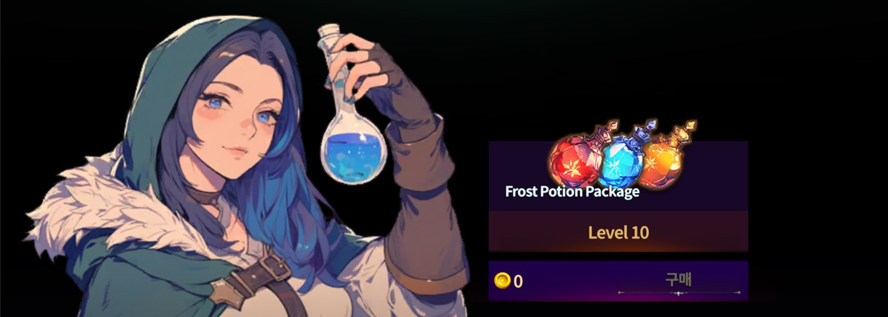

# ❄️ Frost War



## ❄️ Frost War Guide

_A compact but intense battlefield!_\
Get a taste of large-scale PvP with **Frost War** — fast, fierce, and super fun.

***

### 💡 Before You Join

#### 🕹 How to Enter

Tap the **\[Mode]** button in-game and head to the **Frost War Lobby**.

<figure><figcaption></figcaption></figure>

#### ⏰ Schedule

Starts **daily at** \
🎯**13:30 UTC**\
🎯**08:30 ETC (UTC-5)**\
🎯**22:30 KST**\
Don’t be late—auto match begins right on time!

***

### 🧪 Potion Purchase

You can grab a _Frost Potion Package_ from **NPC ‘Rena’** in the lobby.

<figure><figcaption></figcaption></figure>

#### **⚠️ Heads Up!**

* Potions are **single-use only**
* **Unused potions disappear** after the war ends\
  → So don’t hoard—use them when it matters most!

#### **🧊 Base Potion Set (Level 0 Package)**

* HP Potion × 10
* MP Potion × 10
* Summon HP Potion × 10

#### 🧊 Level-based Potion Info

| Potion Level | Price (Gold) | Total Potions (each: HP, MP, Summon HP) |
| ------------ | ------------ | --------------------------------------- |
| Lv.0         | Default      | 10                                      |
| Lv.1         | 20           | 20                                      |
| Lv.2         | 100          | 30                                      |
| Lv.3         | 500          | 40                                      |
| Lv.4         | 2,500        | 50                                      |
| Lv.5         | 6,000        | 60                                      |
| Lv.6         | 15,000       | 70                                      |
| Lv.7         | 30,000       | 80                                      |
| Lv.8         | 50,000       | 90                                      |
| Lv.9         | 80,000       | 100                                     |
| Lv.10        | 100,000      | 110                                     |


All food and buffs are **automatically cleared** at the start of battle.\
→ Everyone enters the field with a clean slate. No cheats, no boosts!


***

### 🧙 Participation Requirements

The character you bring into the lobby is the one that joins the fight.

| Character Level | Entry Conditions                                 |
| --------------- | ------------------------------------------------ |
| Level 48+       | Join with your current gear and stats            |
| Below Level 48  | Join with AI-set stats, gear, and random skills  |
| Gear Setting    | Stats based on "Awakening Darkness +0" equipment |

***

### ⚔️ How the Battle Works

#### 👥 Team Formation

* 4 random teams
* Each team = **7 players + up to 50 minions**\
  → Short on players? **AI teammates will fill in!**

#### 🚩 Starting Points

Teams start from the **4 corners of the map**\
Explore and strategize freely — it’s an open battlefield.

***

### 📏 Combat Rules

* Defeating enemy players **levels up your team’s minions**
* Each level gives **+20% attack power**, up to **level 20**

***

### 🏆 How to Win

1. Destroy **2 enemy gates**
2. Reach the **central capture stone**
3. Victory is based on **total damage contributed to the stone**

→ It’s not just a brawl — **teamwork and tactics** win the war.

***

### 🎁 Reward System

#### 🏅 Rank-Based Rewards (Arena Tier)

**■ Arena Emperor**

| Rank      | Gold      | Item          | Qty |
| --------- | --------- | ------------- | --- |
| PK\_RANK1 | 1,500,000 | Red Lucky Box | 3   |
| PK\_RANK2 | 1,000,000 | Red Lucky Box | 2   |
| PK\_RANK3 | 700,000   | Red Lucky Box | 1   |
| WINNER    | 300,000   | Arena Coin    | 2   |
| LOSER     | 20,000    | -             | -   |

**■ Arena Noblesse**

| Rank      | Gold      | Item          | Qty |
| --------- | --------- | ------------- | --- |
| PK\_RANK1 | 1,100,000 | Red Lucky Box | 3   |
| PK\_RANK2 | 700,000   | Red Lucky Box | 2   |
| PK\_RANK3 | 400,000   | Red Lucky Box | 1   |
| WINNER    | 150,000   | Arena Coin    | 2   |
| LOSER     | 15,000    | -             | -   |

**■ Arena Gold**

| Rank      | Gold    | Item           | Qty |
| --------- | ------- | -------------- | --- |
| PK\_RANK1 | 700,000 | Blue Lucky Box | 3   |
| PK\_RANK2 | 300,000 | Blue Lucky Box | 2   |
| PK\_RANK3 | 200,000 | Blue Lucky Box | 1   |
| WINNER    | 70,000  | Arena Coin     | 1   |
| LOSER     | 5,000   | -              | -   |

**■ Arena Silver**

| Rank      | Gold    | Item           | Qty |
| --------- | ------- | -------------- | --- |
| PK\_RANK1 | 200,000 | Blue Lucky Box | 3   |
| PK\_RANK2 | 100,000 | Blue Lucky Box | 2   |
| PK\_RANK3 | 60,000  | Blue Lucky Box | 1   |
| WINNER    | 40,000  | Arena Coin     | 1   |
| LOSER     | 3,000   | -              | -   |

**■ Arena Bronze**

| Rank      | Gold    | Item           | Qty |
| --------- | ------- | -------------- | --- |
| PK\_RANK1 | 100,000 | Blue Lucky Box | 3   |
| PK\_RANK2 | 50,000  | Blue Lucky Box | 2   |
| PK\_RANK3 | 35,000  | Blue Lucky Box | 1   |
| WINNER    | 20,000  | Arena Coin     | 1   |
| LOSER     | 2,000   | -              | -   |

***

### 🎁 Lucky Box Contents

🎁 **Red Lucky Box**

| Item                         | Min | Max | Probability (%) |
| ---------------------------- | --- | --- | --------------- |
| Mystic Stone                 | 1   | 1   | 1               |
| Raid Material Random Box     | 2   | 2   | 12              |
| Book of Oblivion             | 1   | 1   | 3               |
| Equipment/Item Trading Pass  | 1   | 1   | 3\~5            |
| PK Shield                    | 1   | 1   | 4               |
| Town Return Scroll           | 1   | 1   | 10              |
| Energy50 Booster             | 1   | 1   | 8               |
| Starcandy                    | 1   | 1   | 8               |
| Special Material Random Box  | 2   | 2   | 12              |
| Hero/Weapon/Equipment Reload | 1   | 1   | 1\~1.5          |
| Resurrection Feather         | 1   | 1   | 3.5             |
| Magic HP/MP Potion           | 30  | 40  | 12 each         |

***

#### 🎁 Blue Lucky Box

| Item                      | Min  | Max  | Probability (%) |
| ------------------------- | ---- | ---- | --------------- |
| Neutralizing Agent        | 2    | 5    | 8               |
| Arena Coin / Seal         | 1    | 1    | 2 each          |
| Extocium / Fragment       | 1    | 1    | 2\~3            |
| Pen of Oblivion / Lemon   | 1    | 1    | 5 each          |
| Steak / Salad / Soup      | 1    | 1    | 8 each          |
| Adventurer's HP/MP Potion | 1    | 20   | 10 each         |
| Powder of Blessing        | 1    | 5    | 8               |
| Evil Crystal / Obsidian   | 1\~3 | 2\~5 | 2\~4            |
| Mystic Stone              | 1    | 1    | 0.1             |

#### 🎯 Final Note

New to PvP?\
**Frost War is the perfect battleground to test the waters.**\
Simple rules, strategic play, and seriously satisfying wins.

💥 **See you every day at 11:00 AM UTC in Frost War!**



## ❄️ Frost War 안내서

작지만 치열한 미니 공성전!\
**Frost War에서 대규모 PvP의 재미를 가볍고 강렬하게 체험해보세요.**

***

### 💡 시작 전 준비하기

#### 🕹 입장 방법

게임 내 **\[모드] 버튼**을 눌러 **Frost War 대기실**로 입장해 주세요.

<figure><figcaption></figcaption></figure>

#### ⏰ 진행 시간

**매일** \
🎯**22:30 KST**\
정시에 자동 시작되니, 늦지 않게 대기실에 들어와 주세요!

***

### 🧪 포션 구매

대기실 내 NPC ‘레나’에게서 _프로스트 포션 패키&#xC9C0;_&#xB97C; 구매할 수 있어요.

<figure><figcaption></figcaption></figure>

#### ⚠️ 중요 포인트!

* 포션은 **1회용**입니다.
* **전쟁 종료 후 미사용 포션은 자동 삭제**되니, 아끼지 말고 꼭 필요한 타이밍에 사용해 주세요!

#### 🧊 기본 포션 구성 (레벨 0 패키지 기준)

* HP 포션 × 10
* MP 포션 × 10
* 소환수 HP 포션 × 10

#### 🧊 레벨별 포션 구매 정보

<table><thead><tr><th width="134.3636474609375">포션 레벨</th><th width="161.0909423828125">가격 (Gold)</th><th>추가 포션 수 (HP, MP, 소환수 HP 각각)</th></tr></thead><tbody><tr><td>Lv.0</td><td>기본 제공</td><td>10개</td></tr><tr><td>Lv.1</td><td>20</td><td>20개</td></tr><tr><td>Lv.2</td><td>100</td><td>30개</td></tr><tr><td>Lv.3</td><td>500</td><td>40개</td></tr><tr><td>Lv.4</td><td>2,500</td><td>50개</td></tr><tr><td>Lv.5</td><td>6,000</td><td>60개</td></tr><tr><td>Lv.6</td><td>15,000</td><td>70개</td></tr><tr><td>Lv.7</td><td>30,000</td><td>80개</td></tr><tr><td>Lv.8</td><td>50,000</td><td>90개</td></tr><tr><td>Lv.9</td><td>80,000</td><td>100개</td></tr><tr><td>Lv.10</td><td>100,000</td><td>110개</td></tr></tbody></table>


전투 시작 시, **음식 및 모든 버프 효과는 자동 제거**됩니다.\
→ 누구나 같은 조건에서 싸우는 **클린 전장**을 위해 꼭 필요한 조치입니다!


***

### 🧙‍♂️ 참여 조건

**대기실에 입장한 캐릭터 기준**으로 전장 참여가 결정돼요.

<table><thead><tr><th width="222.6363525390625">캐릭터 레벨</th><th>전장 참여 방식</th></tr></thead><tbody><tr><td>48 이상</td><td>현재 장비 및 스탯 그대로 전장 참여</td></tr><tr><td>48 미만</td><td>AI 설정 기반 스탯/장비/스킬로 전장 참여 (스킬은 랜덤)</td></tr><tr><td>장비 설정</td><td>'깨어나는 어둠 +0' 기준 장비 스탯 적용</td></tr></tbody></table>

### ⚔️ 진행 방식

#### 👥 팀 구성

* 참가자는 **무작위 4개 팀**으로 나뉘며,\
  각 팀은 **PC 유저 7명 + 미니언 최대 50마리**로 구성돼요.\
  → 참가자가 부족하면 **AI가 자동 보충**됩니다.

#### 🚩 시작 위치

* 각 팀은 **맵의 네 모서리에서 출발**하며,\
  모든 경로가 열린 **개방형 맵**에서 자유롭게 전략을 펼칠 수 있어요.

***

### 📏 전투 규칙

* **상대 팀 PC를 처치**하면, 우리 팀 미니언의 **레벨이 상승**합니다.
* 미니언은 **레벨당 공격력 20% 증가**,\
  **최대 20레벨까지 성장**할 수 있어요.

***

### 🏆 승리 조건

1. **상대 팀의 게이트 2개 파괴**
2. **중앙 점령석 도달**
3. **점령석에 가한 누적 데미지 기여도**에 따라 승패 결정!

→ 단순한 킬 싸움이 아닌, **전략과 협동이 핵심**인 전투입니다.

***

### 🎁 보상 시스템

#### 🏅 등급별 보상 (아레나 랭크 기준)

**■ 아레나 엠퍼러**

| 등수        | Gold      | 보상 아이템  | 수량 |
| --------- | --------- | ------- | -- |
| PK\_RANK1 | 1,500,000 | 레드 럭키박스 | 3  |
| PK\_RANK2 | 1,000,000 | 레드 럭키박스 | 2  |
| PK\_RANK3 | 700,000   | 레드 럭키박스 | 1  |
| WINNER    | 300,000   | 아레나 코인  | 2  |
| LOSER     | 20,000    | -       | -  |

**■ 아레나 노블레스**

| 등수        | Gold      | 보상 아이템  | 수량 |
| --------- | --------- | ------- | -- |
| PK\_RANK1 | 1,100,000 | 레드 럭키박스 | 3  |
| PK\_RANK2 | 700,000   | 레드 럭키박스 | 2  |
| PK\_RANK3 | 400,000   | 레드 럭키박스 | 1  |
| WINNER    | 150,000   | 아레나 코인  | 2  |
| LOSER     | 15,000    | -       | -  |

**■ 아레나 골드**

| 등수        | Gold    | 보상 아이템  | 수량 |
| --------- | ------- | ------- | -- |
| PK\_RANK1 | 700,000 | 블루 럭키박스 | 3  |
| PK\_RANK2 | 300,000 | 블루 럭키박스 | 2  |
| PK\_RANK3 | 200,000 | 블루 럭키박스 | 1  |
| WINNER    | 70,000  | 아레나 코인  | 1  |
| LOSER     | 5,000   | -       | -  |

**■ 아레나 실버**

| 등수        | Gold    | 보상 아이템  | 수량 |
| --------- | ------- | ------- | -- |
| PK\_RANK1 | 200,000 | 블루 럭키박스 | 3  |
| PK\_RANK2 | 100,000 | 블루 럭키박스 | 2  |
| PK\_RANK3 | 60,000  | 블루 럭키박스 | 1  |
| WINNER    | 40,000  | 아레나 코인  | 1  |
| LOSER     | 3,000   | -       | -  |

**■ 아레나 브론즈**

| 등수        | Gold    | 보상 아이템  | 수량 |
| --------- | ------- | ------- | -- |
| PK\_RANK1 | 100,000 | 블루 럭키박스 | 3  |
| PK\_RANK2 | 50,000  | 블루 럭키박스 | 2  |
| PK\_RANK3 | 35,000  | 블루 럭키박스 | 1  |
| WINNER    | 20,000  | 아레나 코인  | 1  |
| LOSER     | 2,000   | -       | -  |

***

### 🎁 럭키박스 구성품

🎁 **레드 럭키 박스**

| 아이템명                         | 최소  | 최대 | 확률 (%)  |
| ---------------------------- | --- | -- | ------- |
| Mystic stone                 | 1   | 1  | 1       |
| Raid Material Random Box     | 2   | 2  | 12      |
| Book of Oblivion             | 1   | 1  | 3       |
| Equipment/Item Trading Pass  | 각 1 | 1  | 3\~5    |
| PK Shield                    | 1   | 1  | 4       |
| Town Return Scroll           | 1   | 1  | 10      |
| Energy50 Booster             | 1   | 1  | 8       |
| Starcandy                    | 1   | 1  | 8       |
| Special Material Random Box  | 2   | 2  | 12      |
| Hero/Weapon/Equipment Reload | 1   | 1  | 1\~1.5  |
| Resurrection Feather         | 1   | 1  | 3.5     |
| Magic HP/MP potion           | 30  | 40 | 12 each |

***

#### 🎁 블루 럭키박스

| 아이템명                          | 최소   | 최대   | 확률 (%)  |
| ----------------------------- | ---- | ---- | ------- |
| Neutralizing agent            | 2    | 5    | 8       |
| Arena Coin / Seal             | 1    | 1    | 2 each  |
| Extocium / Fragment           | 1    | 1    | 2\~3    |
| Pen of Oblivion / Lemon Juice | 1    | 1    | 5 each  |
| Steak / Salad / Soup          | 1    | 1    | 8 each  |
| Adventurer's HP/MP potion     | 1    | 20   | 10 each |
| Powder of blessing            | 1    | 5    | 8       |
| Evil crystal / Obsidian       | 1\~3 | 2\~5 | 2\~4    |
| Mystic stone                  | 1    | 1    | 0.1     |

### 🎯 마무리 한 마디

처음 PvP를 접하신다면,\
**Frost War는 부담 없이 실전 감각을 익힐 수 있는 최고의 전장**입니다.\
간단한 룰, 짜임새 있는 전투, 그리고 짜릿한 승리의 쾌감까지!

✨ **매일 저녁 8시, Frost War에서 뵙겠습니다 😊**



## ❄️ Frost War ご案内

小さいけれど熱い、ミニ攻城戦！\
**Frost War**で、大規模PvPの楽しさを気軽に体験してみませんか？

***

### 💡 開始前の準備

#### 🕹 参加方法

ゲーム内の\*\*\[モード]ボタン\*\*をタップし、**Frost Warロビー**へご入場ください。

<figure><figcaption></figcaption></figure>

#### ⏰ 開催時間

**毎晩**\
🎯**22:30 KSに自動開始**されます。\
お時間に余裕を持ってロビーへお越しください。

***

### 🧪 ポーションの購入

ロビーにいる\*\*NPC「レナ」\*\*か&#x3089;_&#x30D5;ロストポーションパッケー&#x30B8;_&#x3092;ご購入いただけます。

<figure><figcaption></figcaption></figure>

#### **⚠️ ご注意**

* ポーションは**1回限りの使用**となります
* **戦争終了後、未使用ポーションは自動削除**されます\
  → 必要なタイミングで、迷わずお使いください！

#### **🧊 基本ポーション構成（レベル0パッケージ）**

* HPポーション ×10
* MPポーション ×10
* 召喚獣HPポーション ×10

#### 🧊 レベル別ポーション情報

| ポーションレベル | 価格（ゴールド） | 各種ポーション数（HP/MP/召喚体） |
| -------- | -------- | ------------------- |
| Lv.0     | 初期提供     | 10個                 |
| Lv.1     | 20       | 20個                 |
| Lv.2     | 100      | 30個                 |
| Lv.3     | 500      | 40個                 |
| Lv.4     | 2,500    | 50個                 |
| Lv.5     | 6,000    | 60個                 |
| Lv.6     | 15,000   | 70個                 |
| Lv.7     | 30,000   | 80個                 |
| Lv.8     | 50,000   | 90個                 |
| Lv.9     | 80,000   | 100個                |
| Lv.10    | 100,000  | 110個                |


戦闘開始時に、**食事とすべてのバフ効果は自動的に解除**されます。\
→ 全員が同じ条件で戦えるようにするための大切な設定です！


***

### 🧙‍♂️ 参加条件

ロビーに入場したキャラクターが、そのまま戦場に出撃します。

| キャラクターレベル | 参加形式                             |
| --------- | -------------------------------- |
| 48以上      | 現在の装備とステータスで参加                   |
| 48未満      | AIが設定した装備・ステータス・スキルで参加（スキルはランダム） |
| 装備基準      | 「目覚めし闇 +0」のステータス基準で統一されます        |

***

### ⚔️ 戦闘の流れ

#### 👥 チーム構成

* プレイヤーは**ランダムに4つのチーム**に分かれます
* 各チームは**プレイヤー7人 + ミニオン最大50体**で構成されます\
  → 不足時は**AIが自動補充**されます！

#### 🚩 スタート位置

マップの**四隅から開始**され、\
すべてのルートが開放された**オープンフィールド**で自由に戦略を組み立てられます。

***

### 📏 戦闘ルール

* **敵プレイヤーを倒す**と、味方のミニオンのレベルが上がります
* レベルごとに**攻撃力が20%上昇**し、最大**レベル20**まで成長します

***

### 🏆 勝利条件

1. **敵ゲートを2つ破壊**
2. **中央の占領石に到達**
3. **占領石に与えた累積ダメージ量**で勝敗が決定します！

→ キル数ではなく、**戦略とチームワークが勝利のカギ**です。

***

### 🎁 報酬システム

#### 🏅 ランク別報酬（アリーナ階級）

**■ アリーナエンペラー**

| 順位        | ゴールド      | アイテム        | 数量 |
| --------- | --------- | ----------- | -- |
| PK\_RANK1 | 1,500,000 | レッドラッキーボックス | 3  |
| PK\_RANK2 | 1,000,000 | レッドラッキーボックス | 2  |
| PK\_RANK3 | 700,000   | レッドラッキーボックス | 1  |
| WINNER    | 300,000   | アリーナコイン     | 2  |
| LOSER     | 20,000    | -           | -  |

**■ アリーナノブレス**

| 順位        | ゴールド      | アイテム        | 数量 |
| --------- | --------- | ----------- | -- |
| PK\_RANK1 | 1,100,000 | レッドラッキーボックス | 3  |
| PK\_RANK2 | 700,000   | レッドラッキーボックス | 2  |
| PK\_RANK3 | 400,000   | レッドラッキーボックス | 1  |
| WINNER    | 150,000   | アリーナコイン     | 2  |
| LOSER     | 15,000    | -           | -  |

**■ アリーナゴールド**

| 順位        | ゴールド    | アイテム        | 数量 |
| --------- | ------- | ----------- | -- |
| PK\_RANK1 | 700,000 | ブルーラッキーボックス | 3  |
| PK\_RANK2 | 300,000 | ブルーラッキーボックス | 2  |
| PK\_RANK3 | 200,000 | ブルーラッキーボックス | 1  |
| WINNER    | 70,000  | アリーナコイン     | 1  |
| LOSER     | 5,000   | -           | -  |

**■ アリーナシルバー**

| 順位        | ゴールド    | アイテム        | 数量 |
| --------- | ------- | ----------- | -- |
| PK\_RANK1 | 200,000 | ブルーラッキーボックス | 3  |
| PK\_RANK2 | 100,000 | ブルーラッキーボックス | 2  |
| PK\_RANK3 | 60,000  | ブルーラッキーボックス | 1  |
| WINNER    | 40,000  | アリーナコイン     | 1  |
| LOSER     | 3,000   | -           | -  |

**■ アリーナブロンズ**

| 順位        | ゴールド    | アイテム        | 数量 |
| --------- | ------- | ----------- | -- |
| PK\_RANK1 | 100,000 | ブルーラッキーボックス | 3  |
| PK\_RANK2 | 50,000  | ブルーラッキーボックス | 2  |
| PK\_RANK3 | 35,000  | ブルーラッキーボックス | 1  |
| WINNER    | 20,000  | アリーナコイン     | 1  |
| LOSER     | 2,000   | -           | -  |

***

### 🎁 ラッキーボックス内容

🎁 **レッド・ラッキーボックス**

| アイテム名          | 最小 | 最大 | 確率（%） |
| -------------- | -- | -- | ----- |
| ミスティックストーン     | 1  | 1  | 1     |
| レイド素材ランダムボックス  | 2  | 2  | 12    |
| 忘却の書           | 1  | 1  | 3     |
| 装備/アイテム取引パス    | 1  | 1  | 3〜5   |
| PKシールド         | 1  | 1  | 4     |
| 帰還スクロール        | 1  | 1  | 10    |
| エナジー50ブースター    | 1  | 1  | 8     |
| スターキャンディ       | 1  | 1  | 8     |
| 特別素材ランダムボックス   | 2  | 2  | 12    |
| 特殊リロード各種       | 1  | 1  | 1〜1.5 |
| 復活の羽根          | 1  | 1  | 3.5   |
| マジックHP/MPポーション | 30 | 40 | 各12   |

***

#### 🎁 ブルーラッキーボックス

| アイテム名            | 最小  | 最大  | 確率（%） |
| ---------------- | --- | --- | ----- |
| 中和剤              | 2   | 5   | 8     |
| アリーナコイン / アリーナ印章 | 1   | 1   | 各2    |
| エクストシウム / 欠片     | 1   | 1   | 2〜3   |
| 忘却のペン / レモンジュース  | 1   | 1   | 各5    |
| ステーキ / サラダ / スープ | 1   | 1   | 各8    |
| 冒険者用HP/MPポーション   | 1   | 20  | 各10   |
| 祝福の粉             | 1   | 5   | 8     |
| 邪悪な結晶 / 黒曜石      | 1〜3 | 2〜5 | 2〜4   |
| ミスティックストーン       | 1   | 1   | 0.1   |

#### 🎯 最後にひとこと

PvPが初めての方でもご安心ください。\
**Frost Warは、実践感覚を気軽に身につけられる絶好の戦場です。**\
シンプルなルール、緻密な戦闘、そして達成感のある勝利体験をぜひお楽しみください。

✨ **毎晩8時、Frost Warでお会いしましょう！**



