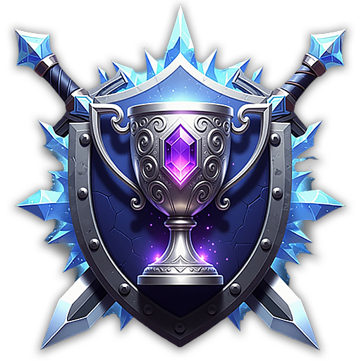

# 🏰 Club Frost War

<figure><figcaption></figcaption></figure>



### 📜 Club Frost War Guide

**Club Frost War** is a special version of Frost War\
that can only be entered by **club members**.

The battle rules and flow are the same as standard Frost War,\
but this time, you fight **for your club’s honor**.

***

### ◾ Schedule

**Every day at**

* **UTC: 12:00**
* **ETC (UTC-5): 07:00**

⏰ When the event starts, you can enter through the **lobby**.

_※ Entry and match flow are the same as regular Frost War._

***

### ◾ Participation Requirements

To join Club Frost War, the following conditions must be met:

* Only **players who belong to a club** can participate
* **Automatic matchmaking by club**
* **Up to 10 players per team**
* If a team lacks players, **AI units will automatically fill empty slots**
* Up to **40 minions** can be summoned on the battlefield


#### ⚠️ Notes

* **AI-controlled PCs do not count toward PK totals**
* Some conditions may change in future updates


***

### ◾ Battle Rules

* Battle rules and match progression are **identical to standard Frost War**
* Victory is determined by **objective control, teamwork, and strategy**

***

### ◾ Reward System

* Club members who participate in the battle receive rewards based on the **match outcome**
* Detailed reward information can be found in the [**reward table**](./#rank-based-rewards-arena-rank)

***

✨

> **This is not a fight for individual glory.**\
> **It is a battlefield where your club’s name is on the line.**
>
> **Stand together with your clubmates** \
> **and raise your flag across the continent of Asterica.**



### 📜 클럽 프로스트 워 가이드

**클럽 프로스트 워**는 클럽원만 참여할 수 있는 **전용 프로스트 워 콘텐츠**입니다.\
전투 방식과 규칙은 일반 프로스트 워와 동일하지만, 이번 전장은 **클럽의 명예를 걸고 싸우는 전투**입니다.

***

### ◾ 진행 시간

* **매일 21:00 (KST)**

⏰ 시작 시간이 되면 **대기실을 통해 입장**할 수 있습니다.

_※ 입장 및 진행 방식은 일반 프로스트 워와 동일합니다._

***

### ◾ 참여 조건

클럽 프로스트 워는 아래 조건을 충족해야 참여할 수 있습니다.

* **클럽에 가입된 모험가만 참여 가능**
* **클럽 단위로 자동 매칭**
* **팀당 최대 10명까지 참가 가능**
* 팀 인원이 부족할 경우, **AI가 자동으로 인원을 보충**합니다.
* 전장에는 **최대 40마리의 미니언**이 소환됩니다.


#### ⚠️ 안내 사항

* **AI PC는 PK 수에 포함되지 않습니다.**
* 일부 조건은 추후 업데이트에 따라 변경될 수 있습니다.


***

### ◾ 전투 규칙

* 전투 규칙과 진행 방식은 **일반 프로스트 워와 동일**합니다.
* 목표 달성, 팀 협력, 전략적 플레이가 승패를 결정합니다.

***

### ◾ 보상 시스템

* 전투에 참가한 클럽원은 **전투 결과에 따라 보상**을 획득합니다.
* 보상 구성은 [**보상 테이블**](./#undefined-15)을 통해 확인할 수 있습니다.

***

✨

> **이번 전투는 개인의 싸움이 아닙니다.**\
> **클럽의 이름을 걸고 싸우는 전장입니다.**
>
> **클럽원들과 함께, 아스테리카 대륙에 당신들의 깃발을 세워 보세요.**



### 📜 クラブ・フロストウォー ガイド

**クラブ・フロストウォー** は、\
クラブメンバーのみが参加できる **クラブ専用のフロストウォーコンテンツ** です。

戦闘ルールや進行方式は通常のフロストウォーと同じですが、\
この戦場では **クラブの名誉を懸けて戦います**。

***

### ◾ 開催時間

* **毎日 21:00（KST）**

⏰ 開始時間になると、**待機室から入場** できます。

_※ 入場方法および進行方式は、通常のフロストウォーと同一です。_

***

### ◾ 参加条件

クラブ・フロストウォーに参加するには、以下の条件を満たす必要があります。

* **クラブに所属しているプレイヤーのみ参加可能**
* **クラブ単位で自動マッチング**
* **1チーム最大10人まで参加可能**
* 人数が不足している場合、**AIが自動的に補充** されます。
* 戦場には、**最大40体のミニオン** が召喚されます。


#### ⚠️ 注意事項

* **AI操作のPCはPK数に含まれません。**
* 一部の条件は、今後のアップデートにより変更される場合があります。


***

### ◾ 戦闘ルール

* 戦闘ルールおよび進行方式は、**通常のフロストウォーと同一** です。
* 勝敗は、**目標達成・チームワーク・戦略的プレイ** によって決まります。

***

### ◾ 報酬システム

* 戦闘に参加したクラブメンバーは、**戦闘結果に応じた報酬** を獲得します。
* 報酬内容の詳細は、[**報酬テーブル**](./#rankuarnaranku) にて確認できます。

***

✨

> **これは個人の戦いではありません。**\
> **クラブの名を懸けた戦場 です。**
>
> **クラブメンバーと共に、アステリカ大陸にあなたたちの旗を掲げましょう。**



<em>※ This guide was written based on the game status as of January 14, 2026,</em>  <em>and its contents may change with future updates.</em>

