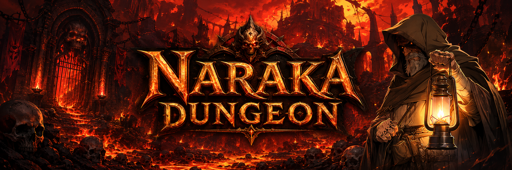

# 🏺 Naraka Dungeon

<figure><figcaption></figcaption></figure>



### 📜 Naraka Dungeon Guide

[The Underground Prison **Naraka**](../field-info/fields-by-level/lv.20-rahans-manor/naraka-dungeon/) is one of EXTOCIUM’s core dungeon contents.\
It’s a dangerous space filled with powerful monsters and unpredictable battles,\
where you can freely hunt for a **limited time using dungeon entry tickets**.

👇 You can find detailed information for each Naraka area on the pages below.

* **Sanjiba**


[lv.30-sanjiva.md](../field-info/fields-by-level/lv.20-rahans-manor/naraka-dungeon/lv.30-sanjiva.md)


* **Kalasutra**


[lv.40-kalasutra.md](../field-info/fields-by-level/lv.20-rahans-manor/naraka-dungeon/lv.40-kalasutra.md)


* **Samgata**


[lv.50-samgata.md](../field-info/fields-by-level/lv.20-rahans-manor/naraka-dungeon/lv.50-samgata.md)


***

#### ◾ How to Enter the Naraka Dungeon

* The Naraka Dungeon can be accessed through the\
  [**Dungeon Manager NPC**](../field-info/fields-by-level/lv.20-rahans-manor/naraka-dungeon/npc-naraka.md#dungeon-manager-di-xia-jian-yu-guan-li-zhe), located in the **left Peace Zone of the Rahan's Manor**.
* To enter the dungeon, you must have a **Naraka Dungeon Entry Ticket**.

<figure><figcaption></figcaption></figure>

***

#### ◾ How to Obtain Dungeon Entry Tickets

To enter each floor of the Naraka Dungeon, a **Naraka Dungeon Entry Ticket** is required.\
You can obtain entry tickets in the following ways:

* **Low drop chance** from PK Leverage Zones and inside the dungeon
* **Purchase with X Points obtained through** [**XTO Holding**](../xto-token/xto-holding-service/)\
  → _Only 1-hour Solo Entry Tickets are available for purchase_

<figure><figcaption></figcaption></figure>

* **Crafting**\
  → _3-hour Solo / 3-hour Party Entry Tickets can be crafted_\
  → Crafting path: **Crafting > Items > Scroll**

<figure><figcaption></figcaption></figure>


**1-hour Party Entry Tickets** can only be obtained through **monster drops**.


***

#### ◾ Dungeon Entry Ticket Usage

* Entry tickets are divided into **1-hour / 3-hour types**,\
  and each type has **Solo** and **Party** versions.
* When the time shown on the ticket is fully consumed,\
  you will be **automatically removed from the dungeon**.


If you log out without using the “Exit Dungeon” option,\
you will **resume inside the dungeon upon reconnecting**.


***

#### ◾ Party Entry & Usage Restrictions

* If you have a **Party Entry Ticket**,\
  all party members must be gathered at the dungeon entrance to enter together.
* The following features are **unavailable inside the dungeon**:
  * Market
  * Club
  * Arena

***

#### ◾ Naraka Dungeon Feature – Wave System

* Naraka is an **open-world style dungeon**.
* **Random dungeon waves** can occur at any time.
* When a wave starts, multiple monsters spawn simultaneously.
* At the same time, **buff items appear on the dungeon floor**.

👉 Proper use of these buff items can make clearing waves much easier.

***

✨

> **Naraka is a dungeon that rewards those who come prepared.**\
> **If you have your entry ticket ready,**\
> **it’s time to step into Naraka and face the challenge.**



### 📜 나라카 던전 가이드

[지하감옥 나라카](../field-info/fields-by-level/lv.20-rahans-manor/naraka-dungeon/)는 EXTOCIUM의 대표적인 **던전 콘텐츠**입니다.\
강력한 몬스터와 예측할 수 없는 전투가 이어지는 공간으로,\
입장권을 사용해 **정해진 시간 동안 자유롭게 사냥**할 수 있습니다.

👇 나라카 던전의 각 지역 정보는 아래 페이지에서 확인할 수 있습니다.

* **산지바**


[lv.30-sanjiva.md](../field-info/fields-by-level/lv.20-rahans-manor/naraka-dungeon/lv.30-sanjiva.md)


* **칼라수트라**


[lv.40-kalasutra.md](../field-info/fields-by-level/lv.20-rahans-manor/naraka-dungeon/lv.40-kalasutra.md)


* **삼가타**


[lv.50-samgata.md](../field-info/fields-by-level/lv.20-rahans-manor/naraka-dungeon/lv.50-samgata.md)


***

#### ◾ 나라카 던전 입장 방법

* 나라카 던전은 **라한 영지 좌측 안전 지역(Peace Zone)** 에 위치한\
  [**지하 감옥 관리자 NPC**](../field-info/fields-by-level/lv.20-rahans-manor/naraka-dungeon/npc-naraka.md#dungeon-manager-di-xia-jian-yu-guan-li-zhe) 를 통해 입장할 수 있습니다.
* 던전에 입장하려면 **나라카 던전 입장권** 이 필요합니다.

<figure><figcaption></figcaption></figure>

***

#### ◾ 던전 입장권 획득 방법

나라카 던전의 각 층에 입장하려면 **나라카 던전 입장권 아이템**이 필요합니다.\
입장권은 아래 방법을 통해 획득할 수 있습니다.

* **PK 레버리지 존** 및 **던전 내부**에서 낮은 확률로 드롭
* [**XTO 홀딩**](../xto-token/xto-holding-service/)을 통해 획득한 **X포인트**로 구매 → _1시간 솔로 입장권만 구매 가능_

<figure><figcaption></figcaption></figure>

* **제작을 통해 획득**\
  → _3시간 솔로 / 3시간 파티 입장권 제작 가능_\
  → 제작 위치: **제작 > 아이템 > 스크롤**

<figure><figcaption></figcaption></figure>


**1시간 파티 입장권**은 **몬스터 드롭**으로만 획득할 수 있습니다.


***

#### ◾ 던전 입장권 사용 안내

* 입장권은 **1시간 / 3시간** 타입으로 나뉘며, 각 타입마다 **솔로용 / 파티용** 입장권이 존재합니다.
* 입장권에 표시된 시간이 모두 소모되면 **자동으로 던전에서 퇴장**됩니다.


던전 나가기를 하지 않은 상태에서 게임을 종료할 경우,\
다시 접속하면 **던전 내부에서 이어서 플레이**할 수 있습니다.


***

#### ◾ 파티 입장 & 이용 제한

* 파티용 입장권을 보유한 경우, **던전 입구에 파티원이 모두 모여야** 함께 입장할 수 있습니다.
* 던전 내부에서는 다음 기능을 이용할 수 없습니다.
  * 마켓
  * 클럽
  * 아레나

***

#### ◾ 나라카 던전 특징 – 웨이브 시스템

* 나라카는 **오픈 월드 형태의 던전**입니다.
* 던전 내부에서는 **랜덤 웨이브**가 발생합니다.
* 웨이브 발생 시 다수의 몬스터가 한꺼번에 등장합니다.
* 동시에 던전 바닥에 **버프 아이템**이 생성됩니다.

👉 버프 아이템을 잘 활용하면 웨이브를 훨씬 수월하게 클리어할 수 있습니다.

***

✨

> **나라카는 준비된 자에게 보상을 주는 던전입니다.**\
> **입장권을 준비했다면, 지금 바로 나라카에 도전해 보세요.**



### 📜 ナラカダンジョンガイド

[地下監獄ナラカ](../field-info/fields-by-level/lv.20-rahans-manor/naraka-dungeon/)は、EXTOCIUMを代表する**ダンジョンコンテンツ**です。\
強力なモンスターと予測できない戦闘が続く危険な空間で、\
**入場券を使用して、決められた時間内で自由に狩り**を行うことができます。

👇 ナラカダンジョン各エリアの詳細情報は、以下のページで確認できます。

* **サンジバ**


[lv.30-sanjiva.md](../field-info/fields-by-level/lv.20-rahans-manor/naraka-dungeon/lv.30-sanjiva.md)


* **カラスートラ**


[lv.40-kalasutra.md](../field-info/fields-by-level/lv.20-rahans-manor/naraka-dungeon/lv.40-kalasutra.md)


* **サムガタ**


[lv.50-samgata.md](../field-info/fields-by-level/lv.20-rahans-manor/naraka-dungeon/lv.50-samgata.md)


***

#### ◾ ナラカダンジョンの入場方法

* ナラカダンジョンは、**ラハン領地左側の安全地域（Peace Zone）** にいる\
  [**地下監獄管理人NPC**](../field-info/fields-by-level/lv.20-rahans-manor/naraka-dungeon/npc-naraka.md#dungeon-manager-di-xia-jian-yu-guan-li-zhe) を通じて入場できます。
* ダンジョンに入場するには、**ナラカダンジョン入場券** が必要です。

<figure><figcaption></figcaption></figure>

***

#### ◾ ダンジョン入場券の入手方法

ナラカダンジョンの各階に入場するには、**ナラカダンジョン入場券アイテム** が必要です。

入場券は以下の方法で入手できます。

* **PKレバレッジゾーン** および **ダンジョン内部** で 低確率でドロップ
* [**XTOホールディング**](../xto-token/xto-holding-service/)**で獲得したXポイントで購入**\
  → _購入できるのは「1時間ソロ入場券」のみ_

<figure><figcaption></figcaption></figure>

* **製作によって入手**\
  → _3時間ソロ / 3時間パーティー入場券を製作可能_\
  → 製作場所：**製作 > アイテム > スクロール**

<figure><figcaption></figcaption></figure>


**1時間パーティー入場券はモンスタードロップでのみ入手可能**です。


***

#### ◾ ダンジョン入場券の使用案内

* 入場券は **1時間 / 3時間タイプ** に分かれており、\
  各タイプごとに **ソロ用 / パーティー用** が存在します。
* 入場券に表示された時間をすべて消費すると、**自動的にダンジョンから退出** します。


ダンジョン退出を行わずにゲームを終了した場合、\
再接続時に **ダンジョン内部からプレイを再開** できます。


***

#### ◾ パーティー入場 & 利用制限

* **パーティー用入場券** を所持している場合、\
  ダンジョン入口に **パーティーメンバー全員が集まる必要** があります。
* ダンジョン内部では、以下の機能を利用できません。
  * マーケット
  * クラブ
  * アリーナ

***

#### ◾ ナラカダンジョンの特徴 – ウェーブシステム

* ナラカは **オープンワールド形式のダンジョン** です。
* ダンジョン内部では **ランダムでウェーブ** が発生します。
* ウェーブ発生時、多数のモンスターが同時に出現します。
* 同時に、ダンジョンの床に **バフアイテム** が生成されます。

👉 バフアイテムを上手く活用すると、ウェーブをよりスムーズにクリアできます。

***

✨

> **ナラカは、準備した者に報酬を与えるダンジョンです。**\
> **入場券を準備したら、今すぐナラカへ挑戦してみましょう。**



<em>※ This guide was written based on the game status as of January 15, 2026,</em>  <em>and its contents may change with future updates.</em>

