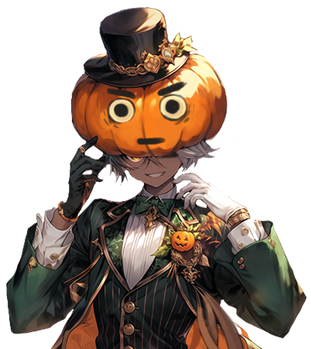
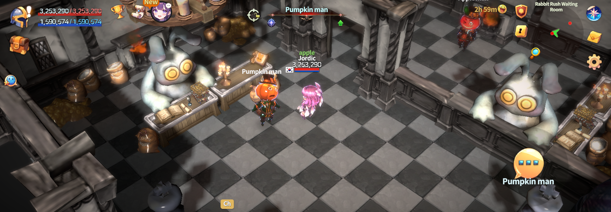
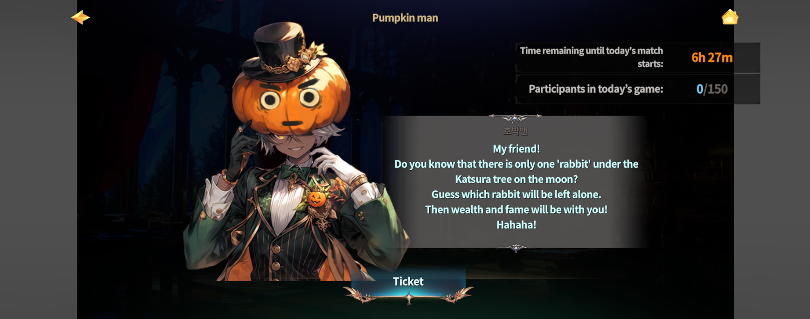
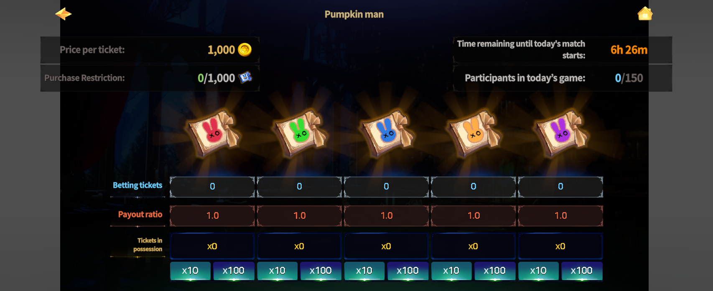

# 📁 Buy tickets

<figure><figcaption></figcaption></figure>



### 📜 **Rabbit Rush – Ticket Purchase Guide**

To join Rabbit Rush,\
you must purchase entry tickets from the NPC **Pumpkin Man** in the waiting room.

When buying tickets, you choose the color you believe will win in the upcoming match.

You can:

* Choose **just one color**, or
* **Split your tickets across multiple colors**.

The more tickets that are purchased for a specific color, the **lower its payout rate** becomes.

📌 Check the payout rates carefully and use smart strategies by combining different colors.

***

### ◾ How to Buy Tickets

<figure><figcaption></figcaption></figure>

1️⃣ Talk to **Pumpkin Man** in the Rabbit Rush waiting room.

<figure><figcaption></figcaption></figure>

2️⃣ Select the ticket color for the upcoming match, \
then choose how many tickets you want to purchase.

<figure><figcaption></figcaption></figure>

***

### ◾ **Ticket Purchase Rules**

* Tickets can only be purchased for the **current upcoming match**
* Minimum purchase: **10 tickets**
* You can freely choose the ticket color
* Maximum purchase limit: **1,000 tickets**
* Buying more tickets for the same color lowers its payout rate

📌 A lower payout rate means **smaller rewards if that color wins**.

***

### ◾ **Before You Buy**

* Once tickets are purchased, you are **automatically registered** for the match.
* When the match starts, you will join automatically **no matter where you are in the world**.

⚠️ Make sure you’re ready before buying your tickets.



### 📜 Rabbit Rush – 입장권 구매 가이드

Rabbit Rush에 참여하려면 \
**대기실에 있는 NPC ‘호박맨’**&#xC5D0;게 말을 걸어 입장권(티켓)을 구매해야 합니다.

티켓을 구매할 때,
&#x20;이번 경기에서 **승리할 것이라 예측하는 색깔**을 선택해 참여합니다.

한 가지 색깔만 선택할 수도 있고,
&#x20;여러 색깔에 나누어 티켓을 구매할 수도 있습니다.\
티켓이 많이 구매된 색깔일수록 배당률은 낮아집니다.

📌 배당률을 확인하고,
&#x20;여러 색깔을 조합해 전략적으로 구매해 보세요.

***

### ◾ 티켓 구매 방법

<figure><figcaption></figcaption></figure>

1️⃣ Rabbit Rush 대기실에서 **NPC 호박맨**과 대화합니다.

<figure><figcaption></figcaption></figure>

2️⃣ 이번에 진행될 경기의 티켓 색깔을 선택한 후,
&#x20;원하는 수량만큼 티켓을 구매합니다.

<figure><figcaption></figcaption></figure>

***

### ◾ 티켓 구매 규칙

* **현재 진행될 경기의 티켓만 구매 가능**
* **최소 10장부터 구매 가능**
* 원하는 **컬러 선택 가능**
* **총 구매 가능 수량: 최대 1,000장**
* 티켓을 많이 구매할수록 **배당률이 낮아집니다**

📌 배당률이 낮아지면, 승리 시 **받는 보상이 줄어들 수 있습니다.**

***

### ◾ 티켓 구매 전 꼭 확인하세요

* 티켓을 **미리 구매해 두면**, 경기 시작 시 **자동으로 참여 처리**됩니다.
* 경기 시작 시, **월드 어디에 있든 자동으로 참전**되니 주의하세요.



### 📜 **ラビットラッシュ – チケット購入ガイド**

ラビットラッシュに参加するには、\
待機室にいる NPC **パンプキンマン** から 入場チケットを購入する必要があります。

チケット購入時には、今回の試合で**勝利すると予想する色**を選択します。

* 1つの色だけを選ぶこともできます
* 複数の色に分けてチケットを購入することも可能です

特定の色に多くのチケットが購入されるほど、その色の**配当率は低くなります**。

📌 配当率をよく確認し、複数の色を組み合わせて戦略的に購入しましょう。

***

### ◾ チケット購入方法

<figure><figcaption></figcaption></figure>

1️⃣ ラビットラッシュ待機室で NPC **パンプキンマン** に話しかけます。

<figure><figcaption></figcaption></figure>

2️⃣ 今回の試合のチケットカラーを選択し、購入したい枚数を設定します。

<figure><figcaption></figcaption></figure>

***

### ◾ **チケット購入ルール**

* チケットは **次に開催される試合分のみ** 購入可能
* 最低購入枚数：**10枚**
* カラーは自由に選択可能
* 購入可能な最大枚数：**1,000枚**
* 同じ色のチケットを多く購入すると配当率が下がります

📌 配当率が下がると、勝利時に受け取れる報酬も少なくなります。

***

### ◾ **購入前の注意事項**

* チケットを購入すると、試合開始時に **自動的に参加登録** されます。
* 試合開始時は、ワールド内のどこにいても **自動で参戦** します。

⚠️ 購入前に必ず内容を確認してください。



<em>※ This guide was written based on the game status as of January 15, 2026,</em>  <em>and its contents may change with future updates.</em>

