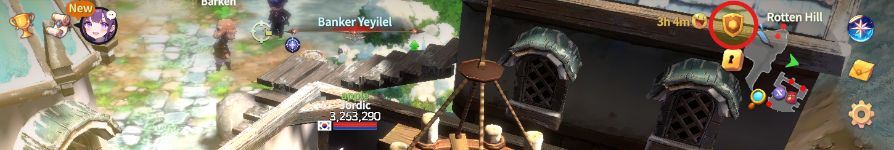
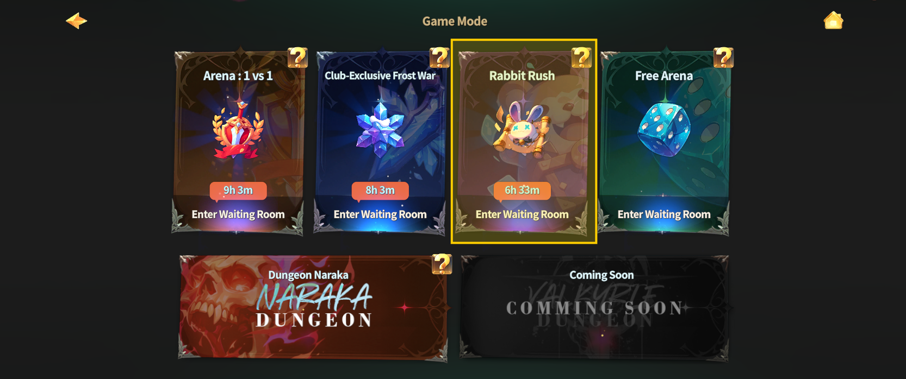
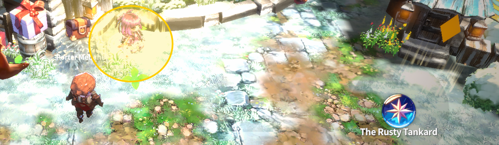
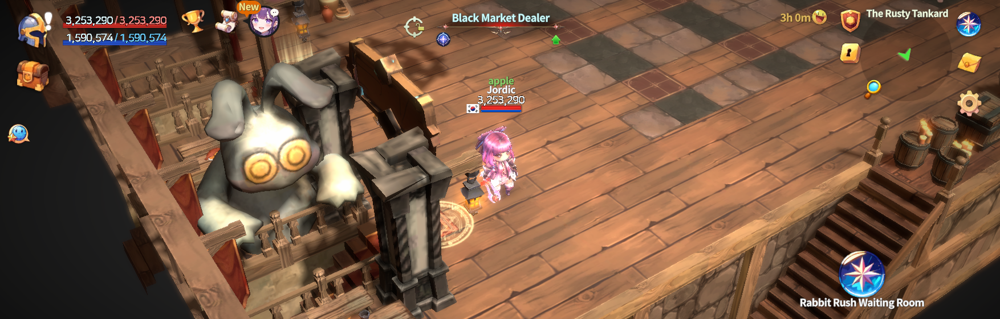

# 📁 Entrance

<figure><figcaption></figcaption></figure>



### 📜 Rabbit Rush – Entry Guide

Rabbit Rush is a **betting-style PvP mode** that opens only at scheduled times.\
Matches start automatically at the set time, \
and **as long as you’ve purchased a ticket in advance**,\
you’ll be **automatically entered**, no matter where you are in the world.

***

### ◾ Schedule

Rabbit Rush matches are held daily at the following times:

🕑 **UTC**

* 10:30

🕑 **ETC (UTC-5)**

* 05:30

🕑 **KST (UTC+9)**

* 19:30

***

### ◾ Entry Method ①&#x20;

This is the quickest way to access Rabbit Rush.

1️⃣ Tap the **Game Mode icon** at the top right of the main HUD.

<figure><figcaption></figcaption></figure>

2️⃣ From the top menu, tap **Rabbit Rush Lobby**.

<figure><figcaption></figcaption></figure>

***

### ◾ Entry Method ②&#x20;

1️⃣ In [**Rottenhill**](../../field-info/rotten-hill/), enter the small tavern next to [**Mebahel**](../../field-info/rotten-hill/npc-rotten-hill.md#mebahel-mebaheru), called [**The Rusty Tankard**](../../field-info/rotten-hill/the-rusty-tankard.md).

<figure><figcaption></figcaption></figure>

2️⃣ Go down the stairs to reach the **Battle Zone**.

<figure><figcaption></figcaption></figure>

3️⃣ Use the **portal on the left side** of the Battle Zone to enter the **Rabbit Rush Lobby**.

<figure><figcaption></figcaption></figure>

***

✨

> **If you’ve got the timing right, anyone can join.**\
> **Make your choice and let the race decide the winner.**



### 📜 Rabbit Rush 입장 가이드

Rabbit Rush는 정해진 시간에만 열리는 **배팅형 PvP 콘텐츠**입니다.\
정시에 경기가 시작되며,
&#x20;경기 시작 전 티켓만 구매해 두면
&#x20;월드 어디에 있더라도 자동으로 참여됩니다.

***

### ◾ 진행 시간

Rabbit Rush 경기는 매일 아래 시간에 진행됩니다.

🕑 **UTC**

* 10:30

🕑 **ETC (UTC-5)**

* 05:30

🕑 **KST (UTC+9)**

* 19:30

***

### ◾ 입장 방법 ①&#x20;

가장 빠르고 간편한 입장 방법입니다.

1️⃣ **메인 HUD 우측 상단의 게임 모드 아이콘**을 터치합니다.

<figure><figcaption></figcaption></figure>

2️⃣ 메뉴 화면 상단에서 **Rabbit Rush 대기실**을 터치합니다.

<figure><figcaption></figcaption></figure>

***

### ◾ 입장 방법 ②&#x20;

1️⃣ [**로튼힐(Rottenhill)**](../../field-info/rotten-hill/)에서 [**메바헬**](../../field-info/rotten-hill/npc-rotten-hill.md#mebahel-mebaheru)옆에 있는 작은 술집, [**녹슨 술잔**](../../field-info/rotten-hill/the-rusty-tankard.md)으로 입장합니다.

<figure><figcaption></figcaption></figure>

2️⃣ 계단을 따라 아래로 내려가면 **배틀존(Battle Zone)** 이 나타납니다.

<figure><figcaption></figcaption></figure>

3️⃣ 배틀존 **좌측에 있는 포털**을 통해 **Rabbit Rush 대기실**로 입장할 수 있습니다.

<figure><figcaption></figcaption></figure>

***

✨

> **시간만 맞으면, 누구나 참여할 수 있습니다.**\
> **당신의 선택으로 승부를 시작해 보세요.**



### 📜 ラビットラッシュ 入場ガイド

ラビットラッシュは、\
決められた時間にのみ開催される **ベッティング型PvPコンテンツ** です。\
開始時間になると試合が自動的に始まり、\
**事前にチケットを購入していれば、ワールドのどこにいても自動的に参加** されます。

***

### ◾ 開催時間

ラビットラッシュは、毎日以下の時間に開催されます。

🕑 **UTC**

* 10:30

🕑 **ETC (UTC-5)**

* 05:30

🕑 **KST (UTC+9)**

* 19:30

***

### ◾ 入場方法 ①&#x20;

最も早く、簡単に入場できる方法です。

1️⃣ メインHUD右上にある **ゲームモードアイコン** をタップします。

<figure><figcaption></figcaption></figure>

2️⃣ 上部メニューから **ラビットラッシュ待機室** をタップします。

<figure><figcaption></figcaption></figure>

***

### ◾ 入場方法 ②&#x20;

1️⃣ [**ロッテンヒル（Rottenhill）**](../../field-info/rotten-hill/) にある、[**メバヘル（Mebahel）**](../../field-info/rotten-hill/npc-rotten-hill.md#mebahel-mebaheru) の隣の小さな酒場\
&#xNAN;**「**[**ザ・ラスティ・タンカード（The Rusty Tankard）**](../../field-info/rotten-hill/the-rusty-tankard.md)**」** に入ります。

<figure><figcaption></figcaption></figure>

2️⃣ 階段を下りると **バトルゾーン（Battle Zone）** に到着します。

<figure><figcaption></figcaption></figure>

3️⃣ バトルゾーン左側にある **ポータル** を使って、**ラビットラッシュ待機室** に入場できます。

<figure><figcaption></figcaption></figure>

***

✨

> **時間さえ合えば、誰でも参加できます。**\
> **あなたの選択で、勝負を始めましょう。**



<em>※ This guide was written based on the game status as of January 15, 2026,</em>  <em>and its contents may change with future updates.</em>

