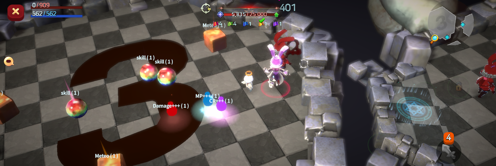

# 📁 Game rules

<figure><figcaption></figcaption></figure>



## 📜 Rabbit Rush – Game Rules Guide

The rules of Rabbit Rush are a little different.\
But don’t worry. Once you understand the steps below, anyone can jump right in.

***

### ◾ Goal of Rabbit Rush

The goal of Rabbit Rush is very simple.


👉 **The color of the last rabbit standing becomes the winning color.**


And your mission is just as clear:


👉 **Make sure the rabbits of the color you bought tickets for survive until the end.**


***

### ◾ What Happens When the Match Starts

* When the match begins, all players transform into **Level 10 rabbits**.
* Up to **150 participants** can join a match.
* If there aren’t enough players, the remaining slots are filled with **NPC rabbits**.
* Every rabbit belongs to one of **five colors**:
  * Blue / Green / Purple / Red / Yellow


#### 📌 **Important!**

The color of the ticket you purchased and the color of the rabbit you become **may be different**.\
Rabbit colors are assigned **completely at random**.


***

### ◾ Where Do Rabbits Start?

* All rabbits spawn randomly on one of **nine platforms**.
* Sometimes, you may be warped through a **blue rabbit hole portal**.
* When you use a warp, **you won’t know where you’ll end up**.

👉 Unpredictable! That’s part of the fun of Rabbit Rush.

***

### ◾ How Combat Works

* At the start, **no one has any skills**.
* Pick up items floating on the ground.

There are **two types of items**:

<figure><figcaption></figcaption></figure>

* **Round items**\
  → Allow you to equip and use a skill.
* **Square items**\
  → Cast a **random area-of-effect attack** on one of the nine platforms.

📌 The skill you obtain is **one random skill** from all skills available to heroes in EXTOCIUM\
(including Succession skills).

***

### ◾ As Time Passes, It Gets More Dangerous

* After **2 minutes**, a **red ring** begins to close in from the edges of the map.
* The safe area keeps shrinking, and battles become more intense.

👉 Less space. More pressure. Faster decisions.

***

### ◾ What If You Die Early?

<figure><figcaption></figcaption></figure>

* If you are defeated before the match ends, you enter **Ghost Mode**.
* As a ghost, you can freely move around the map and **watch the match**.
* Ghosts **cannot attack or affect the game in any way**.

***

✨&#x20;

> **Rabbit Rush is a PvP mode where luck, judgment, and choice all matter.**\
> **Test your choices in Rabbit Rush 🐇🔥**



## 📜 Rabbit Rush 게임 룰 가이드

Rabbit Rush의 룰은 조금 특별합니다.\
하지만 걱정하지 마세요. 아래 순서대로만 이해하면 누구나 바로 플레이할 수 있습니다.

***

### ◾ Rabbit Rush의 목표

Rabbit Rush의 목표는 아주 간단합니다.


👉 **마지막까지 살아남은 토끼의 ‘색깔’이 당첨 색깔이 됩니다.**


그리고 당신의 목표는,


👉 **내가 구매한 티켓 색깔의 토끼가 끝까지 살아남도록 만드는 것**입니다.


***

### ◾ 경기 시작하면 이렇게 바뀝니다

* 경기에 입장하면, 모든 플레이어는 **레벨 10 토끼**로 변신합니다.
* 최대 **150명**까지 참가할 수 있습니다.
* 플레이어가 부족할 경우, 나머지는 **NPC 토끼**로 채워집니다.
* 모든 토끼는 아래 **5가지 색깔** 중 하나입니다.
  * 파랑 / 초록 / 보라 / 빨강 / 노랑


#### 📌 **중요!**

내가 구매한 티켓 색깔과 내가 변신한 토끼의 색깔은 **서로 다를 수 있습니다**.\
토끼 색깔은 **완전 랜덤**으로 정해집니다.


***

### ◾ 토끼는 어디서 시작하나요?

* 모든 토끼는 **9개의 발판 중 하나**에 랜덤으로 등장합니다.
* 가끔 **파란 토끼굴 워프**로 이동할 수도 있습니다.
* 워프를 타면 **어디로 이동할지는 알 수 없습니다**.

👉 예측 불가! 이게 Rabbit Rush의 재미입니다.

***

### ◾ 전투는 이렇게 진행됩니다

* 처음에는 **아무 스킬도 없습니다**.
* 바닥에 떠 있는 아이템을 획득하세요.

아이템 종류는 두 가지입니다.

<figure><figcaption></figcaption></figure>

* **동그란 아이템**\
  → 스킬을 사용할 수 있게 됩니다.
* **네모난 아이템**\
  → 9개의 발판 중 한 곳에 랜덤으로 **범위 공격 마법**이 발동됩니다.

📌 획득하는 스킬은 현재 엑스토시움의 영웅이 보유한 모든 스킬 중 **랜덤 1종**입니다. (계승 스킬 포함)

***

### ◾ 시간이 지나면 더 위험해집니다

* 경기 시작 후 **2분이 지나면**
* 맵 가장자리에서 **레드 링**이 서서히 좁혀옵니다.

👉 안전한 공간은 점점 줄어들고, 전투는 더 치열해집니다.

***

### ◾ 먼저 죽으면 어떻게 되나요?

<figure><figcaption></figcaption></figure>

* 경기가 끝나기 전에 사망하면 당신은 **유령 상태**가 됩니다.
* 유령이 되면 맵을 자유롭게 돌아다니며 **관전만 가능**합니다.
* 공격하거나, 게임에 영향을 주는 행동은 **할 수 없습니다**.

***

✨&#x20;

> **Rabbit Rush는 운 + 판단 + 선택이 모두 중요한 PvP입니다.**\
> **당신의 선택을 시험해 보세요 🐇🔥**



## 📜 Rabbit Rush ゲームルールガイド

Rabbit Rushのルールは少し特別です。\
でも安心してください。\
下の順番どおりに読めば、誰でもすぐにプレイできます。

***

### ◾ Rabbit Rushの目的

Rabbit Rushの目的はとてもシンプルです。


👉 **最後まで生き残ったウサギの「色」＝当たりカラー** になります。


そして、あなたの目的は


👉 **自分が購入したチケットの色のウサギを、最後まで生き残らせること** です。


***

### ◾ 試合が始まるとこうなります

* 試合に入ると、すべてのプレイヤーは **レベル10のウサギ** に変身します。
* 最大 **150人** まで参加できます。
* 人数が足りない場合は、残りは **NPCウサギ** で補われます。
* ウサギの色は、次の **5色** のいずれかです。\
  青 / 緑 / 紫 / 赤 / 黄色


#### 📌 重要！

購入したチケットの色と、自分が変身するウサギの色は **一致しないことがあります**。\
ウサギの色は **完全ランダム** で決まります。


***

### ◾ ウサギはどこから始まるの？

* すべてのウサギは、**9つの足場のどれか** にランダムで出現します。
* ときどき **青いウサギ穴ワープ** に移動することがあります。
* ワープ先がどこになるかは **分かりません**。

👉 予測できない！それがRabbit Rushの面白さです。

***

### ◾ バトルの進み方

* 最初は **スキルを持っていません**。
* 地面に浮いているアイテムを拾いましょう。

アイテムは **2種類** あります。

<figure><figcaption></figcaption></figure>

* **丸いアイテム**\
  → スキルを装備して使えるようになります。
* **四角いアイテム**\
  → 9つの足場のどこかに、ランダムで **範囲攻撃魔法** が発動します。

📌 入手できるスキルは、現在EXTOCIUMのヒーローが持つすべてのスキルの中から \
**ランダムで1つ** です。（継承スキル含む）

***

### ◾ 時間が経つと、もっと危険に

* 試合開始から **2分** が経過すると、
* マップの外側から **レッドリング** が少しずつ迫ってきます。

👉 安全な場所はどんどん狭くなり、戦いはより激しくなります。

***

### ◾ 先に倒されたらどうなる？

<figure><figcaption></figcaption></figure>

* 試合が終わる前に倒されると、**ゴースト状態** になります。
* ゴーストになると、マップ内を自由に移動して **観戦** できます。
* 攻撃したり、ゲームに影響を与えることは **できません**。

***

✨&#x20;

> **Rabbit Rushは、運・判断・選択 がすべて重要なPvPです。**\
> **あなたの選択が、勝敗を決めます。**\
> **Rabbit Rushで、ぜひ試してみてください 🐇🔥**



<em>※ This guide was written based on the game status as of January 15, 2026,</em>  <em>and its contents may change with future updates.</em>

