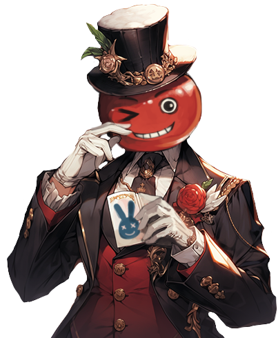
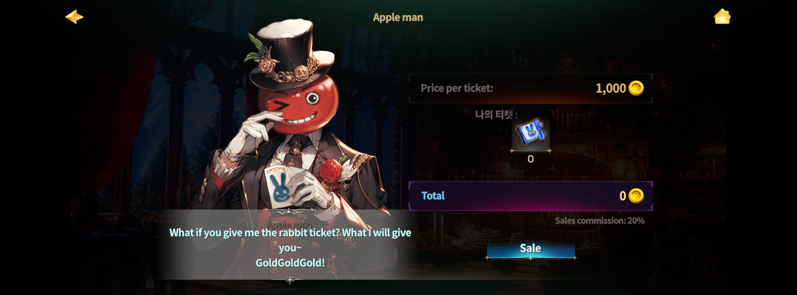

# 📁 Sell tickets

<figure><figcaption></figcaption></figure>



### 📜 Rabbit Rush – Ticket Exchange Guide (Sell Ticket)

Won a match in Rabbit Rush?\
Now it’s time to turn your victory into **Gold**.

***

#### ◾ How Victory Rewards Work

When you win a Rabbit Rush match, 👉 you receive **tickets of the winning color**.


These tickets are **not added directly to your inventory**.\
After the match ends, they are sent to your **Mailbox**.


***

#### ◾ How to Claim Your Tickets

1️⃣ After the match ends, open your **Mailbox**.\
2️⃣ **Claim the winning tickets** from the mail.

<figure><figcaption></figcaption></figure>

***

#### ◾ How to Sell Tickets (Sell Ticket)

Once you’ve claimed your tickets, \
head to the Rabbit Rush waiting room and find **NPC Appleman**.

1️⃣ Talk to **NPC Appleman**.\
2️⃣ Exchange your winning tickets for **Gold**.

<figure><figcaption></figcaption></figure>


Tickets can **only** be exchanged for Gold through **Appleman**.


***

#### ◾ Important Notes

* Winning tickets are delivered to your **Mailbox**.
* You must **claim them manually** before exchanging.
* Ticket → Gold exchange is **exclusive to NPC Appleman**.



### 📜 Rabbit Rush – 티켓 판매 가이드 (Sell Ticket)

Rabbit Rush에서 승리했다면, 이제 **보상을 골드로 바꿀 차례**입니다.

***

#### ◾ 승리 보상은 이렇게 받습니다

Rabbit Rush에서 승리하면 👉 **승리한 색깔의 티켓**을 획득합니다.


이 티켓은 **바로 인벤토리에 들어오지 않습니다.** 경기 종료 후, **우편함으로 지급**됩니다.


***

#### ◾ 티켓 수령 방법

1️⃣ 게임 종료 후, **우편함을 확인합니다.**\
2️⃣ 우편함에서 **승리 티켓을 수령**합니다.

<figure><figcaption></figcaption></figure>

***

#### ◾ 티켓 판매 방법 (Sell Ticket)

우편함에서 티켓을 받았다면, 대기실에 있는 NPC **사과맨**을 찾아가세요.

1️⃣ NPC **사과맨**과 대화합니다.\
2️⃣ 보유한 승리 티켓을 **골드로 교환**합니다.

<figure><figcaption></figcaption></figure>


티켓은 **사과맨을 통해서만 골드로 교환**할 수 있습니다.


***

#### ◾ 꼭 기억하세요

* 승리 티켓은 **우편함으로 지급**됩니다.
* 우편함에서 **직접 수령해야** 교환할 수 있습니다.
* 티켓 → 골드 교환은 **NPC 사과맨 전용 기능**입니다.



### 📜 Rabbit Rush – チケット交換ガイド（Sell Ticket）

Rabbit Rushで勝利したら、次は **報酬をゴールドに交換する番** です。

***

#### ◾ 勝利報酬の受け取り方

Rabbit Rushで勝利すると、👉 **勝利したカラーのチケット** を獲得します。


このチケットは **直接インベントリには入りません**。試合終了後、**メールボックス** に送られます。


***

#### ◾ チケットの受け取り手順

1️⃣ 試合終了後、**メールボックス** を確認します。\
2️⃣ メールボックスから **勝利チケットを受け取ります**。

<figure><figcaption></figcaption></figure>

***

#### ◾ チケットの交換方法（Sell Ticket）

チケットを受け取ったら、待機室にいる **NPC アップルマン** を訪ねてください。

1️⃣ **NPC アップルマン** と会話します。\
2️⃣ 所持している勝利チケットを **ゴールドと交換** します。

<figure><figcaption></figcaption></figure>


チケットをゴールドに交換できるのは **NPC アップルマンのみ** です。


***

#### ◾ 必ず覚えておきましょう

* 勝利チケットは **メールボックスに配布** されます。
* 交換するには **必ず受け取る必要があります**。
* チケット → ゴールド交換は **NPC アップルマン専用の機能** です。



<em>※ This guide was written based on the game status as of January 15, 2026,</em>  <em>and its contents may change with future updates.</em>

